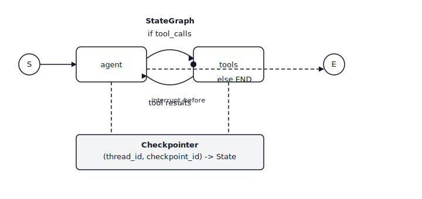

# LangGraph——智能体的状态机

> 手写的ReAct循环是一个`while True`。用LangGraph编写的ReAct循环是一个可以进行检查点、中断、分支和时间旅行的图。智能体本身没有改变，改变的是围绕它的框架。

**类型：** 构建
**语言：** Python
**前置知识：** 阶段11·09（函数调用），阶段11·14（模型上下文协议）
**时间：** 约75分钟

## 问题

你发布了一个函数调用智能体。它正常工作了三个回合，然后出了问题：模型尝试了一个返回500的工具，用户中途改变了主意，或者智能体在没有人工批准的情况下决定退款订单。`while True:` 循环没有钩子。你无法暂停它，无法回退它，也无法分支到“如果模型选择了另一个工具会怎样”。一旦你把这个发布到演示之外，智能体就变成了一个黑盒，要么工作，要么不工作。

下一步一旦你看到它就很明显了。智能体本身就是一个状态机——系统提示加上消息历史加上待定的工具调用加上下一步动作。将状态机显式化：节点包括“模型思考”、“工具运行”、“人工批准”，边是它们之间的条件转移。一旦图显式化，框架就免费获得了四样东西：检查点（在步骤之间保存状态）、中断（暂停等待人工）、流式（流式传输令牌和中间事件）和时间旅行（回退到之前的状态并尝试不同的分支）。

LangGraph是实现这种抽象的库。它不是LangChain意义上的智能体框架（“这里有一个AgentExecutor，祝你好运”）。它是一个带有头等状态、头等持久化和头等中断的图运行时。智能体循环是你画出来的，而不是你手写的。

## 核心概念



一个`StateGraph`包含三样东西。

1. **状态。** 一个类型化的字典（TypedDict或Pydantic模型），流经整个图。每个节点接收完整状态并返回部分更新，LangGraph使用每个字段的*reducer*来合并——对于应该累积的列表用`operator.add`，默认覆盖。
2. **节点。** Python函数`operator.add`。每个都是一个离散步骤：“调用模型”、“运行工具”、“总结”。
3. **边。** 节点之间的转移。静态边去一个地方。条件边接受一个路由函数`operator.add`，这样图可以根据模型输出分支。

你编译这个图。编译绑定拓扑，附加检查点（可选但对生产环境至关重要），并返回一个可运行对象。你用一个初始状态和一个`thread_id`来调用它。执行的每一步都会在存储中写入一个以`(thread_id, checkpoint_id)`为键的检查点。

### 四大超能力

**检查点。** 每个节点转移都会将新状态写入存储（测试用内存，生产用Postgres/Redis/SQLite）。通过使用相同的`thread_id`再次调用图来恢复。图从暂停的地方继续。

**中断。** 用`interrupt_before=["human_review"]`标记一个节点，执行在该节点运行前停止。状态持久化。你的API向用户响应“等待批准”。后续对同一个`thread_id`的请求带有`Command(resume=...)`则会恢复执行。

**流式传输。** `graph.stream(state, mode="updates")`在状态变化时产生状态增量。`mode="messages"`在模型节点内部流式传输LLM令牌。`mode="values"`产生完整快照。你选择在UI中展示什么。

**时间旅行。** `graph.get_state_history(thread_id)`返回完整的检查点日志。将任何先前的`checkpoint_id`传递给`graph.invoke`，你就从那个点分叉。非常适合调试（“如果模型选择了工具B会怎样？”）以及用于重放生产轨迹的回归测试。

### Reducer是关键

每个状态字段都有一个reducer。大多数默认值就足够了——新值覆盖旧值。但消息列表需要`operator.add`，这样新消息会追加而不是替换。并行边通过reducer合并它们的更新。如果两个节点都更新了`messages`而你忘了`Annotated[list, add_messages]`，第二个会静默获胜，你会丢失半个回合。Reducer是这个库中唯一微妙的部分；把它做对了，剩下的就组合起来了。

### 四个节点的ReAct图

一个生产级的ReAct智能体是四个节点和两条边：

1. `agent` — 用当前消息历史调用LLM。返回助手消息（可能包含tool_calls）。
2. `agent` — 执行最后一条助手消息中的任何tool_calls，将工具结果作为工具消息追加。
3. 从`agent`出发的条件边，如果最后一条消息有tool_calls则路由到`tools`，否则到`agent`。
4. 从`agent`回到`tools`的静态边。

就是这样。你可以得到完整的ReAct循环（思考→行动→观察→思考→…），带有检查点、中断和流式传输，大约只需40行代码。

### StateGraph 与 Send（扇出）

`Send(node_name, state)`允许一个节点分发并行子图。例如：智能体决定同时查询三个检索器。每个`Send`启动目标节点的并行执行；它们的输出通过状态reducer合并。这就是LangGraph如何在没有线程原语的情况下表达编排者-工作者模式。

### 子图

一个编译后的图可以作为另一个图中的一个节点。外部图看到一个单一节点；内部图有自己的状态和检查点。这就是团队构建监督者-工作者智能体的方式：监督者图将用户意图路由到每个领域的工作者子图。

## 动手构建

### 步骤1：状态和节点

```python
from typing import Annotated, TypedDict
from langchain_core.messages import AnyMessage, HumanMessage, AIMessage
from langgraph.graph import StateGraph, END
from langgraph.graph.message import add_messages
from langgraph.prebuilt import ToolNode
from langgraph.checkpoint.memory import MemorySaver

class State(TypedDict):
    messages: Annotated[list[AnyMessage], add_messages]

def agent_node(state: State) -> dict:
    response = llm.invoke(state["messages"])
    return {"messages": [response]}

def should_continue(state: State) -> str:
    last = state["messages"][-1]
    return "tools" if getattr(last, "tool_calls", None) else END

tool_node = ToolNode(tools=[search_web, read_file])

graph = StateGraph(State)
graph.add_node("agent", agent_node)
graph.add_node("tools", tool_node)
graph.set_entry_point("agent")
graph.add_conditional_edges("agent", should_continue, {"tools": "tools", END: END})
graph.add_edge("tools", "agent")

app = graph.compile(checkpointer=MemorySaver())
```

`add_messages`是让消息列表累积而不是覆盖的reducer。忘记它是最常见的LangGraph错误。

### 步骤2：使用线程运行

```python
config = {"configurable": {"thread_id": "user-42"}}
for event in app.stream(
    {"messages": [HumanMessage("find the Anthropic headquarters address")]},
    config,
    stream_mode="updates",
):
    print(event)
```

每个更新都是一个字典`{node_name: state_delta}`。你的前端可以将其流式传输到UI，以便用户看到“智能体正在思考…调用search_web…得到结果…回答”。

### 步骤3：添加人工循环中断

标记一个节点，使得执行在该节点运行前暂停。

```python
app = graph.compile(
    checkpointer=MemorySaver(),
    interrupt_before=["tools"],  # pause before every tool call
)

state = app.invoke({"messages": [HumanMessage("delete the production database")]}, config)
# state["__interrupt__"] is set. Inspect proposed tool calls.
# If approved:
from langgraph.types import Command
app.invoke(Command(resume=True), config)
# If denied: write a rejection message and resume
app.update_state(config, {"messages": [AIMessage("Blocked by human reviewer.")]})
```

状态、检查点和线程在中断期间都会持久化。除了执行期间，内存中不保存任何内容。

### 步骤 4：时间旅行（Time-Travel）调试

```python
history = list(app.get_state_history(config))
for snapshot in history:
    print(snapshot.values["messages"][-1].content[:80], snapshot.config)

# Fork from a prior checkpoint
target = history[3].config  # three steps back
for event in app.stream(None, target, stream_mode="values"):
    pass  # replay from that point forward
```

传入 `None` 作为输入，将从给定检查点重放；传入一个值，则在恢复前将其作为对该检查点状态的更新追加。这就是在不重新运行整个对话的情况下复现不良代理（Agent）运行的方法。

### 步骤 5：为生产环境替换检查点器（Checkpointer）

```python
from langgraph.checkpoint.postgres import PostgresSaver

with PostgresSaver.from_conn_string("postgresql://...") as checkpointer:
    checkpointer.setup()
    app = graph.compile(checkpointer=checkpointer)
```

SQLite、Redis 和 Postgres 都已内置。`MemorySaver` 用于测试。任何需要在重启之间持久化的内容都需要一个真正的存储。

## 技能

> 你将代理（Agent）构建为图，而不是 `while True` 循环。

在使用 LangGraph 之前，先进行 60 秒的设计：

1. **命名节点。** 每个离散的决策或副作用（Side-effecting）动作都是一个节点。"代理思考"、"工具运行"、"审查者批准"、"响应流"等。如果你无法列出它们，该任务尚未形成代理形态。
2. **声明状态。** 使用最小化的 TypedDict，并为每个列表字段提供一个归并函数（Reducer）。不要将所有内容塞入 `messages`；将任务特定字段（如工作中的 `plan`、一个 `budget` 计数器、一个 `retrieved_docs` 列表）提升到顶层。
3. **绘制边。** 静态边，除非下一步依赖模型输出。每个条件边都需要一个具有命名分支的路由函数。
4. **提前选择检查点器。** `messages` 用于测试，Postgres/Redis/SQLite 用于其他情况。不要在缺少检查点器的情况下发布——没有检查点器意味着无法恢复、无法中断、无法时间旅行。
5. **在工具运行之前决定中断，而不是之后。** 审批放在进入副作用节点的边上，这样可以在产生危害前取消；验证放在模型输出的边上，这样可以低成本拒绝不良调用。
6. **默认使用流式输出。** `messages` 用于 UI，`plan` 用于模型节点内的 Token 级流式输出，`budget` 用于评估期间的完整快照。

拒绝发布没有检查点器的 LangGraph 代理。拒绝发布在副作用*之后*才中断的代理。拒绝发布没有将 `add_messages` 作为其归并函数（Reducer）的 `messages` 字段。

## 练习

1. **简单。** 使用计算器工具和网络搜索工具实现上述四节点 ReAct 图。验证 `list(app.get_state_history(config))` 在两轮对话中至少返回四个检查点。
2. **中等。** 添加一个 `list(app.get_state_history(config))` 节点，它在 `planner` 之前运行，并将结构化的 `agent` 写入状态。让 `plan: list[str]` 标记计划步骤为已完成。如果 `agent` 在检查点恢复时丢失（归并函数错误），则测试失败。
3. **困难。** 构建一个主管图，使用 `plan: list[str]` 在三个子图（`list(app.get_state_history(config))`、`planner`、`agent`）之间路由。每个子图有自己的状态和检查点器。在外层图上添加一个 `agent`，以便人类可以批准研究简报。确认从先前检查点的时间旅行仅重新执行分支。

## 关键术语

|  术语  |  人们的说法  |  实际含义  |
|------|-----------------|-----------------------|
|  StateGraph  |  "LangGraph 图"  |  编译前添加节点和边的构建器对象。 |
|  Reducer  |  "字段如何合并"  |  当节点返回该字段的更新时应用的函数 `(old, new) -> merged`；默认是覆盖，`add_messages` 是追加。 |
|  Thread  |  "会话 ID"  |  一个 `thread_id` 字符串，限定一个会话的所有检查点范围。 |
|  Checkpoint  |  "暂停的状态"  |  节点转换后完整图状态的持久化快照，以 `(thread_id, checkpoint_id)` 为键。 |
|  Interrupt  |  "暂停等待人类"  |  `interrupt_before` / `interrupt_after` 在节点边界停止执行；使用 `Command(resume=...)` 恢复。 |
|  Time-travel  |  "从先前步骤分支"  |  `graph.invoke(None, config_with_old_checkpoint_id)` 从该检查点向前重放。 |
|  Send  |  "并行子图调度"  |  节点可以返回的一个构造函数，用于产生目标节点的 N 个并行执行。 |
|  Subgraph  |  "作为节点的编译后图"  |  一个编译后的 StateGraph，作为另一个图中的节点使用；保留其自身的状态范围。 |

## 延伸阅读

- [LangGraph documentation](https://langchain-ai.github.io/langgraph/) —— StateGraph、归并函数、检查点器和中断的权威参考。
- [LangGraph documentation](https://langchain-ai.github.io/langgraph/) —— 本课使用的思维模型，直接来自源头。
- [LangGraph documentation](https://langchain-ai.github.io/langgraph/) —— 关于 Postgres/SQLite/Redis 存储、检查点命名空间和线程 ID 的详细信息。
- [LangGraph documentation](https://langchain-ai.github.io/langgraph/) —— [LangGraph concepts: state, reducers, checkpointers](https://langchain-ai.github.io/langgraph/concepts/low_level/)、[LangGraph Persistence and Checkpoints](https://langchain-ai.github.io/langgraph/concepts/persistence/)、[LangGraph Human-in-the-loop](https://langchain-ai.github.io/langgraph/concepts/human_in_the_loop/) 和编辑状态（Edit-state）模式。
- [LangGraph documentation](https://langchain-ai.github.io/langgraph/) —— 每个 LangGraph 代理都实现的模式；阅读它了解推理轨迹（Reasoning Trace）的基本原理。
- [LangGraph documentation](https://langchain-ai.github.io/langgraph/) —— 应该优先选择哪种图结构（链式、路由器、编排器-工作者、评估器-优化器）以及何时使用。
- 第 11 阶段 · 09（函数调用）—— 每个 LangGraph 代理节点重用的工具调用原语。
- 第 11 阶段 · 14（模型上下文协议）—— 通过 MCP 适配器接入 LangGraph [LangGraph documentation](https://langchain-ai.github.io/langgraph/) 的外部工具发现。
- 第 11 阶段 · 17（代理框架权衡）—— 何时选择 LangGraph 而非 CrewAI、AutoGen 或 Agno。
