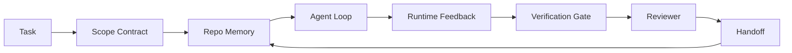

# Agent Workbench 工程：为何能力强的模型仍然失败

> 能力强的模型是不够的。可靠的智能体需要一个工作台：指令、状态、范围、反馈、验证、审查和交接。剥离这些，即使前沿模型产生的工作也不安全，无法交付。

**类型:** 学习 + 构建
**语言:** Python (标准库)
**前置条件:** 第14阶段·01 (智能体循环)，第14阶段·26 (故障模式)
**时间:** 约45分钟

## 学习目标

- 将模型能力与执行可靠性分开。
- 命名决定智能体是否交付的七个工作台表面。
- 比较纯提示运行与工作台引导运行在小仓库任务上的表现。
- 生成一份故障模式报告，将每个缺失的表面映射到其导致的症状。

## 问题

你将一个前沿模型放入真实仓库，要求它添加输入验证。它打开了四个文件，编写了看似合理的代码，宣布成功，然后停止。你运行测试。两个失败了。还接触了第三个与验证无关的文件。没有记录智能体假设了什么、首先尝试了什么或还有哪些待办事项。

模型不是关于Python错了。而是关于工作错了。它不知道什么算是完成、允许在哪里写入、哪些测试是权威的，或者下一个会话应该从哪里继续。

这不是模型错误。这是工作台错误。智能体周围的环境缺少将一次性生成转化为可靠、可恢复工程的部分。

## 核心概念

工作台是在任务期间包裹模型的操作环境。它有七个表面：

|  表面  |  承载内容  |  缺失时的故障  |
|---------|-----------------|----------------------|
|  指令  |  启动规则、禁止操作、完成的定义  |  智能体猜测交付的含义  |
|  状态  |  当前任务、接触的文件、阻塞项、下一步操作  |  每次会话从零开始  |
|  范围  |  允许的文件、禁止的文件、验收标准  |  编辑泄漏到无关代码中  |
|  反馈  |  捕获到循环中的真实命令输出  |  智能体在400错误上宣布成功  |
|  验证  |  测试、lint、冒烟测试、范围检查  |  "看起来不错"到达主分支  |
|  审查  |  以不同角色进行的第二次检查  |  构建者批改自己的作业  |
|  交接  |  改变了什么、为什么改变、还留下了什么  |  下一个会话重新发现一切  |

工作台独立于模型。你可以交换模型并保留表面。你不能交换表面并保留可靠性。



循环在状态文件上闭合，而不是在聊天历史。聊天是易变的。仓库是记录系统。

### 工作台与提示工程

提示告诉模型这一轮你想要什么。工作台告诉模型如何在跨轮次和跨会话中工作。大多数智能体故障故事是穿着提示工程外衣的工作台故障。

### 工作台与框架

框架给你一个运行时(LangGraph, AutoGen, Agents SDK)。工作台给智能体在该运行时内部一个工作位置。你需要两者。这个迷你系列是关于第二个的。

### 从原语推理，而非从供应商分类法

目前有很多关于"工具工程"的写作。Addy Osmani、OpenAI、Anthropic、LangChain、Martin Fowler、MongoDB、HumanLayer、Augment Code、Thoughtworks、walkinglabs的awesome列表，以及Medium和Hacker News上持续不断的文章都在讨论。他们对于工具边界、范围以及使用哪种词汇存在分歧。我们不需要选择立场。七个表面是一个用户界面层；每个工作台之下是支撑任何可靠后端的一组相同的分布式系统原语。

暂时去掉智能体标签。一次智能体运行是跨时间、进程和机器的计算。为了使其可靠，你需要任何生产系统所需的相同原语。

|  原语  |  是什么  |  为智能体承载什么  |
|-----------|------------|------------------------------|
|  函数  |  类型化处理器。尽可能纯净。拥有自己的输入和输出。  |  工具调用、规则检查、验证步骤、模型调用  |
|  工作者  |  长期运行的进程，拥有一个或多个函数和生命周期  |  构建者、审查者、验证者、MCP服务器  |
|  触发器  |  调用函数的事件源  |  智能体循环滴答、HTTP请求、队列消息、cron、文件更改、钩子  |
|  运行时  |  决定什么在哪里运行、使用什么超时和资源的边界  |  Claude Code的进程、LangGraph的运行时、工作者容器  |
|  HTTP / RPC  |  调用者和工作者之间的连接  |  工具调用协议、MCP请求、模型API  |
| 队列 | 触发器和工作器之间的持久缓冲区；背压、重试、幂等性 | 任务板、反馈日志、评审收件箱 |
| 会话持久化 | 在崩溃、重启、模型切换中存活的状态 | `agent_state.json`、检查点、KV存储、仓库本身 |
| 授权策略 | 谁可以调用哪个函数以及作用域范围 | 允许/禁止的文件、审批边界、MCP能力列表 |

现在将七个工作台表面映射到这些原语上。

- **指令**——策略+函数元数据。规则是检查（函数）。路由器（`AGENTS.md`）是附加在运行时启动上的策略。
- **状态**——会话持久化。一个运行时每一步都读取的键值存储。文件、KV或DB；持久化语义重要，存储后端不重要。
- **作用域**——每个任务的授权策略。允许/禁止的通配符是一个ACL。所需的审批是一个权限格。
- **反馈**——写入队列的调用日志。每个shell调用都是一个记录，持久、可重放。
- **验证**——一个函数。对于输入是确定性的。在任务关闭时触发。失败时关闭。
- **评审**——一个独立的工作器，对构建产物具有只读授权，对评审报告具有只写授权。
- **交接**——由会话结束触发器发出的持久记录。下一个会话的启动触发器读取它。

智能体循环本身就是一个工作器，它消费事件（用户消息、工具结果、定时器滴答），调用函数（模型，然后模型选择的工具），写入记录（状态、反馈），并发出触发器（验证、评审、交接）。没有神秘之处；与任务处理器形状相同。

### 流通中的模式，翻译为原语

每个流行的框架模式都归结为八个原语。翻译表。

| 供应商或社区模式 | 它实际上是什么 |
|------------------------------|--------------------|
| Ralph Loop（Claude Code、Codex、agentic_harness书）——当智能体试图提前停止时，将原始意图重新注入新的上下文窗口 | 一个触发器，使用干净上下文重新入队任务；会话持久化推进目标 |
| 计划/执行/验证（PEV） | 三个工作器，每个角色一个，通过状态和队列在阶段之间通信 |
| 框架-计算分离（OpenAI Agents SDK，2026年4月）——将控制平面与执行平面分离 | 重申控制平面/数据平面。比智能体标签早了几十年 |
| Open Agent Passport（OAP，2026年3月）——在执行前根据声明式策略签名并审计每个工具调用 | 由前置动作工作器强制执行的授权策略，带有签名的审计队列 |
| 指导与传感器（Birgitta Böckeler / Thoughtworks）——前馈规则 + 反馈可观测性 | 授权策略 + 验证函数 + 可观测性追踪 |
| 渐进式压缩，5阶段（Claude Code逆向工程，2026年4月）||| 一个状态管理工作器，在会话持久化上像cron一样运行，使其保持在预算内 |  |
| 钩子/中间件（LangChain、Claude Code）——拦截模型和工具调用 | 围绕运行时调用路径的触发器+函数 |
| 技能作为Markdown并渐进式披露（Anthropic、Flue）||| 一个函数注册表，函数元数据即时加载到上下文中 |  |
| 沙箱智能体（Codex、Sandcastle、Vercel Sandbox）||| 计算平面：具有隔离文件系统、网络和生命周期的运行时 |  |
| MCP服务器 | 通过稳定RPC暴露函数的工作器，能力列表作为授权 |

该表中的每一条都是智能体社区到达了一个在分布式系统中已有名称的原语，并给它起了一个新名字。对营销有用的标签；作为工程词汇没有用。

### 数据实际上说了什么

框架胜过模型的说法现在有数据支持。值得了解，因为它们也是反对“只需等待一个更聪明的模型”的唯一诚实的论点。

- Terminal Bench 2.0——相同模型，框架更改将一个编码智能体从第30名之外移至第5名（LangChain，《智能体框架剖析》）。
- Vercel——删除了其智能体80%的工具；成功率从80%跃升至100%（MongoDB）。
- Harvey——仅通过框架优化，法律智能体准确率提高了一倍以上（MongoDB）。
- 88%的企业AI智能体项目未能投入生产。失败集中在运行时，而非推理（preprints.org，《语言智能体框架工程》，2026年3月）。
- 一项2025年对三个流行开源框架的基准研究报告了约50%的任务完成率；长上下文WebAgent在长上下文条件下从40-50%下降到10%以下，主要原因是无限循环和目标丢失（2026年初的文章广泛报道）。

结论不是“框架永远胜利”。模型确实会随时间吸收框架技巧。结论是，今天，承重工程在模型周围，而不是模型内部，承载这些负荷的原语正是每个生产系统一直需要的。

### 供应商文章止步之处

这部分你不需要客气。

- LangChain的《智能体框架剖析》列举了11个组件——提示词、工具、钩子、沙箱、编排、记忆、技能、子智能体以及一个运行时“哑循环”。它没有提及队列、工作器作为部署单元、触发器语义、会话持久化作为独立关注点，或授权策略。它将框架视为你配置的对象，而不是你部署的系统。
- Addy Osmani的《智能体框架工程》提出了`Agent = Model + Harness`框架和棘轮模式，但没有说明框架是由什么构成的。它更像是一个立场，而不是一个规范。
- Anthropic和OpenAI对表面探讨最深，但局限于它们自己的运行时。2026年4月Agents SDK中的“框架-计算分离”公告是第一个明确支持控制平面/数据平面分离的供应商文章。这是一个原语思想，而不是新思想。
- agentic_harness书将框架视为配置对象（Jaymin West的《智能体工程》第6章），其中最有力的一句话是“框架是智能体系统中的主要安全边界”。这不过是授权策略的重新表述。
- Hacker News的讨论一直走到同一结论。2026年4月的帖子《智能体框架属于沙箱之外》认为框架应该“更像一个位于一切之外、根据上下文和用户授权访问的管理程序”。这再次将授权策略作为一个独立的平面。

你不需要不同意任何这些文章就能注意到差距。他们在写一个已经存在的系统的UX描述。我们在写系统本身。当系统构建正确时，七个表面从原语中得出。当构建错误时，再多的`AGENTS.md`修饰也无法修复缺失的队列。

所以当你在别处听到“框架工程”时，将其翻译为原语。提示词和规则是策略和函数。脚手架是运行时。护栏是授权+验证。钩子是触发器。记忆是会话持久化。Ralph Loop是重新入队。子智能体是工作器。沙箱是计算平面。词汇变化了；工程没有变。工作台是面向智能体的UX；框架，在经得起下一次供应商重构的意义上，是函数、工作器、触发器、运行时、队列、持久化和策略的正确连接。

## 动手构建

`code/main.py`运行一个小型仓库任务两次。第一次仅作为提示词，然后接入七个表面。相同模型，相同任务。脚本统计失败运行中缺失的表面，并打印失败模式报告。

故意让仓库任务小：为一个单文件FastAPI风格处理器添加输入验证，并编写一个通过测试。

运行它：

```
python3 code/main.py
```

输出：两次运行的并排日志、一个总结仅提示运行的`failure_modes.json`，以及工作台运行的一行结论。

该代理是一个基于规则的微型桩（stub）；重点是“表面”（surface），而非模型。在本小型课程剩余部分，你将把每个表面重建为真实、可重用的工件。

## 使用它

工作台表面（workbench surface）在现实中已存在于三处，即使没有人这么称呼它们：

- **Claude Code, Codex, Cursor.** `AGENTS.md`和`CLAUDE.md`是指令表面（instructions surface）。斜杠命令是范围（scope）。钩子（hooks）是验证（verification）。
- **LangGraph, OpenAI Agents SDK.** 检查点（checkpoints）和会话存储（session stores）是状态表面（state surface）。交接（handoffs）是交接表面（handoff surface）。
- **真实仓库上的CI.** 测试、lint和类型检查是验证。PR模板是交接。CODEOWNERS是审查。

工作台工程（Workbench engineering）是使这些表面显式且可重用的学科，而不是让每个团队重新发现它们。

## 发布

`outputs/skill-workbench-audit.md`是一个可移植的技能，它审计现有仓库的七个工作台表面，并报告哪些缺失、哪些部分存在、哪些健康。将其放在任何代理设置旁；它告诉你首先修复什么。

## 练习

1. 选择一个你已经运行代理的仓库。对七个表面评分，从0（缺失）到2（健康）。你最弱的表面是哪个？
2. 扩展`main.py`，使仅提示运行也产生一个虚假的“成功”声明。验证验证门是否会捕获它。
3. 为你自己的产品添加第八个表面。证明它为何不会归入现有七个之一。
4. 使用一个不同的桩代理重新运行脚本，该代理幻觉了一个额外的文件写入。哪个表面会首先捕获它？
5. 将第14·26阶段中的五个行业反复出现的失败模式映射到七个表面。每个表面设计用来吸收哪种模式？

## 关键术语

|  术语  |  人们的说法  |  实际含义  |
|------|----------------|------------------------|
|  工作台（Workbench）  |  "设置"  |  围绕模型设计的表面，使工作可靠  |
|  表面（Surface）  |  "文档"或"脚本"  |  代理每轮读取或写入的命名、机器可读输入  |
|  记录系统（System of record）  |  "笔记"  |  当聊天历史消失时代理视为真的事实文件  |
|  完成定义（Definition of done）  |  "验收"  |  代理无法伪造的客观、基于文件的检查清单  |
|  工作台审计（Workbench audit）  |  "仓库就绪检查"  |  在工作开始前检查七个表面并标记缺失部分的过程  |

## 延伸阅读

将这些视为数据点，而非权威。每一个都是部分分类法。在决定是否采用之前，将每个概念还原为原语（函数、工作器、触发器、运行时、HTTP/RPC、队列、持久化、策略）。

供应商框架：

- [Addy Osmani, Agent Harness Engineering](https://addyosmani.com/blog/agent-harness-engineering/) — `Agent = Model + Harness`和棘轮模式（ratchet pattern）；基础设施薄弱
- [Addy Osmani, Agent Harness Engineering](https://addyosmani.com/blog/agent-harness-engineering/) — 十一个组件：提示、工具、钩子、编排、沙箱、记忆、技能、子代理、运行时；忽略队列、部署、授权
- [Addy Osmani, Agent Harness Engineering](https://addyosmani.com/blog/agent-harness-engineering/) — Codex团队对于其运行时周围表面的看法
- [Addy Osmani, Agent Harness Engineering](https://addyosmani.com/blog/agent-harness-engineering/) — 代理循环简化为对函数调用的`Agent = Model + Harness`
- [Addy Osmani, Agent Harness Engineering](https://addyosmani.com/blog/agent-harness-engineering/) — 特定运行时内的长周期表面
- [Addy Osmani, Agent Harness Engineering](https://addyosmani.com/blog/agent-harness-engineering/) — 应用设计笔记
- [Addy Osmani, Agent Harness Engineering](https://addyosmani.com/blog/agent-harness-engineering/) — 运行时配置表面

具有可用细节的实践者文章：

- [Martin Fowler / Birgitta Böckeler, Harness engineering for coding agent users](https://martinfowler.com/articles/harness-engineering.html) — 引导（前馈）+ 传感器（反馈）；最清晰的控制理论框架
- [Martin Fowler / Birgitta Böckeler, Harness engineering for coding agent users](https://martinfowler.com/articles/harness-engineering.html) — "这不是模型问题，而是配置问题"
- [Martin Fowler / Birgitta Böckeler, Harness engineering for coding agent users](https://martinfowler.com/articles/harness-engineering.html) — 案例：Vercel从80%到100%，Harvey 2倍准确率，终端基准测试从前30到前5
- [Martin Fowler / Birgitta Böckeler, Harness engineering for coding agent users](https://martinfowler.com/articles/harness-engineering.html) — 约束优先的演练
- [Martin Fowler / Birgitta Böckeler, Harness engineering for coding agent users](https://martinfowler.com/articles/harness-engineering.html) — 运行时关注点优先于模型关注点

书籍、论文和参考实现：

- [Jaymin West, Agentic Engineering — Chapter 6: Harnesses](https://www.jayminwest.com/agentic-engineering-book/6-harnesses) — 书籍长度的处理，将绑定（harness）视为主要安全边界
- [Jaymin West, Agentic Engineering — Chapter 6: Harnesses](https://www.jayminwest.com/agentic-engineering-book/6-harnesses) — 学术框架：控制/代理/运行时
- [Jaymin West, Agentic Engineering — Chapter 6: Harnesses](https://www.jayminwest.com/agentic-engineering-book/6-harnesses) — 精选阅读列表，涵盖上下文、评估、可观测性、编排
- [Jaymin West, Agentic Engineering — Chapter 6: Harnesses](https://www.jayminwest.com/agentic-engineering-book/6-harnesses) — 替代精选列表（工具、评估、记忆、MCP、权限）
- [Jaymin West, Agentic Engineering — Chapter 6: Harnesses](https://www.jayminwest.com/agentic-engineering-book/6-harnesses) — 准备好生产环境的参考实现，带有Redis支持的记忆和评估套件
- [Jaymin West, Agentic Engineering — Chapter 6: Harnesses](https://www.jayminwest.com/agentic-engineering-book/6-harnesses) — 开源代理绑定，内置个人代理

值得阅读的Hacker News帖子，关注分歧而非共识：

- [HN: Effective harnesses for long-running agents](https://news.ycombinator.com/item?id=46081704)
- [HN: Effective harnesses for long-running agents](https://news.ycombinator.com/item?id=46081704)
- [HN: Effective harnesses for long-running agents](https://news.ycombinator.com/item?id=46081704) — 主张将授权作为独立层面

本课程内的交叉引用：

- 第14·23阶段 — OpenTelemetry GenAI约定：传感器文献所指的可观测性层
- 第14·26阶段 — 七个表面设计用于吸收的失败模式目录
- 第14·27阶段 — 位于授权-策略原语处的提示注入防御
- 第14·29阶段 — 生产运行时（队列、事件、cron）：本课程中的原语在部署中的位置
