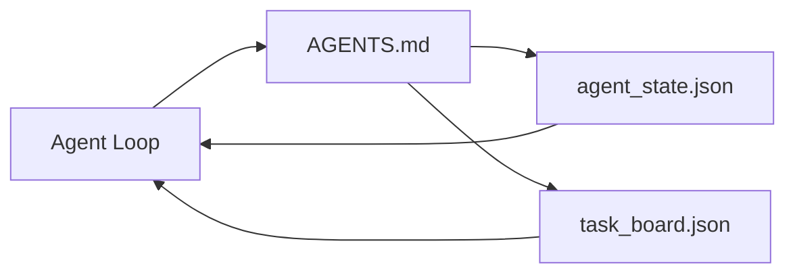

# 最小智能体工作台

> 最小可行的作业台由三个文件组成：一个根指令路由器(Router)、一个状态文件和一个任务板(Task Board)。其他所有东西都叠加上去。如果一个仓库不能承载这三个文件，没有任何模型能拯救它。

**类型：** 构建
**语言：** Python (stdlib)
**先决条件：** 阶段14 · 31（为何有能力的模型仍然失败）
**时间：** 约45分钟

## 学习目标

- 定义构成最小可行作业台的三个文件。
- 解释为什么短根路由器胜过冗长的单体`AGENTS.md`。
- 构建一个代理每一步都能读取、结束时能写入的状态文件。
- 构建一个无需聊天记录就能跨会话工作的任务板。

## 问题

大多数团队通过编写3000行的`AGENTS.md`并宣称完成来搭建作业台。模型加载它，忽略无法总结的部分，然后在同样的问题上继续失败。

你需要相反的做法。一个微小的根文件，仅在相关时将代理路由到更深层的文件。持久化状态——代理在行动前读取、行动后写入。一个任务板，显示正在进行、受阻和下一步的任务。

三个文件。各司其职。每个都足够机器可读，以便日后演变为真正的系统。

## 核心概念



### AGENTS.md 是一个路由器(Router)，不是手册

一个好的`AGENTS.md`是简短的。它指引代理到：

- 状态文件（你在哪里）。
- 任务板（还剩下什么）。
- 深层规则（位于`docs/agent-rules.md`下）。
- 验证命令（如何知道它工作正常）。

任何更长的内容都放在深层文档中，仅在需要时加载。长手册会被忽略。简短的路线图会被遵循。

### agent_state.json 是记录系统

状态包含：当前任务ID、已接触的文件、所做的假设、阻塞项以及下一步行动。代理每一步都会读取它。下一个会话读取它而不是回放聊天记录。

状态保存在文件中，因为聊天记录不可靠。会话会死亡。对话会被截断。文件不会。

### task_board.json 是队列

任务板包含每个任务及其状态`todo | in_progress | done | blocked`。它是代理在状态为空时拉取任务的队列，也是你想了解代理是否在正轨时读取的队列。

板上的任务有一个ID、一个目标、一个负责人（`builder`、`reviewer`或`human`）和验收标准。板故意保持小规模：当它增长超过一个屏幕时，你遇到的是规划问题，而不是板的问题。

### 三个文件是地板，而不是天花板

后续课程会增加范围合同、反馈运行器、验证门、审查者清单和交接包。这里的三个文件是它们都依赖的基础。

## 动手构建

`code/main.py`将最小作业台写入一个空仓库，并演示一个代理回合：

1. 读取`agent_state.json`。
2. 如果状态为空，则从`agent_state.json`拉取下一个任务。
3. 触及范围内单文件。
4. 写回更新后的状态。

运行它：

```
python3 code/main.py
```

脚本在自身旁边创建`workdir/`，放下三个文件，运行一个回合，并打印差异。重新运行以查看第二回合如何从第一回合结束处继续。

## 使用它

在生产级代理产品中，同样的三个文件以不同名字出现：

- **Claude Code：** `AGENTS.md`或`CLAUDE.md`作为路由器，`.claude/state.json`风格的存储用于状态，钩子用于板。
- **Codex / Cursor：** 工作区规则作为路由器，会话内存用于状态，聊天侧边栏中的排队任务用于板。
- **自定义Python代理：** 与你刚写的文件相同。

名字变了。形式不变。

## 实际中的生产模式

当三个模式叠加在最小作业台上时，它能在真实单体仓库中存活。这些模式是独立的；选择你的仓库实际需要的那些。

**嵌套`AGENTS.md`，最近优先。** OpenAI在其主仓库中发布了88个`AGENTS.md`文件，每个子组件一个。Codex、Cursor、Claude Code和Copilot都从工作文件向仓库根目录遍历，并连接沿途找到的每个`AGENTS.md`。子目录文件扩展根文件。Codex添加`AGENTS.override.md`以替换而不是扩展；覆盖机制是Codex特有的，应避免用于跨工具工作。Augment Code的衡量标准是关键的指标：最好的`AGENTS.md`文件带来的质量提升相当于从Haiku升级到Opus；最差的输出比没有文件更糟糕。

**即使看起来覆盖全面也要拒绝的反模式。** 相互冲突的指令会默默将代理从交互模式降级到贪婪模式（ICLR 2026 AMBIG-SWE：解决率从48.8%降至28%）；对优先级进行编号而不是平铺排列。不可验证的风格规则（例如"遵循Google Python风格指南"）没有强制执行命令，让代理自行遵守；应将每个风格规则与确切的lint命令配对。以风格而非命令开头会埋没验证路径；命令优先，风格最后。为人类而非代理编写会浪费上下文预算；简洁是一种特性。

**跨工具符号链接。** 一个带有符号链接（`ln -s AGENTS.md CLAUDE.md`、`ln -s AGENTS.md .github/copilot-instructions.md`、`ln -s AGENTS.md .cursorrules`）的单个根文件使每个编码代理保持同一事实来源。Nx的`nx ai-setup`从单个配置自动化跨Claude Code、Cursor、Copilot、Gemini、Codex和OpenCode的此功能。

## 发布

`outputs/skill-minimal-workbench.md`为任何新仓库生成三文件作业台：一个为项目调优的`AGENTS.md`路由器，一个带有正确键的`agent_state.json`，以及一个填充了当前积压任务的`task_board.json`。

## 练习

1. 在`agent_state.json`中添加一个`last_run`时间戳。如果文件超过24小时未更新，则拒绝运行，除非操作员确认。
2. 在任务板上添加一个`last_run`字段，并将拉取者改为始终选择优先级最高的`agent_state.json`。
3. 将`last_run`迁移到JSON Lines格式，以便每个任务占据一行，且在版本控制中差异清晰。
4. 编写一个`last_run`，如果`agent_state.json`超过80行或引用了不存在的文件，则该检查失败。
5. 从三个文件中决定哪一个丢失后损失最大。为其辩护。

## 关键术语

|  术语  |  人们的说法  |  实际含义  |
|------|----------------|------------------------|
| 路由器 | `AGENTS.md` | 指向代理到更深入文档和文件的简短根文件 |
| 状态文件 | "笔记" | 代理位置的机器可读记录，每轮写入一次 |
| 任务板 | "待办事项" | 带有状态、负责人、验收条件的工作JSON队列 |
| 记录系统 | "真相来源" | 工作台在聊天消失时视为权威的文件 |

## 延伸阅读

- [agents.md — the open spec](https://agents.md/) — 被Cursor, Codex, Claude Code, Copilot, Gemini, OpenCode采用
- [agents.md — the open spec](https://agents.md/) — 测量的质量提升
- [agents.md — the open spec](https://agents.md/) — 经验中哪些有效，哪些无效
- [agents.md — the open spec](https://agents.md/) — 实践中的嵌套优先级
- [agents.md — the open spec](https://agents.md/) — 跨六个工具的单源生成
- [agents.md — the open spec](https://agents.md/) — 经审查仍存续的章节顺序
- [agents.md — the open spec](https://agents.md/)
- 阶段14 · 31 — 这个最小值吸收的失败模式
- 阶段14 · 34 — 本课预览的持久状态模式
