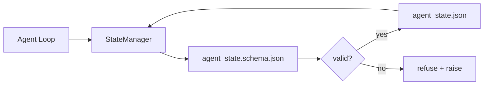

# 仓库记忆与持久状态

> 聊天记录是易失的。仓库是持久的。工作台将代理状态存储在版本化文件中，这样下一次会话、下一个代理、下一个审查者都从同一个真实来源读取。

**类型:** 构建
**语言:** Python (stdlib + `jsonschema` 可选)
**前置条件:** 阶段14 · 32 (最小工作台)
**时间:** 约60分钟

## 学习目标

- 定义哪些属于仓库记忆，哪些属于聊天记录。
- 为`agent_state.json`和`task_board.json`编写JSON Schema。
- 构建一个状态管理器，能够原子性地加载、验证、修改和持久化状态。
- 使用Schema在错误写入破坏工作台之前拒绝它们。

## 问题

代理完成一个会话。聊天关闭。下一个会话打开并询问从哪里开始。模型说“让我检查一下文件”，读取过时的笔记，并重新做已经完成的工作。或者更糟，它重写了一个已经完成的文件，因为没有人告诉它文件已经完成。

工作台的修复是仓库记忆：状态存在于仓库的JSON文件中，按照Schema写入，原子性地持久化，在代码审查中便于差异对比。聊天是短暂的流；仓库是记录系统。

## 核心概念



### 哪些属于仓库记忆

|  属于  |  不属于  |
|---------|-----------------|
|  活动任务ID  |  原始聊天记录  |
|  本次会话接触的文件  |  令牌级推理跟踪  |
|  代理做出的假设  |  “用户似乎感到沮丧”  |
|  未解决的阻塞项  |  采样补全  |
|  下一步行动  |  供应商特定模型ID  |

测试标准是耐久性：三个月后在CI重跑中这会是有用的吗？如果是，放入仓库。如果否，放入遥测。

### Schema优先的状态

JSON Schema是契约。没有它，每个代理都会发明新字段，每个审查者都要学习新形状，每个CI脚本都必须特殊处理过去的版本。有了它，错误的写入就是被拒绝的写入。

Schema涵盖：

- 必需的键。
- 允许的`status`值。
- 禁止的值（例如数组的`status`）。
- 模式约束（任务ID匹配`status`）。
- 用于迁移的版本字段。

### 原子性写入

状态写入需要能够承受部分失败：写入临时文件，fsync，重命名覆盖目标。状态文件是真实来源；写入一半的文件比没有文件更糟糕。

### 迁移

当Schema更改时，在Schema升级的同时附带迁移脚本。状态文件携带`schema_version`字段；管理器拒绝加载来自无法迁移的版本的文件。

## 动手构建

`code/main.py` 实现：

- `agent_state.schema.json`和`task_board.schema.json`。
- 一个仅使用stdlib的验证器（JSON Schema的子集：required, type, enum, pattern, items）。
- `agent_state.schema.json`, `task_board.schema.json`, `StateManager.load`，带有原子性的临时文件和重命名写入。
- 一个演示，修改状态、持久化、重新加载并证明往返完整。

运行它：

```
python3 code/main.py
```

脚本写入`workdir/agent_state.json`和`workdir/task_board.json`，在两个回合中修改它们，并在每一步打印验证后的状态。

## 实际中的生产模式

四个模式将本课的最小实现转变为多代理单仓库可以存活的东西。

**原子性的临时文件和重命名不是可选的。** 一份2026年3月Hive项目的bug报告清楚地记录了故障模式：`state.json`通过`write_text()`写入，异常被捕获并静默处理。部分写入导致会话在无信号的情况下从损坏的状态恢复。修复方法始终是：在与目标相同的目录中`tempfile.mkstemp`，写入，`fsync`，`os.replace`（POSIX和Windows上的原子重命名）。本课的`atomic_write`正是这样做的。

**每个非幂等工具调用的幂等键。** 如果代理在调用工具之后但在检查点保存结果之前崩溃，恢复时会重试工具调用。对于读操作是安全的；对于电子邮件、数据库插入、文件上传是危险的。模式：在执行前将每个工具调用ID记录到`pending_calls.jsonl`中。重试时，检查ID；如果存在，跳过调用并使用缓存的结果。Anthropic和LangChain都在2026年的指南中指出了这一点；LangGraph的检查点保存器出于同样的原因持久化待处理的写入。

**将大型工件与状态分离。** 不要将CSV、长记录或生成的文件存储在`agent_state.json`中。将工件保存为单独的文件（或上传到对象存储），并在状态中仅保留路径。检查点保持小而快；工件独立增长。

**用于审计的事件溯源，用于恢复的快照。** 每次修改追加到事件日志（`state.events.jsonl`）；定期快照到`state.json`。恢复时读取快照，然后重放快照时间戳之后的任何事件。这会消耗更多磁盘，但可以逐字重放代理决策——在调试长时间运行的任务时至关重要。与Postgres内部用于WAL的形状相同。

**Schema迁移或拒绝加载。** `schema_version`整数是契约。当管理器加载一个未知版本的文件时，它拒绝读取。在Schema升级的同时附带迁移脚本；`tools/migrate_state.py`在每次启动时幂等地运行。

## 使用它

在生产中：

- **LangGraph检查点保存器。** 相同的理念，不同的存储。检查点保存器将图状态持久化到SQLite、Postgres或自定义后端。本课教授的Schema是当检查点保存器失效且需要手动读取状态时使用的。
- **Letta记忆块。** 具有结构化Schema的持久化块（阶段14 · 08）。相同的规范适用于长期运行的角色。
- **OpenAI Agents SDK会话存储。** 可插拔后端，Schema感知。本课中的状态文件是本地文件后端。

## 发布

`outputs/skill-state-schema.md` 生成一个项目特定的JSON Schema对（状态+看板），一个连接到原子写入的Python `StateManager`，以及一个迁移脚手架，以便下次模式升级不会破坏工作台。

## 练习

1. 添加一个`last_human_touch`时间戳。拒绝在人类编辑后的五秒内任何代理写入。
2. 扩展验证器以支持`last_human_touch`，从而使任务可以是构建任务或审查任务，具有不同的必填字段。
3. 添加一个`last_human_touch`字段，并编写从v1到v2的迁移（将`oneOf`重命名为`schema_version`）。
4. 将存储后端从本地文件迁移到SQLite。保持`last_human_touch`API相同。
5. 运行两个代理对同一个状态文件进行50ms写入竞争。会出现什么问题，原子重命名如何拯救你？

## 关键术语

|  术语  |  人们的说法  |  实际含义  |
|------|----------------|------------------------|
|  仓库内存  |  “笔记文件”  |  存储于仓库中跟踪文件内的状态，位于模式  |
|  模式优先  |  “验证输入”  |  在写入器之前定义契约，拒绝漂移  |
|  原子写入  |  “仅重命名”  |  写入临时文件，fsync，重命名，从而部分失败不会损坏  |
|  迁移  |  “模式升级”  |  将vN状态转换为v(N+1)状态的脚本  |
|  记录系统  |  “真相来源”  |  工作台视为权威的工件  |

## 延伸阅读

- [JSON Schema specification](https://json-schema.org/specification.html)
- [JSON Schema specification](https://json-schema.org/specification.html)
- [JSON Schema specification](https://json-schema.org/specification.html)
- [JSON Schema specification](https://json-schema.org/specification.html) — 带幂等性的模式优先检查点
- [JSON Schema specification](https://json-schema.org/specification.html) — 并发控制、TTL、事件溯源
- [JSON Schema specification](https://json-schema.org/specification.html) — 真实项目中的故障模式
- [JSON Schema specification](https://json-schema.org/specification.html) — 从操作系统历史应用于代理的CR原语
- [JSON Schema specification](https://json-schema.org/specification.html)
- [JSON Schema specification](https://json-schema.org/specification.html) — 供应商检查点管理器
- 阶段14 · 08 — 内存块和休眠时间计算
- 阶段14 · 32 — 本课程模式化的最小三个文件
- 阶段14 · 40 — 从同一模式读取的移交包
