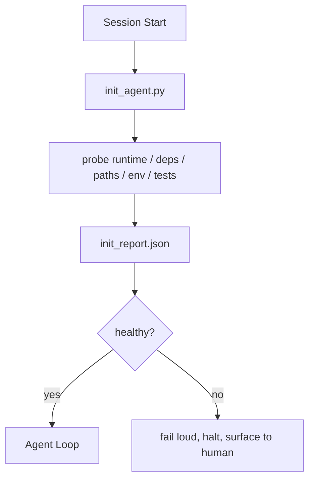

# 代理的初始化脚本

> 每个冷启动的会话都要付出代价。智能体(Agent)反复读取同一份文件，重试相同的探测，重新发现相同的路径。初始化脚本只付一次代价，然后把答案写入状态(State)。

**类型：** 构建
**语言：** Python (标准库)
**前置条件：** 阶段14·32（最小工作台），阶段14·34（仓库记忆）
**时间：** ~45分钟

## 学习目标

- 识别智能体在每个会话中绝不应重复做的工作。
- 构建一个确定性的初始化脚本，探测运行时、依赖项和仓库健康状态。
- 持久化探测结果，让智能体读取它而不是重新运行检查。
- 当初始化失败时，要失败得响亮、快速，并且有一个地方可供查看。

## 问题

打开一个会话。智能体猜测Python版本。猜测测试命令。列出仓库根目录五次以找到入口点。尝试导入一个未安装的包。询问用户配置文件在哪里。等到它真正做出一次编辑时，已经花费了一万个token在做那些本应是一个脚本完成的准备工作。

解决方案是一个初始化脚本，它在智能体做任何其他事情之前运行，并写入一个`init_report.json`，智能体在启动时读取。

## 核心概念



### 初始化脚本探测什么

|  探测项  |  为什么重要  |
|-------|----------------|
|  运行时版本  |  错误的Python或Node版本意味着静默的版本错误bug  |
|  依赖可用性  |  缺少某个包，后面修复的成本是现在发现它的成本的十倍  |
|  测试命令  |  智能体必须知道如何验证；如果命令缺失，工作台就坏了  |
|  仓库路径  |  硬编码的路径会漂移；一次性解析并固定  |
|  环境变量  |  缺失的`OPENAI_API_KEY`是一个失败面，而不是运行时谜题  |
|  状态与看板新鲜度  |  崩溃会话中的陈旧状态是一个隐患  |
|  最后一次已知的正常提交  |  作为会话结束时交接差异的锚点  |

### 失败得响亮，失败得快速，失败在一个地方

探测失败意味着停止并向人类展示。不要指望“智能体会解决”。初始化的全部意义在于，当工作台损坏时拒绝启动。

### 幂等(Idempotent)

连续运行两次。第二次运行除了更新时间戳外应该是空操作。幂等性让你可以将脚本接入CI、钩子或预任务斜杠命令。

### 初始化与启动规则

规则（阶段14·33）描述了行动必须满足的条件。初始化是建立这些条件可被检查的脚本。没有初始化的规则变成了“要小心”。没有规则的初始化变成了精致的失败。

## 动手构建

`code/main.py`实现了`init_agent.py`：

- 五个探测项：Python版本，通过`importlib.util.find_spec`列出的依赖，测试命令的可解析性，所需的环境变量，状态文件的时效性。
- 每个探测项返回`importlib.util.find_spec`。
- 脚本写入包含完整探测集的`importlib.util.find_spec`，如果任何块级严重性探测失败，则非零退出。

运行它：

```
python3 code/main.py
```

脚本打印探测表，写入`init_report.json`，并在正常路径上以零退出，或者以非零及失败探测列表退出。

## 实际中的生产模式

三种模式区分了有用的初始化脚本和仪式性的东西。

**最后一次已知的正常提交锚定。** 探测当前提交与上次成功合并时写入的`LKG`文件的差异。如果diff超出预算（默认50个文件），则拒绝启动并要求人类批准新基线。Cloudflare的AI代码审查(Code Review)正是使用这个方法来限定审查智能体的范围：每个审查会话都锚定同一个最后一次已知的正常提交，绝不会跨会话累积漂移。

**带TTL的锁文件。** 在第一次成功的探测通过后写入一个`prereqs.lock`。后续运行信任该锁N小时（默认24小时），并跳过昂贵的探测。初始化脚本首先读取锁；如果锁未过期且依赖清单哈希匹配，则短路。这与Docker用于层缓存的模式相同：幂等探测 + 内容哈希 = 跳过。

**热路径上无网络、无LLM、无意外。** 初始化探测是确定性的管道。一个调用LLM来分类失败或访问外部服务检查许可证的探测不是探测，而是工作流。如果某个探测在干运行中耗时超过三秒，则视为工作台不良气味，要么将其移出初始化，要么缓存其结果。

## 使用它

在生产中：

- **Claude Code钩子。** `pre-task`钩子调用初始化脚本，如果失败则拒绝启动智能体。
- **GitHub Actions。** 一个`pre-task`任务运行初始化脚本；智能体任务依赖它。
- **Docker入口点。** 智能体容器在执行智能体运行时之前运行初始化脚本；失败时日志会呈现出来。

初始化脚本是可移植的，因为它不调用特定框架。Bash、Make或任务文件都可以包装它。

## 发布

`outputs/skill-init-script.md`对项目进行访谈，将它的设置工作分类为探测项，并生成一个项目特定的`init_agent.py`以及一个在任何智能体步骤之前运行它的CI工作流。

## 练习

1. 添加一个探针，对比当前提交与上次已知正常提交，如果超过50个文件有变更则拒绝启动。
2. 将脚本配置为写入`prereqs.lock`文件，如果锁文件超过七天则拒绝启动。
3. 添加一个`prereqs.lock`标志，自动安装缺失的开发依赖，但未经批准绝不修改运行时依赖。
4. 将探针从硬编码函数迁移到YAML注册表。为此权衡做出辩护。
5. 为每个探针添加时间预算。运行超过三秒的探针是工作台异味。

## 关键术语

|  术语  |  人们的说法  |  实际含义  |
|------|----------------|------------------------|
|  探针  |  "一项检查"  |  一个返回`(name, status, detail)`的确定性函数  |
|  初始化报告  |  "设置输出"  |  与状态文件相邻写入的JSON，包含探针结果  |
|  幂等  |  "可安全重跑"  |  连续两次运行生成相同的报告（时间戳除外）  |
|  失败显式  |  "不要吞没"  |  停止并将信息呈现给用户；无静默回退  |
|  设置税  |  "启动成本"  |  智能体每次会话重新发现显而易见内容所花费的令牌  |

## 延伸阅读

- [Anthropic, Effective harnesses for long-running agents](https://www.anthropic.com/engineering/effective-harnesses-for-long-running-agents)
- [Anthropic, Effective harnesses for long-running agents](https://www.anthropic.com/engineering/effective-harnesses-for-long-running-agents)
- [Anthropic, Effective harnesses for long-running agents](https://www.anthropic.com/engineering/effective-harnesses-for-long-running-agents) — 预提交 + CI检查作为初始化
- [Anthropic, Effective harnesses for long-running agents](https://www.anthropic.com/engineering/effective-harnesses-for-long-running-agents) — 初始化预期
- [Anthropic, Effective harnesses for long-running agents](https://www.anthropic.com/engineering/effective-harnesses-for-long-running-agents) — 会话开始作为感知压缩的初始化
- 阶段14 · 33 — 此脚本启用的规则集
- 阶段14 · 34 — 此脚本播种的状态文件
- 阶段14 · 38 — 初始化脚本提供的验证关口
- 阶段14 · 40 — 消费初始化报告的上次已知正常状态的交接
