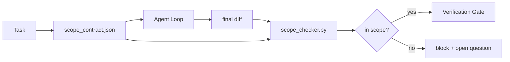

# 范围契约与任务边界

> 模型不知道工作在哪里结束。范围合同是一个按任务划分的文件，说明工作从哪里开始、在哪里结束，以及如果工作超出范围如何回滚。合同将“保持范围”从愿望变为检查。

**类型：** 构建
**语言：** Python（标准库）
**前置条件：** 阶段14 · 32（最小工作台），阶段14 · 33（作为约束的规则）
**时间：** ~50分钟

## 学习目标

- 编写一个范围合同，代理在任务开始时读取，验证器在任务结束时读取。
- 指定允许的文件、禁止的文件、验收标准、回滚计划和批准边界。
- 实现一个范围检查器，将差异与合同进行比较并标记违规。
- 使范围蔓延可见、自动且可审查。

## 问题

代理会蔓延。任务是“修复登录漏洞”。差异涉及登录路由、电子邮件助手、数据库驱动程序、README和发布脚本。每一步当时都有合理的理由。但合在一起，它们变成了与审查时不同的更改。

范围蔓延是代理工作中最被低估的失败模式，因为代理出于善意叙述每一步。解决方案不是更严格的提示。解决方案是磁盘上的一份合同，说明承诺了什么，以及将结果与承诺进行比较的检查。

## 核心概念



### 范围合同中包含什么

|  字段  |  目的  |
|-------|---------|
|  `task_id`  |  指向看板上任务的链接  |
|  `goal`  |  验证器可以验证的一句话  |
|  `allowed_files`  |  代理可以写入的通配符  |
|  `forbidden_files`  |  代理即使意外也不能触碰的通配符  |
|  `acceptance_criteria`  |  证明完成测试的命令或断言行  |
|  `rollback_plan`  |  如果需要停顿时操作员可以执行的一段描述  |
|  `approvals_required`  |  超出范围需要明确人工签署的动作  |

没有`forbidden_files`的合同是不完整的。负空间是合同的一半。

### 通配符，而非原始路径

真正的仓库会移动文件。将合同固定到通配符（`app/**/*.py`, `tests/test_signup*.py`）上，这样会话之间的重构不会使合同失效。

### 回滚是范围的一部分

列出如何回滚迫使合同作者考虑可能出错的地方。一个无法回滚的合同是不应被批准的合同。

### 范围检查是差异检查

代理写入差异。检查器读取差异、允许的通配符、禁止的通配符以及任何已运行的验收命令列表。每个违规都是一个带标签的发现，验证门可以拒绝。

### 范围的两个层级：功能列表和任务合同

范围合同限制一个任务。它不限制项目。代理可以完美地留在登录修复的合同内，但在下一轮中仍然决定项目还需要设置页面、深色模式切换和重写路由器。合同从未被问及哪些工作属于项目范围，只问哪些文件属于任务范围。

第二个层级需要它自己的原语：代理在会话开始时读取的`feature_list.json`。它是一个机器可读、有序的项目待办列表。代理只选取一个`status`为`todo`的功能，将其`id`写入当前的范围合同，并且禁止在同一会话中开始第二个功能。“一次一个功能”不再只是提示中的一行，代理可以绕过它，而是成为磁盘上读取的一个值以及门强制执行的一项检查。

```json
{
  "project": "knowledge-base",
  "active": "import-pdf",
  "features": [
    { "id": "import-pdf",   "status": "in_progress", "goal": "import a PDF into the library",        "done_when": "pytest tests/test_import.py && a sample PDF appears in the library view" },
    { "id": "full-text-search", "status": "todo",     "goal": "search document text and rank hits",   "done_when": "query returns ranked results with snippets" },
    { "id": "cite-answers", "status": "todo",         "goal": "answers carry source citations",        "done_when": "every answer renders at least one clickable citation" }
  ]
}
```

|  字段  |  目的  |
|-------|---------|
|  `active`  |  当前会话可以接触的单个功能；空表示选取一个并设置它  |
|  `features[].id`  |  范围合同的`task_id`指向的稳定标识符  |
|  `features[].status`  |  `todo`，`in_progress`，`done`，`blocked`；一次只能有一个`in_progress`  |
|  `features[].goal`  |  验证器可以验证的一句话  |
|  `features[].done_when`  |  将`in_progress`翻转为`done`的验收行  |

两条规则使列表具有承载性而非装饰性。首先，不变量“最多只有一个`in_progress`”本身就是一个启动检查（阶段14 · 33）：如果列表显示两个，会话拒绝启动直到人工解决。其次，功能列表是一个文件，而不是聊天消息，因为聊天会滚动出上下文，而文件会跨会话和代理持久化。交接（阶段14 · 40）将已完成功能的状态写回`done`，以便下一个会话打开时看到准确的看板，而不是重新推导剩余内容。

合同和列表通过最小权限组合，如下所述：任务合同的`allowed_files`必须位于当前功能接触的范围内，绝不能超出它。

## 动手构建

`code/main.py` 实现：

- `scope_contract.json` schema（JSON Schema的子集，glob数组）。
- 一个差异解析器，将受影响的文件列表和运行命令列表转换为`scope_contract.json`。
- 一个`scope_contract.json`，返回与合约对比的`RunSummary`。
- 两个演示运行：一个在范围内，一个越界。检查器标记越界，并给出具体文件和原因。

运行它：

```
python3 code/main.py
```

输出：合约、两次运行、每次运行的判定结果以及保存的`scope_report.json`。

## 实际中的生产模式

一位实践者运行"specsmaxxing"（在调用代理前以YAML编写范围合约）报告称，在不改变代理的情况下，三周内"兔子洞率"从52%下降到21%。是合约起了作用，而非模型。三个模式使这一收益得以持续。

**违规预算(violation budgets)，而非二元失败。** `agent-guardrails`（Claude Code、Cursor、Windsurf、Codex通过MCP使用的开源合并门控）为每个任务提供`violationBudget`：预算内的小范围偏移会作为警告显示；只有在预算超限时，合并门控才会拒绝。与`violationSeverity: "error" | "warning"`配合使用。预算区分了能投入生产的门控与被团队嫌弃而禁用的门控。

**基于路径族的严重性不对称。** 对`docs/**`的越界写入通常是`warn`；而对`scripts/**`、`migrations/**`、`config/prod/**`的越界写入始终是`block`。这种不对称必须存在于合约中，而非运行时，因为它是项目特定的，并随任务变化。

**时间和网络预算与文件预算并列。** `time_budget_minutes`字段限定了墙钟时间；运行时在超出后若无重新批准则拒绝继续。主机名的`network_egress`白名单防止代理悄悄访问不属于任务的外部API。这些也是范围维度；文件glob是必要的，但不是充分的。

**多合约合并语义（最小权限）。** 当两个范围合约适用时（例如，项目级合约加任务特定合约），合并规则为：**交集** `allowed_files`（两个合约都必须允许该路径），**并集** `forbidden_files`（任一可以禁止），`time_budget_minutes`取最严格（最小值），`approvals_required`累加。`network_egress`为`None`表示不执行，`[]`表示全部拒绝，`[...]`作为白名单；合并时，`None`服从对方，两个列表取交集，全部拒绝保持全部拒绝。在合约schema中声明这一点，以便合并是机械且可审查的。

## 使用它

生产模式：

- **Claude Code斜杠命令。** `/scope`命令写入合约并将其固定为会话上下文。子代理在执行前读取合约。
- **GitHub PRs。** 将合约作为JSON文件推送到PR正文或作为签入的产物。CI针对合并差异运行范围检查器。
- **LangGraph中断。** 范围违规触发中断；处理器询问人类合约是否需要扩展或代理是否需要回退。

合约随任务移动。任务关闭时，合约存档于`outputs/scope/closed/`下。

## 发布

`outputs/skill-scope-contract.md`为任务描述生成范围合约，并生成一个全局感知的检查器，在CI中对每个代理差异运行。

## 练习

1. 添加`network_egress`字段列出允许的外部主机。拒绝触及其他主机的运行。
2. 扩展检查器，对`network_egress`软失败，对`docs/**`硬失败。论证这种不对称的合理性。
3. 让合约通过静态规则集（无LLM）从`docs/**`字段推导出`network_egress`。第一个边界情况会出现什么问题？
4. 添加`network_egress`，一旦墙钟时间超过它则拒绝继续。
5. 对同一差异运行两个合约。当两者都适用时，正确的合并语义是什么？

## 关键术语

|  术语  |  人们的说法  |  实际含义  |
|------|----------------|------------------------|
|  范围合约(Scope contract)  |  "任务简介"  |  每个任务的JSON，列出允许/禁止的文件、接受、回滚  |
|  范围蔓延(Scope creep)  |  "它还触及了..."  |  同一任务中合约之外被更改的文件  |
|  回滚计划(Rollback plan)  |  "我们可以回滚"  |  用于暂停的一段操作员运行手册  |
|  批准边界(Approval boundary)  |  "需要签字"  |  合约中列为需要明确人工批准的操作  |
|  差异检查(Diff check)  |  "路径审计"  |  将受影响的文件与合约glob进行比对  |

## 延伸阅读

- [LangGraph human-in-the-loop interrupts](https://langchain-ai.github.io/langgraph/concepts/human_in_the_loop/)
- [LangGraph human-in-the-loop interrupts](https://langchain-ai.github.io/langgraph/concepts/human_in_the_loop/)
- [LangGraph human-in-the-loop interrupts](https://langchain-ai.github.io/langgraph/concepts/human_in_the_loop/) — 违规预算、严重性等级
- [LangGraph human-in-the-loop interrupts](https://langchain-ai.github.io/langgraph/concepts/human_in_the_loop/) — 无外部依赖的[OpenAI Agents SDK tool approval policies](https://platform.openai.com/docs/guides/agents-sdk)模式
- [LangGraph human-in-the-loop interrupts](https://langchain-ai.github.io/langgraph/concepts/human_in_the_loop/) — specsmaxxing收据：52% → 21%
- [LangGraph human-in-the-loop interrupts](https://langchain-ai.github.io/langgraph/concepts/human_in_the_loop/) — 细粒度按权限的范围
- [LangGraph human-in-the-loop interrupts](https://langchain-ai.github.io/langgraph/concepts/human_in_the_loop/) — 范围作为最小权限的一部分
- [LangGraph human-in-the-loop interrupts](https://langchain-ai.github.io/langgraph/concepts/human_in_the_loop/) — 三层边界系统（必须/询问/从不）
- 第14章·27 — 与范围锁配合使用的提示注入防御
- 第14章·33 — 此合约每任务特化的规则集
- 第14章·38 — 检查器报告到的验证门控
