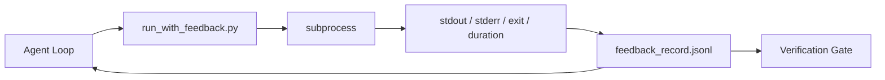

# 运行时反馈循环

> 未看到真实命令输出的智能体会猜测。反馈运行器将标准输出、标准错误、退出码和计时捕获到结构化记录中，供下一轮读取。这样智能体就能对事实做出反应，而不是对自身预测的事实做出反应。

**类型：** 构建
**语言：** Python (stdlib)
**先决条件：** Phase 14 · 32 (Minimal Workbench), Phase 14 · 35 (Init Script)
**时间：** ~50分钟

## 学习目标

- 区分运行时反馈与可观测性遥测。
- 构建一个封装Shell命令并持久化结构化记录的反馈运行器。
- 确定性地截断大输出，使循环保持在Token预算内。
- 当缺少反馈时，拒绝推进循环。

## 问题

智能体说“正在运行测试”，下一条消息说“所有测试通过”。但现实是根本没有测试运行。智能体想象了输出，或者它运行了命令但从未读取结果，或者它读取了结果但静默截断了失败行。

反馈运行器消除了这一差距。每个命令都通过运行器执行。每条记录都包含命令、捕获的标准输出和标准错误、退出码、挂钟时长以及一行智能体注释。智能体在下一轮读取记录，验证门在任务结束时读取记录。

## 核心概念



### 反馈记录包含什么

|  字段  |  重要性  |
|-------|----------------|
|  `command`  |  精确的argv，无Shell展开意外 |
|  `stdout_tail`  |  最后N行，确定性截断 |
|  `stderr_tail`  |  最后N行，与标准输出分离 |
|  `exit_code`  |  明确的成功信号 |
|  `duration_ms`  |  揭示慢探测和失控进程 |
|  `started_at`  |  用于回放的时间戳 |
|  `agent_note`  |  智能体关于其预期的一行注释 |

### 截断是确定性的

一个50MB的日志会破坏循环。运行器用`...truncated N lines...`标记截断头部和尾部，具有确定性，因此相同的输出总是产生相同的记录。没有采样；智能体需要看到的部分（最终错误、最终摘要）位于尾部。

### 反馈与遥测

遥测（第14阶段·23，OTel GenAI约定）供人类操作员跨时间审查运行情况。反馈用于本次运行的下一轮。它们共享字段，但存在于不同的文件中，具有不同的保留策略。

### 没有反馈则拒绝推进

如果运行器在捕获退出前出错，记录将携带`exit_code: null`和`error: <reason>`。智能体循环必须拒绝在`null`退出时声称成功。没有退出，就没有进展。

## 动手构建

`code/main.py` 实现：

- `run_with_feedback(command, agent_note)`封装`subprocess.run`，捕获标准输出/标准错误/退出/时长，确定性截断，追加到`feedback_record.jsonl`。
- 一个小的加载器将JSONL流式传输到Python列表。
- 一个演示，运行三条命令（成功、失败、慢速）并打印每条命令的最后一条记录。

运行它：

```
python3 code/main.py
```

输出：三条反馈记录追加到`feedback_record.jsonl`，每条的最后一条内联打印。跨多次运行查看文件尾部，观察循环累积。

## 实际中的生产模式

三种模式可以将运行器加固到可发布的程度。

**在写入时编辑，而非读取时。**任何涉及标准输出或标准错误的记录都可能泄露秘密。运行器在JSONL追加前执行编辑步骤：删除匹配`^Bearer `, `password=`, `api[_-]?key=`, `AKIA[0-9A-Z]{16}` (AWS), `xox[baprs]-` (Slack)的行。读取时编辑是搬起石头砸自己的脚；磁盘上的文件是攻击者能够触及的。每季度根据生产运行时观察到的秘密格式审计编辑模式。

**轮换策略，而非单个文件。**每个文件`feedback_record.jsonl`限制为1MB；溢出时轮换到`.1`、`.2`，丢弃`.5`。智能体的循环只读取当前文件，因此运行时成本是有界的。CI制品存储获取完整的轮换集。没有轮换，文件会成为每次加载器调用的瓶颈。

**用于重试链的父命令ID。**每条记录都有`command_id`；重试携带`parent_command_id`，指向前一次尝试。审查者的“失败尝试”列表（第14阶段·40）和验证门的审计都跟随该链。没有这个链接，重试看起来像独立的成功，审计隐藏了失败历史。

## 使用它

生产模式：

- **Claude Code Bash工具。**该工具已捕获标准输出、标准错误、退出和时长。本课的运行器是适用于任何智能体产品的框架无关等效实现。
- **LangGraph节点。**将任何Shell节点包装在运行器中，以便记录在图形状态之外持久化。
- **CI日志。**将JSONL管道传输到CI制品存储；审查者无需重新运行会话即可重放任何命令。

运行器是一个薄包装器，能经受每次框架迁移，因为它拥有记录的形状。

## 发布

`outputs/skill-feedback-runner.md`生成项目特定的`run_with_feedback.py`，包含正确的截断预算、连接到工作台的JSONL写入器，以及智能体每轮读取的加载器。

## 练习

1. 为每条记录添加`cwd`字段，以便区分从不同目录运行的同一命令。
2. 添加一个`cwd`步骤，删除匹配`redaction`或`^Bearer `的行。在固定记录上进行测试。
3. 通过轮换到`redaction`、`^Bearer `文件，将总的`cwd`大小限制在1MB。捍卫轮换策略。
4. 添加`cwd`，使重试链可见：哪个命令产生了下一个命令消费的输入。
5. 将JSONL管道传输到一个小型TUI，突出显示最新的非零退出。TUI需要显示八个关键功能才能在审查中有用。

## 关键术语

|  术语  |  人们的说法  |  实际含义  |
|------|----------------|------------------------|
| 反馈记录  |  "运行日志"  |  包含命令、输出、退出码和持续时间的结构化JSONL条目 |
| 尾部截断  |  "修剪日志"  |  确定性的首尾捕获，使记录符合令牌预算 |
| 空值拒绝  |  "缺失数据阻塞"  |  当`exit_code`为null时，循环不得推进 |
| 代理笔记  |  "期望标签"  |  代理在读取结果前写下的单行预测 |
| 遥测拆分  |  "两个日志文件"  |  反馈用于下一轮，遥测用于操作员 |

## 延伸阅读

- [OpenTelemetry GenAI semantic conventions](https://opentelemetry.io/docs/specs/semconv/gen-ai/)
- [OpenTelemetry GenAI semantic conventions](https://opentelemetry.io/docs/specs/semconv/gen-ai/)
- [OpenTelemetry GenAI semantic conventions](https://opentelemetry.io/docs/specs/semconv/gen-ai/) — 作为回归测试的编辑模式
- [OpenTelemetry GenAI semantic conventions](https://opentelemetry.io/docs/specs/semconv/gen-ai/) — 工具前后捕获
- [OpenTelemetry GenAI semantic conventions](https://opentelemetry.io/docs/specs/semconv/gen-ai/) — 可观测性界面
- 阶段14·23 — 遥测端的OTel GenAI约定
- 阶段14·24 — 代理可观测性平台（Langfuse, Phoenix, Opik）
- 阶段14·33 — 要求在声明完成前提供反馈的规则
- 阶段14·38 — 读取JSONL的验证门
