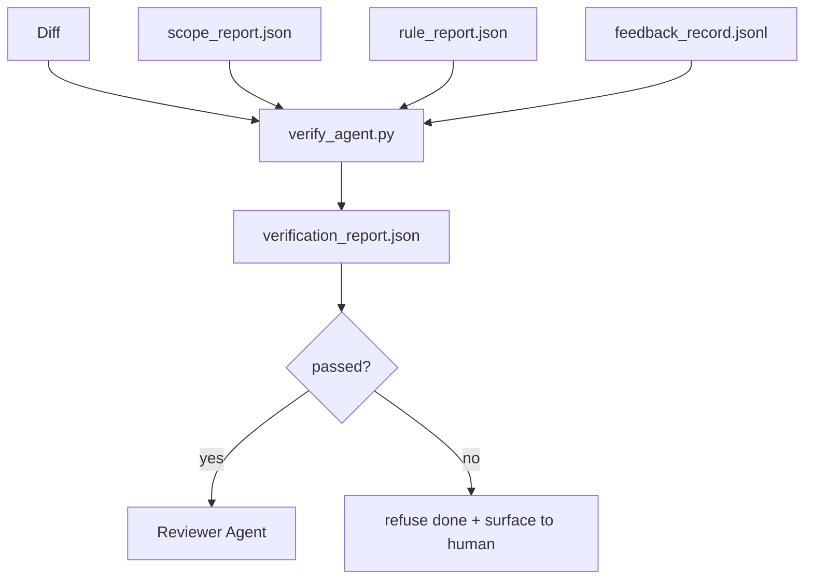

# 验证门(Verification Gates)

> 智能体不能自己标记任务完成。验证门读取范围合约、反馈日志、规则报告和差异(diff)，并回答一个简单的问题：这个任务真的完成了吗？如果验证门说不，不管聊天说什么，任务都未完成。

**类型：** 构建
**编程语言：** Python (标准库)
**前置条件：** 阶段14 · 33 (规则)，阶段14 · 36 (范围)，阶段14 · 37 (反馈)
**时间：** ~55分钟

## 学习目标

- 定义验证门为工作台工件(workbench artifacts)上的确定函数。
- 将规则报告、范围报告、反馈记录和差异(diff)合并为一个判定结果。
- 生成一个审核智能体(reviewer agent)和持续集成(CI)都能读取的`verification_report.json`。
- 拒绝在任何阻塞严重性的失败上推进任务，没有例外。

## 问题

智能体太容易声称成功。三种失败模式占主导：

- "看起来不错。"模型读取了自己的差异(diff)并判定它是正确的。
- "测试通过了。"自信地说出。没有测试实际运行的记录。
- "验收通过。"验收标准被宽松地解释为"任何像完成的东西"。

工作台修复是一个单一的验证门，它读取智能体已经产生的工件并做出判定。该门是确定性的。该门在版本控制中。该门连接到持续集成(CI)。智能体不能贿赂它。

## 核心概念



### 验证门检查什么

|  检查  |  源工件  |  严重性  |
|-------|-----------------|----------|
|  所有验收命令已运行  |  `feedback_record.jsonl`  |  阻塞  |
|  所有验收命令退出码为零  |  `feedback_record.jsonl`  |  阻塞  |
|  范围检查无禁止写入  |  `scope_report.json`  |  阻塞  |
|  范围检查无超出范围的写入  |  `scope_report.json`  |  阻塞或警告  |
|  所有阻塞严重性规则通过  |  `rule_report.json`  |  阻塞  |
|  反馈中无`null`退出码  |  `feedback_record.jsonl`  |  阻塞  |
|  触及文件匹配`scope.allowed_files`  |  两者  |  警告  |

`warn`发现会注解判定结果；`block`发现会阻止`passed: true`。

### 确定性的，而非概率性的

每次对于相同的工件集，验证门必须产生相同的判定结果。没有大语言模型(LLM)评判者。大语言模型评判者属于审查方(阶段14 · 39)，其目标是定性评估，而非状态。

### 一份报告，一条路径

每次任务关闭，验证门生成一个`verification_report.json`，写入`outputs/verification/<task_id>.json`下。持续集成(CI)消费相同的路径。多门不同路径会分叉真相来源。

### 拒绝，没有例外

阻塞严重性的发现不能被智能体覆盖。只能由人类覆盖，且需要记录`override_reason`和`overridden_by`用户ID。覆盖是一个签名变更，而不是智能体决策。

## 动手构建

`code/main.py` 实现：

- 每个输入工件有一个加载器，全部本地存根(stub)以使课程自包含。
- 一个`verify(task_id, artifacts) -> VerdictReport`纯函数。
- 一个打印器，显示每个检查结果和最终的通过/失败。
- 一个包含三个任务场景的演示：干净通过、范围蔓延、缺少验收。

运行它：

```
python3 code/main.py
```

输出：三份判定报告，每份保存在脚本旁边。

## 实际中的生产模式

四个模式将验证门从"另一个lint工作"提升到"决定性边缘"。

**纵深防御，而非单门。** 预提交钩子(pre-commit hook) → 持续集成(CI)状态检查 → 预工具授权钩子(pre-tool authz hook) → 预合并门(pre-merge gate)。每一层都是确定性的，因此一层的失败会被下一层捕获。microservices.io的2026年3月手册明确指出：预提交钩子不可绕过，因为与模型端技能不同，它不依赖智能体遵循指令。验证门位于持续集成/预合并层。

**确定性检查防御，模型评判仅用于细微差别。** Anthropic的2026年混合规范配对：可验证奖励(单元测试、模式检查、退出码)回答"代码解决了问题吗？" —— 大语言模型(LLM)评分标准回答"代码可读、安全、符合风格吗？" 验证门运行第一类；审查方(阶段14 · 39)运行第二类。混合使用会淹没信号。

**签名覆盖日志，而非Slack线程。** 每次覆盖在`outputs/verification/overrides.jsonl`中生成一行，包含：时间戳、发现码、原因、签名用户、当前HEAD提交。运行时会拒绝任何缺少签名的覆盖；审计跟踪由git追踪。这是覆盖策略和覆盖剧场之间的界限。

**覆盖率下限作为第一类检查。** `coverage_report.json`提供给`coverage_floor`(默认80%)检查。如果测量覆盖率低于下限，或低于上一次合并的下限超过1个百分点，则验证门失败。没有这个检查，智能体会悄悄删除失败的测试，而验证报告保持绿色。

**`--strict` 模式将警告提升为阻塞。** 对于发布分支、阻塞发布的 PR 或事后分类，`--strict` 使每个警告变为硬性失败。该标志是按分支选择加入的，不是全局默认，因为一切严格会腐蚀日常流程。

## 使用它

生产模式：

- **CI 步骤。** `verify_agent` 作业对代理的最终工件运行门控。没有 `passed: true` 时，合并保护会拒绝。
- **移交前钩子。** 代理运行时在生成移交文档之前调用门控。没有绿色判定，就没有移交。
- **手动分类。** 当代理声称成功而人类怀疑时，操作员会读取报告。

门控是工作台流程中的决定性边缘。所有其他表面都位于其上游。

## 发布

`outputs/skill-verification-gate.md` 将门控连接到特定项目：哪些验收命令为其提供输入，哪些规则是阻塞严重性，哪些范围外的写入被允许，以及覆盖审计日志如何存储。

## 练习

1. 添加一个 `coverage_floor` 检查：测试命令必须生成至少 80% 覆盖率的报告。决定哪个工件承载基线。
2. 支持一种 `coverage_floor` 模式，将每个 `--strict` 提升为 `warn`。记录严格模式为正确默认值的情况。
3. 使门控除了生成 JSON 之外还生成 Markdown 摘要。论证哪些字段属于摘要。
4. 添加一个 `coverage_floor` 检查：任何在人类按键后 60 秒内编辑的文件免于范围外标记。
5. 在您产品的一个真实代理差异上运行门控。有多少发现是真实的，有多少是噪音？门控需要在哪些方面改进？

## 关键术语

|  术语  |  人们的说法  |  实际含义  |
|------|----------------|------------------------|
| @@SKIP0000@@ |  “阻止事情发生的检查” |  对工作台工件的确定性函数，产生通过/失败判定 |
| 阻塞严重性 |  “硬性失败” |  一种阻止 `passed: true` 并要求签署覆盖的发现 |
| 覆盖日志 |  “为什么我们让它通过” |  带有原因和用户 ID 的签名条目，由审查审计 |
| 验收命令 |  “证明” |  一个 shell 命令，其零退出值表示 `done` 的含义 |
| 单一报告路径 |  “真相来源” |  `outputs/verification/<task_id>.json`，供 CI 和人类共同使用 |

## 延伸阅读

- [Anthropic, Harness design for long-running application development](https://www.anthropic.com/engineering/harness-design-long-running-apps)
- [Anthropic, Harness design for long-running application development](https://www.anthropic.com/engineering/harness-design-long-running-apps)
- [Anthropic, Harness design for long-running application development](https://www.anthropic.com/engineering/harness-design-long-running-apps) — 提交前和 CI 之间的纵深防御
- [Anthropic, Harness design for long-running application development](https://www.anthropic.com/engineering/harness-design-long-running-apps) — 审批门禁阶梯（草稿 → 审批 → 阈值下自动）
- [Anthropic, Harness design for long-running application development](https://www.anthropic.com/engineering/harness-design-long-running-apps) — Lean 4 作为确定性门控的上限
- [Anthropic, Harness design for long-running application development](https://www.anthropic.com/engineering/harness-design-long-running-apps) — 范围 + 变异测试门控
- [Anthropic, Harness design for long-running application development](https://www.anthropic.com/engineering/harness-design-long-running-apps) — 确定性验证器作为 CI 评分器
- [Anthropic, Harness design for long-running application development](https://www.anthropic.com/engineering/harness-design-long-running-apps) — 前/后工具门控
- 第14阶段·27 — 提示注入防御（门控的对抗对）
- 第14阶段·36 — 此门控强制执行的范围合约
- 第14阶段·37 — 此门控评分的反馈日志
- 第14阶段·39 — 门控移交给的审查代理
