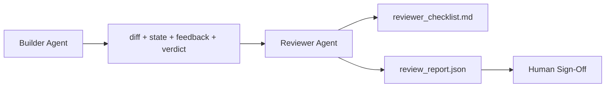

# 审阅代理：将构建者与标记者分离

> 编写代码的代理无法对其进行评分。审阅者是第二个循环，具有不同的系统提示、不同的目标，并且对构建者产生的所有内容具有只读访问权限。构建者与审阅者之间的差距是大多数可靠性所在之处。

**类型：** 构建
**语言：** Python (标准库)
**先决条件：** 阶段14 · 38 (验证门)
**时间：** ~55分钟

## 学习目标

- 说明为什么同一代理无法可靠地审查自己的工作。
- 构建一个审阅代理循环，它消耗构建者的产物并生成结构化的审阅报告。
- 编写一个审阅评分标准，对特定维度进行评分，而不是凭感觉。
- 将审阅者接入工作台，以便人工审查步骤从实际产物开始。

## 问题

你让代理修复一个错误。它编辑了四个文件，运行了测试，并报告完成。验证门（阶段14 · 38）确认验收运行且范围保持。门显示`passed: true`。你合并了。两天后你发现修复解决了错误的另一半。

验收是必要的，但不充分。审阅者提出了验收无法提出的问题：这解决了正确的问题吗？是否在未标记的情况下扩大了范围？是否记录了本应受到质疑的假设？是否将工作台置于下一次会话可以接手的良好状态？

## 核心概念



### 审阅评分标准

五个维度，每个评分0到2。

|  维度  |  问题  |
|-----------|----------|
|  问题契合度  |  更改是否解决了所述任务，而不是近似的任务？  |
|  范围纪律  |  编辑是否限于约定，还是约定被故意扩大？  |
|  假设  |  所有隐藏的假设是否都已记录在可审查的地方？  |
|  验证质量  |  验收命令是否真正证明了目标，还是证明了一个较弱的版本？  |
|  交接就绪度  |  下一次会话能否从当前状态干净地接手？  |

总分10分。低于7分为轻微失败；低于5分为严重失败。

### 审阅者是一个独立的角色，而不是一个独立的模型

你可以使用与构建者相同的模型运行审阅者。纪律在于角色分离：不同的系统提示，不同的输入，对差异没有写权限。姿态的变化就是信号的变化。

### 审阅者不能编辑差异

审阅者读取差异、状态、反馈、判决。它写一份报告。它不打补丁。如果报告说“修复这个”，下一个构建者轮次进行修复；审阅者继续审查。混合角色会破坏这种差距。

### 审阅评分标准与验证门

门（阶段14 · 38）检查确定性事实：验收是否运行，规则是否通过，范围是否保持。审阅者做出定性判断：这是否是正确的工作，是否已记录，交接是否可用。两者都是必需的。

## 动手构建

`code/main.py` 实现：

- 一个`ReviewerInputs`数据类，打包审阅者读取的产物。
- 一个评分标准评分器，每个维度一个函数。每个函数是确定性的，对于本课来说是存根级别的；实际实现会调用LLM。
- 一个`ReviewerInputs`写入器，包含五个分数、总分和判决（`review_report.json`, `pass`, `soft_fail`）。
- 两个演示案例：一个干净的更改和一个“测试正确，问题错误”的更改。

运行它：

```
python3 code/main.py
```

输出：两个写入磁盘的审阅报告和一个维度分数的控制台表格。

## 实际中的生产模式

收据：Cloudflare 2026年4月的AI代码审查系统在30天内对5169个仓库的48095个合并请求进行了131246次审查运行。审查中位数完成时间为3分39秒。最多七名专业审阅者（安全、性能、代码质量、文档、发布管理、合规性、工程编码手册）在审查协调器下并行运行，该协调器去重发现并判断严重程度。顶级模型专门保留给协调器；专业审阅者运行在更便宜的层级上。

四个模式使其在大规模下工作。

**专业审阅者池，而不是一个大的审阅者。** 一个具有5维度评分标准的审阅者适用于单个仓库。一旦代码库包含安全关键、性能关键和文档表面，就拆分为具有较小提示的专业审阅者。协调器进行去重；专业审阅者从不运行完整的评分标准。模型层级分离自然形成：便宜的专业审阅者，昂贵的协调器。

**偏差缓解作为设计需求，而非优化。** LLM裁判显示出四种可靠的偏差（Adnan Masood, 2026年4月）：位置偏差（GPT-4在(A,B)与(B,A)排序上约40%不一致），冗长偏差（约15%的分数膨胀偏向更长的输出），自我偏好（裁判偏好来自同一模型家族的输出），权威性（裁判高估对已知作者的引用）。缓解措施：评估两种排序并只计算一致的胜出；使用明确奖励简洁性的1-4分制；在不同模型家族之间轮换裁判；在评分前去除作者姓名。

**校准集，而不是凭感觉。** 一个包含10-20个历史任务且已知正确判决的集合。每次提示更改时对校准集运行审阅者。如果与历史记录的一致性低于80%，则需要在审阅者发布前修订评分标准。这是每个团队最终都会重新发现的；最好从一开始就做。

**与门结合的混合规范。** 验证门（阶段14 · 38）处理确定性检查（验收是否运行，测试是否通过，范围是否保持）。审阅者处理语义检查（这是否是正确的工作，假设是否已记录，交接是否可用）。Anthropic 2026年的指导明确说明了这种分离：不要要求审阅者重新做门已经证明的事情。

## 使用它

生产模式：

- **Claude Code子代理。** 在构建者关闭任务后运行审阅子代理。它在PR上发布带有评分标准的评论。
- **OpenAI Agents SDK交接。** 构建者在任务完成时移交给审阅者。审阅者可以返回发现列表或升级到人工。
- **双模型配对。** 构建者在更快更便宜的模型上运行。审阅者在更强的模型上运行，上下文更小，专注于判断。

审查者是工作台在人类无法自行完成所有审查时长出的第二双眼睛。

## 发布

`outputs/skill-reviewer-agent.md` 生成项目特定的审查评分标准、一个连接到构建者工件的审查代理存根，以及与验证门的集成，使人类审查从书面报告开始，而不是空白页。

## 练习

1. 为你的产品领域添加第六个维度。论证为何它不能被已有的五个维度吸收。
2. 使用两个不同的系统提示（简略、详细）运行审查者。哪个更容易让人类阅读报告？
3. 为每个维度添加一个`confidence`字段。当最低维度的置信度低于0.6时，拒绝发布报告。
4. 构建一个校准集：10个已知正确判定的历史任务关闭。运行审查者检测这些任务。它在哪些地方与历史记录不一致？
5. 添加一个“请求更多证据”功能：审查者可以在评分前要求构建者进行特定的测试运行。合适的退避机制是什么以防止循环？

## 关键术语

|  术语  |  人们的说法  |  实际含义  |
|------|----------------|------------------------|
| 审查评分标准  |  “清单”  |  五个维度0-2分评分，每个维度有一个书面问题 |
| 软失败  |  “需要修订”  |  总分低于7；构建者获得需要处理的问题 |
| 硬失败  |  “拒绝”  |  总分低于5或任一维度为0；暂停并上报给人类 |
| 角色分离  |  “不同提示”  |  相同模型可以担任两个角色；关键在于输入和姿态 |
| 置信度下限  |  “不发布低信号报告”  |  当评分标准不确定时拒绝给出判定 |

## 延伸阅读

- [OpenAI Agents SDK handoffs](https://platform.openai.com/docs/guides/agents-sdk/handoffs)
- [OpenAI Agents SDK handoffs](https://platform.openai.com/docs/guides/agents-sdk/handoffs)
- [OpenAI Agents SDK handoffs](https://platform.openai.com/docs/guides/agents-sdk/handoffs) — 7专家+协调员架构，131k次运行/30天
- [OpenAI Agents SDK handoffs](https://platform.openai.com/docs/guides/agents-sdk/handoffs) — DevAI基准测试，366个分层解决方案需求
- [OpenAI Agents SDK handoffs](https://platform.openai.com/docs/guides/agents-sdk/handoffs) — 4种偏见及其缓解措施
- [OpenAI Agents SDK handoffs](https://platform.openai.com/docs/guides/agents-sdk/handoffs) — 分离构建者/评估者的生产工具
- [OpenAI Agents SDK handoffs](https://platform.openai.com/docs/guides/agents-sdk/handoffs) — 校准集工作流
- [OpenAI Agents SDK handoffs](https://platform.openai.com/docs/guides/agents-sdk/handoffs)
- [OpenAI Agents SDK handoffs](https://platform.openai.com/docs/guides/agents-sdk/handoffs)
- 阶段14 · 05 — 自我优化与CRITIC（单代理自我审查基线）
- 阶段14 · 30 — 基于评估的代理开发（校准集生成器）
- 阶段14 · 38 — 审查者读取的验证门
- 阶段14 · 40 — 审查者报告馈入的交接包
