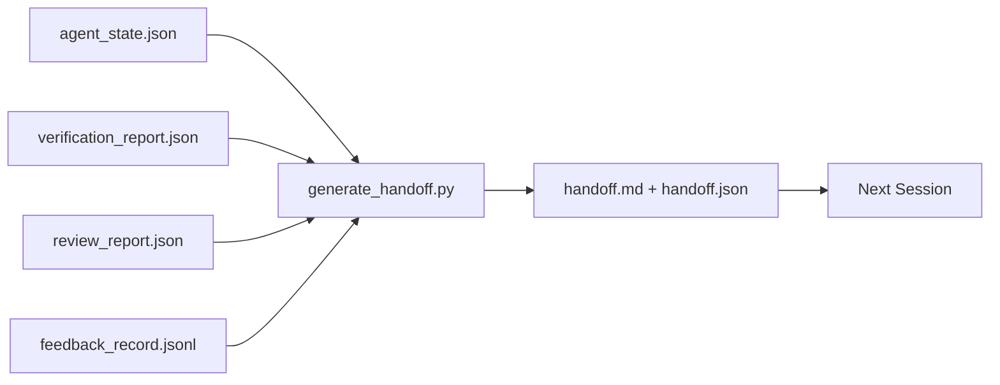

# 多会话交接

> 会话即将结束，但工作不会。交接包是将“代理工作了一小时”转变为“下一会话在第一分钟就高效”的产物。请有意识地构建它，而非事后才想起。

**类型：** 构建
**语言：** Python（标准库）
**先决条件：** 阶段14·34（仓库记忆），阶段14·38（验证），阶段14·39（审查者）
**时间：** 约50分钟

## 学习目标

- 识别每个交接包所需的七个字段。
- 从工作台工件生成交接包，无需手写描述。
- 将大量反馈日志精简为交接包大小的摘要。
- 使下一会话的第一个操作具有确定性。

## 问题

会话结束。代理说：“太好了，我们取得了进展。”下一会话开始。下一个代理问：“我们停在哪里了？”前一个代理的回答已消失。下一个代理重新发现、重新运行相同命令、重新向人类问同样的问题，花费三十分钟来恢复上一会话的最后三十秒。

糟糕交接的代价在任务的每个会话中都会付出。解决办法是在会话结束时自动生成一个包：改变了什么、为什么、尝试了什么、什么失败了、还剩下什么、下次首先做什么。

## 核心概念



### 每个交接包携带的七个字段

|  字段  |  它回答的问题  |
|-------|---------------------|
|  做了什么  |  一段描述已完成工作的段落  |
|  变更概览  |  一目了然的差异  |
|  实际执行  |  实际执行了哪些操作  |
|  尝试与失败  |  尝试了什么以及为何不成功  |
|  潜在风险  |  下一会话可能遇到的问题及其严重程度  |
|  下一步行动  |  下一会话采取的第一个具体步骤  |
|  验证路径  |  验证和审查报告的路径  |

“下一步行动”字段是关键的。一个缺少“下一步行动”的交接包只是状态报告，而非交接包。

### 交接包是生成的，不是写出来的

手写的交接包在困难的日子里会被跳过。生成器读取工作台工件并输出包。代理的工作是将工作台置于生成器可总结的状态，而不是编写总结。

### 两种形式：人类可读和机器可读

人类可读格式是人类阅读的。机器可读格式是下一个代理加载的。两者来自同一源工件。如果它们出现分歧，以JSON为准。

### 反馈日志精简

完整的反馈日志可能有数百条记录。交接包只携带最后K条记录以及所有退出码非零的记录。下一会话如果需要可以加载完整日志，但包保持小巧。

### 保持清洁状态

交接包描述工作。清洁状态使工作可恢复。它们不是同一回事。如果下一会话打开时面对半应用的差异、代理遗忘的临时文件、杂乱的分支以及甚至无法运行的测试错误，那么完美的“做了什么”字段也毫无价值。下一个代理接着花费前十分钟清理上一个代理的遗留问题，而不是进行构建，而且这种成本在任务的每个会话中不断累积。

因此会话不是在功能完成时结束。而是在工作台处于生成器可总结且下一会话可信任的状态时结束。清理是独立阶段，在交接之前执行，并且是一种检查，而非习惯，因为习惯是在困难日子里会被跳过的事情。

|  检查项  |  清洁意味着  |  脏乱会阻塞，因为  |
|-------|-------------|----------------------|
|  工作树  |  每次变更都已提交或明确附注 stash  |  半应用的差异对下一代理看起来像是故意的工作  |
|  临时工件  |  没有遗留临时文件、临时目录、调试打印或注释掉的代码块  |  残留文件污染差异和下一代理的心智模型  |
|  测试  |  绿色通过，或红色失败并在“下一步行动”中命名失败原因  |  静默的红色测试是下一会话会踩到的陷阱  |
|  功能看板  |  状态反映现实（阶段14·36）  |  过时的看板会让下一会话去处理已完成的工作  |
|  分支  |  位于预期分支，无分离头指针，无孤儿分支  |  错误的分支意味着下一会话的第一次提交会落到错误位置  |

清理阶段输出一个`clean_state.json`的阻塞问题；空列表是交接生成器在写入数据包之前断言的前提条件。基于脏树构建的交接不是交接，而是转发的一团糟。这两个工件配对：清理证明工作台可以安全离开，交接证明下一会话知道从哪里开始。

## 动手构建

`code/main.py` 实现：

- 一个将状态、裁决、审查和反馈收集到单个`WorkbenchSnapshot`中的加载器。
- 一个`WorkbenchSnapshot`函数。
- 一个筛选器，选择最后的K条反馈条目加上所有非零退出。
- 一个演示运行，将`WorkbenchSnapshot`和`generate_handoff(snapshot) -> (markdown, payload)`写入脚本旁边。

运行它：

```
python3 code/main.py
```

输出：打印的交接主体，以及磁盘上的两个文件。

## 实际中的生产模式

Codex CLI、Claude Code 和 OpenCode 各自提供了不同的紧缩策略；结构化的交接数据包位于三者之上。

**紧缩策略各不相同；数据包模式不变。** Codex CLI 的 POST /v1/responses/compact 是一个服务器端不透明的 AES 数据块（OpenAI 模型的快速路径）；后备方案是将一个本地“交接摘要”作为`_summary`用户角色消息附加。Claude Code 在上下文的 95% 处运行五阶段渐进紧缩。OpenCode 执行基于时间戳的消息隐藏加上一个 5 标题的大语言模型摘要。三种不同的机制，同一个需求：将压缩后幸存的内容序列化为可移植的工件。数据包就是那个工件。

**新会话交接不是紧缩。** 紧缩扩展一个会话；交接干净地关闭一个会话并开始下一个。Hermes Issue #20372 的框架（2026年4月）是正确的：当原地压缩开始降级时，代理应编写一个紧凑的交接，结束会话，并在新上下文中恢复。数据包使这个过渡变得廉价。错误在于持续压缩直到质量崩溃；修复方法是预算早期的干净交接。

**每个分支和主题仅有一个活跃的交接。** 多智能体协调在过时交接上比在糟糕的模型输出上更容易崩溃。始终包含`branch`、`last_known_good_commit`和一个`status`的`active | superseded | archived`。过时的交接被归档；只有活跃的交接驱动下一个会话。这就是交接作为笔记和交接作为状态的区别。

**在上下文使用到 50-75% 时结束，而不是达到极限。** 手动模式手册（CLAUDE.md + HANDOVER.md）报告称，当会话在上下文预算的 50-75% 而不是 95% 结束时效果最佳。数据包生成器在压缩伪影污染源状态之前干净地运行。在上下文完整时编写成本低廉；当模型已经丢失位置时编写成本高昂。

## 使用它

生产模式：

- **会话结束钩子。** 运行时在用户关闭聊天时触发生成器。数据包进入`outputs/handoff/<session_id>/`。
- **PR 模板。** 生成器的 Markdown 也是 PR 正文。审阅者无需打开其他五个文件即可阅读。
- **跨智能体交接。** 用一个产品（Claude Code）构建，用另一个（Codex）继续。数据包是共同语言。

数据包体积小、规则且生产成本低。成本节约随着每个会话而复合增长。

## 发布

`outputs/skill-handoff-generator.md` 生成一个针对项目工件路径调整的生成器、一个运行它的会话结束钩子，以及下一个智能体在启动时读取的 `handoff.json` 模式。

## 练习

1. 添加一个 `assumptions_to_validate` 字段，展示构建者记录但审阅者评分未超过1的每个假设。
2. 对于失败的运行与通过的运行，以不同方式修剪反馈摘要。论证这种不对称的合理性。
3. 包含一个“向人类提问”列表。问题进入数据包与进入聊天消息的阈值是什么？
4. 使生成器幂等：运行两次产生相同的数据包。需要什么稳定才能实现这一点？
5. 添加一个“下一会话前置条件”部分，列出下一会话在行动前必须加载的工件。

## 关键术语

|  术语  |  人们的说法  |  实际含义  |
|------|----------------|------------------------|
|  Handoff packet  |  "Session summary"  |  携带七个字段的生成工件，包含 Markdown 和 JSON  |
|  Next action  |  "What to do first"  |  开启下一会话的一个具体步骤  |
|  Feedback trim  |  "Log summary"  |  最后 K 条记录加上所有非零退出  |
|  Status report  |  "What we did"  |  缺少 `next_action` 的文档；有用，但不是交接  |
|  Verdict pointer  |  "Receipt"  |  用于可追溯性的验证和审查报告路径  |

## 延伸阅读

- [Anthropic, Effective harnesses for long-running agents](https://www.anthropic.com/engineering/effective-harnesses-for-long-running-agents)
- [Anthropic, Effective harnesses for long-running agents](https://www.anthropic.com/engineering/effective-harnesses-for-long-running-agents)
- [Anthropic, Effective harnesses for long-running agents](https://www.anthropic.com/engineering/effective-harnesses-for-long-running-agents) — POST /v1/responses/compact 和本地后备
- [Anthropic, Effective harnesses for long-running agents](https://www.anthropic.com/engineering/effective-harnesses-for-long-running-agents) — 三家供应商的紧缩比较
- [Anthropic, Effective harnesses for long-running agents](https://www.anthropic.com/engineering/effective-harnesses-for-long-running-agents) — CLAUDE.md + HANDOVER.md，50-75% 上下文预算
- [Anthropic, Effective harnesses for long-running agents](https://www.anthropic.com/engineering/effective-harnesses-for-long-running-agents) — 分布式系统框架
- [Anthropic, Effective harnesses for long-running agents](https://www.anthropic.com/engineering/effective-harnesses-for-long-running-agents)
- [Anthropic, Effective harnesses for long-running agents](https://www.anthropic.com/engineering/effective-harnesses-for-long-running-agents) — Codex CLI 中面向交接的提示
- [Anthropic, Effective harnesses for long-running agents](https://www.anthropic.com/engineering/effective-harnesses-for-long-running-agents)
- [Anthropic, Effective harnesses for long-running agents](https://www.anthropic.com/engineering/effective-harnesses-for-long-running-agents)
- [Anthropic, Effective harnesses for long-running agents](https://www.anthropic.com/engineering/effective-harnesses-for-long-running-agents)
- Phase 14 · 34 — 生成器读取的状态文件
- Phase 14 · 38 — 数据包指向的验证裁决
- Phase 14 · 39 — 捆绑到数据包中的审阅者报告
