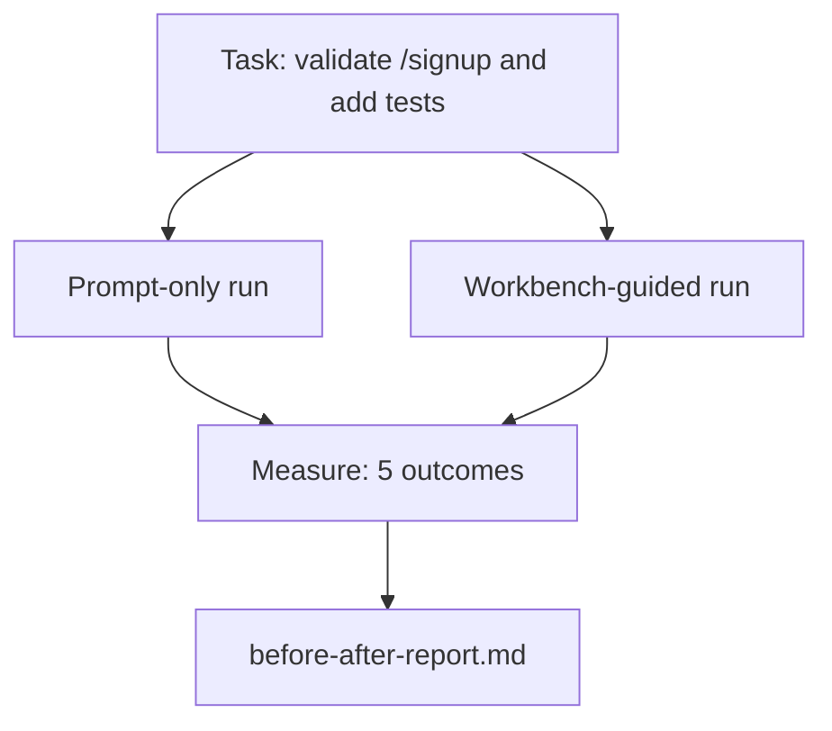

# 真实代码库上的工作台

> 如果表象的十一课未能经受真实代码库的考验，就毫无价值。本课在小型示例应用上两次运行相同任务：仅提示词对比工作台引导。数据会说明一切。

**类型：** 构建
**语言：** Python（标准库）
**前置要求：** 阶段 14 · 32 到 14 · 40
**时间：** 约60分钟

## 学习目标

- 在小型应用中整合七个工作台表象。
- 对相同任务运行两次（仅提示词 vs 工作台引导）并测量五项结果。
- 阅读前后对比报告，判断哪些表象提供了最大杠杆。
- 针对“但我的模型已经够好了”的质疑，为工作台辩护。

## 问题

在玩具任务上的演示无法说服任何人。只有当真实感的任务在真实感的仓库中落地，且故障更少、回滚更少、下一个会话能使用的数据包时，工作台的价值才得以体现。

本课交付了那个真实感的仓库，并通过两条流水线运行相同任务。结果是一份可以递给怀疑者的前后对比报告。

## 核心概念



### 示例应用

在`sample_app/`中的一个最小化FastAPI风格处理器：

- `app.py`配合`/signup`（尚无验证）。
- `app.py`包含一个快乐路径测试。
- `app.py`和`/signup`作为禁区诱饵。

### 任务

> 为`/signup`添加输入验证：拒绝长度少于8个字符的密码，返回422并附带类型化的错误信封。添加一个证明新行为的测试。

### 两条流水线

仅提示词：

1. 阅读README。
2. 阅读`app.py`。
3. 编辑文件。
4. 声称完成。

工作台引导：

1. 运行初始化脚本（第35课）。
2. 阅读范围约束（第36课）。
3. 阅读状态（第34课）。
4. 仅编辑允许的文件。
5. 通过反馈运行器运行验收命令（第37课）。
6. 运行验证门（第38课）。
7. 运行审查器（第39课）。
8. 生成交接包（第40课）。

### 测量的五项结果

|  结果  |  重要性  |
|---------|----------------|
|  `tests_actually_run`  |  大多数“测试通过”的声明无法验证  |
|  `acceptance_met`  |  证明目标的测试必须是实际运行的测试  |
|  `files_outside_scope`  |  范围蔓延是主要的无声故障  |
|  `handoff_quality`  |  下一个会话为此付出代价或从中受益  |
|  `reviewer_total`  |  在门控之上的定性判断  |

## 动手构建

`code/main.py`针对同一个示例应用夹具编排两条流水线。两条流水线都是脚本化的（无LLM参与），因此测量可复现。脚本将对比写入`before-after-report.md`和`comparison.json`。

运行它：

```
python3 code/main.py
```

输出：每条流水线结果的控制台表格、保存在脚本旁边的Markdown报告，以及供任何人绘制图表的JSON。

## 实际中的生产模式

怀疑者的问题是“工作台到底有多大帮助？”2026年的数据表明，帮助远比解释多。

**终端基准测试从Top-30跃升至Top-5，基于同一模型。** LangChain的《代理框架剖析》（2026年4月）：一个编码代理仅通过改变框架，就从终端基准测试2.0的前30名之外跃升至第5名。同一模型。不同表象。25个名次的差距。

**Vercel通过删除工具实现从80%到100%。** Vercel报告称，删除代理80%的工具后，成功率从80%提升到100%。更小的工具界面、更清晰的范围、更少的失败方式。负空间获胜。

**Harvey仅通过框架优化准确率翻倍。** 法律代理通过框架优化准确率翻倍以上，无需更换模型。

**88%的企业AI代理项目未能进入生产环境。** preprints.org上的《语言代理的框架工程》论文（2026年3月）将失败归因于运行时而非推理：陈旧状态、脆弱的重试、过大的上下文、从中间错误恢复能力差。

**长上下文崩溃。** WebAgent在长上下文条件下基线成功率从40-50%降至10%以下，主要源于无限循环和目标丢失。Ralph循环和交接包正是为了解决这一问题。

**假阴性(False negatives)仍然存在。**单步事实性任务、单行lint检查、格式化运行，以及任何模型已逐字记忆的内容——这些仅用提示词运行更快。基准测试应诚实列举它们，以免工作台被指责为过度设计。

要点并非“框架永远胜出”。模型确实会随着时间吸收框架的技巧。要点在于，如今工程负载位于七个表面，而数字证明了这一点。

## 使用它

本课是你引用案例时的依据：

- 当有人问为什么每个PR都带有`agent-rules.md`和作用域合同时。
- 当团队想要放弃验证关卡“仅限本次迭代”时。
- 当新的智能体产品上线，你需要一个可移植的基准来判断它是否真正节省时间时。

数字比解释传得更远。

## 发布

`outputs/skill-workbench-benchmark.md`是一个可移植的评估框架，它通过两条流水线针对项目自己的示例应用运行任何智能体产品，并报告五个结果。

## 练习

1. 添加第六个结果：首次有意义编辑的时间。你如何干净地测量它？
2. 在代码库中一个真实的第二天任务上运行比较。工作台的数据在哪里下滑？
3. 添加一个“假阴性”通过：那些仅用提示词会更快且工作台开销是真实成本的任务。无论如何，为保留工作台辩护。
4. 用真实的大语言模型调用替换脚本化的“智能体”。哪些结果变得噪声更大？
5. 编写一份面向非工程师的一页摘要。什么能留下来？

## 关键术语

|  术语  |  人们的说法  |  实际含义  |
|------|----------------|------------------------|
| 示例应用  |  “玩具仓库”  |  虽小但足够真实，能练习所有七个表面 |
| 流水线  |  “工作流”  |  智能体遵循的有序表面读写序列 |
| 前后报告  |  “凭证”  |  你交给怀疑者的工件 |
| 假阴性  |  “工作台过度设计”  |  仅用提示词更快的任务；诚实列举有用 |
| 工作台基准  |  “可靠性评分”  |  在你的代码库上运行比较的可移植框架 |

## 延伸阅读

- [LangChain, The Anatomy of an Agent Harness](https://blog.langchain.com/the-anatomy-of-an-agent-harness/) — 终端基准前30到前5的凭证
- [LangChain, The Anatomy of an Agent Harness](https://blog.langchain.com/the-anatomy-of-an-agent-harness/) — Vercel + Harvey数据
- [LangChain, The Anatomy of an Agent Harness](https://blog.langchain.com/the-anatomy-of-an-agent-harness/) — 88%企业失败率，运行时根本原因
- [LangChain, The Anatomy of an Agent Harness](https://blog.langchain.com/the-anatomy-of-an-agent-harness/) — 在15个模型上复现
- [LangChain, The Anatomy of an Agent Harness](https://blog.langchain.com/the-anatomy-of-an-agent-harness/) — 生产环境中30天131k次审查运行
- [LangChain, The Anatomy of an Agent Harness](https://blog.langchain.com/the-anatomy-of-an-agent-harness/)
- 阶段14·32到14·40 — 本课端到端练习的表面
- 阶段14·19 — SWE-bench、GAIA、AgentBench作为本课补充的宏观基准
- 阶段14·30 — 同一框架插件的评估驱动智能体开发
