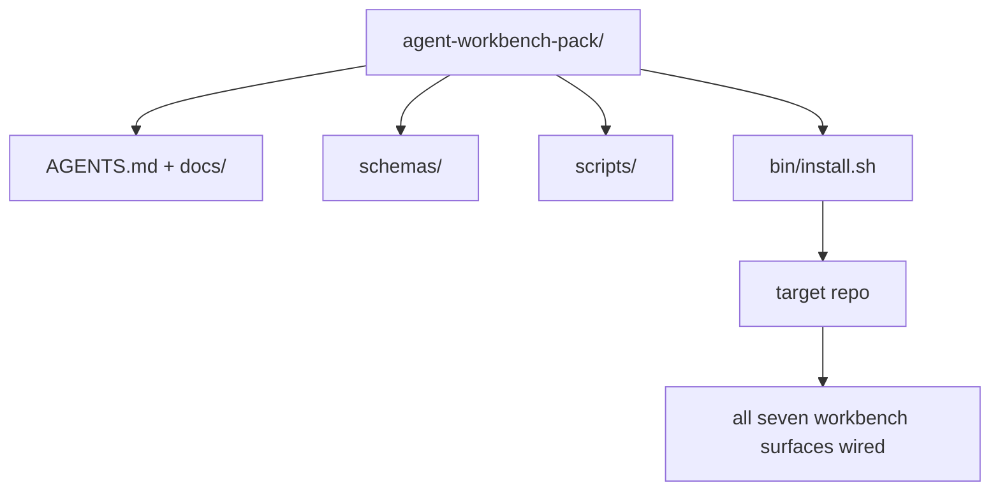

# 顶点项目：发布一个可复用的智能体工作台包

> 迷你课程以一个可放入任意代码仓库的包结束。七个工作台表面的课压缩成一个目录，你可以`cp -r`，第二天早上就能让代理可靠工作。结业作品是本次课程所依赖的制品。

**类型：** 构建
**语言：** Python（标准库）
**先决条件：** 阶段14·31至14·41
**时间：** 约75分钟

## 学习目标

- 将七个工作台表面打包成一个可放置的目录。
- 固定模式、脚本和模板，使新仓库获得已知良好的基线。
- 添加一个安装脚本，可幂等地放置该包。
- 决定哪些留在包内、哪些留在包外，并为每个决策提供理由。

## 问题

一个存在于Google文档、聊天记录和三个半遗忘脚本中的工作台，每个季度都要重建一次。解决方案是版本化的包：一个包含表面、模式、脚本和一行命令安装器的仓库或目录。

你将在此课结束时将`outputs/agent-workbench-pack/`部署到磁盘上，并拥有一个`bin/install.sh`，可将其放入任意目标仓库。

## 核心概念



### 包布局

```
outputs/agent-workbench-pack/
├── AGENTS.md
├── docs/
│   ├── agent-rules.md
│   ├── reliability-policy.md
│   ├── handoff-protocol.md
│   └── reviewer-rubric.md
├── schemas/
│   ├── agent_state.schema.json
│   ├── task_board.schema.json
│   └── scope_contract.schema.json
├── scripts/
│   ├── init_agent.py
│   ├── run_with_feedback.py
│   ├── verify_agent.py
│   └── generate_handoff.py
├── bin/
│   └── install.sh
└── README.md
```

### 哪些保留，哪些排除

保留：

- 表面模式。它们是契约。
- 上述四个脚本。它们是运行时。
- 四个文档。它们是规则和评分标准。

排除：

- 项目特定的任务。任务属于目标仓库的看板，而非包内。
- 供应商SDK调用。包是与框架无关的。
- 入门文档。包应置于团队现有入门文档旁，而非其内部。

### 安装程序

一个简短的`bin/install.sh`（或`bin/install.py`）：

1. 拒绝在没有`--force`的情况下覆盖现有包。
2. 将包复制到目标仓库。
3. 如果存在`--force`，则设置CI。
4. 打印后续步骤：填写看板、设置验收命令、运行初始化脚本。

### 版本管理

包携带一个`VERSION`文件。需要迁移的模式升级和脚本更改会升级主版本号。仅文档更改会升级补丁版本号。目标仓库的`agent_state.json`记录初始化时使用的包版本。

## 动手构建

`code/main.py`将包组装到`outputs/agent-workbench-pack/`中，置于课旁边，并植入本迷你课程先前课中的模式和脚本，以及你已经写好的文档。

运行它：

```
python3 code/main.py
```

脚本复制并固定表面，写入README，打印包树，并以零退出。重新运行是幂等的。

## 实际中的生产模式

一个包只有在经受住分叉、更新和不友好的上游时才具有价值。四种模式确保其可用。

**`VERSION`是契约，而非营销。** 主版本升级需要状态迁移。次版本升级需要检查器重新运行。补丁版本升级仅涉及文档。安装器在每次安装时将`.workbench-version`写入目标仓库；如果目标的锁定与包的`VERSION`不一致，`lint_pack.py`拒绝发布。这就是`npm`、`Cargo`和`pyproject.toml`在十年变动中存活的方式；代理相关操作不会改变规则。

**跨工具分发的单一来源。** Nx从单一配置发布一个`nx ai-setup`，部署`AGENTS.md`、`CLAUDE.md`、`.cursor/rules/`、`.github/copilot-instructions.md`和一个MCP服务器。包应同样如此；安装器发出符号链接（`ln -s AGENTS.md CLAUDE.md`），使单一事实源分发到每个编码代理。为支持某个工具而分叉包是一种失败模式。

**`uninstall.sh`在存在非平凡状态时拒绝执行。** 卸载包不得删除用户的`agent_state.json`、`task_board.json`或`outputs/`。卸载器会移除模式、脚本、文档和`AGENTS.md`（可选择`--keep-agents-md`退出），并在状态文件存在未提交更改时拒绝继续。状态属于用户；包不拥有它。

**技能即可发布。SkillKit风格的分发。** 该包作为SkillKit技能发布：`skillkit install agent-workbench-pack`从单一来源将其部署到32个AI代理。包仓库是事实源；SkillKit是分发渠道。供应商锁定被打破；七个表面保持不变。

## 使用它

包发布的三个位置：

- **作为可放入仓库的目录。** `cp -r outputs/agent-workbench-pack /path/to/repo`。
- **作为公共模板仓库。** 分叉并定制，`cp -r outputs/agent-workbench-pack /path/to/repo`控制差异。
- **作为SkillKit技能。** 接入你的代理产品，使单一命令即可部署。

包是配方。每次安装都是一份成品。

## 发布

`outputs/skill-workbench-pack.md`生成项目调优的包：规则根据团队历史打磨，范围通配符匹配仓库，评分标准扩展一个领域特定条目。

## 练习

1. 决定哪个可选的第五文档应提升为标准包的一部分。为决策提供理由。
2. 将安装器重写为Python并添加`--dry-run`标志。比较与bash的人机工程学。
3. 添加一个`--dry-run`，安全移除包，并在状态文件存在非平凡历史时拒绝执行。什么是非平凡历史？
4. 添加一个`--dry-run`，当包偏离`bin/uninstall.sh`时失败。将其接入包自身仓库的CI。
5. 编写从手动工作台迁移到此包的运行手册。最小化停机时间的操作顺序是什么？

## 关键术语

|  术语  |  人们的说法  |  实际含义  |
|------|----------------|------------------------|
|  工作台包  |  "入门套件"  |  携带所有七个表面的版本化目录  |
|  安装器  |  "设置脚本"  |  幂等放置包的`bin/install.sh`  |
|  包版本  |  "VERSION"  |  模式/脚本更改升级主版本，仅文档更改升级补丁  |
|  即用包  |  "cp -r 即可使用"  |  无需逐仓库定制即可在第一天正常工作  |
| 可复刻模板 | "GitHub模板" | 一个公共仓库，GitHub的“使用此模板”功能可以从中克隆 |

## 延伸阅读

- 第14.31阶段至第14.41阶段——该包打包的每个表面
- [SkillKit](https://github.com/rohitg00/skillkit) — 将此技能安装到32个AI代理上
- [SkillKit](https://github.com/rohitg00/skillkit) — 跨六个工具的单一源生成器
- [SkillKit](https://github.com/rohitg00/skillkit) — 你的包的路由器必须实现的内容
- [SkillKit](https://github.com/rohitg00/skillkit) — 包等效物的参考实现
- [SkillKit](https://github.com/rohitg00/skillkit) — 基于Redis的参考实现及评估套件
- [SkillKit](https://github.com/rohitg00/skillkit) — 包文档质量门槛
- [SkillKit](https://github.com/rohitg00/skillkit)
- [SkillKit](https://github.com/rohitg00/skillkit)
- 第14.30阶段——基于评估的代理开发，消耗该包的验证门
- 第14.41阶段——该包改进的前后基准测试
