# 通信协议

> 无法使用同一种语言交流的智能体(Agent)不是团队。它们只是对着虚空呐喊的陌生人。

**类型：** 构建
**语言：** TypeScript
**前置要求：** 第14阶段（智能体工程），第16.01课（为什么需要多智能体）
**时间：** 约120分钟

## 学习目标

- 实现MCP工具发现与调用，使智能体能够使用外部服务器暴露的工具
- 构建一个A2A智能体卡片(Agent Card)和任务端点，允许一个智能体通过HTTP将工作委托给另一个智能体
- 比较MCP（工具访问）、A2A（智能体到智能体）、ACP（企业审计）和ANP（去中心化信任），并解释每个协议解决什么问题
- 在单个系统中将多个协议串联起来，智能体通过MCP发现工具，通过A2A委托任务

## 问题

你将系统拆分为多个智能体：一个研究员、一个编码员、一个审查员。它们各自的工作都很出色。但现在你需要它们真正地互相交流。

你的第一次尝试很明显：传递字符串。研究员返回一段文本，编码员尽其所能地解析它。这种方法一直有效，直到编码员误解了研究摘要，或者两个智能体互相等待而陷入死锁，或者你需要不同团队构建的智能体进行协作。突然间，“只传递字符串”就行不通了。

这就是通信协议问题。如果没有一个共享的契约来规定智能体如何交换信息，多智能体系统就会变得脆弱、不可审计，并且无法扩展到超出你个人编写的少数几个智能体。

AI生态系统已经用四种协议来应对，每一种解决不同方面的问题：

- **MCP** 用于工具访问
- **A2A** 用于智能体到智能体的协作
- **ACP** 用于企业审计
- **ANP** 用于去中心化身份与信任

本课将深入探讨。你将阅读每个规范的真实线缆格式，构建可工作的实现，并将全部四个协议连接到一个统一的系统中。

## 核心概念

### 协议全景

将这四个协议视为不同的层，每一层解决一个不同的问题：

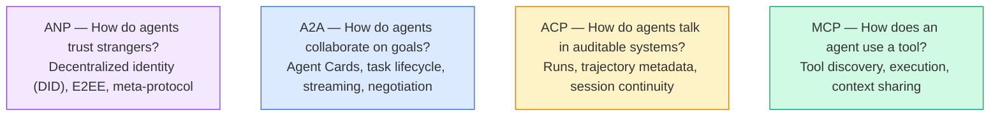

它们不是竞争对手。它们在不同层面解决不同的问题。

### MCP（回顾）

MCP在第13阶段已深入介绍。快速回顾：MCP标准化了大语言模型(LLM)如何连接到外部工具和数据源。它是一个**客户端-服务器**协议，智能体（客户端）发现并调用服务器暴露的工具。

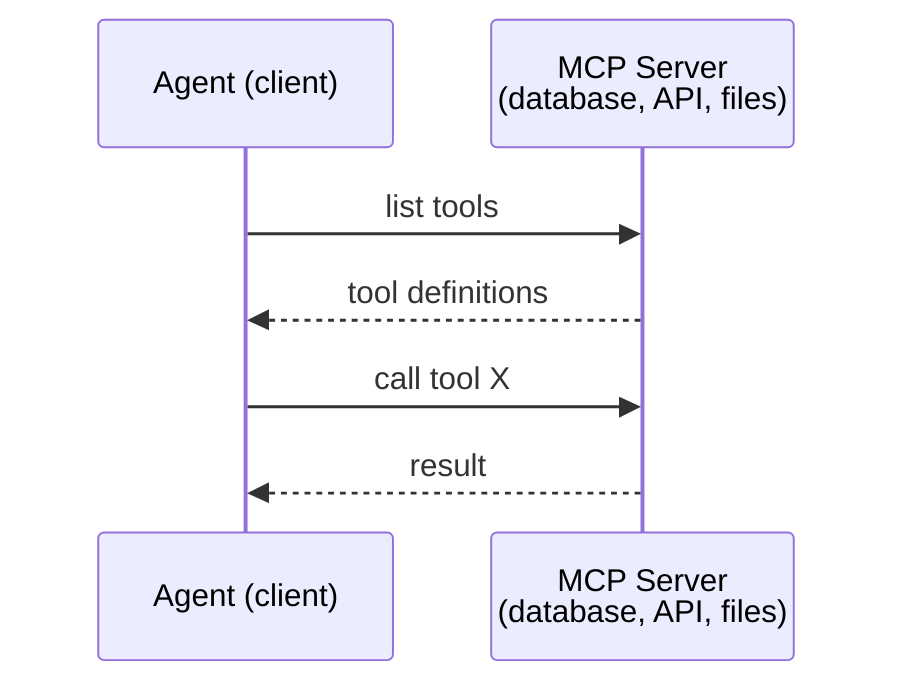

MCP是**智能体到工具**的通信。它不帮助智能体互相交谈。

### A2A（智能体到智能体协议）

**创建者：** Google（现在隶属于Linux基金会，作为`lf.a2a.v1`）
**规范版本：** 1.0.0
**问题：** 自主智能体如何协作、协商以及相互委托任务？

A2A是**点对点智能体协作**的协议。如果说MCP连接智能体与工具，那么A2A则连接智能体与其他智能体。每个智能体在一个知名的URL上发布一个**智能体卡片(Agent Card)**，其他智能体可以发现它、与之协商并委托任务。

#### A2A的工作原理

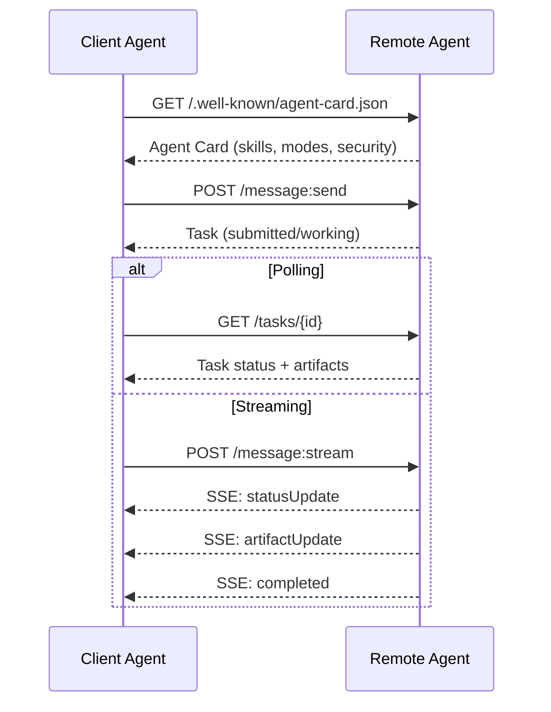

#### 真实的智能体卡片

以下是一个A2A智能体卡片在实际中的样子。在`GET /.well-known/agent-card.json`处提供：

```json
{
  "name": "Research Agent",
  "description": "Searches documentation and summarizes findings",
  "version": "1.0.0",
  "supportedInterfaces": [
    {
      "url": "https://research-agent.example.com/a2a/v1",
      "protocolBinding": "JSONRPC",
      "protocolVersion": "1.0"
    },
    {
      "url": "https://research-agent.example.com/a2a/rest",
      "protocolBinding": "HTTP+JSON",
      "protocolVersion": "1.0"
    }
  ],
  "provider": {
    "organization": "Your Company",
    "url": "https://example.com"
  },
  "capabilities": {
    "streaming": true,
    "pushNotifications": false
  },
  "defaultInputModes": ["text/plain", "application/json"],
  "defaultOutputModes": ["text/plain", "application/json"],
  "skills": [
    {
      "id": "web-research",
      "name": "Web Research",
      "description": "Searches the web and synthesizes findings",
      "tags": ["research", "search", "summarization"],
      "examples": ["Research the latest changes in React 19"]
    },
    {
      "id": "doc-analysis",
      "name": "Documentation Analysis",
      "description": "Reads and analyzes technical documentation",
      "tags": ["docs", "analysis"],
      "inputModes": ["text/plain", "application/pdf"],
      "outputModes": ["application/json"]
    }
  ],
  "securitySchemes": {
    "bearer": {
      "httpAuthSecurityScheme": {
        "scheme": "Bearer",
        "bearerFormat": "JWT"
      }
    }
  },
  "security": [{ "bearer": [] }]
}
```

需要注意的关键点：
- **技能(Skills)** 是智能体能做的事情。每个技能有ID、标签以及支持的输入/输出MIME类型。客户端智能体据此判断远程智能体是否能处理它的请求。
- **supportedInterfaces** 列出了多种协议绑定。一个智能体可以同时使用JSON-RPC、REST和gRPC通信。
- **安全性(Security)** 内置于卡片中。客户端在发出第一个请求之前就知道需要什么认证。

#### 任务生命周期

任务是A2A中的核心工作单元。它们经过定义的状态：

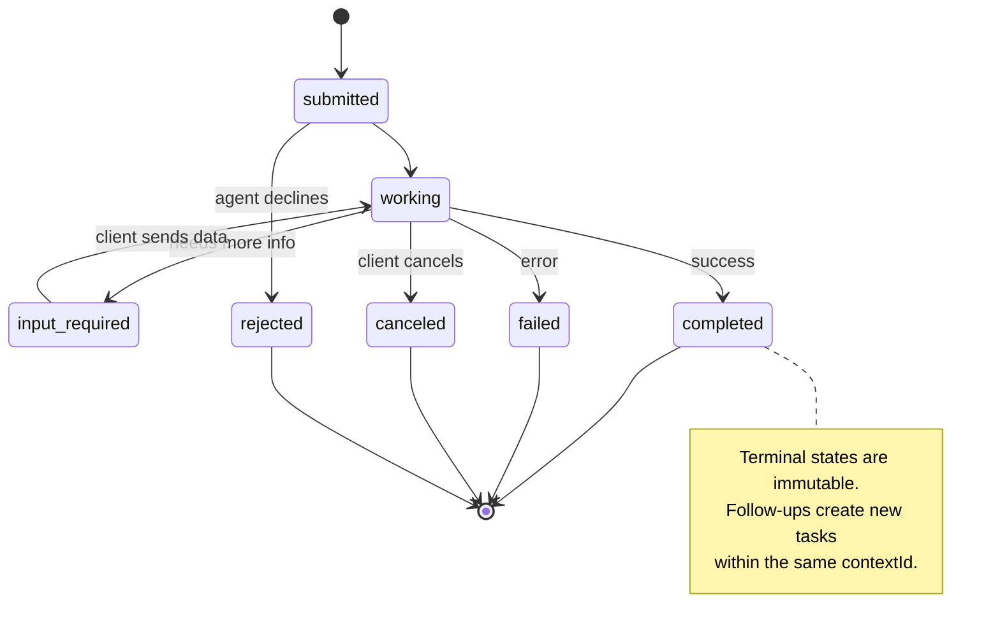

全部8个状态（规范还定义了`UNSPECIFIED`作为哨兵，此处省略）：

|  状态(State)  |  是否终态(Terminal?)  |  含义(Meaning)  |
|---|---|---|
|  `TASK_STATE_SUBMITTED`  |  否  |  已确认，尚未处理  |
|  `TASK_STATE_WORKING`  |  否  |  正在积极处理中  |
|  `TASK_STATE_INPUT_REQUIRED`  |  否  |  代理需要来自客户的更多信息 |
|  `TASK_STATE_AUTH_REQUIRED`  |  否  |  需要身份验证 |
|  `TASK_STATE_COMPLETED`  |  是  |  成功完成 |
|  `TASK_STATE_FAILED`  |  是  |  完成时出错 |
|  `TASK_STATE_CANCELED`  |  是  |  完成前已取消 |
|  `TASK_STATE_REJECTED`  |  是  |  代理拒绝了任务 |

一旦任务达到终止状态，它就不可变。不再接收消息。后续操作会在同一个 `contextId` 中创建一个新任务。

#### 传输格式

A2A 使用 JSON-RPC 2.0。以下是真实的消息交换示例：

**客户端发送任务：**
```json
{
  "jsonrpc": "2.0",
  "id": 1,
  "method": "SendMessage",
  "params": {
    "message": {
      "messageId": "msg-001",
      "role": "ROLE_USER",
      "parts": [{ "text": "Research React 19 compiler features" }]
    },
    "configuration": {
      "acceptedOutputModes": ["text/plain", "application/json"],
      "historyLength": 10
    }
  }
}
```

**代理回复任务：**
```json
{
  "jsonrpc": "2.0",
  "id": 1,
  "result": {
    "task": {
      "id": "task-abc-123",
      "contextId": "ctx-xyz-789",
      "status": {
        "state": "TASK_STATE_COMPLETED",
        "timestamp": "2026-03-27T10:30:00Z"
      },
      "artifacts": [
        {
          "artifactId": "art-001",
          "name": "research-results",
          "parts": [{
            "data": {
              "findings": [
                "React 19 compiler auto-memoizes components",
                "No more manual useMemo/useCallback needed",
                "Compiler runs at build time, not runtime"
              ]
            },
            "mediaType": "application/json"
          }]
        }
      ]
    }
  }
}
```

**通过 SSE 进行流式传输：**
```text
POST /message:stream HTTP/1.1
Content-Type: application/json
A2A-Version: 1.0

data: {"task":{"id":"task-123","status":{"state":"TASK_STATE_WORKING"}}}

data: {"statusUpdate":{"taskId":"task-123","status":{"state":"TASK_STATE_WORKING","message":{"role":"ROLE_AGENT","parts":[{"text":"Searching documentation..."}]}}}}

data: {"artifactUpdate":{"taskId":"task-123","artifact":{"artifactId":"art-1","parts":[{"text":"partial findings..."}]},"append":true,"lastChunk":false}}

data: {"statusUpdate":{"taskId":"task-123","status":{"state":"TASK_STATE_COMPLETED"}}}
```

### ACP（代理通信协议）

**创建者：** IBM / BeeAI
**规范版本：** 0.2.0（OpenAPI 3.1.1）
**状态：** 正在并入 Linux 基金会下的 A2A
**问题：** 代理如何实现完全可审计、会话持续和轨迹跟踪的通信？

ACP 是**企业级协议**。与许多摘要所述不同，ACP **不**使用 JSON-LD。它是一个通过 OpenAPI 定义的直接的 REST/JSON API。其特别之处在于**轨迹元数据**：每个代理响应都可以携带产生该响应的推理步骤和工具调用的详细日志。

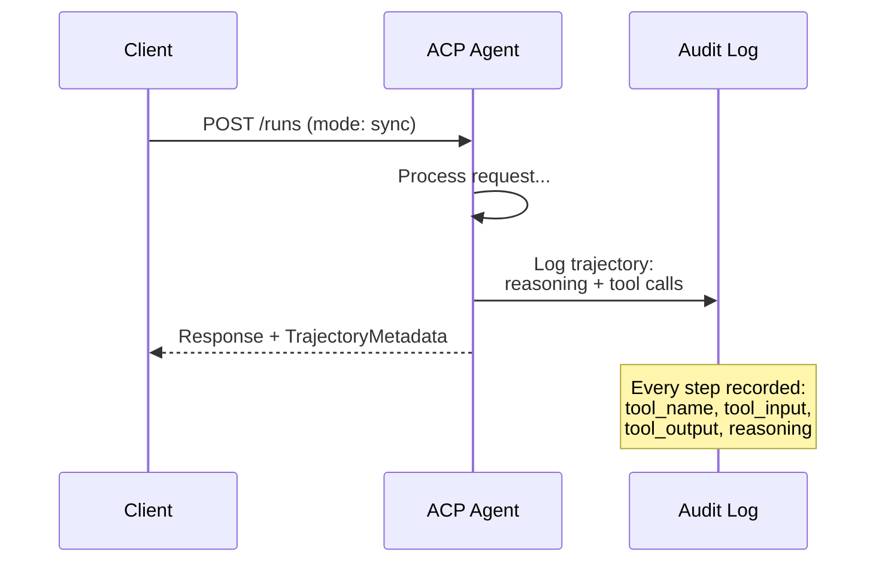

#### ACP 中的代理发现

ACP 定义了四种发现方法：

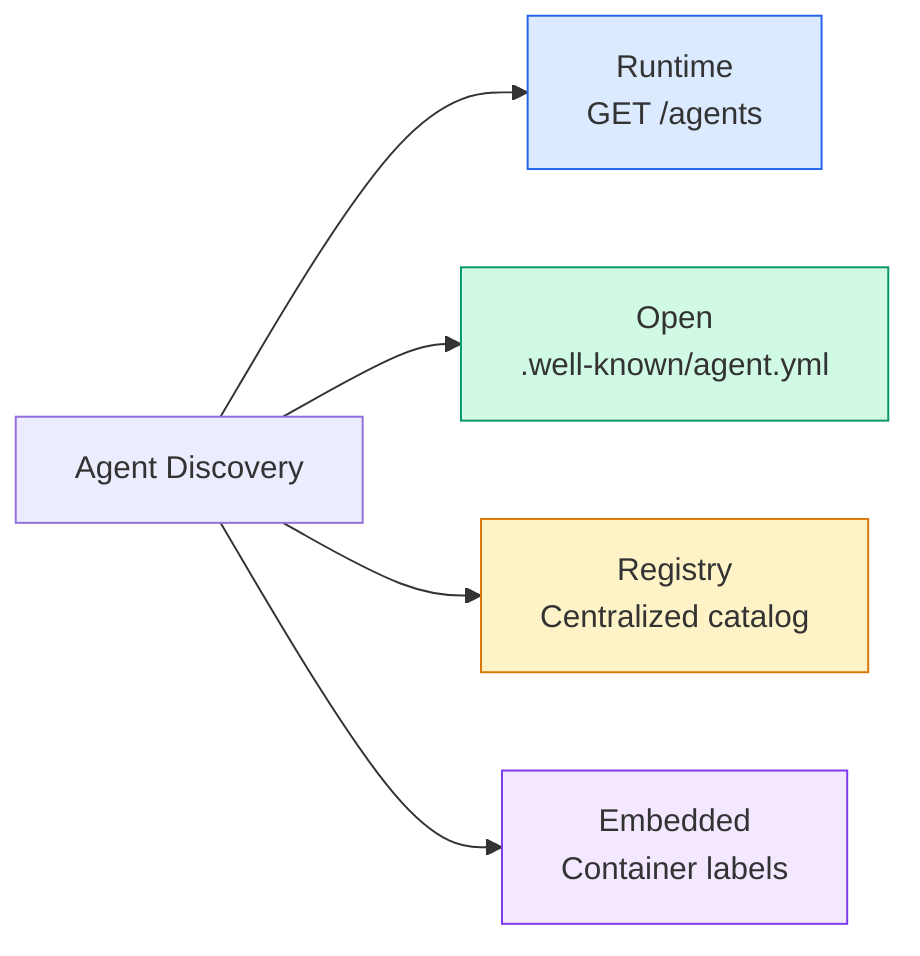

**AgentManifest** 比 A2A 的 Agent Card 更简单：

```json
{
  "name": "summarizer",
  "description": "Summarizes documents with source citations",
  "input_content_types": ["text/plain", "application/pdf"],
  "output_content_types": ["text/plain", "application/json"],
  "metadata": {
    "tags": ["summarization", "RAG"],
    "framework": "BeeAI",
    "capabilities": [
      {
        "name": "Document Summarization",
        "description": "Condenses long documents into key points"
      }
    ],
    "recommended_models": ["llama3.3:70b-instruct-fp16"],
    "license": "Apache-2.0",
    "programming_language": "Python"
  }
}
```

#### 运行生命周期

ACP 使用“运行”代替“任务”。运行是代理执行的一种模式，具有三种方式：

|  方式  |  行为  |
|---|---|
|  `sync`  |  阻塞。响应包含完整结果。  |
|  `async`  |  立即返回 202。轮询 `GET /runs/{id}` 获取状态。  |
|  `stream`  |  SSE 流。代理工作时触发事件。  |

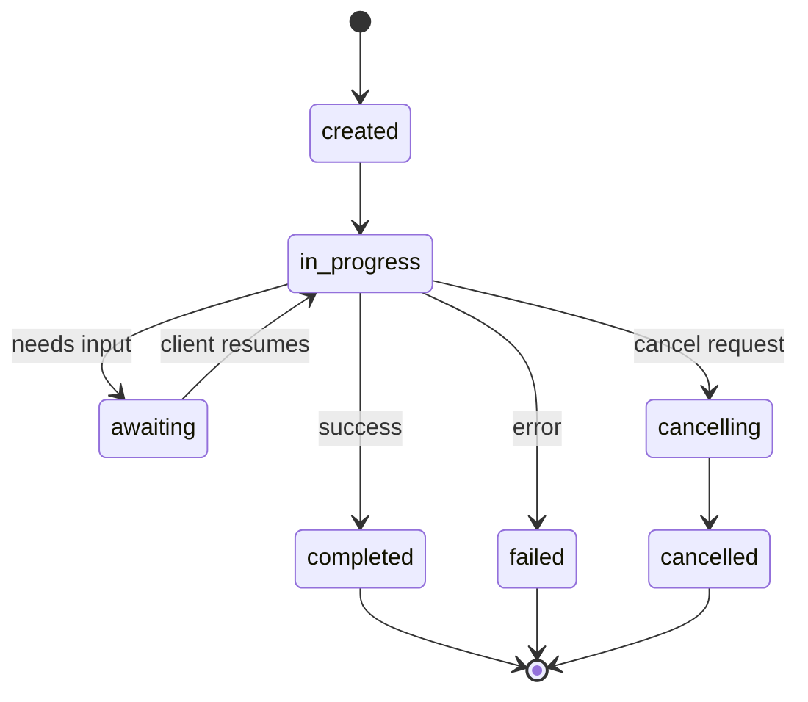

#### 轨迹元数据（审计跟踪）

这是 ACP 的关键区别。每个消息部分都可以包含元数据，精确显示代理所做的事情：

```json
{
  "role": "agent/researcher",
  "parts": [
    {
      "content_type": "text/plain",
      "content": "The weather in San Francisco is 72F and sunny.",
      "metadata": {
        "kind": "trajectory",
        "message": "I need to check the weather for this location",
        "tool_name": "weather_api",
        "tool_input": { "location": "San Francisco, CA" },
        "tool_output": { "temperature": 72, "condition": "sunny" }
      }
    }
  ]
}
```

对于受监管的行业来说，这非常宝贵。每个答案都附带可证明的推理链：调用了哪些工具，使用了哪些输入，收到了哪些输出。没有黑箱。

ACP 还支持**引用元数据**用于来源归属：

```json
{
  "kind": "citation",
  "start_index": 0,
  "end_index": 47,
  "url": "https://weather.gov/sf",
  "title": "NWS San Francisco Forecast"
}
```

### ANP（代理网络协议）

**创建者：** 开源社区（由 GaoWei Chang 创立）
**仓库：** [github.com/agent-network-protocol/AgentNetworkProtocol](https://github.com/agent-network-protocol/AgentNetworkProtocol)
**问题：** 不同组织的代理如何在没有中心化权威的情况下相互信任？

ANP 是**去中心化身份协议**。它使用 W3C 去中心化标识符（Decentralized Identifiers, DIDs）和端到端加密来建立信任。与 A2A 通过已知端点发现代理不同，ANP 允许代理以加密方式证明其身份。

ANP 包含三层：

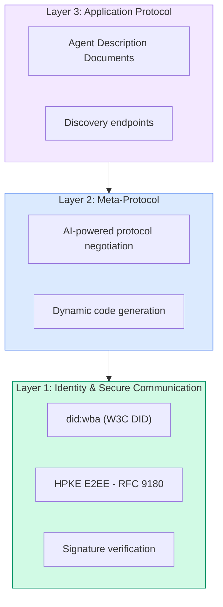

#### DID 文档（真实结构）

ANP 使用名为 `did:wba`（基于 Web 的代理）的自定义 DID 方法。DID `did:wba:example.com:user:alice` 解析为 `https://example.com/user/alice/did.json`：

```json
{
  "@context": [
    "https://www.w3.org/ns/did/v1",
    "https://w3id.org/security/suites/jws-2020/v1",
    "https://w3id.org/security/suites/secp256k1-2019/v1"
  ],
  "id": "did:wba:example.com:user:alice",
  "verificationMethod": [
    {
      "id": "did:wba:example.com:user:alice#key-1",
      "type": "EcdsaSecp256k1VerificationKey2019",
      "controller": "did:wba:example.com:user:alice",
      "publicKeyJwk": {
        "crv": "secp256k1",
        "x": "NtngWpJUr-rlNNbs0u-Aa8e16OwSJu6UiFf0Rdo1oJ4",
        "y": "qN1jKupJlFsPFc1UkWinqljv4YE0mq_Ickwnjgasvmo",
        "kty": "EC"
      }
    },
    {
      "id": "did:wba:example.com:user:alice#key-x25519-1",
      "type": "X25519KeyAgreementKey2019",
      "controller": "did:wba:example.com:user:alice",
      "publicKeyMultibase": "z9hFgmPVfmBZwRvFEyniQDBkz9LmV7gDEqytWyGZLmDXE"
    }
  ],
  "authentication": [
    "did:wba:example.com:user:alice#key-1"
  ],
  "keyAgreement": [
    "did:wba:example.com:user:alice#key-x25519-1"
  ],
  "humanAuthorization": [
    "did:wba:example.com:user:alice#key-1"
  ],
  "service": [
    {
      "id": "did:wba:example.com:user:alice#agent-description",
      "type": "AgentDescription",
      "serviceEndpoint": "https://example.com/agents/alice/ad.json"
    }
  ]
}
```

需要注意的关键点：
- **密钥分离**是强制性的。签名密钥（secp256k1）与加密密钥（X25519）分开。
- **`humanAuthorization`** 是 ANP 独有的。这些密钥需要明确的人工批准（生物识别、密码、HSM）才能使用。诸如资金转移之类的高风险操作通过此路径进行。
- **`humanAuthorization`** 密钥用于 HPKE 端到端加密（RFC 9180）。
- **服务**部分链接到代理描述文档。

#### ANP 中的信任如何运作

ANP **不**使用信任网络或背书图。信任是双向的，并且每次交互都进行验证：

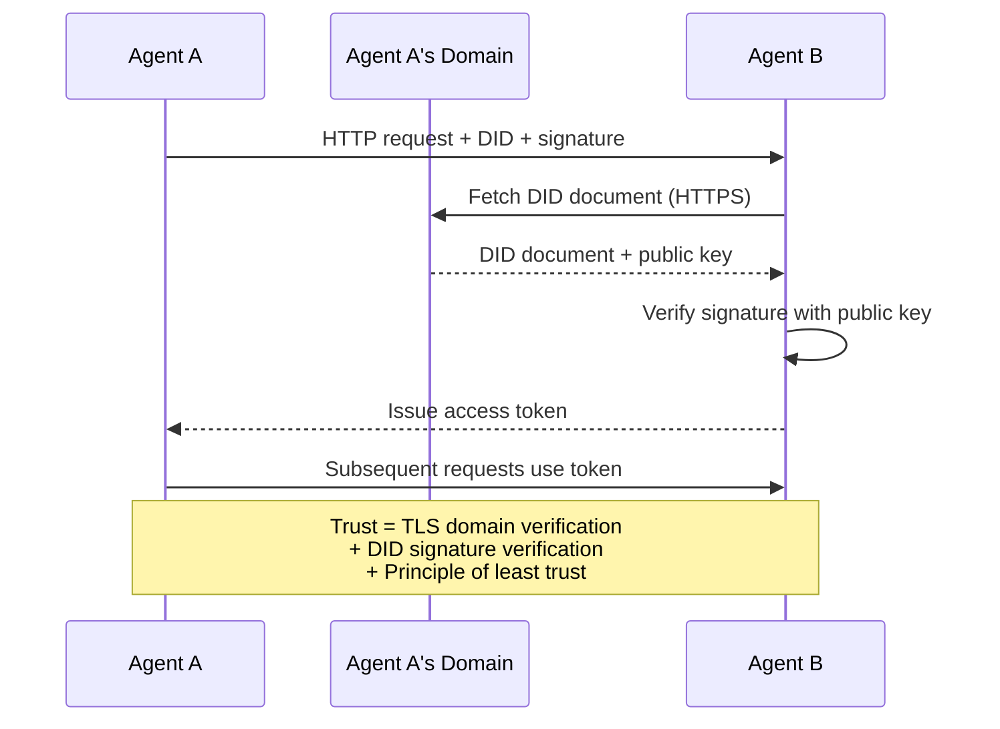

信任来自三个来源：
1. **域名级 TLS** 验证 DID 文档主机
2. **DID 加密签名**验证代理身份
3. **最小信任原则**仅授予最低权限

不存在基于八卦的信任传播或 PageRank 评分。您直接通过其 DID 验证每个代理。

#### 元协议协商

这是 ANP 最具创新性的特性。当来自不同生态系统的两个代理相遇时，它们不需要预先商定的数据格式。它们以自然语言进行协商：

```json
{
  "action": "protocolNegotiation",
  "sequenceId": 0,
  "candidateProtocols": "I can communicate using:\n1. JSON-RPC with hotel booking schema\n2. REST with OpenAPI 3.1 spec\n3. Natural language over HTTP",
  "modificationSummary": "Initial proposal",
  "status": "negotiating"
}
```

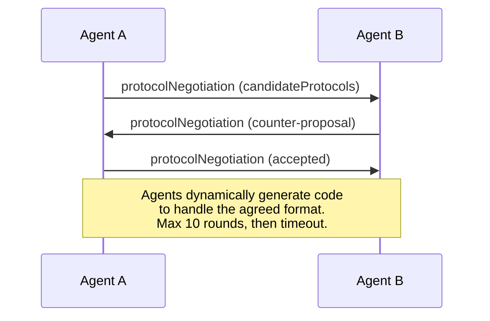

代理来回交互（最多 10 轮），直到就格式达成一致，然后动态生成代码来处理它。状态值：`negotiating`、`rejected`、`accepted`、`timeout`。

这意味着两个从未见过面的代理可以在没有任何人预定义共享模式的情况下，弄清楚如何相互通信。

### 比较（更正后）

|   |  MCP  |  A2A  |  ACP  |  ANP  |
|---|---|---|---|---|
|  **创建者**  |  Anthropic  |  Google / Linux Foundation  |  IBM / BeeAI  |  Community  |
|  **规范格式**  |  JSON-RPC  |  JSON-RPC / REST / gRPC  |  OpenAPI 3.1 (REST)  |  JSON-RPC  |
|  **主要用途**  |  代理到工具  |  代理到代理  |  代理到代理  |  代理到代理  |
|  **发现**  |  工具列表  |  `/.well-known/agent-card.json`  |  `GET /agents`, `/.well-known/agent.yml`  |  `/.well-known/agent-descriptions`, DID 服务端点  |
|  **身份**  |  隐式（本地）  |  安全方案（OAuth, mTLS）  |  服务器级别  |  W3C DID (`did:wba`) 带端到端加密  |
|  **审计追踪**  |  不适用  |  基本（任务历史）  |  TrajectoryMetadata（工具调用、推理）  |  未正式规定  |
|  **状态机**  |  不适用  |  9 个任务状态  |  7 个运行状态  |  不适用  |
|  **流式传输**  |  不适用  |  SSE  |  SSE  |  传输无关  |
|  **独特功能**  |  工具模式  |  代理卡片 + 技能  |  轨迹审计追踪  |  元协议协商  |
|  **最佳适用场景**  |  工具和数据  |  动态协作  |  受监管行业  |  跨组织信任  |
|  **状态**  |  稳定  |  稳定（v1.0）  |  正在合并到 A2A  |  活跃开发中  |

### 它们如何协同工作

这些协议并非互斥。一个实际的企业系统会使用多个：

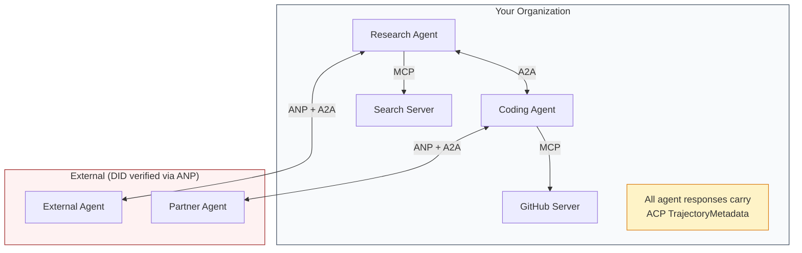

- **MCP** 将每个代理连接到其工具
- **A2A** 处理代理之间的协作（内部和外部）
- **ACP** 将响应包装在轨迹元数据中以实现可审计性
- **ANP** 为您不控制的代理提供身份验证

## 动手构建

### 步骤1：核心消息类型

每个多智能体系统都始于一种消息格式。我们定义了映射到实际协议所使用的类型：

```typescript
import crypto from "node:crypto";

type MessageRole = "user" | "agent";

type MessagePart =
  | { kind: "text"; text: string }
  | { kind: "data"; data: unknown; mediaType: string }
  | { kind: "file"; name: string; url: string; mediaType: string };

type TrajectoryEntry = {
  reasoning: string;
  toolName?: string;
  toolInput?: unknown;
  toolOutput?: unknown;
  timestamp: number;
};

type AgentMessage = {
  id: string;
  role: MessageRole;
  parts: MessagePart[];
  trajectory?: TrajectoryEntry[];
  replyTo?: string;
  timestamp: number;
};

function createMessage(
  role: MessageRole,
  parts: MessagePart[],
  replyTo?: string
): AgentMessage {
  return {
    id: crypto.randomUUID(),
    role,
    parts,
    replyTo,
    timestamp: Date.now(),
  };
}

function textMessage(role: MessageRole, text: string): AgentMessage {
  return createMessage(role, [{ kind: "text", text }]);
}
```

注意：`MessagePart`是多模态的（文本、结构化数据、文件），就像真实的A2A和ACP规范一样。`TrajectoryEntry`捕获推理链，与ACP的TrajectoryMetadata（轨迹元数据）对应。

### 步骤2：A2A智能体卡片与注册表

构建符合真实A2A规范的智能体发现机制：

```typescript
type Skill = {
  id: string;
  name: string;
  description: string;
  tags: string[];
  inputModes: string[];
  outputModes: string[];
};

type AgentCard = {
  name: string;
  description: string;
  version: string;
  url: string;
  capabilities: {
    streaming: boolean;
    pushNotifications: boolean;
  };
  defaultInputModes: string[];
  defaultOutputModes: string[];
  skills: Skill[];
};

class AgentRegistry {
  private cards: Map<string, AgentCard> = new Map();

  register(card: AgentCard) {
    this.cards.set(card.name, card);
  }

  discoverBySkillTag(tag: string): AgentCard[] {
    return [...this.cards.values()].filter((card) =>
      card.skills.some((skill) => skill.tags.includes(tag))
    );
  }

  discoverByInputMode(mimeType: string): AgentCard[] {
    return [...this.cards.values()].filter(
      (card) =>
        card.defaultInputModes.includes(mimeType) ||
        card.skills.some((skill) => skill.inputModes.includes(mimeType))
    );
  }

  resolve(name: string): AgentCard | undefined {
    return this.cards.get(name);
  }

  listAll(): AgentCard[] {
    return [...this.cards.values()];
  }
}
```

这比简单的名称到能力映射要丰富得多。你可以通过技能标签、输入MIME类型或名称来发现智能体，就像真实的A2A规范所支持的那样。

### 步骤3：A2A任务生命周期

构建完整的任务状态机：

```typescript
type TaskState =
  | "submitted"
  | "working"
  | "input-required"
  | "auth-required"
  | "completed"
  | "failed"
  | "canceled"
  | "rejected";

const TERMINAL_STATES: TaskState[] = [
  "completed",
  "failed",
  "canceled",
  "rejected",
];

type TaskStatus = {
  state: TaskState;
  message?: AgentMessage;
  timestamp: number;
};

type Artifact = {
  id: string;
  name: string;
  parts: MessagePart[];
};

type Task = {
  id: string;
  contextId: string;
  status: TaskStatus;
  artifacts: Artifact[];
  history: AgentMessage[];
};

type TaskEvent =
  | { kind: "statusUpdate"; taskId: string; status: TaskStatus }
  | {
      kind: "artifactUpdate";
      taskId: string;
      artifact: Artifact;
      append: boolean;
      lastChunk: boolean;
    };

type TaskHandler = (
  task: Task,
  message: AgentMessage
) => AsyncGenerator<TaskEvent>;

class TaskManager {
  private tasks: Map<string, Task> = new Map();
  private handlers: Map<string, TaskHandler> = new Map();
  private listeners: Map<string, ((event: TaskEvent) => void)[]> = new Map();

  registerHandler(agentName: string, handler: TaskHandler) {
    this.handlers.set(agentName, handler);
  }

  subscribe(taskId: string, listener: (event: TaskEvent) => void) {
    const existing = this.listeners.get(taskId) ?? [];
    existing.push(listener);
    this.listeners.set(taskId, existing);
  }

  async sendMessage(
    agentName: string,
    message: AgentMessage,
    contextId?: string
  ): Promise<Task> {
    const handler = this.handlers.get(agentName);
    if (!handler) {
      const task = this.createTask(contextId);
      task.status = {
        state: "rejected",
        timestamp: Date.now(),
        message: textMessage("agent", `No handler for ${agentName}`),
      };
      return task;
    }

    const task = this.createTask(contextId);
    task.history.push(message);
    task.status = { state: "submitted", timestamp: Date.now() };

    this.processTask(task, handler, message).catch((err) => {
      task.status = {
        state: "failed",
        timestamp: Date.now(),
        message: textMessage("agent", String(err)),
      };
    });
    return task;
  }

  getTask(taskId: string): Task | undefined {
    return this.tasks.get(taskId);
  }

  cancelTask(taskId: string): boolean {
    const task = this.tasks.get(taskId);
    if (!task || TERMINAL_STATES.includes(task.status.state)) return false;
    task.status = { state: "canceled", timestamp: Date.now() };
    this.emit(taskId, {
      kind: "statusUpdate",
      taskId,
      status: task.status,
    });
    return true;
  }

  private createTask(contextId?: string): Task {
    const task: Task = {
      id: crypto.randomUUID(),
      contextId: contextId ?? crypto.randomUUID(),
      status: { state: "submitted", timestamp: Date.now() },
      artifacts: [],
      history: [],
    };
    this.tasks.set(task.id, task);
    return task;
  }

  private async processTask(
    task: Task,
    handler: TaskHandler,
    message: AgentMessage
  ) {
    task.status = { state: "working", timestamp: Date.now() };
    this.emit(task.id, {
      kind: "statusUpdate",
      taskId: task.id,
      status: task.status,
    });

    try {
      for await (const event of handler(task, message)) {
        if (TERMINAL_STATES.includes(task.status.state)) break;

        if (event.kind === "statusUpdate") {
          task.status = event.status;
        }
        if (event.kind === "artifactUpdate") {
          const existing = task.artifacts.find(
            (a) => a.id === event.artifact.id
          );
          if (existing && event.append) {
            existing.parts.push(...event.artifact.parts);
          } else {
            task.artifacts.push(event.artifact);
          }
        }
        this.emit(task.id, event);
      }
    } catch (err) {
      task.status = {
        state: "failed",
        timestamp: Date.now(),
        message: textMessage("agent", String(err)),
      };
      this.emit(task.id, {
        kind: "statusUpdate",
        taskId: task.id,
        status: task.status,
      });
    }
  }

  private emit(taskId: string, event: TaskEvent) {
    for (const listener of this.listeners.get(taskId) ?? []) {
      listener(event);
    }
  }
}
```

这实现了真实的A2A任务生命周期：已提交、进行中、需要输入、终止状态。处理器是异步生成器，产生匹配SSE流模型的事件（状态更新和工件块）。

### 步骤4：ACP风格的审计追踪

用轨迹追踪封装通信：

```typescript
type AuditEntry = {
  runId: string;
  agentName: string;
  input: AgentMessage[];
  output: AgentMessage[];
  trajectory: TrajectoryEntry[];
  status: "created" | "in-progress" | "completed" | "failed" | "awaiting";
  startedAt: number;
  completedAt?: number;
  sessionId?: string;
};

class AuditableRunner {
  private log: AuditEntry[] = [];
  private handlers: Map<
    string,
    (input: AgentMessage[]) => Promise<{
      output: AgentMessage[];
      trajectory: TrajectoryEntry[];
    }>
  > = new Map();

  registerAgent(
    name: string,
    handler: (input: AgentMessage[]) => Promise<{
      output: AgentMessage[];
      trajectory: TrajectoryEntry[];
    }>
  ) {
    this.handlers.set(name, handler);
  }

  async run(
    agentName: string,
    input: AgentMessage[],
    sessionId?: string
  ): Promise<AuditEntry> {
    const entry: AuditEntry = {
      runId: crypto.randomUUID(),
      agentName,
      input: structuredClone(input),
      output: [],
      trajectory: [],
      status: "created",
      startedAt: Date.now(),
      sessionId,
    };
    this.log.push(entry);

    const handler = this.handlers.get(agentName);
    if (!handler) {
      entry.status = "failed";
      return entry;
    }

    entry.status = "in-progress";
    try {
      const result = await handler(input);
      entry.output = structuredClone(result.output);
      entry.trajectory = structuredClone(result.trajectory);
      entry.status = "completed";
      entry.completedAt = Date.now();
    } catch (err) {
      entry.status = "failed";
      entry.trajectory.push({
        reasoning: `Error: ${String(err)}`,
        timestamp: Date.now(),
      });
      entry.completedAt = Date.now();
    }
    return entry;
  }

  getFullAuditLog(): AuditEntry[] {
    return structuredClone(this.log);
  }

  getAuditLogForAgent(agentName: string): AuditEntry[] {
    return structuredClone(
      this.log.filter((e) => e.agentName === agentName)
    );
  }

  getAuditLogForSession(sessionId: string): AuditEntry[] {
    return structuredClone(
      this.log.filter((e) => e.sessionId === sessionId)
    );
  }

  getTrajectoryForRun(runId: string): TrajectoryEntry[] {
    const entry = this.log.find((e) => e.runId === runId);
    return entry ? structuredClone(entry.trajectory) : [];
  }
}
```

每次智能体执行都会生成完整的审计条目：输入了什么、输出了什么、以及中间的工具调用和推理步骤的完整轨迹。你可以按智能体、按会话或按单独运行进行查询。

### 步骤5：ANP风格的身份验证

构建基于DID的身份与验证：

```typescript
type VerificationMethod = {
  id: string;
  type: string;
  controller: string;
  publicKeyDer: string;
};

type DIDDocument = {
  id: string;
  verificationMethod: VerificationMethod[];
  authentication: string[];
  keyAgreement: string[];
  humanAuthorization: string[];
  service: { id: string; type: string; serviceEndpoint: string }[];
};

type AgentIdentity = {
  did: string;
  document: DIDDocument;
  privateKey: crypto.KeyObject;
  publicKey: crypto.KeyObject;
};

class IdentityRegistry {
  private documents: Map<string, DIDDocument> = new Map();

  publish(doc: DIDDocument) {
    this.documents.set(doc.id, doc);
  }

  resolve(did: string): DIDDocument | undefined {
    return this.documents.get(did);
  }

  verify(did: string, signature: string, payload: string): boolean {
    const doc = this.documents.get(did);
    if (!doc) return false;

    const authKeyIds = doc.authentication;
    const authKeys = doc.verificationMethod.filter((vm) =>
      authKeyIds.includes(vm.id)
    );

    for (const key of authKeys) {
      const publicKey = crypto.createPublicKey({
        key: Buffer.from(key.publicKeyDer, "base64"),
        format: "der",
        type: "spki",
      });
      const isValid = crypto.verify(
        null,
        Buffer.from(payload),
        publicKey,
        Buffer.from(signature, "hex")
      );
      if (isValid) return true;
    }
    return false;
  }

  requiresHumanAuth(did: string, operationKeyId: string): boolean {
    const doc = this.documents.get(did);
    if (!doc) return false;
    return doc.humanAuthorization.includes(operationKeyId);
  }
}

function createIdentity(domain: string, agentName: string): AgentIdentity {
  const did = `did:wba:${domain}:agent:${agentName}`;
  const { publicKey, privateKey } = crypto.generateKeyPairSync("ed25519");

  const publicKeyDer = publicKey
    .export({ format: "der", type: "spki" })
    .toString("base64");

  const keyId = `${did}#key-1`;
  const encKeyId = `${did}#key-x25519-1`;

  const document: DIDDocument = {
    id: did,
    verificationMethod: [
      {
        id: keyId,
        type: "Ed25519VerificationKey2020",
        controller: did,
        publicKeyDer,
      },
      {
        id: encKeyId,
        type: "X25519KeyAgreementKey2019",
        controller: did,
        publicKeyDer,
      },
    ],
    authentication: [keyId],
    keyAgreement: [encKeyId],
    humanAuthorization: [],
    service: [
      {
        id: `${did}#agent-description`,
        type: "AgentDescription",
        serviceEndpoint: `https://${domain}/agents/${agentName}/ad.json`,
      },
    ],
  };

  return { did, document, privateKey, publicKey };
}

function signPayload(identity: AgentIdentity, payload: string): string {
  return crypto
    .sign(null, Buffer.from(payload), identity.privateKey)
    .toString("hex");
}
```

这反映了真实的ANP身份模型：智能体拥有DID文档，其中包含单独的身份验证、密钥协商和人类授权密钥。`IdentityRegistry`模拟了DID解析（在生产环境中，这将是对智能体域的HTTP请求）。

### 步骤6：协议网关

将所有四个协议连接到一个统一系统中：

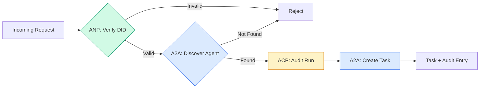

```typescript
class ProtocolGateway {
  private registry: AgentRegistry;
  private taskManager: TaskManager;
  private auditRunner: AuditableRunner;
  private identityRegistry: IdentityRegistry;

  constructor(
    registry: AgentRegistry,
    taskManager: TaskManager,
    auditRunner: AuditableRunner,
    identityRegistry: IdentityRegistry
  ) {
    this.registry = registry;
    this.taskManager = taskManager;
    this.auditRunner = auditRunner;
    this.identityRegistry = identityRegistry;
  }

  async delegateTask(
    fromDid: string,
    signature: string,
    targetAgent: string,
    message: AgentMessage,
    sessionId?: string
  ): Promise<{ task: Task; audit: AuditEntry } | { error: string }> {
    if (!this.identityRegistry.verify(fromDid, signature, message.id)) {
      return { error: "Identity verification failed" };
    }

    const card = this.registry.resolve(targetAgent);
    if (!card) {
      return { error: `Agent ${targetAgent} not found in registry` };
    }

    const audit = await this.auditRunner.run(
      targetAgent,
      [message],
      sessionId
    );
    const task = await this.taskManager.sendMessage(targetAgent, message);

    return { task, audit };
  }

  discoverAndDelegate(
    fromDid: string,
    signature: string,
    skillTag: string,
    message: AgentMessage
  ): Promise<{ task: Task; audit: AuditEntry } | { error: string }> {
    const candidates = this.registry.discoverBySkillTag(skillTag);
    if (candidates.length === 0) {
      return Promise.resolve({
        error: `No agents found with skill tag: ${skillTag}`,
      });
    }
    return this.delegateTask(
      fromDid,
      signature,
      candidates[0].name,
      message
    );
  }
}
```

网关在一次调用中完成四件事：
1. **ANP**：通过DID签名验证调用者身份
2. **A2A**：发现目标智能体并检查能力
3. **ACP**：将执行包装在带有轨迹的审计追踪中
4. **A2A**：创建具有完整生命周期跟踪的任务

### 步骤7：将所有部分连接起来

```typescript
async function protocolDemo() {
  const registry = new AgentRegistry();
  registry.register({
    name: "researcher",
    description: "Searches and summarizes findings",
    version: "1.0.0",
    url: "https://researcher.local/a2a/v1",
    capabilities: { streaming: true, pushNotifications: false },
    defaultInputModes: ["text/plain"],
    defaultOutputModes: ["text/plain", "application/json"],
    skills: [
      {
        id: "web-research",
        name: "Web Research",
        description: "Searches the web",
        tags: ["research", "search", "summarization"],
        inputModes: ["text/plain"],
        outputModes: ["application/json"],
      },
    ],
  });
  registry.register({
    name: "coder",
    description: "Writes code from specs",
    version: "1.0.0",
    url: "https://coder.local/a2a/v1",
    capabilities: { streaming: false, pushNotifications: false },
    defaultInputModes: ["text/plain", "application/json"],
    defaultOutputModes: ["text/plain"],
    skills: [
      {
        id: "code-gen",
        name: "Code Generation",
        description: "Generates code",
        tags: ["coding", "generation"],
        inputModes: ["text/plain", "application/json"],
        outputModes: ["text/plain"],
      },
    ],
  });

  const taskManager = new TaskManager();
  const auditRunner = new AuditableRunner();

  const researchTrajectory: TrajectoryEntry[] = [];

  taskManager.registerHandler(
    "researcher",
    async function* (task, message) {
      yield {
        kind: "statusUpdate" as const,
        taskId: task.id,
        status: { state: "working" as const, timestamp: Date.now() },
      };

      researchTrajectory.push({
        reasoning: "Searching for React 19 documentation",
        toolName: "web_search",
        toolInput: { query: "React 19 compiler features" },
        toolOutput: {
          results: ["react.dev/blog/react-19", "github.com/react/react"],
        },
        timestamp: Date.now(),
      });

      researchTrajectory.push({
        reasoning: "Extracting key findings from search results",
        toolName: "doc_analysis",
        toolInput: { url: "react.dev/blog/react-19" },
        toolOutput: {
          summary:
            "React 19 compiler auto-memoizes, no manual useMemo needed",
        },
        timestamp: Date.now(),
      });

      yield {
        kind: "artifactUpdate" as const,
        taskId: task.id,
        artifact: {
          id: crypto.randomUUID(),
          name: "research-results",
          parts: [
            {
              kind: "data" as const,
              data: {
                findings: [
                  "React 19 compiler auto-memoizes components",
                  "No more manual useMemo/useCallback needed",
                  "Compiler runs at build time, not runtime",
                ],
                sources: ["react.dev/blog/react-19"],
              },
              mediaType: "application/json",
            },
          ],
        },
        append: false,
        lastChunk: true,
      };

      yield {
        kind: "statusUpdate" as const,
        taskId: task.id,
        status: { state: "completed" as const, timestamp: Date.now() },
      };
    }
  );

  auditRunner.registerAgent("researcher", async () => ({
    output: [
      textMessage("agent", "React 19 compiler auto-memoizes components"),
    ],
    trajectory: researchTrajectory,
  }));

  const identityRegistry = new IdentityRegistry();

  const coderIdentity = createIdentity("coder.local", "coder");
  const researcherIdentity = createIdentity("researcher.local", "researcher");

  identityRegistry.publish(coderIdentity.document);
  identityRegistry.publish(researcherIdentity.document);

  const gateway = new ProtocolGateway(
    registry,
    taskManager,
    auditRunner,
    identityRegistry
  );

  console.log("=== Protocol Demo ===\n");

  console.log("1. Agent Discovery (A2A)");
  const researchAgents = registry.discoverBySkillTag("research");
  console.log(
    `   Found ${researchAgents.length} agent(s):`,
    researchAgents.map((a) => a.name)
  );

  console.log("\n2. Identity Verification (ANP)");
  const message = textMessage("user", "Research React 19 compiler features");
  const signature = signPayload(coderIdentity, message.id);
  const verified = identityRegistry.verify(
    coderIdentity.did,
    signature,
    message.id
  );
  console.log(`   Coder DID: ${coderIdentity.did}`);
  console.log(`   Signature verified: ${verified}`);

  console.log("\n3. Task Delegation (A2A + ACP + ANP)");
  const result = await gateway.delegateTask(
    coderIdentity.did,
    signature,
    "researcher",
    message,
    "session-001"
  );

  if ("error" in result) {
    console.log(`   Error: ${result.error}`);
    return;
  }

  console.log(`   Task ID: ${result.task.id}`);
  console.log(`   Task state: ${result.task.status.state}`);
  console.log(`   Artifacts: ${result.task.artifacts.length}`);

  console.log("\n4. Audit Trail (ACP)");
  console.log(`   Run ID: ${result.audit.runId}`);
  console.log(`   Status: ${result.audit.status}`);
  console.log(`   Trajectory steps: ${result.audit.trajectory.length}`);
  for (const step of result.audit.trajectory) {
    console.log(`     - ${step.reasoning}`);
    if (step.toolName) {
      console.log(`       Tool: ${step.toolName}`);
    }
  }

  console.log("\n5. Full Audit Log");
  const fullLog = auditRunner.getFullAuditLog();
  console.log(`   Total runs: ${fullLog.length}`);
  for (const entry of fullLog) {
    const duration = entry.completedAt
      ? `${entry.completedAt - entry.startedAt}ms`
      : "in-progress";
    console.log(`   ${entry.agentName}: ${entry.status} (${duration})`);
  }
}

protocolDemo().catch((err) => {
  console.error("Protocol demo failed:", err);
  process.exitCode = 1;
});
```

## 可能出现的问题

协议解决了理想路径。以下是生产环境中可能出现的问题：

**模式漂移。** 智能体A发布了一张智能体卡片，宣传`application/json`输出。但JSON模式在版本之间发生了变化。智能体B解析了旧格式，得到了垃圾数据。解决方案：对你的技能和输出模式进行版本控制。A2A规范支持智能体卡片上的`version`正是出于这个原因。

**状态机违规。** 智能体处理器生成了一个`completed`事件，然后试图生成更多工件。任务是不可变的。你的代码要么静默丢弃更新，要么抛出异常。解决方案：在生成事件之前检查终止状态。上面的`TaskManager`通过终止状态后的`break`来强制执行这一点。

**信任解析失败。** 智能体A试图验证智能体B的DID，但智能体B的域名宕机。无法获取DID文档。你是采用失败开放（接受未验证的智能体）还是失败关闭（拒绝一切）？ANP建议采用失败关闭，并遵循最小信任原则。

**轨迹膨胀。** ACP轨迹日志记录功能强大但成本高昂。一个复杂的智能体每次运行进行200次工具调用，会产生大量的审计条目。解决方案：以可配置的详细级别记录轨迹。为了合规性记录工具名称和IO，对于非监管工作负载跳过推理步骤。

**发现中的惊群效应。** 50个智能体在启动时同时查询`GET /agents`。解决方案：缓存带有TTL的智能体卡片，交错发现间隔，或使用基于推送的注册而不是轮询。

## 使用它

### 实际实现

**A2A**是最成熟的。谷歌的[official spec](https://github.com/google/A2A)在Linux基金会下开源。提供了Python和TypeScript的SDK。如果你的智能体需要动态发现和协作，从这里开始。

**ACP**正在合并到A2A中。IBM的[BeeAI project](https://github.com/i-am-bee/acp)创建了ACP作为首选REST的替代方案，但轨迹元数据概念正在被吸收到A2A生态系统中。即使你使用A2A作为传输层，也要使用ACP的模式（轨迹日志记录、运行生命周期）。

**ANP** 是最实验性的。[community repo](https://github.com/agent-network-protocol/AgentNetworkProtocol) 有 Python SDK (AgentConnect)。元协议协商概念确实是新颖的。值得关注跨组织的代理部署。

**MCP** 已在第13阶段涵盖。如果你想让代理使用工具，MCP是标准。

### 选择正确的协议

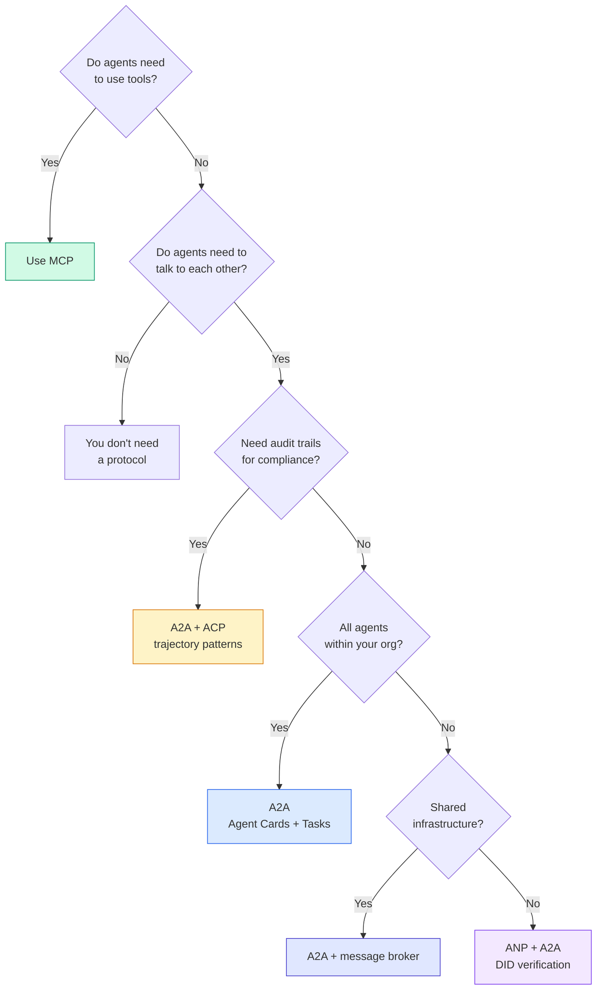

## 发布

本課(lesson)产出：
- `code/main.ts`——所有四种协议模式的完整实现
- `code/main.ts`——一个帮助你为系统选择协议的提示

## 练习

1. **多跳任务委托。** 扩展 `TaskManager`，使得代理处理器可以将子任务委托给其他代理。研究者接收一个任务，将“搜索”和“总结”子任务委托给两个专业代理，等待两者完成，然后将结果合并到自己的产物中。

2. **流式审计跟踪。** 修改 `AuditableRunner` 以支持流式模式。不必等待完整结果，而是随着轨迹条目的添加，实时产生 `AuditEntry` 更新。使用一个生成审计快照的异步生成器。

3. **DID轮换。** 为 `IdentityRegistry` 添加密钥轮换。代理应该能够在维护 `previousDid` 引用的同时，发布带有更新密钥的新DID文档。验证者应在宽限期内同时接受当前和先前密钥的签名。

4. **协议协商。** 实现ANP的元协议概念。两个代理交换带有候选格式的`protocolNegotiation`消息（例如，“我能说JSON-RPC” vs “我偏好REST”）。最多经过3轮后，它们达成一致格式或超时。协商确定的格式决定了它们使用哪个`TaskManager`或`AuditableRunner`。

5. **速率限制发现。** 添加一个`RateLimitedRegistry`包装器，该包装器缓存代理卡片查找，具有可配置的TTL，并限制每个代理每秒的发现查询。模拟100个代理启动时相互发现的惊群效应，并测量差异。

## 关键术语

|  术语  |  人们的说法  |  实际含义  |
|------|----------------|----------------------|
|  MCP  |  "AI工具的协议"  |  一种客户端-服务器协议，用于代理发现和使用工具。代理到工具，不是代理到代理。  |
|  A2A  |  "Google的代理协议"  |  一种点对点协议，用于Linux Foundation下的代理协作。通过代理卡片发现，9状态任务生命周期，通过SSE流式传输。支持JSON-RPC、REST和gRPC绑定。  |
|  ACP  |  "企业代理消息"  |  IBM/BeeAI的REST API，用于带有轨迹元数据的代理运行：每个响应携带完整的推理链和工具调用。正在合并到A2A。  |
|  ANP  |  "去中心化代理身份"  |  一个社区协议，使用`did:wba`（DID）进行加密身份，HPKE进行端到端加密（E2EE），以及AI驱动的元协议协商，用于从未相遇的代理。  |
|  Agent Card  |  "代理的名片"  |  一个位于`/.well-known/agent-card.json`的JSON文档，描述技能、支持的MIME类型、安全方案和协议绑定。  |
|  DID  |  "去中心化身份"  |  W3C标准，用于托管在代理自己域上的加密可验证身份。ANP使用`did:wba`方法。  |
|  TrajectoryMetadata  |  "审计收据"  |  ACP的机制，用于将推理步骤、工具调用及其输入/输出附加到每个代理响应。  |
|  Meta-protocol  |  "代理协商如何交谈"  |  ANP的方法，其中代理使用自然语言动态协商数据格式，然后生成代码来处理它们。  |
|  Task  |  "一个工作单元"  |  A2A的有状态对象，跟踪从提交到完成的工作。一旦终止便不可变。  |

## 延伸阅读

- [Google A2A specification](https://github.com/google/A2A)——官方规范及SDK（v1.0.0，Linux Foundation）
- [Google A2A specification](https://github.com/google/A2A)——代理运行和轨迹元数据的OpenAPI 3.1规范
- [Google A2A specification](https://github.com/google/A2A)——基于DID的身份、端到端加密（E2EE）、元协议协商
- [Google A2A specification](https://github.com/google/A2A)——Anthropic的MCP规范（在第13阶段涵盖）
- [Google A2A specification](https://github.com/google/A2A)——支撑ANP的身份标准
- [Google A2A specification](https://github.com/google/A2A)——ANP用于端到端加密（E2EE）的加密方案
- [Google A2A specification](https://github.com/google/A2A)——现代代理协议的学术前身
