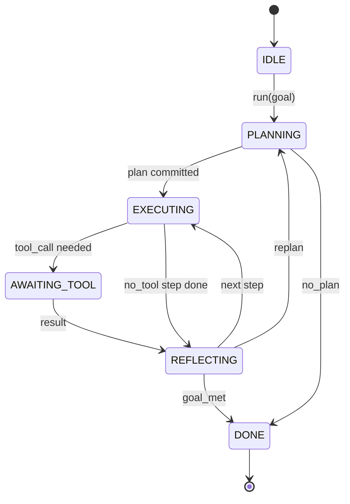

# Agent 工具链循环契约

> 框架(harness)是智能体(agent)，模型(model)是协处理器(coprocessor)。本节课冻结了循环契约(loop contract)，你可以将任何模型接入其中。

**类型：** 构建
**语言：** Python
**前置条件：** 阶段13第01-07课，阶段14第01课
**时间：** 约90分钟

## 学习目标
- 将智能体框架循环指定为一个具有显式转态的确定状态机。
- 实现十个生命周期钩子主题，运营商可将其策略(policy)、遥测(telemetry)和护栏(guardrails)接入其中。
- 定义两个拉取点(pull point)，循环在此处将控制权交回调用者，并在新输入上恢复执行。
- 强制每会话预算（轮次、工具调用、挂钟时间），超出时不泄漏部分状态。
- 发出十一种事件类型的类型化流，下游UI和追踪器可以订阅而无需直接检查循环。

## 框架

一个无监督运行四十轮次的编码智能体不是聊天循环。它是一个状态机(state machine)，操作员可以拦截其节点，审计其边。一旦你写下契约，交换模型、工具或策略就不再是重构。它变成了一次注册调用。

本节课构建了这个契约。我们命名了六个状态、十个钩子主题、两个拉取点、十一种事件类型和一个预算信封(budget envelope)。框架中的其他内容（工具注册表、JSON-RPC传输、调度器、规划器）都插入到这个形态中。

## 状态

循环有六个状态。五个是活动状态。一个是终态。



`IDLE`是唯一的合法入口点。`DONE`是唯一的合法出口。`AWAITING_TOOL`是唯一产生拉取点的状态。其他所有转态都是内部的。

状态机是确定性的。给定相同的事件日志，框架重新进入相同状态。这个属性允许你重放会话进行调试而无需重新调用模型。

## 钩子主题

钩子是操作员接入循环的接口。框架触发十个主题。每个主题接受任意数量的订阅者。订阅者按注册顺序触发。订阅者可以修改荷载(payload)，引发以中止轮次，或返回一个哨兵(sentinel)以跳过下一步。

```text
before_plan         after_plan
before_tool_call    after_tool_call
before_step         after_step
on_error
on_pause
on_budget_exceeded
on_complete
```

这个形态反映了Claude Code、Cursor和OpenCode在2025年中都趋同的形式。名称是功能性的，非品牌化。一个阻塞`rm -rf`的钩子存在于`before_tool_call`中。一个发送OpenTelemetry跨度的钩子存在于`after_step`中。一个在暂停会话上恢复的钩子存在于`on_pause`中。

## 拉取点

循环交出两次控制权。第一次在`AWAITING_TOOL`，当它无法在没有工具结果的情况下取得进展时。第二次在`on_pause`，当预算耗尽或钩子明确请求人工审核时。

拉取点不是异常。它是一种返回。调用者检查框架状态，获取框架请求的内容，并调用`resume(payload)`。框架从停止的地方继续执行。这与Python生成器(generator)的形态相同。拉取点之上的传输由你选择。在TUI中是按键。通过MCP是`tools/call`。通过队列是作业轮询。

## 事件流

循环在契约的特定点将事件追加到类型化流中。该流是只追加的，订阅者可以从任何偏移量重放。实现的十一种事件类型是：

- `session.start` — 在调用`run(goal)`时发出一次
- `session.start` — 当规划器返回草稿计划时发出
- `session.start` — 在草稿作为活动计划提交后发出
- `session.start` — 在每个执行步骤开始时发出
- `session.start` — 在每个执行步骤结束时发出
- `session.start` — 当需要工具的步骤将控制权交给调用者时发出
- `session.start` — 在带工具结果恢复时发出
- `session.start` — 在带错误恢复或钩子中止调用时发出
- `session.start` — 当达到预算限制时发出
- `session.start` — 当循环在暂停（预算或钩子）上交出时发出
- `session.start` — 当循环到达`run(goal)`时发出一次

事件不与钩子荷载重复。钩子是命令式的（修改、中止）。事件是观察性的（记录、发送）。将它们视为正交的。

## 预算信封

一个会话携带三个限制：轮次计数、工具调用计数、挂钟秒数。每轮次增加一轮。每次工具调用增加一次工具调用。挂钟时间在每个状态转换时检查。当达到任何限制时，循环触发`on_budget_exceeded`，发出`budget.warn`，然后转移到`IDLE`，并在下一个拉取点附带预算超出的原因。

预算不是终止开关。它是一个让出。调用者决定是扩展预算并恢复，还是关闭会话。

## 本节课不做什么

它不调用模型。它不注册真实工具。它不实现传输。这些是接下来的四节课。本节课确定了契约，以便接下来的四节课可以插入其中而无需重写。

`main.py`中的确定性规划器是一个占位符。它返回一个硬编码的三步计划，其中两步需要工具结果。重点是循环，而不是计划。

## 如何阅读代码

`HarnessLoop`是主类。它持有状态，触发钩子，发出事件。`Budget`跟踪限制。`Event`是流上的类型化信封。`HookRegistry`是调度表。`_transition`是唯一改变状态的函数，因此状态机不变量(invariants)位于一处。

从上到下阅读`main.py`。然后阅读`code/tests/test_loop.py`。测试固定了每个转换和每个钩子触发顺序。

## 进一步探索

在生产环境中构建测试夹具最难的部分不是状态机，而是让合约具有可执行性。合约必须能经受规划器的热重载，必须能承受返回格式错误JSON的工具，还必须能经受在四十轮会话进行到三分之二时于`before_tool_call`处抛出异常的钩子。本课中的测试正是为了演练这些故障模式。运行它们，破坏它们，添加用例。

下一课将添加工具注册表。然后是JSON-RPC传输层，接着是调度器。到第二十四课时，这个文件中的循环将使用真实的预算约束，对真实的工具执行真实的计划。
