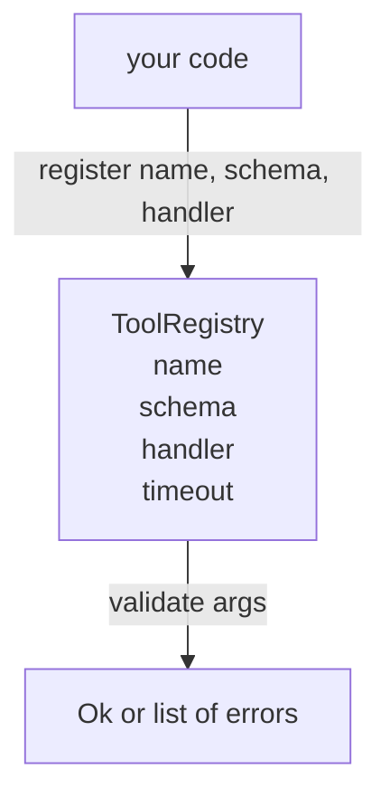

# 带模式校验的工具注册表

> 代理无法验证的工具就是代理无法调用的工具。在构建工具之前，先构建注册表和模式检查器。

**类型：** 构建
**语言：** Python
**前置条件：** 阶段13第01-07课，阶段14第01课
**时间：** 约90分钟

## 学习目标
- 维护一个类型化的工具名→模式→处理程序的注册表，调度器可以一次查询并之后信任。
- 实现一个JSON Schema 2020-12子集，覆盖百分之九十的工具调用实际使用的关键字。
- 返回精确的、JSON指针形状的错误路径，以便模型在一轮往返中自我纠正。
- 拒绝没有显式覆盖的重新注册，因为静默覆盖是生产环境工具目录漂移的原因。
- 保持验证器纯净（无I/O、无时间、无全局变量），以便可以在重放日志上重新运行。

## 为什么注册表先于工具构建

2026年的编码代理拥有比模型单个上下文窗口能容纳的更多已注册工具。一个非平凡的框架会注册两百个工具，并在每一次交互中展示十到四十个。注册表是“存在哪些工具”、“它们的参数采用什么形状”以及“我调用哪个处理程序”这三个问题的唯一真实来源。一旦这三个答案确定下来，框架的其余部分就可以停止猜测。

我们要避免的错误是：在无模式的情况下发布处理程序，或者在无验证的情况下发布模式。这两种情况都很常见。它们都会使下一层（第二十三课中的调度器）变成猜谜游戏，唯一的失败模式是来自处理程序的堆栈跟踪。

## 工具记录的结构

```text
ToolRecord
  name        : str          (unique, lowercase alphanumeric and underscore segments separated by dots, e.g., snake_case.segment.case)
  description : str          (one line, shown to the model)
  schema      : dict         (JSON Schema 2020-12 subset)
  handler     : Callable     (async or sync, returns Any)
  idempotent  : bool         (dispatcher uses this for retry decisions)
  timeout_ms  : int          (override per-tool dispatcher default)
```

模式是验证器唯一接触的字段。处理程序对它是不透明的。我们有意识地将它们分开。模式是数据。处理程序是代码。将它们混合在一起会诱使你将在处理程序内部放置验证逻辑，这正是我们要阻止的错误。

## JSON Schema 2020-12子集

完整的2020-12规范是一篇论文。我们需要八个关键字。

```text
type           string / number / integer / boolean / object / array / null
properties     map of property name -> schema
required       list of property names
enum           list of allowed primitive values
minLength      integer, applies to strings
maxLength      integer, applies to strings
pattern        ECMA-262-compatible regex, applies to strings
items          schema applied to every array element
```

这足以覆盖工具API实际所需的内容。我们未添加的关键字（oneOf、anyOf、allOf、$ref、条件式）在生产模式中是有效的，但会使验证器变成带循环的树遍历器。我们在构建注册表，而不是JSON Schema引擎。

## Json指针错误路径

当验证失败时，验证器返回一个错误列表。每个错误都携带一个指向输入的json-pointer路径。指针是一个以斜杠为前缀的属性名和数组索引序列。

```text
{"a": {"b": [1, 2, "x"]}}
                    ^
                    /a/b/2
```

模型读取错误路径比读取句子更好。如果模式要求`args.user.email`而模型传入了一个整数，错误应该是`/user/email`和`expected_type: string`。模型在下一个调用中修正它，无需经过自然语言回合。

## 注册与覆盖

`register(name, schema, handler, **opts)`默认拒绝重新注册。调用者必须传递`override=True`才能替换。这是操作卫生。代码库的两个部分静默注册相同的工具名是那种需要一周才能在生产环境中发现的错误。

注册表暴露三个读取方法。`get(name)`返回记录或抛出异常。`validate(name, args)`返回一个`Ok`或错误列表。`names()`按注册顺序返回工具名。

## 验证器是什么以及不是什么

它是对模式树的一次单遍递归扫描。它是纯净的。它不调用处理程序。它不进行类型强制（字符串`"42"`不会通过数字模式）。它不会静默截断。

它不是安全边界。恶意处理程序在验证通过后仍然可能行为不端。第二十三课中的调度器添加了超时和沙箱层。注册表添加了形状。

## 形状



## 如何阅读代码

`code/main.py`定义了`ToolRegistry`、`ToolRecord`、`ValidationError`以及八个验证函数。验证器根据`schema["type"]`进行分发（或将具有`enum`的模式视为无类型的枚举检查）。每个类型验证器返回一个空列表或一个`ValidationError`列表。顶层遍历器连接错误并在下降时预置路径段。

`code/tests/test_registry.py`涵盖注册、覆盖、验证成功、带路径的验证失败以及子集中的每个关键字。

## 进一步探索

本课落地后你可能需要的两个扩展是：针对本地definitions块的`$ref`解析，以及用于严格形状的`additionalProperties: false`。两者都很小，并且在工具目录超过五十个工具时常常会被添加。我们将它们留在了课外，以保持文件一次可读。

下一课（第二十二课）构建JSON-RPC stdio传输层，将该注册表暴露给模型客户端。之后的一课（第二十三课）将两者包装在带有超时和重试的调度器后面。
