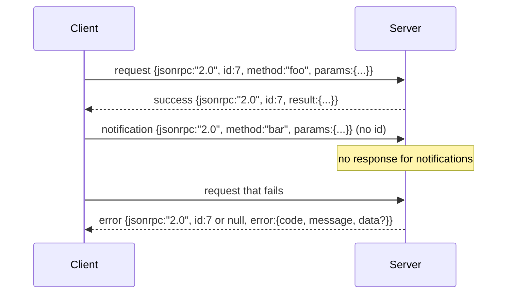

# 基于换行分隔的标准输入输出的 JSON-RPC 2.0

> 模型客户端与工具服务器之间的传输层是基于标准输入输出的 JSON-RPC。手动实现一次，你就能明白每个成帧层(Framing Layer)的代价。

**类型：** 构建
**语言：** Python
**前置条件：** 阶段13第01-07课，阶段14第01课
**时间：** 约90分钟

## 学习目标
- 通过标准输入输出(stdin/stdout)使用换行分隔的JSON帧来传递JSON-RPC 2.0。
- 映射五个标准错误代码(-32700, -32600, -32601, -32602, -32603)，并以正确的语义暴露它们。
- 在不发明新的信封键(Envelope Key)的情况下区分请求(Request)、响应(Response)、通知(Notification)和批量(Batch)。
- 处理每行的解析错误，而不污染流的其余部分。
- 使用io.BytesIO构建一个自终止的演示，使得本课程无需派生子进程即可运行。

## 为什么 JSON-RPC 仍然是通用语言(Lingua Franca)

2026年的一个编码代理(Coding Agent)在单个会话中可能会与大约十二个工具服务器通信。每个服务器是一个独立的进程或远程端点。线路格式(Wire Format)自2013年以来一直保持不变。JSON-RPC 2.0是一个两页的规范。它能存活下来是因为替代方案(gRPC、每次调用的HTTP、自定义二进制)都强加了JSON-RPC没有的权衡：它们要么选择流式(Streaming)、批量(Batching)，要么是传输耦合(Transport-Coupling)。JSON-RPC在标准输入输出、套接字(Socket)、WebSocket和HTTP上是对称的，并且只要双方都遵循规范，客户端可以驱动一个它从未见过的服务器。

本课程构建标准输入输出变体。换行分隔的JSON。每个请求是一行。每个响应是一行。传输边界是`\n`。

## 线路形状

存在四种信封形状(Envelope Shape)。两种由客户端发出，两种由服务器发出。



通知(Notification)没有`id`。服务器不得对其响应。如果服务器对通知返回了响应，客户端将无法将其关联到调用点(Call Site)。这一规则使成帧计算保持简单。

批量(Batch)是一个由请求或通知组成的JSON数组。服务器回复一个响应数组，顺序任意，每个非通知条目对应一个响应。如果批量中的每个条目都是通知，则服务器不返回任何内容。

## 五个错误代码

```text
-32700  Parse error      JSON could not be parsed
-32600  Invalid Request  Envelope shape is wrong
-32601  Method not found
-32602  Invalid params
-32603  Internal error
```

介于-32000和-32099之间的代码保留给服务器自定义的错误。其他所有代码都是应用定义的。本课程只使用这五个。如果你的处理器(Handler)抛出异常，传输层会将其包装为-32603，并将异常类名放在`data.exception`中。

解析错误有一条特殊规则。响应中的`id`是`null`，因为请求从未被充分解析以提取标识符(id)。

## 换行成帧与BytesIO演示

传输层每次读取一行。一行是从开始到包括`\n`在内的字节。如果某一行无法被解析，传输层会写入一个带了`id: null`的-32700响应，然后继续。流不会被污染，下一行会被重新解析。

对于本课程，我们将一个`io.BytesIO`对包装为标准输入和标准输出。服务器读取请求直到EOF(文件结束符)，为每个请求写入响应，然后返回。客户端读取响应回来。无需派生进程，没有超时。传输层行为与真实的子进程管道相同，因为Python的`io`接口提供了相同的`.readline()`和`.write()`契约。

## 方法分发(Method Dispatch)

传输层不知道存在哪些方法。它将控制权交给由辅助框架(Harness)提供的可调用`handler(method, params)`。处理器返回结果或抛出异常。三个异常类暴露特定的错误代码。

```text
MethodNotFound -> -32601
InvalidParams  -> -32602
Anything else  -> -32603 with exception name in data
```

传输层从不接触工具注册表(Tool Registry)。注册表位于处理器之后。这正是我们想要的分层。传输层说JSON-RPC，注册表说工具形状。分发器(第二十三课)将它们缝合在一起。

## 错误时的流行为

```text
client writes              server reads             server writes
---------------            -----------              -------------
{...valid request...}      parses ok                {...response, id matches...}
{...broken json...         parse fails              {id:null, error: -32700}
{...valid request...}      parses ok                {...response, id matches...}
{...missing method...}     invalid envelope         {id:X, error: -32600}
```

损坏的JSON行不会停止循环。缺少`method`字段不会停止循环。处理器异常不会停止循环。传输层持续读取直到EOF。

## 通知与非对称流

通知是一次性的(发后即忘)。辅助框架使用通知来传递进度事件、取消信号和日志行。通知是长时间运行的工具在不进行往返通信的情况下流式传输状态更新的方式。

本课程实现了一个出站通知辅助函数`write_notification`。服务器在请求处理过程中使用它发出进度通知。演示展示了模式：请求进入，处理器发出两个进度通知，然后写入最终响应。

## 如何阅读代码

`code/main.py`定义了`StdioTransport`、解析辅助函数(`parse_request`)、三个写入辅助函数(`write_response`, `write_error`, `write_notification`)以及分发循环`serve`。错误代码常量位于模块作用域。

`code/tests/test_transport.py`涵盖了五个错误代码、通知(无响应写入)、批量(数组输入，数组输出，跳过通知)、损坏的JSON(解析错误然后继续)，以及处理器在调用中途写入通知的非对称流。

## 进一步探索

这个传输层足以满足后续课程。生产环境的传输层会添加三样东西：一个在转发过程中保留的关联ID(Correlation ID)字段(你的`id`已经实现了这一点，但在网格中你还需要一个外部追踪ID)；一个取消通道(一个类似`$/cancelRequest`的通知，其中包含正在处理的调用的ID)；以及一个内容类型协商握手，使得同一个套接字既可以传递JSON-RPC也可以传递Streamable HTTP。这些都不会改变线路格式，它们只是添加了元数据(Metadata)。
