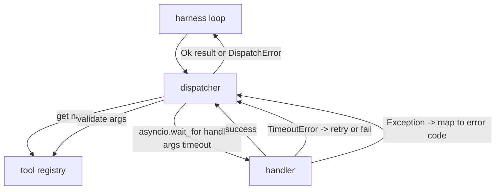
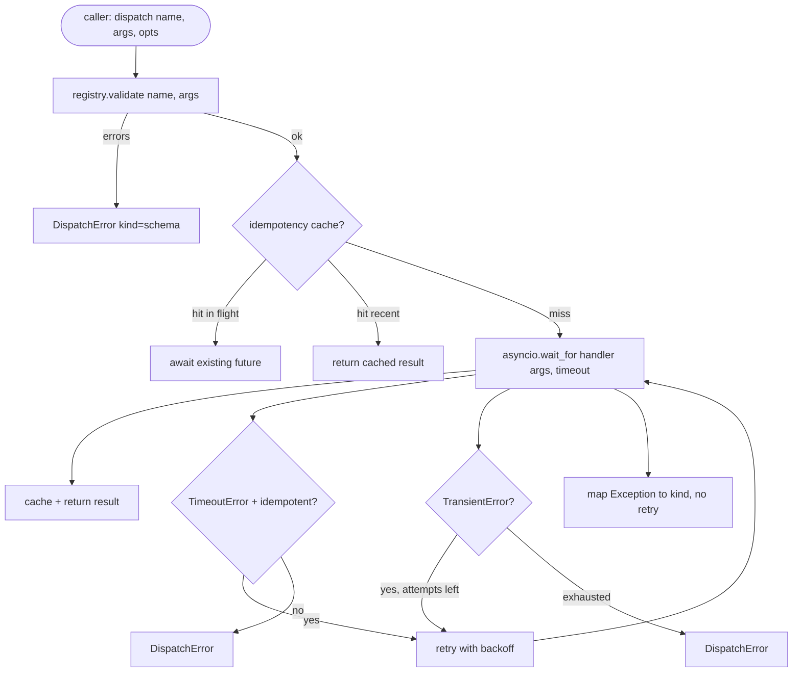

# 函数调用分发器

> 调度器是框架兑现所有模式承诺的地方。超时、重试、去重、错误映射。全都在同一条接缝上。

**类型：** 构建
**语言：** Python
**前置条件：** 阶段13第01-07课，阶段14第01课
**时间：** 约90分钟

## 学习目标
- 将工具处理程序包装在每次调用的超时中，返回类型化错误而不是挂起循环。
- 应用带抖动的指数退避重试和最大尝试次数。
- 基于幂等键去重重试，这样与慢速原始请求并发的重试不会运行两次。
- 将处理程序异常和传输故障映射到框架循环已经理解的单一错误封装。
- 使用并发限制约束并行调度，这样四十个工具调用的扇出不会耗尽事件循环。

## 调度器所在的位置

在框架循环（第二十课）和工具注册表（第二十一课）之间。传输层（第二十二课）为循环提供输入。循环将工具调用交给调度器。调度器调用注册表，运行处理程序，并返回结果或JSON-RPC形状的错误封装。



调度器是唯一了解计时器、重试和幂等性的层。循环不知道，注册表不知道，处理程序也不知道。这种隔离正是关键所在。

## 超时

每个工具都有默认超时。注册表记录携带`timeout_ms`。当框架传递每次调用的覆盖时，调度器会覆盖它。我们使用`asyncio.wait_for`。超时时，处理程序任务被取消，调度器返回`DispatchError(kind="timeout")`。

对于非幂等工具，超时默认不是可重试错误。超时的`db.write`可能已提交也可能未提交。重试会重复写入。调度器遵从注册表记录中的`idempotent`标志。幂等工具重试。非幂等工具不重试。

## 带指数退避的重试

重试策略最多三次尝试。退避采用带抖动的指数方式。

```text
attempt 1  -> delay 0
attempt 2  -> delay 0.1s * (1 + random[0..0.5])
attempt 3  -> delay 0.4s * (1 + random[0..0.5])
```

只有`timeout`和`transient`错误会重试。`schema`错误、`not_found`或`internal`错误不会重试。模式错误是确定性的。重试不会改变结果，只会消耗预算。

重试循环遵从框架的预算。如果调用者的预算剩余零次工具调用，调度器在第一次尝试时快速失败并返回`kind="budget_exceeded"`。

## 幂等键去重

在原始请求仍在进行时触发的重试是一个真实的生产错误。第一个调用在4.9秒时挂起（刚好低于超时）。重试在5秒时触发。现在两个请求竞争同一后端。如果工具是`payments.charge`，你会被收费两次。

调度器接受可选的`idempotency_key`。如果调用到达时相同的键正在执行中，调度器等待正在进行的future并返回其结果。缓存键在完成后保留60秒，以吸收延迟的重试。

键是调用者的责任。框架从规划器派生它：`f"{step_id}:{tool_name}:{hash(args)}"`。调度器不会发明键，因为仅从参数派生键会使两个语义不同的调用看起来相同。

## 错误封装

失败的调度返回单一形状。

```text
DispatchError
  kind        : "timeout" | "transient" | "schema" | "not_found" | "internal" | "budget_exceeded"
  message     : str
  attempts    : int
  jsonrpc_code: int   (one of -32601, -32602, -32603)
```

框架循环将`kind`映射到下一个状态。`schema`和`not_found`转到`on_error`并触发重新规划。`timeout`和`transient`转到`on_error`，并根据尝试次数决定是否重新规划。`budget_exceeded`触发`on_budget_exceeded`。

## 扇出时的并发限制

`gather(*calls)`同时运行所有协程。四十次工具调用意味着四十个开放套接字或四十个子进程管道。大多数后端不喜欢来自一个客户端的四十个并行连接。

调度器将`gather`包装在信号量中。默认并发限制为八个。每次调用在调度前获取信号量，完成后释放。调用者看到`gather`形状的输出，但实际调度是有界的。

## 一次调用的流程



## 如何阅读代码

`code/main.py`定义了`Dispatcher`、`DispatchError`和`TransientError`。调度器在构造时接收注册表。异步`dispatch(name, args, ...)`是唯一的入口点。每次尝试的超时在`_run_with_retries`内部使用`asyncio.wait_for`内联应用。`gather_bounded(calls)`使用并发限制运行多次调度。

`code/tests/test_dispatcher.py`涵盖了超时触发、瞬态错误重试、模式错误不重试、幂等去重（两个具有相同键的并发调用折叠为一次处理程序调用）以及并发限制（信号量生效）。

测试使用`asyncio.sleep(0)`和基于`Counter`的确定性处理程序，因此在毫秒内完成且不依赖挂钟时间。

## 进一步探索

生产调度器会添加两个扩展。第一，每个转换的结构化日志（循环的事件流已经提供，但调度器也应发出`dispatch.attempt`和`dispatch.retry`事件）。第二，断路器：在一个窗口内N次失败后，工具进入冷却期，在此期间调度立即返回`kind="circuit_open"`而不是尝试处理程序。两者都可以在此调度器之上实现，无需更改契约。

第二十四课将调度器连接到规划-执行代理，让你看到所有四个部分在运行。
