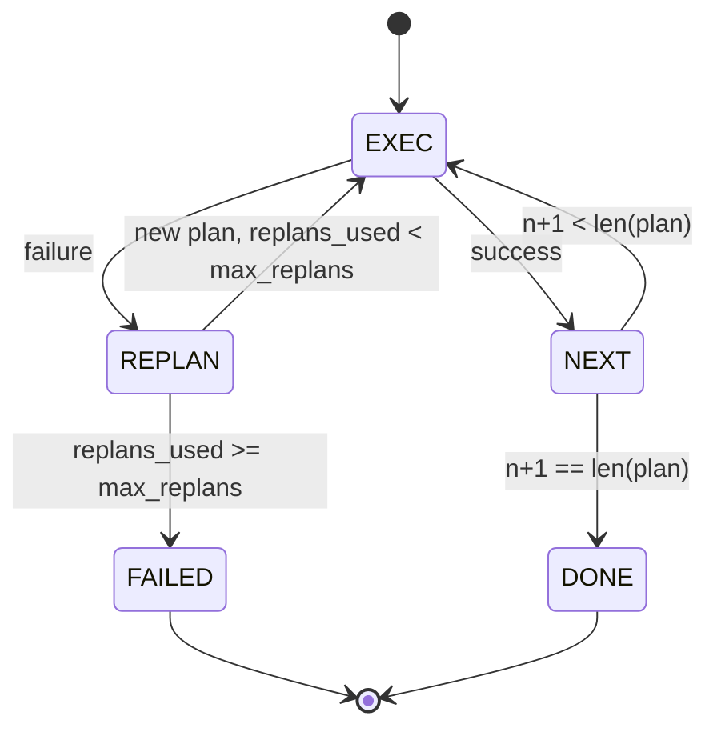

# 计划-执行控制流

> 无法在失败中存活的计划是脚本。能够重新规划(replan)的脚本是智能体(Agent)。先构建重新规划器。

**类型：** 构建
**语言：** Python
**前置条件：** 阶段13第01-07课，阶段14第01课
**时间：** 约90分钟

## 学习目标
- 将计划表示为带类型步骤的有序列表，以便执行器能够推理进度和结果。
- 按顺序执行步骤，并可控地将失败处理交回给规划器。
- 从当前游标(Cursor)处重新规划，并将先前错误放入上下文中，以便下一个计划更明智。
- 每次修订时发出计划差异(Plan Diff)，使下游追踪器或用户界面能够显示计划变化原因。
- 强制执行两个预算：硬性步骤上限和硬性重新规划上限。

## 规划与执行，而非思维链(Chain-of-Thought)

思维链智能体(Chain-of-Thought Agent)发出令牌，让循环猜测工具调用结束位置。规划与执行智能体(Plan-and-Execute Agent)首先发出结构化计划，然后确定性地执行每一步。计划是框架可以内省的数据。执行是框架通过调度器运行该数据。

两个部分：一个生成计划的规划器，一个运行计划的执行器。有趣的工作在于执行器遇到失败时发生什么。三种选项：

```text
1. Abort         (return failed, surface the error)
2. Skip          (mark step failed, continue with the rest)
3. Replan        (hand the error to the planner, get a new plan from the cursor)
```

重新规划是将脚本转变为智能体的关键。

## 步骤(Step)形状

```text
Step
  id              : int           (monotonic within a plan revision)
  tool_name       : str
  args            : dict
  expected_outcome: str           (planner's stated success condition)
  result          : Any | None
  error           : str | None
```

`expected_outcome`是规划器在步骤旁发出的短句。执行器不强制它。它用于两件事：重新规划器在修订计划时读取它；事件流发出它，以便追踪器显示“此步骤本应执行X”。

## 规划器形状

```python
def planner(goal: str, history: list[Step], last_error: str | None) -> list[Step]:
    ...
```

一个纯函数(Pure Function)。`goal`是用户目标。`history`是已执行的步骤（已填充结果和错误）。`last_error`在首次调用时为None，后续每次调用时是最新失败消息。规划器返回从游标开始的下一个计划。

规划器不知道执行器。不知道重试。不知道超时。它生成一个计划。仅此而已。

## 执行器

执行器是一个小型状态机。每个步骤通过调度器运行。结果有三种：成功、失败-可重新规划、失败-致命。可重新规划的失败交回给规划器。致命失败（预算超出、重新规划上限达到）返回`FAILED`会话结果。



## 修订时的计划差异

当规划器在失败后返回新计划时，执行器发出`plan.diff`事件，包含三个字段。

```text
removed: list of step ids that were in the old plan and are not in the new
added  : list of step ids in the new plan that were not in the old
revised: list of step ids whose tool_name or args changed
```

追踪器或用户界面可以渲染为：对删除步骤加删除线，对新增步骤加高亮。重点不是差异格式。重点是修订是一个可见事件，而非静默重写。

## 两个预算，均为硬性

`max_steps`限制整个会话中步骤执行的总次数，包括重新规划。默认值为12。一个包含5步的线性计划，重新规划两次且每次增加三步，将执行16步，超出预算。执行器将拒绝重新规划并返回FAILED。

`max_replans`限制首次计划后调用规划器的次数。默认值为5。这是更重要的限制。一个连续五次返回相同失败计划的规划器，否则会一直循环直到步骤预算截停。限制重新规划次数能使失败更快且原因更清晰。

## 本课中的确定性规划器

本课不调用模型。本课附带一个确定性规划器，它根据`last_error`选择计划。

```text
last_error is None    -> emit a four-step plan
last_error matches X  -> emit a three-step plan that routes around X
last_error matches Y  -> emit a two-step plan that gives up gracefully
otherwise             -> return [] (signals nothing to replan)
```

这足以测试执行器在每条转换路径上的行为：成功、重新规划一次、重新规划两次、重新规划耗尽、步骤预算耗尽。

## 结果形状

```text
SessionResult
  status      : "completed" | "failed"
  reason      : str     ("goal_met" | "step_budget" | "replan_budget" | "no_plan")
  history     : list[Step]
  revisions   : list[PlanDiff]
  events      : list[Event]
```

第二十课中的框架循环可以直接读取此结果。第二十三课中的调度器用于执行每个步骤。第二十一课中的注册表验证每个步骤参数。第二十二课中的传输层会将整个流程通过JSON-RPC暴露给模型客户端。

## 如何阅读代码

`code/main.py`定义了`PlanExecuteAgent`、`Step`、`PlanDiff`、`SessionResult`以及确定性规划器。执行器是一个返回`SessionResult`的`run(goal)`方法。计划差异通过比较步骤ID和`(tool_name, args)`元组来计算。

`code/tests/test_agent.py`涵盖了线性成功、中途失败并重新规划一次、重新规划耗尽返回`failed:replan_budget`、步骤预算耗尽以及计划差异事件格式。

## 进一步探索

一旦你将此连接到真实模型，你会想要两个扩展。首先，部分计划缓存：当计划前三个步骤成功但失败时，你不想重新运行前三个步骤。执行器已保存历史；规划器只需读取它。其次，并行分支：当前执行器严格顺序执行。一个发出独立分支（`gather_step`而非`next_step`）的规划器可以通过调度器并发运行两个工具调用。

两者都会增加实际复杂度。但两者在确定线性执行器后更容易添加。这正是本课所做的。
