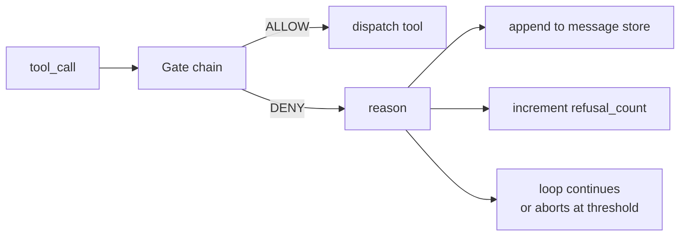
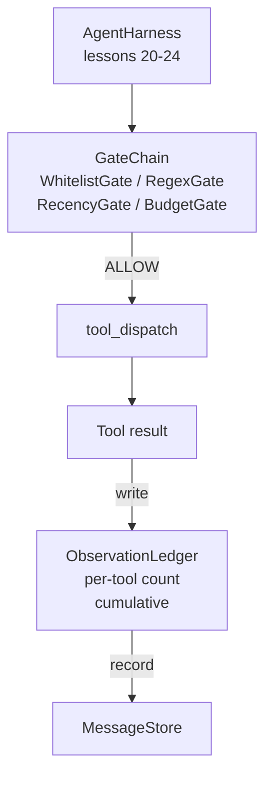

# 顶石课第25课：验证门与观测预算

> 没有验证层的代理框架就像一件风衣中的愿望。本课构建了确定性门链，它决定是否允许工具调用触发、代理允许看到其输出的多少，以及当代理读取过多时循环必须停止。该链是一个由小型命名门加上一个记录模型已看到每个令牌的观测帐本组成的函数。

**类型：**构建
**语言：**Python (stdlib)
**先决条件：**阶段19 · 20-24 (追踪A1：代理循环，工具注册表，消息存储，提示构建器，模型路由器)，阶段14 · 33 (作为约束的指令)，阶段14 · 36 (范围契约)，阶段14 · 38 (验证门)
**时间：**约90分钟

## 学习目标

- 构建一个具有确定性`evaluate(call)`方法的`VerificationGate`协议。
- 将预算、近期性、白名单和正则表达式门组合成一个具有短路语义的链。
- 通过以工具和轮次为键的`VerificationGate`追踪每个观测。
- 当累积观测预算将被超出时拒绝工具调用。
- 公开一个结构化`VerificationGate`记录，下游可观测性可以摄取。

## 问题

当代理框架让模型自由调用工具时，在实际使用的头一个小时内就会出现三类错误。

第一个是无界观测。对一个20万行代码仓库的grep操作将50万个令牌的输出倾倒进下一轮次。模型每千字节看到一个匹配，其余的上下文被浪费。令牌账单很大，代理现在在任务上更差，而不是更好。

第二个是过时的近期性。一个长时间运行的任务累积了50次工具调用。模型重新读取了第三轮次中的第一个read_file，好像它是实时状态。第47轮次中的编辑从未出现，因为提示构建器首先序列化了最早的观测。

第三个是权限蠕变。一个研究任务开始调用`web_search`，然后不知何故最终运行了`shell`，因为模型虚构了一个工具名称且框架默认允许。当任何人阅读追踪时，一个垃圾文件就在/tmp中，并且一个curl命令已对私有API运行。

验证门是说不的框架组件。它不是模型。它不是裁判。它是`(call, history, ledger)`的确定性函数，返回ALLOW或DENY并附上原因。原因被记录。模型被告知。循环继续或中止。

## 核心概念



门是任何具有`evaluate(call, ctx) -> GateDecision`方法的东西。链是一个有序列表。评估在第一个拒绝时短路。顺序很重要：廉价结构门在昂贵的令牌计数门之前运行。

本课提供了四个门：

- `WhitelistGate`。允许的工具名称是一个显式集合。之外的任何内容都被拒绝。这是最廉价的门并首先运行。
- `RegexGate`。工具参数与正则表达式匹配。用于拒绝包含`RegexGate`的shell调用，或对内部IP的HTTP调用。纯对调用载荷。
- `rm -rf`。模型只看到最近N轮次的观测。较旧的观测被屏蔽。该门拒绝其结果将扩展到已过时的观测窗口的工具调用。
- `RecencyGate`。模型在整个会话中读取的累积令牌数有一个上限。当账本说达到上限时，每个进一步的工具调用都被拒绝。

观测账本负责记账。每次成功的工具调用写入一行：工具名称、轮次、发出的令牌数、累积数。账本回答两个问题：模型总共看到了多少，以及它看到了工具X多少。预算门读取前者。每工具预算门（你将作为练习编写）读取后者。

## 架构



框架询问链。链要么同意要么拒绝。如果同意，工具运行，账本更新，结果被追加到消息存储。如果拒绝，模型收到拒绝作为系统消息，循环决定重试还是中止。

## 你将构建什么

实现是一个单独的`main.py`加上测试。

1. `Observation`和`ToolCall`数据类定义了线形状。
2. `Observation`记录`ToolCall`行并回答`ObservationLedger`和`(turn, tool, tokens)`。
3. `Observation`携带`ToolCall`。
4. `Observation`是协议。每个门实现`ToolCall`。
5. `Observation`包装一个有序列表。它调用每个门，返回第一个拒绝，如果所有门通过则返回允许。
6. 演示运行一个小的合成代理循环。三轮次。第三轮触发预算门，循环报告一个干净拒绝，带有非零拒绝计数。

令牌计数器故意采用一个愚蠢的`len(text) // 4`启发式。本课的重点是门管道，而不是分词器。在生产中替换为真正的分词器。

## 为什么链顺序很重要

拒绝比允许更便宜。`WhitelistGate`在O(1)哈希查找中运行。`RegexGate`在O(模式 * 参数)中运行。`RecencyGate`读取消息存储的一小片。`BudgetGate`读取整个账本。你按成本升序排列它们，以便被拒绝的调用在进行昂贵工作之前短路。

你还可以按影响半径排序它们。白名单是最强的断言：此工具不在契约中。正则表达式门是下一个：此参数不在契约中。近期性之后：框架仍然关心，但调用在结构上合法。预算最后，因为根据定义，只有当其他所有都通过时才触发。

## 这如何与追踪A的其余部分组合

前几课给了你循环、工具注册表、消息存储、提示构建器和模型路由器。本课添加了模型与工具之间的层。课26提供了调度器将工具调用传递给门链允许后的沙箱。课27提供了将拒绝计数记录为质量信号的评估框架。课28将门决策接入OpenTelemetry跨度。课29将所有这些缝合成一个工作的编码代理。

## 运行它

```bash
cd phases/19-capstone-projects/25-verification-gates-observation-budget
python3 code/main.py
python3 -m pytest code/tests/ -v
```

演示打印逐轮追踪，包括每个门决策并退出码为零。测试覆盖账本、每个门单独、链短路以及合成循环端到端。
