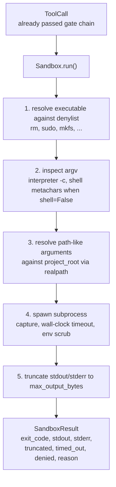
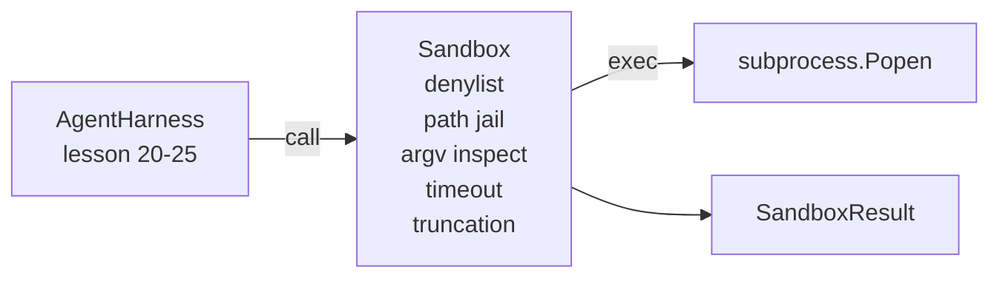

# 结业课程第26课：带拒绝列表和路径监禁的沙箱运行器

> 验证门决定工具调用是否应该运行。沙箱决定调用运行后会发生什么。本课程实现了一个子进程运行器，它拒绝危险的执行文件，拒绝危险的argv形状，将每个文件路径监禁到项目根目录，截断过长的输出，并在挂钟超时后杀死失控的进程。这是位于模型和操作系统之间的两层中的第二层。

**类型：** 构建
**语言：** Python（标准库）
**前提条件：** 第19阶段·第25课（验证门和观察预算），第14阶段·第33课（指令作为约束），第14阶段·第38课（验证门）
**时间：** 约90分钟

## 学习目标

- 构建一个`Sandbox`类，封装`subprocess.run`，支持超时、捕获和截断。
- 根据名称（拒绝列表）和结构（argv检查器）拒绝命令。
- 拒绝任何解析到声明项目根目录之外的路径参数。
- 在shell模式关闭时拒绝shell元字符。
- 返回一个结构化的`Sandbox`，供下游可观测性和评估工具使用。

## 问题

能够执行shell命令的编码智能体可以在单次交互中安装后门、窃取密钥、损坏开发者笔记本电脑，并产生高额云账单。成本最低的防御是不给它shell。其次是提供一个针对精确模式列表说“不”的沙箱。

智能体运行记录中反复出现三类失败。

第一类是危险的执行文件。模型在压力下修复路径问题时，会尝试`sudo`、`chmod -R 777`、`rm -rf`、`mkfs`、`dd`。这些都不应该在智能体运行中出现。拒绝列表通过名称和别名捕获它们。

第二类是argv技巧。被告知不能使用shell的模型会通过解释器发起攻击：`python3 -c "import os; os.system('rm -rf /')"`、`bash -c '...'`、`node -e '...'`、`perl -e '...'`。沙箱需要知道，任何带有`-c`类似标志的解释器运行都只是带有额外步骤的shell调用。

第三类是路径逃逸。模型被告知读取`./src/main.py`，却读取了`../../etc/passwd`。沙箱通过`os.path.realpath`解析每个路径参数并断言前缀，将路径监禁起来。

沙箱在操作系统意义上不是一个安全边界。一个决心坚定的攻击者一旦获得代码执行能力，仍然可以逃脱。沙箱是一个开发时的防护栏：它让常见的失败模式变得明显，并阻止智能体因纯粹的笨拙而造成损害。

## 核心概念



沙箱有四个拒绝维度：名称、argv、路径、结构。每个维度都是调用的纯函数，尚未创建子进程。只有当每个维度都通过后，子进程才会生成。

`SandboxResult`退出码采用常规约定：0表示成功，非零表示失败，外加三个哨兵码：拒绝（-100）、超时（-101）和截断（退出码为真实退出码，同时设置一个标志）。后续课程读取这个结构化结果，而不是解析stderr。

## 架构



拒绝列表是一个可执行文件基名的冻结集合。别名（`/bin/rm`、`/usr/bin/rm`）都解析为相同的基名。argv检查器知道解释器的形状：任何argv中，如果argv[0]是解释器，且后续某个参数以`-c`或`-e`开头，则拒绝。当调用未明确请求shell时，shell元字符（`;`、`|`、`&`、`>`、`<`、反引号、`$()`）会导致拒绝。

路径监禁是最精妙的部分。沙箱在构造时接受一个`project_root`。任何看起来像路径的参数（包含`/`或匹配现有文件）都会通过`os.path.realpath`进行规范化，然后与项目根目录的realpath进行比对。如果解析后的目标不在根目录下，则拒绝。符号链接逃逸尝试（项目根目录内指向外部的符号链接）通过检查realpath而不是字面路径来阻止。

## 你将构建什么

实现包括`main.py`和一个测试目录。

1. `SandboxResult`数据类：exit_code、stdout、stderr、truncated、timed_out、denied、reason、duration_ms。
2. `SandboxResult`数据类：project_root、max_output_bytes、timeout_seconds、denylist、interpreter_block。
3. `SandboxResult`类：`SandboxConfig`方法返回一个`Sandbox`。
4. 内部拒绝辅助函数：`SandboxResult`、`SandboxConfig`、`Sandbox`、`run(argv, *, shell=False, cwd=None)`。
5. 输出截断带有清晰的`SandboxResult`标志和捕获流中的标记行。
6. 底部演示：一系列合法和对抗性调用。每个调用都显示其结果。

沙箱默认使用`subprocess.run`和`shell=False`以及`capture_output=True`。挂钟超时使用`timeout`参数；超时发生后，沙箱杀死进程组并合成一个SandboxResult。

## 为什么这不是一个真正的沙箱

本课程的沙箱不使用命名空间、cgroups、seccomp、gVisor、Firecracker或任何内核级隔离。子进程能做的事情，沙箱也能做。保护是结构性的：智能体被拒绝最常见的危险调用，响亮的拒绝会进入可观测性，而不是静默运行。

对于生产级智能体，你可以在此基础上叠加：在非特权Docker容器内运行，在微型VM内运行，删除能力，将项目根目录挂载为只读并将临时目录挂载为读写，设置内存和CPU的ulimit，将环境清理到已知安全的白名单。第29课会做其中一部分。操作系统级隔离不在本课程的范围内。

## 运行它

```bash
cd phases/19-capstone-projects/26-sandbox-runner-denylist
python3 code/main.py
python3 -m pytest code/tests/ -v
```

演示程序创建一个临时目录，在其中放入一个干净文件，然后运行一系列调用。合法调用成功。被拒绝的调用返回带有`denied=True`和原因的SandboxResult。超时返回`timed_out=True`。截断设置`truncated=True`。演示程序打印一个JSON格式的结果表，并以零退出。

## 这如何与追踪A的其余部分组合

第25课生成了门链。第26课是门允许后运行的执行器。第27课中的评估工具将沙箱结果与每个任务的预期退出码进行比较。第28课在每个`Sandbox.run`调用周围发出一个`gen_ai.tool.execution`跨度。第29课的端到端演示将真实的编码智能体连接到这两层上。
