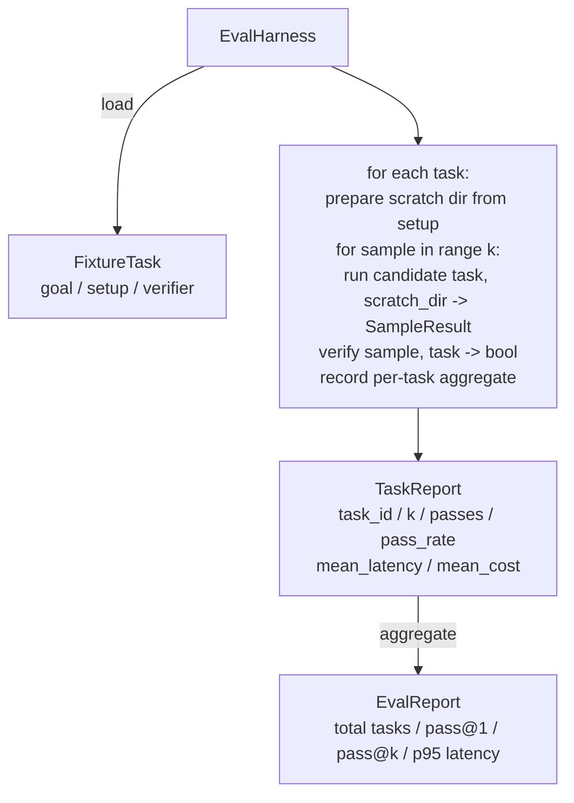

# 结业课程27：使用固定任务集的评估框架

> 一个编码智能体的好坏取决于你用来衡量它的任务集。本课程构建一个评估框架，它接受一个包含固定任务集的文件夹，通过候选智能体运行每个任务，通过确定性验证器判定通过或失败，并将结果汇总为pass@1、pass@k、平均延迟和平均成本。该框架是事实来源，让你能够区分回归与重构。

**类型：** 构建
**语言：** Python（标准库）
**前置条件：** 阶段19·25（验证门）、阶段19·26（沙箱运行器）、阶段14·30（评估驱动智能体开发）、阶段14·19（SWE-bench和GAIA基准）
**时间：** 约90分钟

## 学习目标

- 定义一个固定任务为三元组：目标、设置和验证器。
- 对每个任务进行多次采样运行并计算pass@1和pass@k。
- 汇总延迟和成本为平均值和第95百分位数指标。
- 将确定性验证器（文件差异、退出码、正则匹配）封装为可复用函数。
- 输出结构化JSON报告，供回归跟踪脚本读取。

## 问题

三种失败模式困扰着没有评估框架构建的智能体基准测试。

第一种是未经验证的通过。智能体说它修复了bug，人工瞥一眼差异，测试套件标记为绿色，三周后回归测试暴露了同一个bug。智能体看似有理有据地推理，但并未真正修复任何问题。

第二种是未检测到的回归。对提示模板的一次改动使智能体在明显任务上提升4%，在隐蔽任务上下降14%。没有黄金集和每个任务的得分，回归潜入主干，直到客户投诉才暴露。

第三种是每个任务的漂移。周一评估时用了100个任务，周五只剩95个，因为有人重命名了五个固定任务。通过率看上去提升了5%，其实并没有。

评估框架是将这些失败转化为事实的程序。它每次以可重复的顺序运行每个固定任务，并针对验证器进行检验，验证器基于确定性检查返回真或假。

## 核心概念

```mermaid
flowchart LR
  F1[fixtures/task_001/<br/>task.json + expected/] --> Harness
  F2[fixtures/task_002/<br/>...] --> Harness
  Harness[Harness<br/>for each task:<br/>setup / run agent k samples /<br/>verify each sample /<br/>record latency, cost]
  Harness --> Report[EvalReport<br/>pass@1 / pass@k<br/>mean ms / p95 ms<br/>mean cost]
```

一个`FixtureTask`是一个小JSON文件加上一个可选的`expected/`目录。JSON声明了`id`、`goal`（提供给智能体的提示）、`setup`块（要放入暂存目录的文件）以及`verifier`块。验证器块指定了框架验证器注册表中的一个函数及其参数。

三种验证器形态覆盖了大多数有用的任务。

第一种是`file_equals`。智能体运行后，比较指定文件与预期内容。这适用于“以精确方式修复此bug”的任务。

第二种是`regex_match`。指定文件的内容与正则表达式匹配。这适用于“函数必须存在并返回X”的任务，且存在多种可接受的解决方案。

第三种是`shell_exit_zero`。框架（通过第26课的沙箱）运行一个shell命令，仅在命令退出码为零时判定任务通过。这适用于“测试必须通过”的任务。

框架对每个任务运行`k`次。Pass@k等于`1 - (1 - p)^k`，其中p是经验通过率；框架还报告原始计数以便你发现方差。延迟是每个样本的挂钟时间。成本是智能体自行报告的任何形式（token数、美元或两者兼有）；框架对各样本求和并给出每个任务和汇总数字。

```figure
pass-at-k
```

## 架构



候选者是一个可调用对象：`Callable[[FixtureTask, str], SampleResult]`。框架通过`tempfile.mkdtemp()`创建暂存目录，并将其路径作为普通字符串传递。框架不关心候选者的工作方式。候选者可以是确定性补丁应用器（用于框架自测）、真正的LLM智能体或模糊测试器。合约是SampleResult。

## 你将构建什么

`main.py`附带：

1. `FixtureTask`数据类。
2. `FixtureTask`数据类：success_self_reported、latency_ms、cost_units、edits。
3. `FixtureTask`和`SampleResult`数据类，带有`TaskReport`。
4. `FixtureTask`将验证器名称映射到函数。内置验证器：file_equals、regex_match、shell_exit_zero。
5. `FixtureTask`类。对候选者运行一个任务目录。返回EvalReport。
6. 五个捆绑在`FixtureTask`中的固定任务：
   -    `FixtureTask`中的差一错误
   -    `FixtureTask`中缺少返回
   -    错误消息中的拼写错误
   -    空函数体
   -    链表遍历中的差一错误
7. 一个确定性参考候选者（`FixtureTask`），框架用它演示干净的pass@1为1.0。
8. 演示打印EvalReport JSON并以零退出。

固定任务作为JSON文件捆绑在`tasks/`中，配对的源文件在`tasks/<id>/buggy/`和`tasks/<id>/expected/`中。框架将buggy文件复制到暂存目录，交给候选者，然后与预期进行验证。

## 为什么使用pass@k而不仅仅是pass@1

真正的LLM智能体是随机的。pass@1为0.6看起来像失败。pass@5为0.95表明智能体大多数情况下得到正确答案，但在早期采样中选错了。解决方法是采样和排序，而不总是增加训练。Pass@k使这一点可见。

Pass@k与pass@1一同报告，因为pass@1掩盖了一个真正的失败：如果模型在20次尝试中只得到一次正确答案，你并没有一个有用的智能体。框架同时显示两者。

## 这如何与追踪A的其余部分组合

第25课产生了门链。第26课产生了沙箱。框架将沙箱用于任何`shell_exit_zero`验证器。第28课将每次框架运行包装在OTel追踪中。第29课针对其中一个捆绑固定任务运行端到端演示，并断言参考候选者的pass@1 = 1.0。

## 运行它

```bash
cd phases/19-capstone-projects/27-eval-harness-fixture-tasks
python3 code/main.py
python3 -m pytest code/tests/ -v
```

演示以JSON格式打印EvalReport，包括pass@1、pass@5、平均延迟以及每个任务的细分。退出码为零。测试覆盖了验证器函数、pass@k计算、固定任务加载以及针对捆绑参考候选者的端到端框架。
