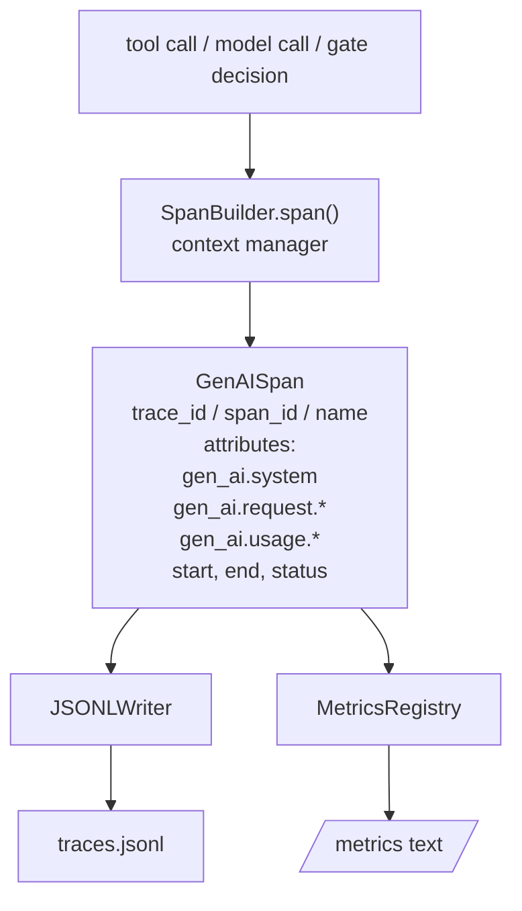
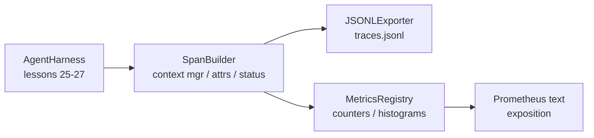

# 专题课程第28课：使用OTel GenAI Span和Prometheus指标实现可观测性

> 没有可观测性的代理(Agent)框架(harness)就是一个花钱的黑箱。本课程手动实现了一个Span构建器，它生成符合OpenTelemetry GenAI语义约定的记录，每行一个Span写入JSON-Lines文件，并以Prometheus文本格式公开计数器和直方图。全部使用Python标准库，可离线运行。

**类型：** 构建
**语言：** Python（标准库）
**前置条件：** 阶段19·25（验证门gate）、阶段19·26（沙箱sandbox）、阶段19·27（评估框架eval harness）、阶段13·20（OpenTelemetry GenAI）、阶段14·23（OTel GenAI约定）
**耗时：** 约90分钟

## 学习目标

- 构建一个符合OpenTelemetry GenAI语义约定的Span数据类。
- 实现一个每行写入一个自包含Span的JSONL导出器。
- 构建带有标签和Prometheus文本格式展示的计数器和直方图。
- 将任何可调用对象包装在一个Span上下文管理器(context manager)中，该管理器记录持续时间、状态和异常。
- 验证发出的Span能通过`json.loads`往返，并且符合规范形状。

## 问题

生产环境中的编码代理每次执行会产生三类产物：模型调用、工具执行和验证门决策。没有结构化遥测数据，这些产物都毫无用处。

第一个故障模式是缺失追踪(trace)。周二出了问题，但唯一记录是一份500行的聊天日志。没有记录哪个工具运行了，花了多长时间，提示中用了多少令牌(token)，或者门是否拒绝了某些内容。代理作者只能猜测。

第二个故障模式是无法解析的追踪。框架写了Span，但使用了自己的临时字段名。Grafana、Honeycomb、Jaeger或本地CLI中没有工具能读取它们。团队技术栈中已有的工具都浪费了，因为Span是非标准的。

第三个故障模式是未聚合的指标。你可以在追踪中看到一个慢速工具调用，但你无法回答“过去一小时内read_file调用的p95延迟是多少？”，因为没有指标，只有追踪。

OpenTelemetry GenAI语义约定正是为此而生。它们定义了一小组标准属性，各个LLM框架的Span发射器共享这些属性。如果你的框架写入这些属性，每个兼容OTel的后端都能读取它们。

## 核心概念



框架中的每个操作都会产生一个Span。一个Span包含追踪ID（整个代理调用）、Span ID（本操作）、名称（例如`gen_ai.chat`、`gen_ai.tool.execution`）、遵循GenAI约定的属性、开始和结束时间以及状态。

GenAI约定标准化了这些属性键：`gen_ai.system`（哪个提供商，例如`anthropic`、`openai`）、`gen_ai.request.model`（模型ID）、`gen_ai.request.max_tokens`、`gen_ai.usage.input_tokens`、`gen_ai.usage.output_tokens`、`gen_ai.response.model`、`gen_ai.response.id`、`gen_ai.operation.name`，以及工具特定的键`gen_ai.tool.name`和`gen_ai.tool.call.id`。

导出器写入JSONL。每行一个JSON对象。这是下游工具可以流式传输、grep和导入的最简单格式。真正的OTel导出器会使用OTLP gRPC；本课程的JSONL导出器是离线等效方案，并在每台工作站上以零退出码退出。

指标与追踪并存。每次工具调用时计数器递增：`tools_called_total{tool="read_file"}`。直方图记录观测到的延迟：`tool_latency_ms{tool="read_file"}`。两者都序列化为Prometheus文本展示格式，这是基于拉取(pull)的指标的事实标准。

```figure
trace-spans
```

## 架构



Span构建器是一个小类，包含一个`span(name, attrs)`方法，该方法返回一个上下文管理器。上下文管理器在进入时记录开始时间，退出时记录结束时间，如果抛出异常则附加异常，并将完成的Span推送到导出器。

指标注册表是两个字典。计数器是`{(name, frozen_labels): int}`。直方图将原始样本保存在列表中，并在展示时序列化为Prometheus直方图桶(bucket)。

## 你将构建什么

`main.py`附带：

1. `GenAISpan`数据类：trace_id, span_id, parent_span_id, name, attributes, start_unix_nano, end_unix_nano, status, status_message, events。
2. `GenAISpan`类，带有`SpanBuilder`上下文管理器。
3. `GenAISpan`类，带有`SpanBuilder`追加一行。
4. `GenAISpan`和`SpanBuilder`类，加上`span(name, attrs, parent=None)`。
5. `GenAISpan`生成文本格式输出。
6. `GenAISpan`装饰器，发射Span并更新指标。
7. 演示：合成一个完整的代理调用（gen_ai.chat span包裹工具spans），写入traces.jsonl，打印Prometheus展示，以零退出。

Span ID和追踪ID是由`os.urandom`生成的16字节十六进制字符串。这与OTel的W3C追踪上下文一致。导出器从不抛出异常；IO错误会被暴露，但框架继续运行。

直方图有固定的桶集（OTel默认的以毫秒为单位的延迟：5、10、25、50、100、250、500、1000、2500、5000、10000、+Inf）。样本存储为列表；展示时按需计算每个桶的计数。

## 为什么手动实现而不是使用opentelemetry-sdk

OTel Python SDK是一个真实的依赖项。它还有几千行代码、多个用于OTLP导出器的进程，以及超出课程预算的运行时成本。手动实现的版本教授了线格式(wire format)。在生产中，你将相同的属性接入真正的SDK，就能免费获得OTLP导出器、批处理和资源检测。

这些约定是稳定的。本课程发出的线格式在2030年仍能解析，因为OTel从不破坏GenAI属性名；只会添加新的。

## 这如何与追踪A的其余部分组合

第25课产生了门链(gate chain)。第26课产生了沙箱。第27课产生了评估框架。第28课使三者都可观测。第29课将端到端演示的每一步包裹在Span中，并在最后打印Prometheus文本。

## 运行它

```bash
cd phases/19-capstone-projects/28-observability-otel-traces
python3 code/main.py
python3 -m pytest code/tests/ -v
```

演示在课程的工作目录中生成一个`traces.jsonl`（结束时清理），然后打印三个Span的示例，然后打印计数器和直方图的Prometheus展示。测试验证Span可以往返序列化、规范化的GenAI属性存在、计数器正确递增，以及直方图展示包含预期的桶计数。
