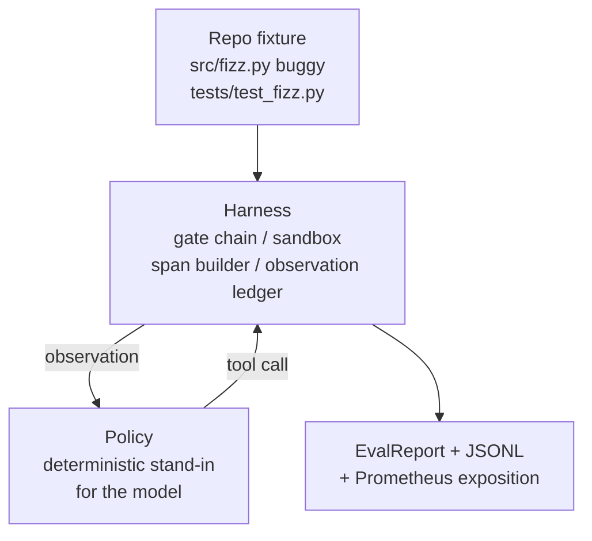
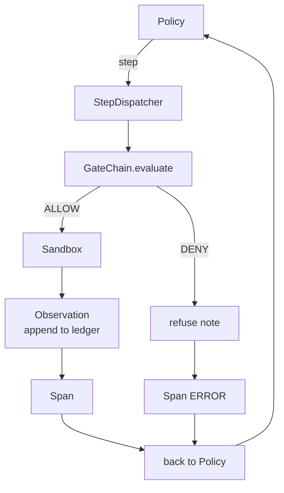

# 顶点课程第29课：在Harness上的端到端编码代理

> Track A的回报。本课将门链(gate chain)、沙箱(sandbox)、评估框架(eval harness)和OTel跨度(OTel spans)组合成一个可工作的编码代理，用于修复一个多文件Python项目中的真实（小型、夹具规模）错误。该代理是一个确定性策略(deterministic policy)，而非大语言模型(LLM)；这种替换使课程可复现，并表明整个过程中有趣的部分一直是评估框架。合约是相同的：真实的模型在策略接口处插入。

**类型：** 构建
**语言：** Python (标准库)
**先修课程：** 阶段19·25（验证门）、阶段19·26（沙箱）、阶段19·27（评估框架）、阶段19·28（可观测性）、阶段14·38（验证门）、阶段14·41（真实仓库工作台）、阶段14·42（代理工作台顶点课程）
**时间：** ~90分钟

## 学习目标

- 将门链、沙箱、评估框架和跨度生成器组合成一个单一的代理循环。
- 实现一个确定性策略，使用 read_file、run_tests 和 write_file 修复一个夹具错误。
- 在端到端运行中强制执行全局步骤预算和观察令牌预算。
- 为完整运行发出完整的OTel GenAI追踪和Prometheus指标。
- 验证代理在少于12步内解决夹具问题，且合法工具上零门触发。

## 问题

大多数代理演示都是孤立的：单独的沙箱、单独的评估框架、单独的跨度发射器。它们看起来不错。将它们组合起来，接缝就显现了。

门链说允许(ALLOW)，但沙箱因为门链未预料到的原因拒绝。评估框架记录通过，但OTel跨度说门拒绝了一个代理声称使用的工具。Prometheus计数器本应递增一次，却递增了两次。观察预算超限，但代理继续运行，因为预算是在门链中追踪的，而沙箱不知道。

本课是整个阶段的集成测试。代理必须按顺序做四件事：读取项目、运行测试、从测试失败中识别错误、编写修复、重新运行测试并停止。每个操作都通过门链。每个工具执行都通过沙箱。每一步都包装在一个跨度中。评估框架在最后对整个运行评分。

## 核心概念



代理的策略是一个状态机。五个状态。

`SURVEY`：代理读取项目列表。下一个状态是 RUN_TESTS。

`RUN_TESTS`：代理运行测试命令。如果测试通过，状态机以成功终止。否则下一个状态是 INSPECT。

`INSPECT`：代理读取失败的源文件。下一个状态是 FIX。

`FIX`：代理写入修正后的文件。下一个状态是 VERIFY。

`VERIFY`：代理再次运行测试命令。如果测试通过，成功终止。否则失败终止。

每个状态对应一个工具调用。每个工具调用通过门链。如果工具调用被拒绝，代理在追踪中报告拒绝并终止。

夹具错误是 `fizz.py` 中的一处差一错误(off-by-one)。确定性策略通过正则表达式从测试失败消息中检测到错误，并发出修正后的文件。用LLM替换策略不会改变评估框架的合约。

## 架构



本课是自包含的。每个先前课程的原始实现以最小规模在 `main.py` 中重新实现（门、沙箱、账本、跨度），以便本课无需导入同级模块即可运行。名称与第25-28课完全一致，因此概念映射无歧义。

## 你将构建什么

`main.py`附带：

1. 最小评估框架原始实现，复制时使用与第25-28课相同的名称：`GateChain`、`Sandbox`、`ObservationLedger`、`SpanBuilder`、`MetricsRegistry`。
2. `GateChain` 类：具有五个状态的状态机。
3. `GateChain` 辅助函数：准备一个包含捆绑的错误夹具的临时目录。
4. `GateChain` 类：驱动策略，通过评估框架分发，返回一个 `Sandbox`。
5. 一个捆绑的夹具 (`GateChain`)，包含 src/fizz.py、tests/test_fizz.py 和用于评估框架的 expected/ 目录树。
6. 演示：端到端运行策略，打印逐步追踪，断言通过，打印指标。

捆绑的夹具与第27课任务结构形状相同：一个错误文件和一个测试文件。测试失败消息包含足够的信息，使确定性策略能够识别修复。真正的LLM会做同样的工作，速度更慢，召回范围更广，但不会改变评估框架的期望。

## 为什么策略不是LLM

真正的LLM需要API密钥、网络调用和不可验证的随机性。评估框架是本课关心的部分。用确定性策略替换，使得本课可以在任何开发者笔记本电脑上运行，无需外部依赖，并且测试套件可以断言确切的步骤数。

本课的策略是LLM代理的严格子集。该策略读取仓库，查看失败的测试，识别代码行，并发出修复。LLM执行相同的循环，遵循相同的评估框架合约；簿记完全相同。

## 演示断言的内容

端到端演示在退出时断言五件事，测试套件以编程方式重新断言它们。

该策略在少于12步内解决了夹具问题。

观察预算从未超限。

合法工具上零门拒绝触发。（代理从未发明被拒绝的工具名称。）

每一步在 traces.jsonl 中都有对应的跨度。

Prometheus 暴露包含一个 `tools_called_total{tool="read_file"}` 条目和一个 `tool_latency_ms` 直方图。

## 这如何与追踪A的其余部分组合

本课是集成。第25课编写了门链。第26课编写了沙箱。第27课编写了评估框架。第28课编写了可观测性。第29课证明它们作为一个系统工作。一个真正的代理评估框架从这里扩展：将确定性策略替换为模型，将捆绑的夹具替换为真实仓库任务，将JSONL导出器替换为OTLP。

## 运行它

```bash
cd phases/19-capstone-projects/29-end-to-end-coding-task-demo
python3 code/main.py
python3 -m pytest code/tests/ -v
```

演示打印逐步追踪、最终评估报告和Prometheus暴露。退出码为零。测试覆盖策略状态转换、合成工具调用上的门拒绝、捆绑夹具上的端到端运行以及步骤预算不变性。
