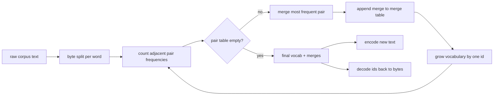
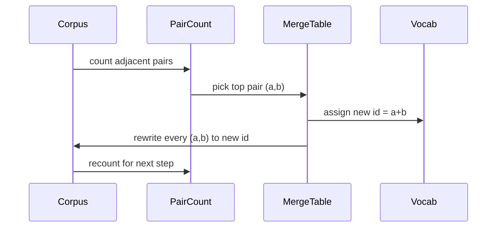

# 从零实现 BPE 分词器

> 输入字节，输出ID，ID再变回相同的字节。构建每一个现代文本模型仍从它开始的tokenizer（分词器）。

**类型:** 构建
**语言:** Python
**前提条件:** 第四阶段课程，第七阶段Transformer课程
**时间:** 约90分钟

## 学习目标
- 通过反复合并最频繁出现的相邻符号对，从原始文本语料库训练一个字节对编码（Byte-Pair Encoding, BPE）词汇表。
- 实现一个确定性合并表，并将其应用于新文本以生成子词ID流。
- 将任意UTF-8输入无损地往返转换为ID并还原。
- 保留并保护特殊标记（`<|endoftext|>`, `<|pad|>`），使其在训练和解码中不被破坏。
- 推理为什么字节级字母表是通用tokenizer（分词器）的正确基础。

## 框架

语言模型从不看到文本。它看到的是整数。从字符串到整数列表以及反向的映射就是tokenizer（分词器）。如果这一层出错，训练过程中的每一个损失曲线度量的都是错误的东西。

通用文本模型中最主要的子词tokenizer（分词器）家族是字节对编码（Byte-Pair Encoding, BPE）。这个想法很简单。从一个已知的字母表开始。找出在训练语料库中出现最频繁的相邻符号对。将其合并为一个新符号。重复直到词汇表达到目标大小。编码新文本时，使用相同的合并列表按相同顺序应用。

我们将构建字节级变体。字母表是256个原始字节，而不是Unicode码点。这一选择使得tokenizer（分词器）能够处理任何UTF-8输入，而无需回退到未知标记。

## 流水线

训练端和推理端共享合并表。这种共享就是契约。如果在推理时改变合并顺序，你将解码出不同的ID流。

## 字节字母表

前256个ID保留给原始字节0x00到0xFF。这保证了任何输入字符串在进行任何合并之前都能用当前词汇表表示。在字节块之后，我们为特殊标记保留一个小范围。训练循环永远不会将这些ID作为合并目标提出，因为我们完全将它们排除在预处理后的流之外。

预分词器（Pretokenizer）在训练看到语料库之前，按空白和标点边界分割语料库。没有这个分割，BPE合并步骤会愉快地学习跨越单词边界的合并，词汇表就会被整个常见短语填满。有了分割，合并保持在单词内部，结果更具泛化能力。

## 训练循环

对于每个训练步骤，循环做三件事。它遍历语料库中的每个单词，统计每对当前相邻符号出现的频率（按单词本身出现的频率加权）。它选出计数最高的对。它将该对的每次出现重写为一个新符号，其ID是词汇表中下一个空闲位置。然后记录这次合并。

每一步的成本与语料库（表示为符号序列列表）的大小呈线性关系。对于100万个单词和目标词汇表大小为10000个ID的情况，循环在几秒内完成，因为随着合并进行，符号序列会变短。

## 编码新文本

推理时不调用合并计数器。它按与学习时相同的顺序应用合并表。对于一个新单词，编码器从字节分割开始。它扫描当前序列，寻找排名最低的合并（最早适用的合并）。执行该合并。再次扫描。当没有表中的合并适用于当前序列时，循环结束。

按排名排序的性质使得编码是确定性的，并且与相同输入上的训练行为一致。首先学习的合并排在表的最前面，首先被应用。如果在同一位置可能应用两个合并，较低排名者胜出。

## 特殊标记

特殊标记是字节流永远无法产生的ID。我们手动保留它们。本节课需要两个就够了。

- `<|endoftext|>` 在预训练期间分隔文档。它告诉模型“新文档从这里开始，不要让前一个文档的上下文泄露进来。”
- `<|endoftext|>` 填充短序列，以便批处理可以是矩形张量。损失掩码在训练期间隐藏它。

编码器接受一个标志，允许输入中的特殊标记。如果标志关闭，字符串`<|endoftext|>`和`<|pad|>`会被当作组成它们的字节来分词。如果标志打开，这些文字字符串被映射到其保留的ID，并且不受任何合并影响。

## 往返保证

编码后解码必须精确返回输入字节。解码器按顺序连接每个ID的字节展开。由于每个ID要么是原始字节，要么是两个先前已知ID的连接，递归展开总是在原始字节处终止。解码后返回这些字节拼成的UTF-8字符串。

本节课的测试套件在一个未见过的句子上、一个包含Unicode表情符号的句子上，以及一个包含文字`<|endoftext|>`标记的句子上检查这一属性。

## 本节课不做什么

它没有构建最大生产级tokenizer（分词器）风格的基于正则表达式的预分词器。这里的预分词器是一个简单的空白和标点分割。它足以在小型训练语料库上产生合理的合并，并且与本节课链中其余部分的契约保持一致。下一节课将tokenizer（分词器）视为黑盒，并在其之上构建滑动窗口数据集。

它没有并行化对计数器。在Python中对数千个单词的语料库进行循环，在远小于一秒的时间内完成。对于更大的语料库，明显的做法是并行计算每个单词的对然后归约。

## 如何阅读代码

`main.py` 定义了四个对象。`BPETokenizer` 保存词汇表、合并表和特殊标记表。`train` 是训练循环。`encode` 是推理路径。`decode` 是字节拼接。底部的演示在一个内置语料库上训练一个小型tokenizer（分词器），编码一个保留句子，解码ID并打印两者。`code/tests/test_bpe.py` 中的测试固定了往返属性、特殊标记保留和合并顺序。

运行演示。然后将演示中的目标词汇表大小从300改为600，观察保留句子的编码长度如何下降。这条曲线就是BPE压缩曲线。
