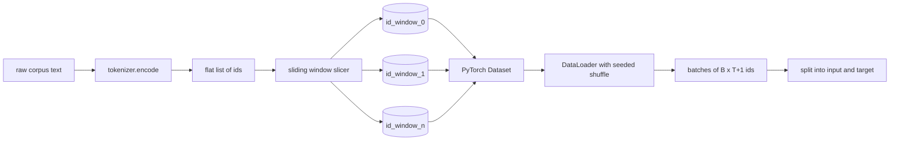
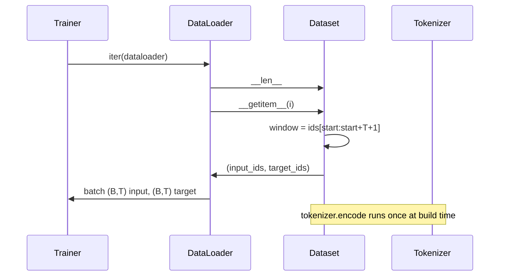

# 使用滑动窗口的分词数据集

> 预训练运行是一个从令牌ID到梯度的函数。本课程构建了将这些ID输入其中的传送带。

**类型:** 构建
**语言:** Python
**前置要求:** 阶段04课程、阶段07变换器(Transformer)课程、本阶段第30课
**时间:** 约90分钟

## 学习目标
- 通过单次调用分词器将原始语料库转换为令牌ID流。
- 将ID流切片成固定长度的窗口，并带有可配置的重叠步长。
- 构建一个PyTorch数据集(Dataset)，返回用于下一令牌预测的输入张量和目标张量。
- 将数据集包装在数据加载器(DataLoader)中，每个周期(epoch)使用确定性种子打乱。
- 权衡步长(stride)、冗余和有效数据集大小之间的取舍。

## 框架

预训练运行每次读取一批令牌ID并更新模型。每批的形状由训练协议固定。对于因果语言模型，该批包含`(B, T)`个输入ID和`(B, T)`个目标ID，其中目标是输入左移一位。数据管道的任务是从可能数GB的原始文本语料库中，以确定性和可重现的方式按需生成该协议。

本课程构建了管道。上一课的分词器将文本转换为一个长的扁平ID列表。滑动窗口将该列表切片为训练样本。自定义数据集将样本公开为张量。数据加载器将它们分批并使用已知种子打乱。

## 形状协议

因果语言模型消费形状为`(B, T)`的ID，其中`B`是批量大小(batch size)，`T`是上下文长度(context length)。位置`t`处的目标是位置`t+1`处的输入。这意味着每个训练样本覆盖`T+1`个原始ID。窗口步长(windows stride)控制连续样本之间存在多少重叠。

切片器从不越过语料库边界。如果最后一个窗口没有足够的ID来填充`T+1`个位置，切片器会丢弃它。用`<|pad|>`填充尾部也是一个有效选择，但会使损失掩码复杂化。本课程中我们选择丢弃。

## 为什么使用滑动窗口

预训练语料库是一个较长的ID流。如果模型只看到非重叠窗口，每个训练样本都会教会它相同的`T`边界。调整步长会移动这些边界，使模型看到更多样化的预测下一令牌任务。

步长为`T`时产生非重叠窗口。步长为`T // 2`时产生50%重叠，有效数据集加倍。步长为`1`时产生最大重叠，数据集增加`T`倍。代价是每个周期更多计算量。好处是更多边界多样性。大多数预训练运行使用的步长等于上下文长度，因为语料库已经远大于模型在一个周期内能完成的量，因此边界多样性论点较弱。

## 数据集类

一个PyTorch数据集有两个必需的方法。`__len__`返回样本数量。`__getitem__`返回一个样本作为一堆张量。我们的数据集存储编码后的ID流和步长。对其进行索引时实时计算窗口起始位置，因此无论步长产生多少个样本，内存成本都只有一份ID流副本。

左移一位操作在`__getitem__`内部发生。数据集返回`(input, target)`，其中`input = window[:-1]`和`target = window[1:]`。两者都是PyTorch长整型张量。训练循环将它们视为真实值(ground truth)。

## 确定性打乱

带有`shuffle=True`的数据加载器从PyTorch随机生成器读取。通过传递每个周期播种的显式`torch.Generator`，我们在每次重新启动运行时都得到相同的打乱顺序。当你想比较仅在一个超参数上不同的两次运行时，这一特性很重要。没有种子，两次运行以不同顺序看到数据，损失曲线会因与更改无关的原因而发散。

本课程中的种子协议很简单。`epoch_seed = base_seed + epoch_index`。基础种子在构造时传入。每个周期开始时训练器递增周期索引。使用相同基础种子重新运行时，在每个周期中总能看到相同的顺序。

## 批采样器

PyTorch中的默认采样器均匀随机选择索引，无放回。这正是预训练所需要的。对于小数据集的微调，协议相同。数据加载器通过调用`__getitem__` `B`次并堆叠结果来组装一个批次。因为每个样本在构造时长度相同，所以不需要填充逻辑。

为简单起见，本课程保持`num_workers=0`。在生产运行中，工作进程并行化`__getitem__`调用。对于我们的管道，这基本上是一个空操作，因为工作只是对内存中张量的切片，但相同的数据集API干净地支持工作进程。

## 计算样本数量

对于长度为`N`的ID流，上下文长度`T`，步长`S`，样本数量为`max(0, 1 + (N - (T + 1)) // S)`。本课程将该计算作为数据集上的静态方法公开，以便训练器无需迭代即可计算每个周期的总步数。

## 本节课不做什么

它不进行磁盘流式处理。语料库完全编码在内存中，并作为一个张量保存。对于几百万个ID的语料库，远小于一百兆字节，适合本课程的练习。磁盘流式处理是一个独立的问题，可以通过替换存储来插入，同时保持数据集协议。

它不处理多个文档。语料库被视为一个连续的ID流。当语料库由多个文档构建时，通过插入`<|endoftext|>`个ID来编码下一个文档边界。模型学习预测边界周围的内容。

## 如何阅读代码

`main.py`定义了两个类和一个辅助函数。`SlidingWindowDataset`是PyTorch数据集。`make_dataloader`返回一个带有种子生成器的配置好的数据加载器。`_encode_corpus_to_ids`是一次性分词器调用。底部的演示在进程中构建一个小型分词器，编码内置语料库，构造数据集和数据加载器，打印一个批次，并断言形状协议。`code/tests/test_dataset.py`中的测试固定了窗口计数公式、左移一位性质、确定性打乱和步长权衡。

运行演示。然后将上下文长度从16改为32，观察每个周期的样本数量如何下降。该数字是您每个周期的步骤预算。
