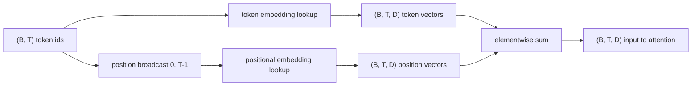
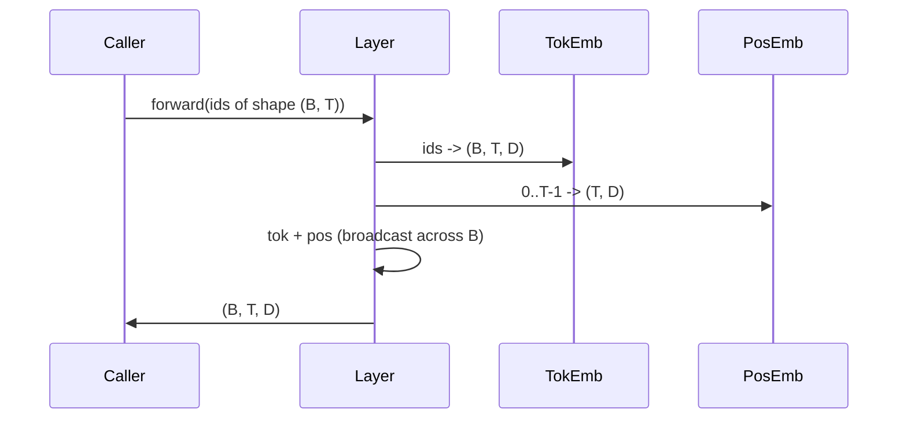

# Token和位置嵌入

> ID是整数。模型需要向量。它们之间有两个查找表，而位置嵌入的选择会影响模型能学到什么。

**类型：** 构建
**语言：** Python
**先决条件：** 阶段04课程，阶段07 transformer课程，本阶段第30和31课
**时间：** ~90分钟

## 学习目标
- 构建一个词元嵌入查找表，将词汇ID映射为稠密向量。
- 构建一个以位置为索引的可学习位置嵌入查找表。
- 构建一个以位置为索引的固定正弦位置嵌入，无参数。
- 将词元和位置嵌入组合成单个输入，供transformer块使用。
- 对比可学习和正弦嵌入在长度泛化和参数数量方面的差异。

## 框架

模型与词元ID的第一次接触是在词元嵌入矩阵中进行行查找。该矩阵每个词汇ID一行，每个模型维度一列。查找返回一个向量，模型的其余部分将其视为该ID的含义。反向传播更新在前向传播中使用过的行。在训练过程中，这些行的几何形状会学习在方向上编码相似性。

仅凭词元ID没有顺序。模型需要第二个信号来告知它位置一与位置十七不同。该信号的两个主流选择是可学习位置嵌入（第二个查找表，每个位置一行）和固定正弦位置嵌入（一个无参数的数学公式）。这个选择有后果。可学习表是一个参数，受限于模型训练时的最大上下文长度。正弦表理论上无参数，公式可扩展到任何位置，但本课的`SinusoidalPositionalEmbedding`预计算了一个固定表到`max_context_length`，其`forward`会超出该边界；因此两个模块在此都强制了最大上下文长度。即使表足够大以进行索引，模型在超过其训练长度后仍可能遇到困难。

本课构建了这两种嵌入，并将它们与词元嵌入组合成单个输入，供下一课的注意力块使用。

## 形状协议

嵌入阶段的输入是一批形状为`(B, T)`的词元ID。输出是一个形状为`(B, T, D)`的张量，其中`D`是模型维度。每个批次元素具有相同的上下文长度`T`。每个位置具有相同的向量维度`D`。



组合方式是求和，而非拼接。求和使`D`在整个网络中保持恒定，并让模型在每个特征上自行决定在每一层中词元含义或位置哪个占主导。

## 词元嵌入矩阵

词元嵌入是一个形状为`(V, D)`的参数张量，其中`V`是词汇量大小。PyTorch将其暴露为`nn.Embedding(V, D)`。初始化时，条目从小型高斯分布中抽取，传统上均值为零，标准差在Transformer规模模型约为`0.02`。确切的初始化方法不如保持多次运行间的一致性重要。

前向传播是一个简单的索引操作。PyTorch通过收集行将`(B, T)`的int64 ID映射为`(B, T, D)`的浮点数。反向传播仅累积到前向传播中触及过的行的梯度。在那一批次中从未出现的两行在该步中接收零梯度。

一个微妙的细节。词元嵌入和模型末端的输出投影经常共享权重（权重绑定）。当这种情况发生时，每个反向传播通过输出侧触及嵌入的每一行。本课将两者作为独立模块展示，但在完整模型中同一矩阵可以同时扮演两个角色。

## 可学习位置嵌入

可学习位置嵌入是第二个形状为`nn.Embedding`的`(max_context_length, D)`。查找由位置ID`0, 1, 2, ..., T-1`作为键。前向传播将该位置向量广播到批次维度上。

可学习表的缺点是无法查询位置`T`，如果模型只训练到位置`T-1`。该行不存在。使用此方案的纯解码器生产模型将最大上下文长度融入架构，并拒绝处理更长的输入。

## 正弦位置嵌入

正弦位置嵌入是一个从位置到向量的函数。位置`p`和特征`i`产生

```python
angle = p / (10000 ** (2 * (i // 2) / D))
emb[p, 2k]     = sin(angle)
emb[p, 2k + 1] = cos(angle)
```

该函数没有参数。每个位置都有一个唯一向量。波长在特征维度上几何变化，因此低维度编码粗略位置，高维度编码精细位置。

由`sin`和`cos`的选择共同产生的性质是，位置`p + k`处的向量是位置`p`处向量的线性函数。这为注意力层学习相对位置偏移提供了一条简单路径。模型不需要单独的参数来表示“向后看五个词元”。

本课在构建时一次性计算完整的正弦表，并在前向传播时对其进行索引。

## 组合

输入管道按顺序执行三件事。读取词元ID。查找词元向量。添加位置向量。返回和。



求和步骤中的广播沿着批次维度复制`(T, D)`位置张量。PyTorch自动处理，因为位置张量在unsqueeze后形状为`(1, T, D)`。

## 对比分析

本课对相同的输入运行两种变体，并打印两个诊断结果。

第一个是参数数量。可学习变体在词元嵌入基础上增加了`max_context_length * D`个参数。正弦变体增加了零个。

第二个是相邻位置嵌入之间的余弦相似度。正弦变体具有平滑且可预测的衰减，因为函数是连续的。可学习变体在初始化时具有接近随机的相似度，因为各行是独立抽取的。训练后，可学习变体通常会发展出类似的平滑结构，但它必须从数据中发现这种结构。

## 本节课不做什么

本课不构建旋转位置编码（RoPE）或AliBi。这些是现代Transformer生产模型的主流选择。它们都遵循与这里嵌入相同的形状约定（对形状为`(B, T, D)`的向量应用位置依赖变换），但应用于注意力投影步骤而非输入。下一课构建注意力块，其中一个可选扩展是在那里将旋转编码融入查询-键投影中。

本课不训练嵌入。训练需要损失，损失需要模型输出，输出需要注意力和语言模型头。那是下一课和后一课的内容。

## 如何阅读代码

`main.py` 定义了三个模块。`TokenEmbedding` 封装了 `nn.Embedding(V, D)`。`LearnedPositionalEmbedding` 封装了 `nn.Embedding(L, D)`。`SinusoidalPositionalEmbedding` 预计算表格并将其作为缓冲区暴露。`EmbeddingComposer` 将词嵌入和位置嵌入结合在一起。底部的演示打印了形状、参数数量以及相邻位置相似性诊断。`code/tests/test_embeddings.py` 中的测试确定了形状、广播行为、参数数量以及正弦波公式。

运行演示。然后将模型维度 `D` 从 64 改为 32，观察正弦波波长带如何变化。
