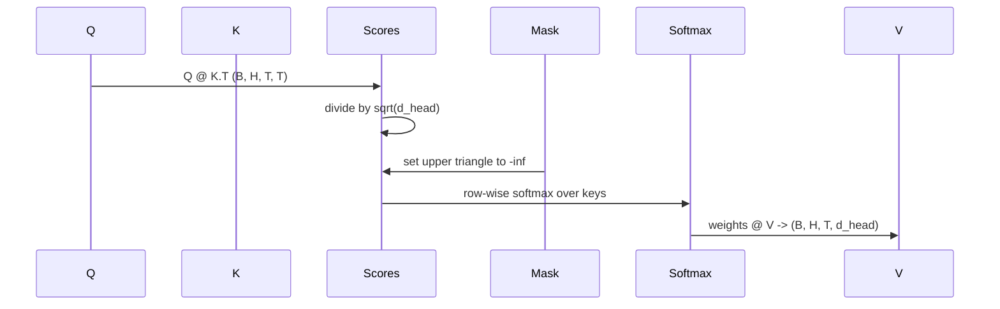

# 多头自注意力(Multi-Head Self-Attention)

> 一个线性投影，三种视角，H个并行头，一个掩码。这就是模型实际使用的注意力块。

**类型：** 构建
**语言：** Python
**前置条件：** 阶段04课程，阶段07 Transformer课程，本阶段第30至32课
**时长：** 约90分钟

## 学习目标
- 实现一个批处理的查询/键/值投影作为单个线性层，并拆分为H个头。
- 计算缩放点积注意力，并进行正确的归一化和数据类型处理。
- 应用因果掩码，防止一个位置关注未来的位置。
- 检查固定输入下每个头的注意力权重，并推理每个头关注什么。
- 在玩具任务上训练一个小型注意力块，观察损失下降，同时各个头逐渐特化。

## 框架

注意力是一种函数，它允许一个词元的表示从同一序列中的其他词元中提取信息。自注意力意味着查询、键和值都来自同一个输入。多头意味着投影被拆分为H个并行的注意力问题，其输出被拼接并投影回去。

高效的实现模式是一个线性层，从`D`投影到`3 * D`，然后切片成三个视图，再重塑为H个头，每个大小为`D // H`。矩阵乘法、softmax和加权求和以批处理张量操作进行，因此各个头在加速器上并行运行。

本节课构建该块。它还添加了因果掩码，使得相同的代码可以作为仅解码器语言模型中的注意力层工作。下一课将该块堆叠成完整的Transformer，再下一课对其进行训练。

## 形状协议

输入是`(B, T, D)`。输出是`(B, T, D)`。掩码是`(T, T)`或可广播到该形状。在块内部，中间张量的形状为`(B, H, T, d_head)`，其中`d_head = D // H`。约束条件是`D % H == 0`。

```mermaid
flowchart LR
    A["(B, T, D) input"] --> B[Linear D -> 3D]
    B --> C["split into Q, K, V"]
    C --> D["reshape to (B, H, T, d_head)"]
    D --> E["scores = Q @ K.T / sqrt(d_head)"]
    E --> F[apply causal mask]
    F --> G[softmax over keys]
    G --> H["context = weights @ V"]
    H --> I["reshape to (B, T, D)"]
    I --> J[output Linear D -> D]
    J --> K["(B, T, D) output"]
```

两个线性层（QKV投影和输出投影）是块中仅有的参数。掩码、softmax、矩阵乘法和重塑操作都没有参数。

## QKV拆分

朴素的实现有三个独立的线性层，分别用于Q、K和V。高效的实现有一个单一的层，输出`3 * D`个特征并拆分结果。两者在数学上是等价的，因为三个独立的矩阵乘法（分别乘以`(D, D)`个权重）恰好等于一个矩阵乘法（乘以由它们堆叠而成的`(3D, D)`个权重）。

高效的版本更快，因为加速器只启动一次矩阵乘法而不是三次。它也更易于初始化，因为三个子矩阵位于同一个参数张量中，可以一起初始化。

## 头的重塑

拆分后，Q、K、V每个都是`(B, T, D)`。要将其转换为H个并行的注意力问题，我们重塑为`(B, T, H, d_head)`并转置为`(B, H, T, d_head)`。现在头部维度紧邻批次维度，因此PyTorch将每个头的注意力视为跨越`B * H`个独立实例的批处理操作。

d_head维度保持在最后，因此分数矩阵乘法`Q @ K.transpose(-2, -1)`会收缩它。结果是每个头的注意力分数`(B, H, T, T)`。

## 缩放

分数在softmax之前除以`sqrt(d_head)`。如果没有这种缩放，点积会随着`d_head`的增长而增长，并将softmax推入一种状态，即一个条目几乎拥有所有权重，而其他条目则极小。在这种状态下梯度很小，学习停滞。除以`sqrt(d_head)`可以保持分数在不同头大小下的方差大致恒定。

## 因果掩码

仅解码器语言模型在预测下一个词元时只能依赖过去。掩码强制执行这一点。具体来说，在softmax之前，`(T, T)`分数矩阵中对角线上方的每个条目都被替换为负无穷。softmax之后，这些位置的权重为零。

我们在构造时将掩码注册为缓冲区，因此它位于与模型相同的设备上，并且不属于梯度图的一部分。掩码覆盖块将看到的最大上下文长度。在前向传播时，我们切取左上角的`(T, T)`部分。

## 输出投影

在每个头的上下文向量`(B, H, T, d_head)`之后，我们转置回`(B, T, H, d_head)`，重塑为`(B, T, D)`，并应用最后一个`(D, D)`线性投影。输出投影允许模型混合各个头。如果没有它，H个头只能通过后续层重新组合，块会受到人为限制。

## 注意力权重检查

本课程在前向传播中暴露了一个`return_weights=True`标志。当设置时，块返回形状为`(B, H, T, T)`的每个头的注意力权重以及输出。演示在短输入上打印一个头权重的热力图，以便您可以看到因果三角形结构和每个位置的关注点。

在训练好的模型中，不同的头学习不同的模式。有些头关注紧挨着的前一个词元。有些头关注序列的开始。有些头几乎均匀地分布注意力。检查钩子是这项可解释性工作的入口点。

## 训练演示

在`main.py`底部的演示将注意力块连接到一个微小的LM头，并在重复任务上训练整个模型。输入的每一行是单个随机ID，在上下文中重复。目标是输入向右偏移一个位置，因此模型必须学习下一个词元与前一个词元相同。损失函数是交叉熵。使用H=4，D=32，T=12，词汇表大小为64，损失从随机水平（约`log(64) ~ 4.16`）下降到远低于`1.0`，在CPU上训练三个代。

演示的目的不是训练一个有用的模型。目的是确认梯度流过块的每一个部分，并且各个头在一个答案显而易见的问题上学到了一些东西。

## 本节课不做什么

它没有添加前馈块。真实模型中的Transformer层是注意力后跟一个两层MLP，每个周围有残差连接和层归一化。下一课会添加这些。

它没有实现旋转位置编码或AliBi位置编码。两者都在同一个块的QKV投影步骤中应用，但它们是一个独立的教学单元。这里构建的块与两者都兼容，只需在矩阵乘法之前转换Q和K。

它没有实现用于推理的KV缓存。跨前向传播缓存键和值是使自回归解码快速的优化。它改变了K和V张量的形状约定，但不改变Q的形状。这属于推理课程的内容。

## 如何阅读代码

`main.py`定义了`MultiHeadSelfAttention`。该类包含两个线性层和一个注册的掩码缓冲区。前向传播进行投影、重塑、评分、掩码、softmax、加权、重塑和再次投影。底部的演示构建了一个小型模型，该模型使用词元和位置嵌入以及LM头包裹注意力，在复制任务上训练三个代，并打印损失曲线和每个头的注意力热力图。`code/tests/test_attention.py`中的测试确定了形状约定、因果性、softmax属性、头拆分属性和梯度流动。

先运行演示。然后将`n_heads`从4增加到8（保持`d_model=32`不变，所以`d_head=4`），并观察热力图的变化。
