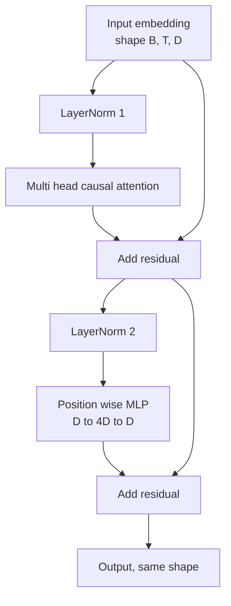
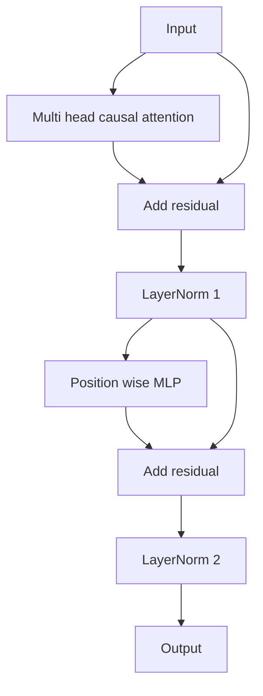

# 从头构建Transformer块

> 每个现代解码器大语言模型的基本单元就是一个块。层归一化（LayerNorm）、多头注意力、残差连接、MLP、残差连接。预层归一化（pre-LN）变体无需预热即可稳定训练。后层归一化（post-LN）变体是原始论文中使用的版本。本课将并排构建这两种变体，并展示在常见的12层堆叠和学习率下，哪个变体能稳定运行。

**类型：** 构建
**语言：** Python
**前置条件：** 第19阶段第30至33课（分词器、嵌入、注意力机制数学、批量数据加载器）
**时间：** 约90分钟

## 学习目标

- 用PyTorch从四个组成部分构建一个Transformer块：层归一化（LayerNorm）、多头因果注意力、残差连接、位置逐点MLP。
- 将层归一化置于两种配置中（预LN和后LN），并解释为何一种无需预热即可稳定训练。
- 在多头注意力内部实现因果掩码，使得令牌 `i` 无法看到令牌 `j > i`。
- 在12层堆叠上追踪两种变体的梯度流，并给出不含糊的结果解读。
- 当下一课组装一个1.24亿参数的GPT时，该块可直接作为可插拔单元复用。

## 问题

Transformer就是一个块重复多次。一旦块做错一次，重复十二次，你发布的模型就会在第一个epoch发散，或者之后都需要预热技巧。本课中你将看到的两种失败模式并不罕见。它们会在学习者首次天真地堆叠块时出现。一种是注意力层关注了未来；另一种是层归一化放置的位置无法抑制深度残差信号。

一旦你看穿，修复方法就是机械式的。该块恰好有两条残差路径和两个归一化位置。正确选择位置后，堆叠的其余部分就只是记账工作。

## 核心概念

每个仅解码器Transformer块都是一个函数，它接收形状为 `(batch, sequence, embedding)` 的张量，并返回相同形状的张量。内部有两个子层完成工作。



这是预层归一化（pre-LN）变体。层归一化位于残差分支内部，子层之前。残差连接将未归一化的信号向前传递。

后层归一化（post-LN）变体将层归一化移动到残差相加之后。



形状完全相同，但训练行为不同。使用post-LN时，通过残差路径反向传播的梯度必须经过层归一化。在12层深度且学习率为 `3e-4` 时，该梯度会迅速缩小，从而需要预热调度。pre-LN让残差路径保持未归一化，因此梯度可以干净地传播到嵌入层。正因如此，GPT-2及之后的版本都采用pre-LN配置。

### 因果多头注意力

注意力子层将输入投影为三个张量：查询、键、值。每个张量从 `(B, T, D)` 重塑为 `(B, H, T, D/H)`，其中 `H` 是头数。缩放点积注意力对每个头计算 `softmax(Q K^T / sqrt(d_k))`，将上三角掩码设为负无穷，通过softmax应用掩码，然后乘以 `V`。各头拼接回单个 `(B, T, D)` 张量并再次投影。掩码是使模型具备因果性的唯一部分。忘记掩码，你训练出的模型就会作弊。

### MLP

位置逐点MLP对每个令牌独立应用相同的两层网络。隐藏宽度是嵌入宽度的四倍，激活函数为GELU，第二个线性层后跟一个dropout。在MLP内部，令牌之间没有交流。所有令牌混合都发生在注意力层。

### 残差连接的两个作用

它们使梯度路径在深度上具有加性，从而在12层中保持梯度范数稳定。同时，它们让每个块学习对当前表示的加性更新，而非完全替换。这两种效应正是块可扩展的原因。

## 动手构建

`code/main.py` 实现：

- `class LayerNorm` 带有可学习的缩放和偏移，有偏epsilon，按令牌向量应用。
- `class LayerNorm` 带有 `class MultiHeadAttention`、`num_heads`、融合的QKV投影、注册的因果掩码、注意力dropout和残差dropout。
- `class LayerNorm` 带有两个线性层、GELU激活、dropout。
- `class LayerNorm` 带有一个 `class MultiHeadAttention` 标志，用于在两个变体之间切换。
- 一个演示程序，构建一个6层pre-LN栈和一个6层post-LN栈，输入相同，并打印 (a) 输出形状，(b) 一次反向传播后嵌入层的梯度范数。

运行它：

```bash
python3 code/main.py
```

输出：两个栈的形状检查，梯度范数并排显示。在同学习率下，pre-LN栈的嵌入梯度比post-LN栈大一个数量级，这是pre-LN无需预热即可训练的实证信号。

## 技术栈

- `torch` 用于张量数学、自动求导和 `nn.Module` 管道。
- 没有 `torch`，没有预训练权重。该块从基本操作实现。

## 实际中的生产模式

三种模式将教科书中的块转化为可部署的成品。

**融合的QKV投影。** 三个独立的线性层需要三次内核启动和三次矩阵乘法。一个宽度为 `3 * d_model` 的线性层在一次启动中完成相同工作，然后沿最后一维分割输出。融合路径在所有加速器上更快，并且与GPT-2、LLaMA和Mistral的参考实现一致。

**注册的因果掩码缓冲区。** 掩码仅取决于最大上下文长度。在构造时用 `register_buffer` 分配一次，每次前向传播中切片活动窗口，避免每次调用的分配。忽略这点会在长上下文时使掩码成为分配热点。

**Dropout放在两个位置，而非三个。** Dropout应放在注意力softmax之后（注意力dropout）和MLP的第二个线性层之后（残差dropout）。对残差本身做dropout会破坏让梯度在深度流动的加性恒等性。一些早期实现搞错了这一点，导致训练不稳定。

## 使用它

- 本课中的块可以直接插入第35课的GPT组装中，无需修改。
- 预层归一化变体是所有现代开源权重大语言模型使用的版本。后层归一化变体是2017年原始注意力论文使用的版本。了解两者足以读懂你遇到的任何解码器架构。
- 将GELU替换为SiLU，你就得到了LLaMA家族的激活函数。将层归一化替换为RMSNorm，你就得到了LLaMA家族的归一化。相同的骨架。

## 练习

1. 向块中的每个线性层添加一个 `bias=False` 标志。现代开源权重的大语言模型在线性层中不使用偏置。测量在一个12层768维模型中你节省了多少参数。
2. 将 `bias=False` 替换为手工实现的RMSNorm，并验证输出形状不变。
3. 添加一个标志，将第一个头的注意力权重作为 `bias=False` 张量返回。绘制上三角以确认softmax后为零。
4. 构建一个合理性检查，向两个变体输入形状为 `bias=False` 且值为 `nn.LayerNorm` 的张量，断言在权重初始化相同且dropout设为0时，前向输出不同（例如 `(B, T, T)`）。

## 关键术语

|  术语  |  人们的说法  |  实际含义  |
|------|-----------------|------------------------|
|  Pre-LN  |  "预归一化"  |  层归一化位于残差分支内部、每个子层之前；残差携带未归一化信号  |
|  Post-LN  |  "后归一化"  |  层归一化在残差相加之后；2017年论文使用的版本，需要预热  |
|  因果掩码  |  "三角掩码"  |  注意力logits的上三角设为负无穷，使得令牌i无法读到令牌j当j大于i时  |
|  融合QKV  |  "合并投影"  |  一个宽度为3D的线性层代替三个宽度为D的线性层；一次内核，一次矩阵乘法  |
|  残差流  |  "跳跃连接"  |  从上到下流过每个块的未归一化张量；每个块向其添加的东西  |

## 延伸阅读

- 第7阶段第02课（从头实现自注意力）了解此模块下方的注意力数学。
- 第7阶段第05课（完整Transformer）了解同一骨架的编码器-解码器版本。
- 第10阶段第04课（预训练迷你GPT）了解此模块所插入的训练过程。
- 第19阶段第35课（本路线）将其中十二个模块堆叠成GPT模型。
