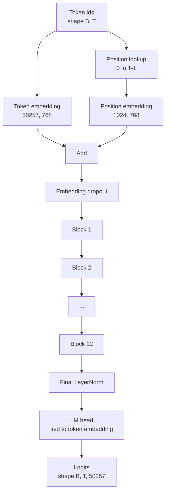
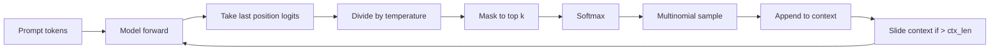

# GPT 模型组装

> 堆叠十二个块、一个令牌嵌入、一个学习到的位置嵌入、一个最终LayerNorm和一个共享权重的语言模型头。这就是完整的1.24亿参数GPT模型。本课将这些组件组装成一个可运行的类，统计参数以确认模型与参考的124M形状匹配，并通过多项式采样、温度和top-k生成文本。

**类型：** 构建
**语言：** Python
**前置条件：** 阶段19第30到34课
**时间：** ~90分钟

## 学习目标

- 将第34课中的Transformer块组装成完整的GPT模型：令牌嵌入、位置嵌入、N个块、最终LayerNorm、语言模型头。
- 重现1.24亿参数配置：词表大小50257，上下文长度1024，嵌入维度768，12个注意力头，12层。
- 将语言模型头的权重与令牌嵌入绑定，并解释在此规模下为何能节省约3800万参数。
- 从提示词通过多项式采样、温度缩放和top-k截断生成文本，使用滑动窗口保持上下文长度。
- 测量参数数量和前向传播成本，与124M目标对比。

## 问题

Transformer块本身什么都不做。你需要将令牌ID转换为向量，混入位置信息，通过堆栈运行它们，并投影回词表logits。忘记这四个步骤中的任何一个，模型要么无法前向传播，要么位置信息漂移，要么无法生成语言。

模型的形状也很重要。参考的GPT-2 small恰好有1.24亿参数，配置如上。这些数字并非魔法。词表大小50257乘以嵌入维度768是令牌表。位置长度1024乘以768是位置表。十二个块每个大约700万参数，总计8400万。最终头通过权重绑定重用令牌表。把这些加起来，正好是1.24亿。构建一个参数数量与参考值不匹配的模型，说明你可能在某个地方接错了线。

## 核心概念



令牌ID变成令牌向量。位置ID变成位置向量。两者相加后送入堆栈。最终LayerNorm是唯一在块外且被所有现代变体保留的组件。LM头重用令牌嵌入矩阵，这就是权重绑定的含义。

### 权重绑定

令牌嵌入的形状是`(vocab, d_model)`。语言模型头需要从`d_model`投影回`vocab`。两者互为转置。绑定意味着完全相同的参数张量，使用两次。当词表大小为50257，d_model为768时，该矩阵有3800万参数。如果不绑定，你需支付两份。绑定后，你只需支付一份，而且由于嵌入和头一起更新，梯度信号也会稍微更干净。

### 位置嵌入是学习到的，不是正弦的

GPT-2使用学习到的位置嵌入。位置表是一个形状为`(1024, 768)`的参数张量。模型在每次前向时查找位置0到T-1，并将查找结果加到令牌嵌入上。这是最简单的位置方案（RoPE、ALiBi、T5相对偏置是替代方案），也是124M参考使用的方案。

### 生成：温度、top-k、多项式采样

生成是自回归的。每一步，模型返回整个词表在每个位置上的logits。你只取最后一个位置，除以温度，可选地将除top-k以外的所有logits屏蔽为负无穷，softmax得到概率，然后从所得分布中采样一个令牌。



三个旋钮，三种不同的行为。温度接近零时退化为贪婪。温度为1时匹配模型的自然分布。top-k为1时是贪婪的。top-k为40时过滤长尾。这些组合很重要；下一节关于训练的课程将把生成用作定性评估信号。

## 动手构建

`code/main.py` 实现：

- `class GPTConfig`数据类，包含124M默认值：`vocab_size=50257`，`context_length=1024`，`d_model=768`，`num_heads=12`，`num_layers=12`，`mlp_expansion=4`，`dropout=0.1`，`use_bias=True`，`weight_tying=True`。
- `class GPTConfig`包含令牌嵌入、位置嵌入、嵌入dropout、十二个`vocab_size=50257`、最终LayerNorm，以及一个在标志设置时与令牌嵌入绑定的`context_length=1024`。
- 一个`class GPTConfig`辅助函数，返回唯一的参数数量（这样权重绑定在计数中得以体现）。
- 一个`class GPTConfig`函数，执行温度、top-k、多项式采样和滑动窗口上下文。
- 一个演示，构建模型，打印参数数量并与参考的124M对比，从固定提示词生成短序列以展示端到端流程。

运行它：

```bash
python3 code/main.py
```

输出：参数数量与124M参考值并列，从随机提示词生成的令牌ID，以及当绑定开启时LM头和令牌嵌入共享存储的确认。

为了保持演示速度，脚本还运行一个小型配置（`d_model=64`，`num_layers=2`）端到端，并内嵌打印生成的令牌序列。124M配置被构建，但仅对其参数数量和一次前向传播进行测试。

## 技术栈

- `torch`用于张量运算、自动求导和模块管道。
- `torch`在本地重实现了第34课中的相同块模式。

## 实际中的生产模式

三种模式决定了模型是能运行还是能发布。

**将残差投影初始化为小值。**注意力的输出投影和MLP的第二个线性层都直接馈入残差加法。如果使用与其他线性层相同的标准差初始化它们，残差流会随着深度增长，将最终LayerNorm推入热区。对于这两个投影，将标准差按`1 / sqrt(2 * num_layers)`缩放；残差流会在十二层中保持在合理范围。

**缓存位置ID张量，不要重新计算。**`torch.arange(T)`每次前向都会分配新内存。在`__init__`中为最大上下文一次性分配，每次调用时切片前T个条目，避免分配器的往返。

**在参数级别绑定权重，而不仅仅是复制。**设置`lm_head.weight = token_embedding.weight`共享张量；复制则不会。优化器需要更新一个参数，自动求导图需要一个累积。如果复制，头会偏离嵌入，权重绑定毫无意义。

## 使用它

- 本课中的模型类与下一课训练的模型形状相同。
- 将学习到的位置嵌入替换为RoPE，即可得到LLaMA系列，无需改动块或头。
- 将GELU替换为SiLU，LayerNorm替换为RMSNorm，即可得到LLaMA系列的其余变化。
- 生成函数适用于任何logits来源，不仅限于此模型。你可以在第37课中从预训练的GPT-2文件中提取logits，并重用相同的生成循环。

## 练习

1. 解除LM头与令牌嵌入的绑定，重新计算参数。验证差值为50257乘以768等于3800万。
2. 将学习到的位置嵌入替换为在构造时计算的正弦表。确认模型仍能前向传播，且参数数量减少786,432。
3. 在生成中添加一个`greedy=True`标志，跳过采样并使用argmax。确认序列在多次运行中是确定性的。
4. 添加一个`greedy=True`旋钮，在softmax之前将提示词或生成历史中任何令牌的logit除以一个常数。在固定提示词上展示，大于1的值会减少输出中的重复次数。
5. 在`repetition_penalty`旁边添加`greedy=True`（核）采样。两行代码检查保留令牌的概率和是否超过`top_p`。

## 关键术语

|  术语  |  人们的说法  |  实际含义  |
|------|-----------------|------------------------|
|  权重绑定  |  "绑定嵌入"  |  LM头和令牌嵌入共享相同的参数张量；节省词表大小乘以d_model参数，与GPT-2参考一致  |
|  位置嵌入  |  "学习到的位置"  |  一个形状为(上下文长度, d_model)的单独表格，加到令牌向量上；端到端学习  |
|  滑动窗口上下文  |  "上下文上限"  |  当提示词加生成令牌超过上下文长度时，丢弃最早的令牌，使活动窗口适合  |
|  Top-k采样  |  "K截断"  |  保留K个最高值的logits，将其余屏蔽为负无穷，对剩余部分进行softmax  |
|  温度  |  "采样温度"  |  在softmax前将logits除以T；T小于1时锐化，T等于1时保持自然分布，T大于1时变平缓  |

## 延伸阅读

-  阶段19第34课，了解本模型堆叠的块。
- 阶段19第36课，了解使用交叉熵损失驱动本模型的训练循环。
- 阶段19第37课，了解将预训练GPT-2权重大致加载到此架构中。
- 阶段7第7课（GPT因果语言建模），了解下一个令牌预测的数学。
- 阶段10第4课（预训练迷你GPT），了解同一架构上的原始训练过程。
