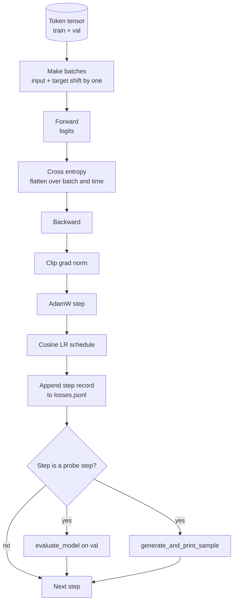

# 训练循环与评估

> 没有度量的循环就是虚假的循环。本节课构建驱动GPT模型的训练循环：包含权重衰减拆分的AdamW优化器、预热加余弦学习率调度、一个`calc_loss_batch`辅助函数、在保留数据集上进行`evaluate_model`评估、每K步进行一次`generate_and_print_sample`定性探测，以及一个可以绘图的可损失JSONL日志。同样的框架可以训练你未来构建的任何解码器LLM。

**类型：** 构建
**语言：** Python
**前置条件：** 阶段19的第30至35课
**时间：** ~90分钟

## 学习目标

- 构建一个训练循环，为下一个词元预测正确计算输入和目标对齐的交叉熵损失。
- 配置AdamW优化器，对权重张量应用权重衰减，不对LayerNorm或偏置张量应用。
- 实现一个具有线性预热和余弦衰减的学习率调度，并随时间读取生成的LR。
- 使用`evaluate_model`在保留数据集上评估，使评估损失在不同运行间可比较。
- 每K步使用`evaluate_model`生成定性样本，以便在损失曲线之前捕捉发散。
- 将每一步的损失持久化到JSONL中，以便重新加载、绘图，并将训练日志作为可交付产品传输。

## 问题

一个只打印损失而不做其他事情的训练脚本在三个方面失败。它无法告诉你损失是否因正确原因下降（模型可能过拟合训练集而从未学习）。它无法告诉你发散是否开始（损失可能一步骤尖峰后又恢复，或一步骤尖峰后崩溃）。它无法告诉你模型学到了什么（损失是一个标量；生成的样本是一个段落）。除非循环进行度量，否则所有三个失败都隐藏。

本节课中的循环以三种方式进行度量。每步在训练批次上的损失。每K步在保留批次上的损失。每K步从固定提示生成的延续。训练日志以JSONL形式保存，因此产物是循环的证词。

## 核心概念



两个不明显的部分是对齐损失和AdamW衰减拆分。

### 损失对齐

模型在每个位置预测下一个词元。如果输入批次是词元`[t0, t1, t2, t3]`，那么目标批次必须是`[t1, t2, t3, t4]`。交叉熵是在平坦形状`(batch * seq, vocab)`与平坦目标`(batch * seq,)`上计算的。忘记偏移就会训练模型预测自身，这会导致损失收敛到零，但学不到任何有用的东西。

### AdamW衰减拆分

权重衰减正则化权重张量，但不正则化归一化尺度或偏置。对LayerNorm尺度施加衰减会逐渐将尺度趋向于零并破坏归一化。对偏置施加衰减在数学上无害，但浪费计算周期。标准拆分是：矩阵形状的张量（线性权重、嵌入表）应用衰减，而看起来像尺度或偏移的张量则不应用。

### 预热加余弦调度

预热在几百步内将学习率从零提升到目标值，使优化器状态有时间填充。余弦衰减在剩余步骤中将学习率降回零，使最终阶段以小步长微调权重。这种组合是开源权重LLM训练中最常见的调度，因为它消除了前一千步和后一千步中的大多数脆弱时刻。

### 保留数据集评估

`evaluate_model`从验证集中运行固定数量的批次，累积损失，除以批次数量，然后返回。无梯度。无丢弃。在相同种子和相同拆分下，该数值在不同运行间可重现。在训练损失旁边报告保留损失是发现过拟合的方法。

### 作为早期信号的定性采样

一个训练损失下降良好但生成样本都是相同词元的模型是损坏的。一个损失曲线看似平坦但生成样本逐渐变成连贯单词的模型正在学习。定性探测比读取完整曲线更快，并能捕捉标量遗漏的模式。

## 动手构建

`code/main.py` 实现：

- `make_batches(token_ids, batch_size, context_length)`将长词元张量切片为输入和目标对。
- `make_batches(token_ids, batch_size, context_length)`前向传播、展平并返回标量交叉熵。
- `make_batches(token_ids, batch_size, context_length)`无梯度迭代固定数量的验证批次并返回平均损失。
- `make_batches(token_ids, batch_size, context_length)`在固定提示上运行第35课的生成函数并打印结果。
- `make_batches(token_ids, batch_size, context_length)`生成两个分组的AdamW参数列表。
- `make_batches(token_ids, batch_size, context_length)`返回给定步骤的LR。
- `make_batches(token_ids, batch_size, context_length)`运行循环，持久化`calc_loss_batch(model, inputs, targets)`，并每`evaluate_model(model, val_loader, max_batches)`步打印评估损失和样本。
- 一个演示，在CPU上使用少量步骤在合成数据上训练小模型，写入JSONL日志，并在探测点打印评估损失和样本。演示在一分钟内在CPU上完成。

运行它：

```bash
python3 code/main.py
```

输出：每步损失行，每个探测步的评估损失，每个探测步的生成样本，以及一个可用`outputs/losses.jsonl`逐行加载的最终`json.loads`。

## 技术栈

- `torch`用于自动梯度、优化器和模块。
- `torch`在本地重新实现了第35课的`main.py`和支持模块。

## 实际中的生产模式

三种模式将教科书式的循环转变为可以整夜运行的东西。

**梯度范数裁剪是不可或缺的。** 一个坏批次（异常数据、LR尖峰、数值边缘情况）会产生巨大的梯度，摧毁数小时的训练。在`backward`之后、`step`之前执行`torch.nn.utils.clip_grad_norm_(params, max_norm=1.0)`使优化器保持在安全范围内。裁剪值是一个自由参数；1是默认值，适用于大多数设置。

**可恢复的JSONL日志记录，而非pickled状态。** 每步损失记录为JSONL中的`{"step": int, "train_loss": float, "lr": float}`行是持久的：任何崩溃都会留下可读的产物，可以grep，可以用三十行Python绘图，并且可以通过读取最后一步来恢复训练。Pickled状态使你依赖于产生该文件的确切模块布局，这在重构时很脆弱。

**从固定切片中抽取的评估批次。** 验证词元在脚本启动时被切片成批次，而不是即时进行。可重现性取决于评估批次在不同运行间是否相同；否则比较两次运行的评估损失会同时度量批次洗牌和模型。

## 使用它

- 本节课中的循环是训练124M模型在真实数据上的相同框架。将合成词元张量替换为`datasets`风格的加载器，循环即可直接运行。
- JSONL日志是将训练运行转化为证据的可交付产品。下一课将使用它来比较新训练的检查点和预训练的检查点。
- 定性样本探测是标量损失无法替代的全面检查。

## 练习

1. 添加`weight_decay_groups()`单元测试，确认尺度和偏置参数落在无衰减组，线性和嵌入权重落在衰减组。
2. 将合成随机词元替换为来自小型文本文件的字节，使演示在可读内容上训练。验证生成的样本使用了文件中存在的字符。
3. 在余弦调度中添加`weight_decay_groups()`的10%的`min_lr`下限并重新绘图。
4. 除JSONL日志外，每`weight_decay_groups()`步保存一个检查点。添加一个`min_lr`标志以重新加载模型状态和优化器状态。
5. 在损失旁边记录每步吞吐量（每秒词元数），并确认其保持在稳定范围内。

## 关键术语

|  术语  |  人们的说法  |  实际含义  |
|------|-----------------|------------------------|
| 损失对齐  |  "Shift by one"  |  输入词元在位置0..T-1，目标词元在位置1..T；交叉熵在展平形状上计算 |
| 衰减拆分  |  "Two groups"  |  AdamW对矩阵形状张量应用权重衰减，对尺度或偏置张量不应用 |
| 预热  |  "Ramp"  |  学习率在固定步数内从零上升到目标值，使优化器状态可以填充 |
| 评估批次  |  "Held out batches"  |  验证词元张量的固定切片，在脚本启动时切片一次，每个探测时相同使用 |
| 定性探测(qualitative probe)  |  "样本打印(sample print)"  |  从固定提示(prompt)每K步生成一个简短输出，以捕捉损失(loss)单独隐藏的失败模式(failure modes)  |

## 延伸阅读

- 阶段19第35课：模型的循环驱动(loop drives)。
- 阶段19第37课：将预训练权重(pretrained weights)加载到同一模型。
- 阶段10第04课（预训练迷你GPT）：关于真实数据(real data)的处理过程。
- 阶段10第10课（评估）：关于交叉熵损失(cross entropy loss)之外的更广泛评估表面(eval surface)。
