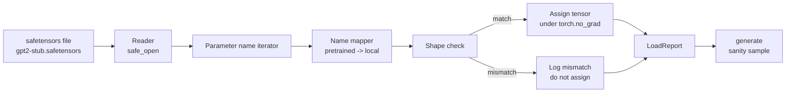

# 加载预训练权重

> 从头训练一个1.24亿参数的模型是一项预算决策；加载一个已发布的检查点则是周二的工作。本节课从一个safetensors文件加载预训练的GPT-2风格权重到第35课的精确架构中，逐条讲解参数名称映射，并通过生成一段续写来证明加载成功。无网络、无第三方加载器、无黑魔法。

**类型：** Build
**语言：** Python
**前置条件：** 第19阶段第30至36课
**时间：** 约90分钟

## 学习目标

- 使用`safetensors` Python库读取safetensors文件，并检查张量名称和形状。
- 将每个预训练参数名称映射到第35课GPT模型中的参数。
- 处理已发布的GPT-2权重与本track模型之间不同的两种命名约定：`safetensors`和`wte/wpe/h.N.attn.c_attn/c_proj`与本地命名的`mlp.c_fc/c_proj`和`tok_embed/pos_embed/blocks.N.attn.qkv/out_proj`。
- 在任何权重赋值之前检测并拒绝形状不匹配的情况，并给出清晰错误信息。
- 使用加载的权重生成一段短续写，确认token来自已加载的分布，而非随机初始化的分布。

## 问题

已发布的权重并非为你的架构打包。它们带有原始实现所使用的名称。预训练文件包含形状为`(2304, 768)`的`transformer.h.0.attn.c_attn.weight`；你的模型期望形状为`(2304, 768)`的`blocks.0.attn.qkv.weight`（这是按不同布局约定的相同矩阵），或者你的模型使用`nn.Linear`，它以转置形式存储矩阵。同一个参数以三种微妙不同的身份（名称、形状、字节布局）出现，加载器必须协调这三者。

盲目复制的加载器会把正确的张量放到错误的位置，导致模型生成无意义的内容。拒绝复制但形状不匹配且不记录任何信息的加载器会让你猜测哪个张量加载失败。本节课中的加载器是显式的：每次赋值都有日志，每个形状都经过检查，并且`LoadReport`总结命中、未命中以及形状不匹配的情况，以便你了解发生了什么。

## 核心概念



名称映射器只是一个从字符串到字符串的函数。形状检查是一条if语句。赋值在`torch.no_grad()`内进行，因此autograd不会跟踪加载。报告包含每个名称的结果。

### GPT-2命名约定

已发布的GPT-2权重名称类似：

|  预训练名称  |  形状  |  含义  |
|-----------------|-------|---------|
|  `wte.weight`  |  (50257, 768)  |  Token嵌入  |
|  `wpe.weight`  |  (1024, 768)  |  位置嵌入  |
|  `h.N.ln_1.weight`  |  (768,)  |  块N的LayerNorm 1缩放  |
|  `h.N.ln_1.bias`  |  (768,)  |  块N的LayerNorm 1偏移  |
|  `h.N.attn.c_attn.weight`  |  (768, 2304)  |  融合QKV线性权重  |
|  `h.N.attn.c_attn.bias`  |  (2304,)  |  融合QKV线性偏置  |
|  `h.N.attn.c_proj.weight`  |  (768, 768)  |  注意力输出投影  |
|  `h.N.attn.c_proj.bias`  |  (768,)  |  注意力输出投影偏置  |
|  `h.N.ln_2.weight`  |  (768,)  |  LayerNorm 2缩放  |
|  `h.N.ln_2.bias`  |  (768,)  |  LayerNorm 2偏移  |
|  `h.N.mlp.c_fc.weight`  |  (768, 3072)  |  MLP fc1权重  |
|  `h.N.mlp.c_fc.bias`  |  (3072,)  |  MLP fc1偏置  |
|  `h.N.mlp.c_proj.weight`  |  (3072, 768)  |  MLP fc2权重  |
|  `h.N.mlp.c_proj.bias`  |  (768,)  |  MLP fc2偏置  |
|  `ln_f.weight`  |  (768,)  |  最终LayerNorm缩放  |
|  `ln_f.bias`  |  (768,)  |  最终LayerNorm偏移  |

有两个意外需要应对。`c_attn`、`c_proj`、`c_fc`线性层存储的矩阵相对于`nn.Linear.weight`所期望的是转置的。加载器在赋值时进行转置。LM头根本不在文件中；模型依赖于与`wte`的权重绑定，因此一旦`wte`加载成功，头通过别名设置。

### 本地命名约定

本track中的模型使用描述性名称：

|  本地名称  |  含义  |
|------------|---------|
|  `tok_embed.weight`  |  Token嵌入  |
|  `pos_embed.weight`  |  位置嵌入  |
|  `blocks.N.ln1.scale`  |  第N个块的LayerNorm 1缩放  |
|  `blocks.N.ln1.shift`  |  LayerNorm 1偏移  |
|  `blocks.N.attn.qkv.weight`  |  融合QKV  |
|  `blocks.N.attn.qkv.bias`  |  融合QKV偏置  |
|  `blocks.N.attn.out_proj.weight`  |  注意力输出投影  |
|  `blocks.N.attn.out_proj.bias`  |  输出投影偏置  |
|  `blocks.N.ln2.scale`  |  LayerNorm 2缩放  |
|  `blocks.N.ln2.shift`  |  LayerNorm 2偏移  |
|  `blocks.N.mlp.fc1.weight`  |  MLP全连接层1  |
|  `blocks.N.mlp.fc1.bias`  |  MLP全连接层1偏置  |
|  `blocks.N.mlp.fc2.weight`  |  MLP全连接层2  |
|  `blocks.N.mlp.fc2.bias`  |  MLP全连接层2偏置  |
|  `final_ln.scale`  |  最终LayerNorm缩放  |
|  `final_ln.shift`  |  最终LayerNorm偏移  |

映射是一个固定函数。本课将其作为加载器迭代的字典提供。

### 存根测试夹具

真实的GPT-2权重为0.5 GB。演示不会下载它们；而是在首次运行时生成一个小的safetensors测试夹具，具有精确的GPT-2命名约定和适合12块模型、d_model为192而不是768的形状。该夹具具有正确的结构，可以测试加载器中的每条代码路径。将夹具替换为真实文件，加载器无需修改即可工作。

## 动手构建

`code/main.py` 实现：

- 第35课的一个小型副本`GPTModel`，因此本课是自包含的。
- `GPTModel`它扩展了每层的条目。
- `GPTModel`它迭代名称，映射它们，检查形状，转置conv1d风格的权重，并在`make_pretrained_to_local(num_layers)`下分配。返回一个`load_safetensors(model, path)`。
- `GPTModel`生成一个具有精确预训练命名约定的测试夹具文件。
- 一个演示，在首次运行时创建`GPTModel`，构建一个新模型，从随机初始化捕获一个生成的延续，加载存根，捕获另一个延续，打印两者，并验证两者不同（加载实际上改变了模型）。

运行它：

```bash
python3 code/main.py
```

输出：测试夹具路径、按名称的加载日志、`LoadReport`摘要、加载前的延续、加载后的延续，以及故意注入到夹具中的单个错误张量的形状不匹配，以测试失败路径。

## 技术栈

- `safetensors`用于磁盘格式和流读取器。
- `safetensors`用于模型和分配数学。
- 没有`safetensors`，没有`torch`，没有网络调用。

## 实际中的生产模式

三种模式使加载器能够处理不是你创建的权重。

**在任何分配之前始终验证文件。**打开文件，列出每个张量的名称及其数据类型和形状，运行带有形状检查的完整映射，仅当成功后才开始分配。半加载的模型是静默失败的机器。

**记录每个分配，包括源名称和目标名称。**当出现问题时，日志会告诉你哪个张量落在哪里；否则只能阅读十六进制转储。本课中的`LoadReport`数据类跟踪`loaded`、`missing`、`unexpected`和`shape_mismatch`列表，并在最后打印摘要。

**LM头是一个权重绑定别名，而不是单独的副本。**在加载`tok_embed`后设置`model.lm_head.weight = model.tok_embed.weight`是标准模式。将嵌入矩阵复制到新的`lm_head.weight`参数会破坏绑定，并悄悄地使参数数量翻倍。

## 使用它

- 加载器适用于任何使用预训练命名约定的safetensors文件。真实的GPT-2文件（small/medium/large/xl）无需更改代码即可工作；只有模型配置不同。
- 同样的模式扩展到LLaMA、Mistral、Qwen权重，只需更新名称映射。形状检查和报告保持不变。
- 加载后的合理性生成是一个快速检验：如果加载后的样本看起来与加载前的样本相同，则加载没有改变模型，这意味着映射默默地错过了每个张量。

## 练习

1. 向加载器添加一个`dtype`参数，在分配时将每个张量转换为目标数据类型（`bfloat16`、`float16`、`float32`）。确认`float32`模型可以向下转换为`bfloat16`并仍能生成。
2. 添加一个`dtype`参数，如果检查点的`bfloat16`索引与模型的`float16`不匹配，则拒绝加载。
3. 将加载器插入第35课的生成函数，并生成两个并排的样本：一个来自随机初始化，一个来自加载的夹具。
4. 添加导出路径：使用预训练命名约定将当前模型状态写入新的safetensors文件。往返加载器并确认报告没有形状不匹配。
5. 扩展`dtype`以处理LLaMA命名约定（无偏置、RMSNorm、融合QKV布局），并在你生成的存根LLaMA夹具上重新运行加载器。

## 关键术语

|  术语  |  人们的说法  |  实际含义  |
|------|-----------------|------------------------|
|  名称映射  |  "键重映射"  |  从预训练张量名称到本地参数名称的函数；通常是一个字面字典，每个层索引有一个条目，通过循环展开  |
|  形状不匹配  |  "错误形状"  |  预训练张量在映射名称下存在，但其维度与本地参数不一致；加载器拒绝分配并记录这对  |
|  加载时转置  |  "Conv1d布局"  |  发布的GPT-2将注意力和MLP投影存储在nn.Linear期望的转置中；加载器在分配期间进行转置  |
| 权重绑定(Weight tying)别名  |  "共享语言模型头(Shared LM head)"  |  设置 model.lm_head.weight = model.tok_embed.weight，使头部和嵌入共享存储；因此头部不在文件中  |
| 加载报告(Load report)  |  "覆盖摘要(Coverage summary)"  |  一个小的数据类(dataclass)，跟踪已加载、缺失、意外和形状不匹配的列表；打印它即可判断加载是否成功  |

## 延伸阅读

- Phase 19 lesson 35（针对接收权重的架构）。
- Phase 19 lesson 36（针对生成相同形状检查点的训练循环）。
- Phase 10 lesson 11（量化，关于内存紧张时如何处理加载的权重）。
- Phase 10 lesson 13（构建完整的LLM流水线，关于加载和推理的完整生命周期）。
