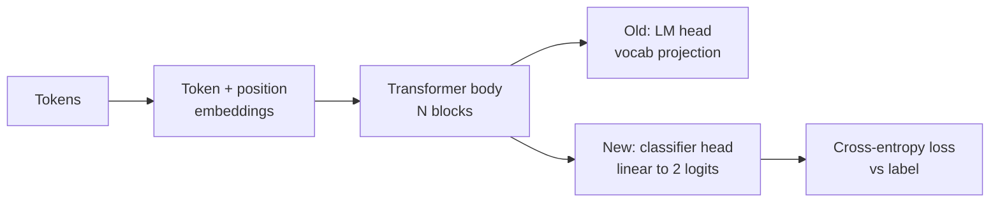
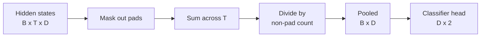
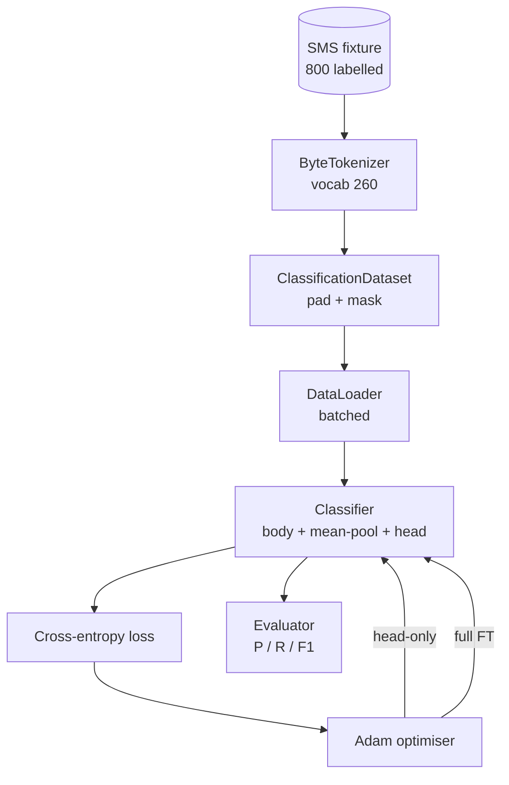

# 顶点课第38课：通过头部交换进行分类器微调

> B方向的第一门顶点课。一个预训练的语言模型是由自注意力块堆叠而成，以词预测头部结束。当你想要区分垃圾邮件和正常邮件时，头部是错误的，但主体大部分是正确的。本课程将头部剥离，在池化表示上粘贴一个二类线性层，并以两种不同方式训练分类器：仅最后一层和完全微调。评估指标是保留集上的精确率、召回率和F1分数。你将了解每种策略能带来什么以及代价是什么。

**类型：** 构建
**语言：** Python (torch, numpy)
**先修条件：** 第19阶段第30-37课（NLP LLM方向：分词器、嵌入表、注意力块、Transformer主体、预训练循环、检查点、生成、困惑度）
**时间：** 约90分钟

## 学习目标

- 用分类头部替换语言模型头部，而无需重新初始化主体。
- 实现两种训练模式：冻结主体（仅头部）和完全微调，共享同一个训练循环。
- 构建一个支持分词器的数据管道，进行填充、屏蔽填充词并对注意力输出进行池化。
- 从原始logits计算精确率、召回率、F1和混淆矩阵。
- 思考参数数量、训练时间和性能提升空间之间的权衡。

## 问题

你已经在通用语料库上预训练了一个小型Transformer。输出头部将最后一个隐藏状态投影到1000个词的词汇表。现在你有了800条标记为垃圾邮件或正常邮件的短信，想要一个二分类器。有三种选择。

错误的选择是在800个样本上从头训练一个全新的分类器。预训练模型的主体已经编码了有用的结构：词的身份、位置、简单的共现。丢弃它会浪费构建它所花费的计算资源。

两个正确的选择是头部交换并冻结主体，以及头部交换但主体可训练。仅头部训练速度快，内存开销几乎为零，并且在数据量少时很少过拟合。完全微调速度较慢，在小数据上可能过拟合，但当下游领域与预训练语料库存在差异时，能达到更高的准确率。

本课程构建了这两种方法，以便你可以在相同的测试平台上进行比较。

## 核心概念

模型是一个函数 `f_theta(tokens) -> hidden_states`。头部是一个函数 `g_phi(hidden) -> logits`。交换头部意味着保留 `theta` 并替换 `g_phi`。主体的参数是昂贵部分。头部是一个单独的线性层。

两个可训练的参数集很重要：

- `theta`（主体）：每个注意力块数万个权重。
- `theta`（头部）：`phi` 个权重加上一个偏置。

在仅头部训练中，你只对 `phi` 计算梯度，而对 `theta` 清零梯度。PyTorch允许你通过设置主体参数的 `requires_grad=False` 来实现这一点。优化器只看到头部，主体保持冻结。

在完全微调中，你让梯度通过整个堆栈反向传播。主体的权重会漂移以适应分类目标。风险是在小数据上发生灾难性遗忘：主体的预训练被过拟合噪声淹没。

## 池化问题

分类器需要每个序列一个向量，而不是每个词一个向量。三种常见选择：

- **平均池化**：根据注意力掩码对序列中的隐藏状态进行加权平均。
- **CLS池化**：在前面添加一个特殊标记，只使用其输出。这是BERT的做法。
- **最后一个标记池化**：使用最后一个非填充标记。这是GPT类分类器的做法。

本课程使用带有显式注意力掩码加权的平均池化。它最简单，能在不同序列长度上提供稳定的信号，并且不需要预训练CLS标记。

## 数据

八百条短信，平衡分布400条垃圾邮件和400条正常邮件，在 `code/main.py` 中确定性生成。生成器使用固定种子，选择模板并替换槽填充符，生成长度在5到25个词之间的消息。真实数据集有噪声，而这个测试平台没有。测试平台的意义在于可重复性。

数据按80/20划分：640条训练，160条测试。划分是分层抽样的，因此测试集保持50/50平衡。已知平衡的保留集使得精确率和召回率成为诚实可信的数字。

## 评估指标

二分类，类别1为正类（垃圾邮件）。计数为：

- `TP`：预测为垃圾邮件，实际是垃圾邮件。
- `TP`：预测为垃圾邮件，实际是正常邮件。
- `TP`：预测为正常邮件，实际是垃圾邮件。
- `TP`：预测为正常邮件，实际是正常邮件。

三个主要指标：

- `precision = TP / (TP + FP)`。在被标记为垃圾邮件的消息中，实际是垃圾邮件的比例是多少？
- `precision = TP / (TP + FP)`。在真正的垃圾邮件中，模型标记出了多少比例？
- `precision = TP / (TP + FP)`。两者的调和平均数。

混淆矩阵以2x2网格形式打印四个计数。演示程序将两种训练模式的混淆矩阵输出到标准输出。

## 架构

主体是一个故意设计得很小的Transformer：词汇表260，隐藏维度64，4个头，2个块，最大序列长度32。它足够小，可以在90秒内在CPU上将两种模式训练到收敛。本课程中没有预训练，而是通过 `pretrain_quick` 辅助函数在同一测试平台的文本上进行五个时期的语言模型训练，为主体提供一个非平凡的起点。这使得课程自成一体。

## 你将构建什么

实现由一个 `main.py` 文件和一个测试模块（`code/tests/test_main.py`）组成。

1. `ByteTokenizer`：将字节映射到ID，保留一个填充ID。
2. `ByteTokenizer`：一个Transformer块，包含多头注意力和前馈层。采用层归一化在前。
3. `ByteTokenizer`：标记嵌入+位置嵌入，以及一个块堆栈。返回隐藏状态。
4. `ByteTokenizer`：沿序列轴进行掩码加权平均。
5. `ByteTokenizer`：主体、池化、线性头部。主体在不同模式下是同一个实例。
6. `ByteTokenizer` 和 `Block`：切换主体参数的 `LMBody`。
7. `ByteTokenizer`：一个共享循环。接受模型和一个针对可训练参数组配置的优化器。
8. `ByteTokenizer`：运行测试集并返回 `Block`。
9. `ByteTokenizer`：短暂预训练主体，然后训练和评估仅头部模式，再训练和评估完全微调模式，打印两份报告，并退出。

## 为什么这种比较很重要

仅训练头部(head-only)的模式通常训练更快，且欠拟合更温和。在此固定配置下，经过二十个周期的仅头部训练，通常您会看到精度约0.9，召回率约0.85。全微调(Full fine-tuning)耗时约三倍，并且根据随机种子，指标会上下波动几个百分点。

本课并不指定优胜者。它教您解读数字与成本。在800个样本和一个小型主干(backbone)下，仅训练头部是正确选择。在80,000个样本和一个更大的主干下，全微调开始显现优势。您从本课学到的约定是API：同样的`train_classifier`函数处理两者，切换只需一次调用。

## 拓展目标

- 添加第三种模式，仅解冻最后一个模块(block)。这有时称为部分微调(partial fine-tuning)。其成本低于全微调，学习效果优于仅训练头部。
- 添加学习率调度器(learning-rate scheduler)。在头部使用余弦退火(cosine schedule)结合主干使用较小恒定学习率是一种常见的生产配置。
- 将平均池化(mean pooling)替换为学习型注意力池化(learned attention pool)：一个具有一个学习查询的小型注意力层。这在较长序列上通常优于平均池化。

实现提供挂钩(hooks)。测试锁定契约(contract)。数字由您推进。
