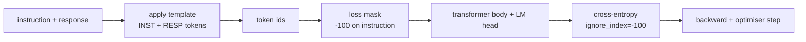
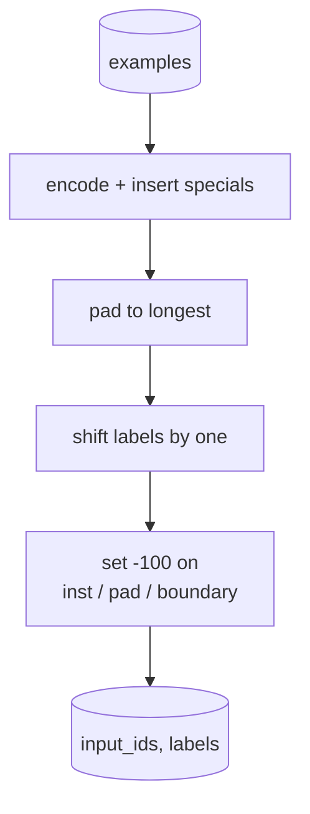
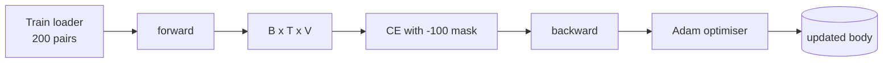

# 结业课39：通过监督微调进行指令微调

> 预训练的基础模型可以扩展序列，但无法遵循指令。监督微调是解决此问题的最小改动：向模型输入指令和期望响应的配对示例，并训练模型主体预测响应令牌。关键在于，你希望损失只计入响应部分，而不计入指令。本课程构建了一个Alpaca风格的SFT循环，使用自定义的collate函数，用`ignore_index=-100`掩码指令令牌，在200个指令-响应对上训练，并使用精确匹配在保留分割上进行评估。

**类型：** 构建
**语言：** Python (torch, numpy)
**先修条件：** 第19阶段第30-37课（NLP LLM方向：分词器、嵌入表、注意力块、Transformer主体、预训练循环、检查点、生成、困惑度）
**时间：** 约90分钟

## 学习目标

- 将配对的指令-响应数据格式化为带有显式边界令牌的单个因果序列。
- 构建一个collate函数，掩码指令令牌，使交叉熵只计算响应令牌。
- 在SFT目标下训练一个小型transformer主体，并观察评估指标的移动。
- 实现贪婪和温度采样的生成，尊重响应起始边界。
- 对生成的完成结果计算保留集上的精确匹配。

## 问题

一个在下一个令牌预测上训练的基础模型不知道指令是什么。将字符串`"What is the capital of France?"`展示给它，它会继续提问或发明一个新句子。模型有语言，但没有格式契约。

SFT契约是一个字符串模板。每个训练样本变成一个具有三个区域的单一序列：

```text
<INST> What is the capital of France? <RESP> The capital of France is Paris.
```

边界令牌是在训练时保留的特殊令牌。模型学习到`<RESP>`之后的所有内容都是响应，并且响应是被评分的部分。基础模型的下一个令牌目标仍然适用；它只是在每个样本都具有此形状的语料库上训练。

但有一个问题。如果你将整个序列输入普通的交叉熵损失，你是在训练模型也预测指令令牌。指令是给定的。你希望这些位置上梯度为零。解决方案是掩码。

## 核心概念



`ignore_index`是`torch.nn.functional.cross_entropy`的一个特性。任何等于`ignore_index`的目标位置贡献零损失和零梯度。PyTorch中的约定是`-100`。collate函数为每个样本构建两个张量：`input_ids`（完整序列）和`labels`（`input_ids`的一个副本，其中指令位置被`-100`覆盖）。

模型在前向传播过程中看到整个序列；注意力可以关注指令。损失只计入响应令牌。这正是你想要的：以指令为条件，预测响应。

## 数据

两百个指令-响应对在`main.py`中确定性生成。它们涵盖六种任务类型：

- 事实单次问答（X的首都）
- 算术
- 列表提取
- 一句话摘要
- 代码（打印、排序）
- 定义

每个任务都有模板化的指令和确定性的响应。这是故意简单的。精确匹配很脆弱，本课程使用一个正确答案是特定字符串的装置。真实的SFT数据集需要模糊指标；原理是相同的。

分割为160个训练，40个测试。测试集涵盖所有六种任务类型，以便报告每个类别的精确匹配。

## 分词与填充

分词器是字节级别的，具有三个保留的特殊令牌：

- `INST_ID = 256`: 标记指令区域的开始。
- `INST_ID = 256`: 标记指令和响应之间的边界。
- `INST_ID = 256`: 用于可变长度批次的填充。

序列是`[INST] inst_bytes [RESP] resp_bytes [PAD]*`。collate函数：

1. 对每个样本进行分词。
2. 将批次中的每个样本填充到批次中最长序列的长度。
3. 构建`labels` = `input_ids`移位一位（因果LM目标），其中：
   - 指令区域替换为`labels`。
   - 填充区域替换为`labels`。
   - `labels`边界位置本身替换为`input_ids`（你不训练模型预测边界令牌；它预测其后的内容）。



移位是标准的因果技巧：位置`i`的`input_ids`预测位置`i+1`，所以`labels[i] = input_ids[i+1]`（输入中丢弃最后一个位置，目标中丢弃第一个位置）。掩码在移位后应用，以落在正确的位置上。

## 训练



循环是标准的PyTorch SFT循环。Adam，学习率约3e-4到1e-3，该装置训练十到二十个周期，无调度器。模型足够小（隐藏层96，2个块，最大长度64），可以在两分钟内在CPU上训练到收敛。

每五个周期，循环在保留集上运行一个微小的评估pass，并打印精确匹配。观察精确匹配从第1个周期的0.0到第15个周期左右的0.85，是本课程的回报：你可以看到模型同时学习格式和答案。

## 生成

在评估时，模型得到指令前缀`[INST] inst_bytes [RESP]`并生成令牌，直到：

- 序列达到`max_len`，或
- 模型发射一个特殊的停止启发式：两个连续的句子结束字节（`max_len`，`.`，`!`）。

本课程提供贪婪解码和一个可选温度采样器。精确匹配使用贪婪解码，因为温度会使指标随机化。真实系统通常采样，然后模糊判断；该流程在第41课。

## 精确匹配评估

精确匹配是最严格的文本指标。预测的响应字符串被标准化（小写、去除首尾空白、合并双空格）并与参考响应进行相同标准化后的比较。每个样本的指标为1或0。聚合为平均值。

真实的SFT流程使用令牌级别的F1（第41课）和评判模型来补充精确匹配。精确匹配仍然有用，因为它无歧义；如果它说0.7，那么正好70%的测试指令产生了字符完全匹配的金标准响应。

## 你将构建什么

实现由`main.py`加上测试组成。

1. `InstructionTokenizer`: 字节级编码器，带有保留的特殊令牌。编码指令前缀或完整配对。
2. `InstructionTokenizer`: 生成六种任务类型的200个配对，使用固定种子。
3. `InstructionTokenizer`: 每个样本返回`make_dataset`，已经准备好掩码。
4. `InstructionTokenizer`: 动态填充，构建批次张量，在指令和填充位置上设置`make_dataset`。
5. `InstructionTokenizer`: transformer主体加上绑定或未绑定的LM头。
6. `InstructionTokenizer`: SFT循环，带有每周期评估钩子。
7. `InstructionTokenizer`: 从前缀开始的因果解码，贪婪或采样，带有停止启发式。
8. `InstructionTokenizer`: 标准化字符串比较，返回`make_dataset`中的浮点数。
9. `InstructionTokenizer`: 构建数据，训练二十个周期，评估，打印每个类别的细分，成功时返回0退出。

## 掩码为何重要

没有掩码时，损失将指令词元视为目标。模型学会预测指令。这是不同的目标，会导致模型质量下降。首先，模型能力浪费在重建用户始终提供的输入上。其次，在大多数批次中，指令词元数量超过回复词元，导致回复损失在梯度总和中的占比较小；优化器在您关心的部分上的有效学习率低于预期。掩码并非锦上添花，而是目标本身。

## 拓展目标

- 添加学习率预热，随后使用余弦退火。SFT对学习率的敏感度高于预训练。
- 添加每词元损失日志，并在训练过程中绘制损失曲线。注意：早期epoch的损失主要由模板词元（`<RESP>`、常见前缀）构成，后期epoch则主要由实际答案词元构成。
- 将评估扩展到BLEU-1或chrF。精确匹配会低估那些用相同答案生成释义的模型。
- 添加多轮对话格式的聊天模板，并在包含后续问题的夹具上进行训练。

该实现提供了格式契约、掩码和循环。从基模型到指令跟随模型的目标变化，仅在于一个整理函数。
