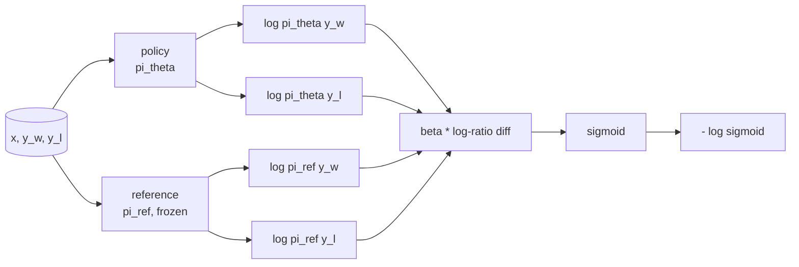
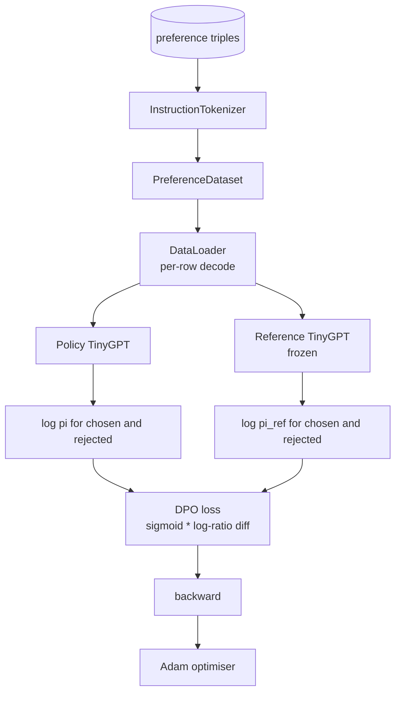

# 结业课40：从头实现直接偏好优化

> 奖励模型和PPO是经典的RLHF栈。DPO将这一栈压缩为单一的监督损失，直接根据偏好对拟合策略。本节课从奖励差恒等式推导DPO损失，提供一个可工作的参考模型加策略模型，计算每个token的对数概率，并在一个由选择完成和拒绝完成组成的偏好测试集上训练一个小型transformer。测试验证了损失数学和梯度方向，确保实现与论文一致。

**类型：** 构建
**语言：** Python (torch, numpy)
**先修条件：** 第19阶段第30-37课（NLP LLM方向：分词器、嵌入表、注意力块、Transformer主体、预训练循环、检查点、生成、困惑度）
**时间：** 约90分钟

## 学习目标

- 从缩放的对数比率差推导出DPO损失作为sigmoid，并将其与隐式奖励联系起来。
- 构建一个参考模型+策略模型对，其中参考模型冻结，策略模型可训练。
- 在两个模型下计算序列级别的对数概率，隐藏提示token。
- 在`(prompt, chosen, rejected)`三元组上训练策略，观察选择完成的对数概率相对于拒绝完成上升。
- 通过测试验证损失数学、梯度符号和参考不变性。

## 问题

你有一个SFT模型。它能遵循指令，但输出参差不齐：有些完成明确，有些冗长或错误。你还有一个小型偏好对数据集：针对同一个提示，人类标记了一个完成作为选择完成，另一个作为拒绝完成。

经典的RLHF方案是一个两阶段流水线：在偏好上训练奖励模型；用PPO针对奖励优化策略。这可行但代价高昂：PPO期间内存中有两个模型，KL控制使策略靠近参考，奖励模型脆弱时存在奖励攻击。

DPO用单一的监督损失替代了这两个阶段。奖励模型从不显式存在。策略直接在偏好对上训练，带有对SFT参考的显式KL惩罚。在Bradley-Terry偏好模型下得到相同的最优解，代码量少得多。

## 核心概念

从Bradley-Terry模型开始。给定一个提示`x`和两个完成`y_w`（选择）与`y_l`（拒绝），人类偏好`y_w`的概率为

```text
P(y_w > y_l | x) = sigmoid( r(x, y_w) - r(x, y_l) )
```

其中`r`是某个隐式奖励函数。RLHF首先从偏好拟合`r`，然后训练策略`pi`以最大化`r`，并带有KL锚点：

```text
max_pi   E_{x, y~pi} [ r(x, y) ] - beta * KL(pi || pi_ref)
```

DPO推导发现，在该目标下的最优策略`pi*`可由`r`表示出闭式解：

```text
pi*(y | x) = (1/Z(x)) * pi_ref(y | x) * exp( r(x, y) / beta )
```

重新排列得到`r`：

```text
r(x, y) = beta * ( log pi*(y | x) - log pi_ref(y | x) ) + beta * log Z(x)
```

对于`y_w`和`y_l`，`log Z(x)`项是相同的（它依赖于`x`，而非`y`），因此在计算偏好差异时会抵消：

```text
r(x, y_w) - r(x, y_l) = beta * ( log pi_theta(y_w|x) - log pi_ref(y_w|x)
                                - log pi_theta(y_l|x) + log pi_ref(y_l|x) )
```

代入Bradley-Terry sigmoid函数，并取偏好对的负对数似然：

```text
L_DPO(theta) = - E_{(x, y_w, y_l)} [
  log sigmoid( beta * ( log pi_theta(y_w|x) - log pi_ref(y_w|x)
                       - log pi_theta(y_l|x) + log pi_ref(y_l|x) ) )
]
```

这就是损失函数。它是每个样本上单个标量的sigmoid函数，由四个对数概率计算得出。没有单独的奖励模型，没有PPO，损失中没有KL项；KL约束被嵌入到闭式推导中。



## 梯度的符号

任何训练运行前有用的合理性检查。对`log pi_theta(y_w | x)`求梯度：

```text
d L_DPO / d log pi_theta(y_w | x) = - beta * (1 - sigmoid(z))
```

其中`z`是sigmoid函数的自变量。对所有`z`，该梯度为负，这意味着：增加策略对选择完成的对数概率会降低损失。对称地，对`log pi_theta(y_l | x)`的梯度为正：增加拒绝完成的对数概率会增加损失。训练推高选择完成的概率，降低拒绝完成的概率。参考模型是冻结的，不发生变化。

## 数据

本节课附带了十二个偏好三元组。每个三元组为`(prompt, chosen, rejected)`。选择完成简短精确。拒绝完成冗长、离题或错误。这些配对覆盖与第39课相同的任务族（大写、算术、列表），因此从SFT基础开始的策略有一个合理的起点。

测试集故意设置得小。DPO在生产中处理数万个配对；这里重点是损失数学和训练循环在小型数据集上端到端运行，并且选择与拒绝的对数概率差距明显增大。

## 参考不变性

DPO实现必须谨慎处理参考模型。参考模型是冻结在原位的SFT模型。必须满足三个性质：

- 参考参数从不接收梯度。
- 参考的对数概率在不同epoch之间从不改变。
- 策略与参考从相同的权重初始化。（最优`theta`是参考加上学习到的更新；将策略初始化为参考的副本是明确定义的起点。）

实现通过以下方式强制执行：

- 在前向传播期间将参考包装在`torch.no_grad()`中。
- 在每个参考参数上设置`torch.no_grad()`。
- 在参考构建后通过`torch.no_grad()`构造策略。

## 架构



模型与第39课中使用的TinyGPT相同（仅解码器、因果、字节分词器）。参考模型和策略模型共享架构；在训练中策略的权重偏离参考，而参考保持不变。

## 你将构建什么

实现由`main.py`加上测试组成。

1. `InstructionTokenizer`: 带有`INST`和`RESP`特殊标记的字节分词器。形状与第39课相同。
2. `InstructionTokenizer`: 仅解码器transformer。形状与第39课相同，这样即使跳过了第39课，本节课也是自包含的。
3. `InstructionTokenizer`: 返回十二个`INST`三元组。
4. `InstructionTokenizer`: 给定模型、提示前缀和完成，返回完成部分上每下一个token的对数概率之和（不包含提示位置的贡献）。
5. `InstructionTokenizer`: 接受四个对数概率和`INST`，返回每个样本的损失张量和用于日志记录的隐式奖励差值。
6. `InstructionTokenizer`: 每个epoch的循环，计算策略和参考下选择与拒绝的对数概率，应用损失，并执行Adam步。
7. `InstructionTokenizer`: 返回任意时刻策略下选择与拒绝的平均对数概率差值。
8. `InstructionTokenizer`: 从一个小型预热预训练构建参考和策略，复制权重，训练三十步，打印每步的损失和差值，成功时退出码为零。

## 为什么DPO有效

DPO在Bradley-Terry偏好模型下在数学上等价于RLHF，除了奖励的参数化方式。隐式奖励`r(x, y) = beta * (log pi(y|x) - log pi_ref(y|x))`可以从偏好中识别出来，但只能确定到`x`的一个函数，该函数在差值中抵消。闭式策略让你跳过显式奖励模型。KL约束在结构上得到强制执行：`pi`与`pi_ref`的任何偏差都会使对数比率变大，sigmoid函数饱和，从而在策略偏离过远时抑制梯度。参考模型是你的安全网。

## 拓展目标

- 向对数概率之和添加长度归一化：除以完成长度。长度偏差是DPO的一个已知失败模式，模型会倾向于选择较短的完成，因为它们的对数概率绝对值更大。
- 添加损失函数的IPO变体：将sigmoid+log替换为`(z - 1)^2`。比较在测试集上的收敛情况。
- 添加标签平滑参数，在硬选择/拒绝标签和均匀的0.5之间插值。
- 用更小更廉价的模型替换参考（知识蒸馏风格）。

实现提供了损失函数、参考不变性和训练循环。数学是课程本身。代码让数学变得具体。
