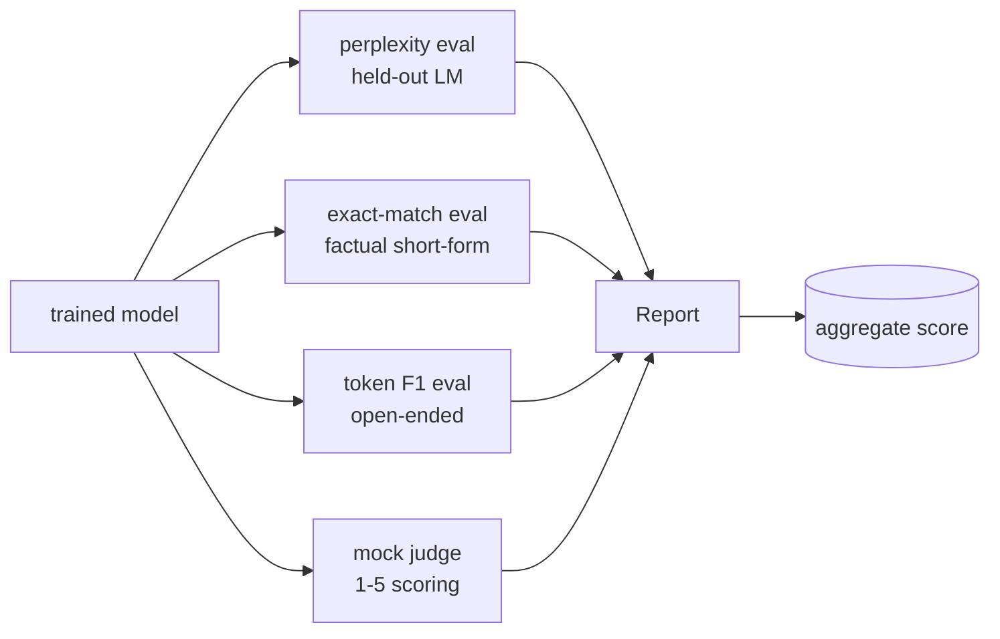
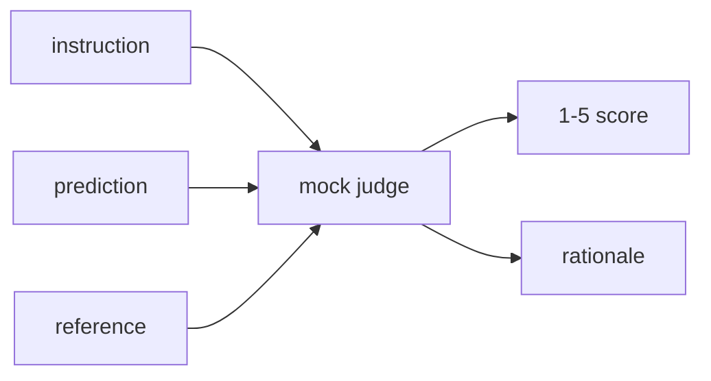
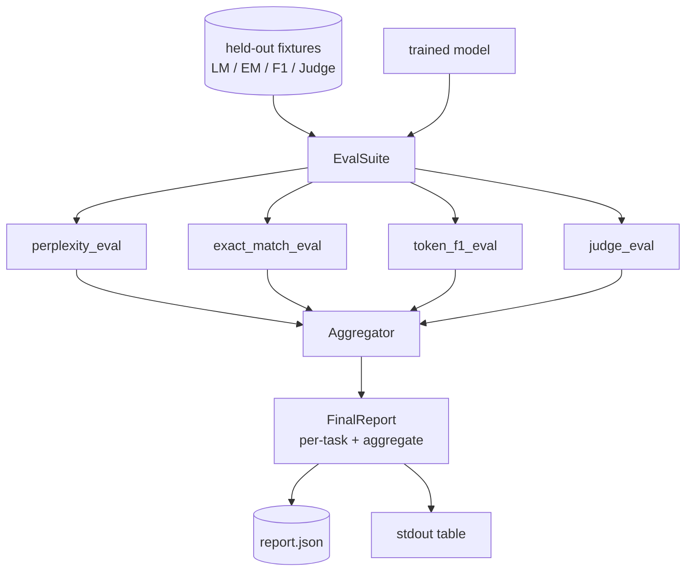

# 总结课41：完整评估管道

> 训练是可以通过损失曲线监控的部分。评估则是必须自行设计的部分。本节课构建了一个统一的评估管道，该管道接收任意训练好的语言模型，对其运行四个异构评估，将结果汇总为每个任务的报告，并提供一个本地模拟的LLM评估器，使得循环无需网络即可运行。这四个评估涵盖了每个发布模型所需的维度：语言建模（困惑度）、短格式正确性（精确匹配）、开放格式相似性（token F1）以及定性评分（评估器）。

**类型：** 构建
**语言：** Python (torch, numpy)
**先修条件：** 第19阶段第30-37课（NLP LLM方向：分词器、嵌入表、注意力块、Transformer主体、预训练循环、检查点、生成、困惑度）
**时间：** 约90分钟

## 学习目标

- 在微型Transformer上通过掩码令牌计算保留集困惑度。
- 对短格式事实性提示运行精确匹配评估。
- 计算预测字符串与参考字符串之间的标准化token F1。
- 构建本地模拟的LLM评估器，对模型输出进行1-5分的评分。
- 将四个评估汇总为带任务细分的加权报告。

## 问题

单个指标永远无法描述一个语言模型。困惑度说明了模型对语言分布的拟合程度，但无法说明它是否能回答问题。精确匹配说明了模型能否生成黄金字符串，但会惩罚正确的意译。Token F1容忍意译，但会被词汇重叠但内容错误的情况迷惑。LLM评估器捕捉定性维度，但昂贵且随机。

你实际需要的管道应包含全部四个指标。每个评估覆盖了其他指标遗漏的一个维度。每个评估在针对该指标定制的不同保留数据子集上运行。最终报告并排显示每个任务的数值和汇总结果，使评审者一目了然地看到模型正在做出的权衡。

本节课将在一个文件中端到端构建该管道。

## 核心概念

每个评估都是一个来自`(model, dataset) -> EvalResult`的函数。结果包含指标值、用于检查的每个样本的细节以及用于汇总的名称。管道通过一个配置文件组合这些评估，该文件指定了运行哪些评估以及如何加权。

## 困惑度，正确计算

困惑度是`exp(mean negative log-likelihood per token)`。实现有两个陷阱：

- 均值必须基于实际token位置，而不是批次乘以序列长度。填充词必须从分母中排除，否则困惑度看起来会优于实际。
- 模型预测下一个token，因此位置`i`的logits预测的是位置`i+1`的token。这里的差一错误是隐性的：损失仍然可以训练，但指标变得无意义。

该评估计算每个批次中非填充位置的`-log p(token)`总和以及每个批次的token计数，最后进行除法。这在数值上比平均每个批次的困惑度（这会使短序列权重偏低）更安全，并且符合教科书定义。

## 精确匹配，带标准化

评估工具在比较前对预测和参考进行标准化：

- 小写。
- 去除两侧空白。
- 将内部连续空白折叠为单个空格。
- 如果双方仅因标点符号不同，则去除末尾的终止标点（`.`，`!`，`?`）。

标准化使精确匹配在实践中变得有用。输出`"Paris"`的模型是正确的；输出`"Paris."`也是正确的；输出`"  paris  "`也是正确的。该指标仍然要求答案在标准化后是相同的字符串。

## Token F1，正确的方式

Token F1是基于词袋计算的精确率和召回率的调和平均数。步骤：

1. 标准化预测和参考（规则与精确匹配相同）。
2. 将每个分割为token列表（空白分词）。
3. 计算多重集交集。
4. 精确率=`intersection_count / len(pred_tokens)`。召回率=`intersection_count / len(ref_tokens)`。F1=调和平均数。

如果预测和参考都为空，F1为1（空匹配）。如果仅一个为空，F1为0。此模式与SQuAD评估参考一致，并且在不同意译下产生稳定数值。

## 本地模拟LLM评估器

真正的评估器是API背后的前沿模型。在本节课中，评估器必须离线运行。模拟评估器是一个确定性评分器，它接受指令、模型预测和参考，并返回`{1, 2, 3, 4, 5}`范围内的分数以及一行理由。评分规则是明确的：

- 标准化预测等于标准化参考时为5。
- 预测与参考的token F1至少为0.8时为4。
- token F1在`[0.5, 0.8)`范围内时为3。
- token F1在`[0.5, 0.8)`范围内时为2。
- 其他情况为1。

这不是真正的评估器，但它具有正确的接口。稍后通过更改一个函数即可替换为真实模型。管道不关心这一点。

## 汇总

汇总是将标准化评估分数进行加权平均。每个评估报告其在`[0, 1]`中的数值：

- 困惑度：标准化为`1 / (1 + log(perplexity))`。困惑度为1映射到1，无穷大映射到0。
- 精确匹配：已在`1 / (1 + log(perplexity))`中。
- Token F1：已在`1 / (1 + log(perplexity))`中。
- 评估器：除以5。

权重可配置。默认混合为0.2困惑度、0.3精确匹配、0.3 token F1、0.2评估器。权重的选择是一个产品决策；本节课暴露了调节旋钮，以便你进行实验。

## 架构

`EvalSuite`是一个轻量级编排器。每个单独的评估是一个自由函数，接受`(model, tokenizer, dataset, config)`并返回一个`EvalResult`。`Aggregator`收集结果并生成最终报告。演示程序打印表格并写入一份JSON副本，供下游CI使用。

## 你将构建什么

实现由`main.py`加上测试组成。

1. `TinyGPT`：与第38-40课相同的仅解码器架构，包含在本课中以使其独立。
2. `TinyGPT`：字节分词器，带有INST / RESP / PAD特殊词。
3. 四个固定数据集：一个LM语料库、一个EM集、一个F1集和一个评估集。每个20个样本，确定性。
4. `TinyGPT`：返回包含困惑度值和每个token损失直方图的`InstructionTokenizer`。
5. `TinyGPT`：返回平均EM和每个样本的记录。
6. `TinyGPT`：返回平均token F1和每个样本的记录。
7. `TinyGPT`和`InstructionTokenizer`：每个样本的分数和理由，以及整个集合的平均分数。
8. `TinyGPT`：每个评估的标准化规则。
9. `TinyGPT`：加权平均和汇总报告。
10. `TinyGPT`：短暂训练一个小模型，运行所有四个评估，打印报告表格并写入JSON，成功时退出代码为零。

## 阅读报告

报告有三层。最上层是总分(aggregate score)。其下是四个逐评估(per-eval)数字。再下面是用于诊断的逐示例(per-example)细分。失败的CI(持续集成)运行通常需要总分，但追踪回归的审查者需要逐示例细分，以查看模型哪些输入出错了。

JSON转储使用稳定的键，以便CI仪表盘可以绘制跨版本的趋势线。美化打印的表格供人在训练运行后盯着终端查看。

## 拓展目标

- 添加一个校准评估(calibration eval)：模型的softmax概率与其准确率是否匹配？按置信度对预测进行分桶，并报告每个桶的经验准确率。
- 添加一个鲁棒性评估(robustness eval)：用扰动(错字、改写、干扰项)标记每个示例，并报告每个扰动下的指标下降。
- 将模拟裁判替换为HTTP调用背后的真实模型。函数签名不变。
- 添加逐任务权重学习(per-task weight learning)：不固定权重，而是将权重拟合到模型的目标偏好顺序上。

该实现提供了四个评估、聚合器和报告。实际评估管道在此基础上叠加更多维度；模式保持不变：每个评估一个函数，一个聚合器，一个报告。
