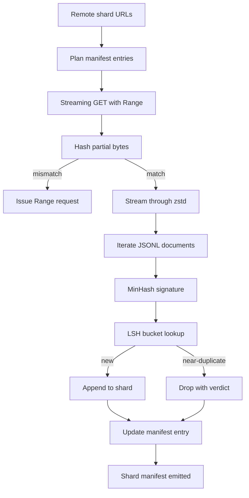

# 大型语料库下载器

> 训练语言模型在第一次前向传播之前很久就开始了。语料库必须落地到磁盘，解压缩，去重，并且可寻址，在网络下降到4%之前就已经规划好了恢复方案。本节课构建了一个流式下载器，它拉取压缩分片，使用Zstandard即时解压缩，通过MinHash加局部敏感哈希对近似重复进行指纹识别，并写入一个其余管道可以信任的分片清单。

**类型：** 构建
**语言：** Python
**前置条件：** 阶段19 第30-37课
**时间：** 约90分钟

## 学习目标

- 使用`urllib`流式传输远程分片，并使用`zstandard`解压缩，而无需在内存中缓冲整个文件。
- 通过针对已验证的字节偏移量发出HTTP `urllib`请求来恢复部分下载。
- 为每个文档构建一个MinHash签名，并使用LSH将其分桶，以便近重复碰撞。
- 输出包含内容哈希、字节大小、文档计数和去重结果的分片清单。

## 问题

当你第一次在一个200 GB的语料库上训练时，网络在41%时中断，脚本以`urllib`异常退出。第二次在78%时中断。到99%时，你已经重写了三次循环。从一开始就必须设计的两个失败场景是部分下载恢复和重复文档移除。两者都有众所周知的解决方案，但通常都被跳过，因为管道最初只是一个简单的`requests.get`调用，后来逐渐变得复杂。

恢复是一个HTTP问题。服务器必须遵循`Range`，客户端必须跟踪与磁盘记录对应的已验证偏移量，并且已验证的偏移量必须在进程死亡后仍然存在。如果偏移量和文件即使相差一个字节，恢复的下载就会写入垃圾数据，并且语料库以仅在分词过程中才显现的方式被损坏。

去重是一个签名问题。精确哈希去重会遗漏近重复：同一篇维基百科文章出现三个不同的样板页脚，同一个代码文件带有不同的许可证头部，同一篇博文每个链接上都有一个跟踪参数。MinHash加LSH以亚线性成本捕获这些重复。成本是每个文档一个签名，每个签名一次桶查找。

## 核心概念



### 使用`urllib`进行流式传输

标准库中的`urllib.request.urlopen`返回一个类文件对象。将其包装在`zstandard.ZstdDecompressor().stream_reader`中，字节从网络流经解压缩器进入文档迭代器，而无需在内存中具体化压缩分片或解压缩分片。唯一的内存开销是行缓冲区、当前文档的MinHash签名和LSH索引。

### 使用`Range`进行恢复

下载器为每个分片写入两个文件：分片本身和一个`.partial.json`检查点。检查点记录`verified_bytes`、`expected_size`、`sha256_prefix`（基于前`verified_bytes`个字节计算）和源URL。启动时，下载器读取检查点，重新计算磁盘上的`sha256_prefix`，并且仅在重新计算的哈希匹配时才恢复。如果哈希错误，则丢弃部分下载并从零字节重新开始。静默损坏是不可能的，因为已验证的字节是被检查的，而不是假设的。

### MinHash加LSH

MinHash在固定空间中估计两个集合的杰卡德相似度。对于一个文档，集合是其文本的shingle（重叠的n-gram）。签名是`k`个最小哈希值，每个独立哈希函数一个。杰卡德相似度为`s`的两个文档在签名的任意单个分量上一致的概率为`s`。

然后LSH将`k`个分量分组为`b`个波段，每个波段有`r`行，其中`k = b * r`。两个文档在至少一个波段中碰撞的概率为`1 - (1 - s^r)^b`，这是一个围绕你调整`(b, r)`的`s`值的尖锐阈值。典型语料库去重的阈值为`s = 0.8`，LSH研究文献通过`k = 128`、`b = 32`、`r = 4`达到该阈值。

### 分片清单作为契约

下载器唯一的持久输出是清单。清单为每个分片保存URL、解压缩后的字节数、文档数、去重后的唯一文档数以及最终分片文件的sha256。下游分词读取清单，而不是目录列表。如果某个分片缺失或其sha256错误，清单会通知下一阶段拒绝启动。清单是“数据已下载”和“数据已下载且可验证”之间的决定性边界。

## 动手构建

`code/main.py` 实现：

- `ShardPlanner` - 读取分片URL列表并生成计划中的清单条目。
- `ShardPlanner` - 打开带有可选`StreamingDownloader`的`urllib`流，写入临时文件，在每个块上更新`Range`检查点，并在恢复时验证sha256前缀。
- `ShardPlanner` - 将类文件流包装在`StreamingDownloader`中，并逐行生成一个文档。
- `ShardPlanner` - 使用固定的哈希种子族为字符串生成`StreamingDownloader`个分量的签名。
- `ShardPlanner` - 按波段对签名进行分桶并报告碰撞。
- `ShardPlanner` - 结合哈希器和索引，将每个文档标记为`StreamingDownloader`或`urllib`，同时记录匹配的分片ID。
- `ShardPlanner` - 收集每个分片的统计信息并写入`StreamingDownloader`。

文件底部的演示在磁盘上构建一个小型合成语料库，使用`zstandard`压缩，通过`file://` URL下载，去重，并打印清单。

运行它：

```bash
python3 code/main.py
```

脚本以零退出并打印清单摘要。

## 生产模式

四种模式将本节课扩展到真实语料库。

**先检查点再写入。** `.partial.json`必须在字节追加到分片之前进行`fsync`。否则断电会反转顺序：分片字节在磁盘上，检查点没有它们，下一次恢复认为它拥有的已验证字节比实际少，重复的后缀字节会损坏文件。先检查点，再写入。这与预写式日志的规则相同。

**分片LSH索引。** 对整个语料库的单个LSH索引在200 GB规模下无法放入RAM。按第一个波段哈希对LSH索引进行分区，将分区存储在磁盘上，并且只查询新签名会落入的分区。代价是每个文档多一次磁盘读取；好处是LSH索引不再是硬性内存上限。

**墓碑标记，而不是删除。** 被丢弃的重复项在清单中记录为结果`near_duplicate`以及它们碰撞的文档的分片ID。删除它们会丢失重复项与其保留者之间的链接。墓碑标记保留了审计跟踪，并允许下游通道改变对阈值的决定。

**清单中的每个分片sha256，加上清单sha256。** 清单本身获得一个内容哈希。下游阶段在信任每个分片条目之前验证清单哈希。如果没有这个，清单就是静默的攻击面：能够编辑单个文件的攻击者就可以破坏整个管道。

## 使用它

生产模式：

- **每次CI运行时恢复。** CI运行者是短暂的。下载器必须假设每次运行都是新磁盘，并从缓存或远程恢复。`--cache-dir`是一等标志。
- **在分词前去重。** 分词很昂贵。在同一文档上运行两次，对于相同的损失曲线是双倍成本。去重位于分词的上游，而不是下游。
- **清单作为合并门。** 训练运行从固定的提交中读取清单sha256。新的数据集版本需要新的清单提交。代码和数据之间的链接是git，而不是传说。

## 发布

在真实项目中，`outputs/skill-corpus-downloader.md`会描述哪些URL为下载器提供数据，检查点目录如何布局，去重使用什么shingle宽度和`(k, b, r)`三元组，以及清单在版本控制中的位置。本节课只提供引擎。

## 练习

1. 添加一个`--shingle-width`标志，并测量在宽度为3、5、9时去重结果如何变化。为所选默认值辩护。
2. 通过嗅探魔术字节在zstd旁边添加gzip支持。下载器不应要求调用者指定编解码器。
3. 添加一个`--shingle-width`模式，如果找不到检查点，则拒绝开始新的下载。在CI中很有用，可以防止一次运行意外地重新拉取200 GB。
4. 将LSH索引移动到shelf或sqlite文件，并测量与内存变体的吞吐量。
5. 在启动时添加清单sha256检查。如果磁盘上的清单与`--shingle-width`中的清单哈希不一致，下载器应故障关闭。

## 关键术语

|  术语  |  人们的说法  |  实际含义  |
|------|-----------------|------------------------|
|  分片  |  “一个文件”  |  语料库的一个自包含切片，拥有自己的sha256，用作恢复和去重的单位  |
|  MinHash签名  |  “指纹”  |  一个集合的`k`个分量的草图，其中每个分量是该集合上独立哈希的最小值  |
|  LSH波段  |  “桶”  |  一组`r`个签名分量，用作单个桶键进行碰撞检测  |
|  已验证字节  |  "恢复偏移量"  |  磁盘上sha256前缀与检查点匹配的字节；唯一安全的恢复偏移量  |
|  清单  |  "索引"  |  下载器生成的单个持久记录，包括内容哈希  |

## 延伸阅读

- [RFC 7233](https://datatracker.ietf.org/doc/html/rfc7233) - HTTP范围请求，恢复协议
- [RFC 7233](https://datatracker.ietf.org/doc/html/rfc7233) - 使流式解压缩安全的帧格式
- [RFC 7233](https://datatracker.ietf.org/doc/html/rfc7233) - 本课使用的签名族
- [RFC 7233](https://datatracker.ietf.org/doc/html/rfc7233) - 去重阈值背后的分带方案
- Phase 19 · 43 - 下载器馈送的HDF5标记化语料库
- Phase 19 · 44 - 在该语料库上训练的余弦调度
- Phase 19 · 45 - 消耗该调度的AMP循环
