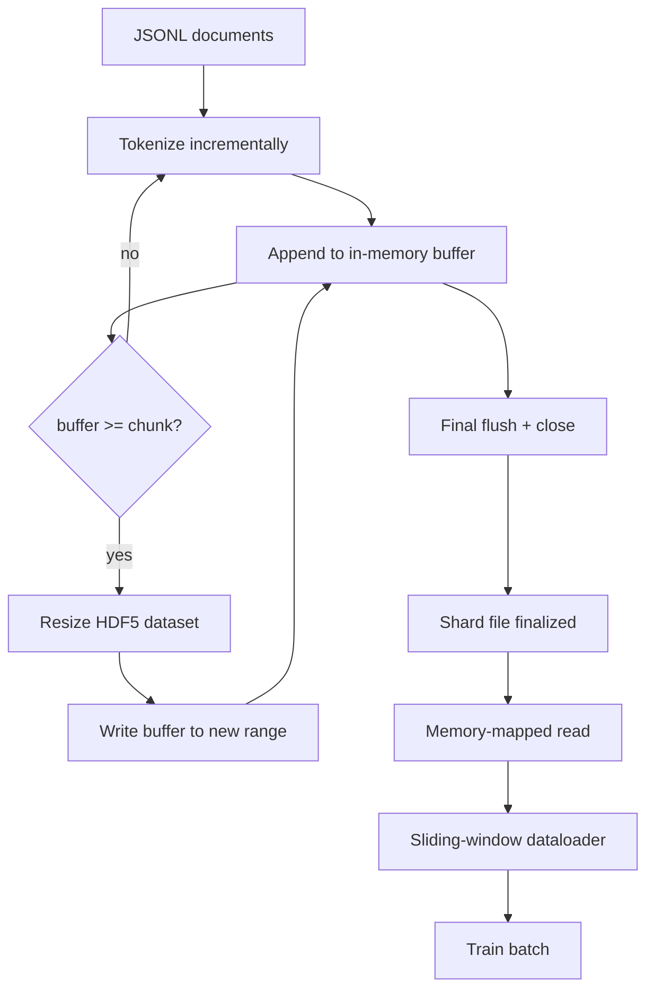

# HDF5 分词语料库

> 下载的语料库必须以训练器可以从线速度流式读取的布局放置。磁盘上的JSONL无法承受16个数据加载器工作进程。而带有可调整大小的分块整数数据集的HDF5可以胜任。本课将流式分词构建到可调整大小的HDF5数据集中，分片写入多个文件，训练时进行内存映射读取，以及一个产生正确打包的固定长度序列的滑动窗口数据加载器。

**类型：** 构建
**语言：** Python
**前置条件：** 阶段19 第30-37课
**时间：** 约90分钟

## 学习目标

- 将文档流式写入具有确定性分块的可调整大小HDF5整数数据集。
- 将写入分片到多个HDF5文件，以便故障范围有限且可并行。
- 通过HDF5的页面缓存支持的分块布局回读令牌，使数据加载器仅在批处理时复制到批处理缓冲区。
- 实现一个滑动窗口数据加载器，它发射具有显式打包规则的固定长度训练序列。

## 问题

现代语言模型训练运行以每秒数十万个样本的速度从数十个工作进程读取令牌。磁盘上的JSONL在第一次冷缓存缺页时崩溃：JSON解析器很慢，文档边界不可寻址，查找“样本4,217,884”需要扫描文件。即使是压缩良好的Parquet也不适合，因为训练器不需要列；它需要一个具有O(1)随机访问的扁平令牌流。

HDF5适合，因为它提供了一个分块、可调整大小、仅整数的数据集，其块在读取时对页面缓存友好。训练器请求`tokens[3,200,000 : 3,200,8192]`的一个切片，HDF5将请求的超切片从页面缓存复制到新分配的NumPy数组中。代价是每个工作进程一个打开的文件句柄和块大小的页面缓存占用，与解码JSONL的成本相比微不足道。

构建问题在于使写入端诚实。可调整大小的数据集很容易被误用：一次写入一个文档，HDF5文件会碎片化到无法使用的程度。在一次调整大小中写入所有文档，进程死亡会丢失整个分片。正确的纪律是缓冲然后扩展，缓冲区大小匹配块大小，以及分片写入将工作负载分散到多个文件，以便崩溃最多丢失一个分片。

## 核心概念



### 正确实现的可调整大小HDF5

令牌数据集以`maxshape=(None,)`和固定`chunks=(chunk_size,)`创建。写入通过将令牌缓冲到长度为`chunk_size`的NumPy数组中进行。当缓冲区填满时，数据集正好调整大小`chunk_size`，并将缓冲区写入新范围。在分片结束时，残差缓冲区写入最后的局部范围。除最后一次外，每次写入都是连续且块对齐的，最后一次写入时，读取器被告知根据分片HDF5属性中记录的`token_count`进行截断。

### 分片写入

单个HDF5文件是单点故障。流水线并行写入分片：来自阶段19第42课的每个输入分片产生一个HDF5输出分片。一个`shards.json`索引记录每个分片的文件路径、令牌计数、文档计数以及令牌的sha256。训练器读取`shards.json`以计算全局偏移并验证语料库。

### 内存映射读取

训练时，每个工作进程以`swmr=True`模式打开其份额的HDF5文件，并请求`tokens[start:stop]`。HDF5的分块布局使得一旦块变热，就成为页面缓存支持的读取。工作进程从不实例化整个文件：切片被复制到数据加载器的批处理缓冲区，然后数据加载器在批处理时将其复制到固定内存的训练张量中。热路径每个块转换一次系统调用；其余都是RAM访问。

### 滑动窗口数据加载器

数据加载器是唯一知道训练序列长度的阶段。它在全局令牌流中随机选择一个起始索引，读取`window_size + 1`个令牌，并返回`(input, target) = (tokens[:-1], tokens[1:])`。文档边界不强制执行：窗口可能跨越两个文档，其间有显式的`boundary_token_id`，以便模型学习使用分隔符。这是标准的打包规则；也是初学者容易忘记的规则，最终导致语料库中8%是训练边界令牌，92%是自然文本。

## 动手构建

`code/main.py` 实现：

- `Tokenizer` - 一个字节级确定性分词器，足以用于演示。接口是`encode(text) -> list[int]`和`vocab_size`。
- `Tokenizer` - 打开一个可调整大小的整数数据集，将令牌缓冲到块大小，以固定大小的步幅调整大小并写入，在关闭时记录`encode(text) -> list[int]`和`vocab_size`作为HDF5属性。
- `Tokenizer` - 迭代输入文档，路由到写入器，并发射一个`encode(text) -> list[int]`索引。
- `Tokenizer` - 打开分片文件以进行内存映射读取，计算全局偏移，公开单个`encode(text) -> list[int]` API。
- `Tokenizer` - 从全局流中选取随机窗口，并生成`encode(text) -> list[int]` NumPy数组。

文件底部的演示构建一个微小的内存语料库，分词到两个分片中，通过内存映射打开，运行数据加载器10个批次，并打印每个批次的形状和校验和。

运行它：

```bash
python3 code/main.py
```

脚本退出码为零，并打印批次校验和。

## 生产模式

四种模式将本课扩展到实际训练运行。

**块大小等于典型读取量。** 训练器每个样本读取`window_size + 1`个令牌。将HDF5块设置为`window_size`的倍数，读取将页面对齐。不匹配的块会使吞吐量减半，因为每个样本触及两个块。

**令牌计数在属性中，不在数据集中。** 数据集的尾部切片可能部分填充，因为块大小不能整除文档边界。将实际`token_count`存储为数据集的HDF5属性，并让读取器在该值处截断。否则读取器会越界进入零填充令牌，模型将学习预测零。

**分片sha256与并行验证。** 每个分片有自己的令牌字节sha256。训练器可以在训练开始前并行验证所有分片。错误的sha256会提前使运行失败，而不是在16小时后的第三个epoch。

**两侧`swmr=True`，写入器端`libver="latest"`。** 单写者多读者模式要求写入器以`libver="latest"`打开，预先创建每个数据集，然后设置`file.swmr_mode = True`。之后，写入器必须在每次调整大小后调用`dataset.flush()`，以便读者工作进程（以`swmr=True`打开）看到一致的数据。跳过`libver="latest"`或在结构更改后启用SWMR是常见的“文件被锁定”故障来源。

## 使用它

生产模式：

- **每个源分片一个HDF5。** 下载器（第42课）为每个URL发射一个分片；分词（本课）为每个源分片发射一个HDF5。1:1的映射使得恢复和部分故障恢复变得简单。
- **边界令牌ID。** 边界令牌是分词器词汇表的一部分，是数据加载器注入的唯一令牌。如果模型应该忽略它，则训练损失会屏蔽边界令牌；否则模型学习将其用作序列分隔符。
- **`shards.json`作为真实来源。** 添加新分片意味着写入HDF5，计算其sha256，并追加条目。训练器在启动时读取该文件一次，之后不再接触目录列表。

## 发布

`outputs/skill-hdf5-tokenized-corpus.md`在一个实际项目中，应描述哪个分词器为流水线提供数据，什么块大小匹配训练器的窗口，`shards.json`在版本控制中的位置，以及数据加载器工作进程如何跨文件分片。本课提供引擎。

## 练习

1. 向HDF5写入器添加一个`--compression gzip`标志，并在演示语料库上测量吞吐量成本。论证选择的默认值。
2. 向滑动窗口数据加载器添加确定性种子，并验证两次相同种子的运行产生相同批次。
3. 添加`--compression gzip`模式，读取每个分片，重新计算令牌上的sha256，并与`--validate`比较。CI应在训练开始前运行此检查。
4. 比较块大小等于窗口大小一半、等于窗口大小和两倍窗口大小时的数据加载器吞吐量。报告页面缓存效应。
5. 添加一个`--compression gzip`标志，在写入时截断非常长的文档。论证与在读取时决定相比的权衡。

## 关键术语

|  术语  |  人们的说法  |  实际含义  |
|------|-----------------|------------------------|
|  可调整大小数据集  |  "仅追加"  |  一个HDF5数据集，具有`maxshape=(None,)`，通过块大小步幅的`resize`调用增长  |
|  分块布局  |  "HDF5如何存储"  |  固定大小的磁盘页面，内核可以内存映射，数据加载器可以连续读取  |
|  `swmr`模式  |  "边写边读"  |  单写者多读者模式，允许数据加载器工作进程安全地共享文件  |
|  分片索引  |  "shards.json"  |  所有令牌分片的持久索引，包含偏移和内容哈希  |
|  滑动窗口  |  "训练样本"  |  全局令牌流的固定长度切片，训练器将其与移位一位的目标配对  |

## 延伸阅读

- [HDF5 chunking documentation](https://docs.hdfgroup.org/hdf5/v1_14/) - 本课使用的分块、可调整大小数据集布局
- [HDF5 chunking documentation](https://docs.hdfgroup.org/hdf5/v1_14/) - HDF5的Python绑定
- [HDF5 chunking documentation](https://docs.hdfgroup.org/hdf5/v1_14/) - HDF5通过h5py公开的读取端原语
- 阶段19 · 42 - 本课分词其输出的下载器
- 阶段19 · 44 - 消费此数据加载器的余弦调度
- 阶段19 · 45 - 包装训练步骤的AMP循环
