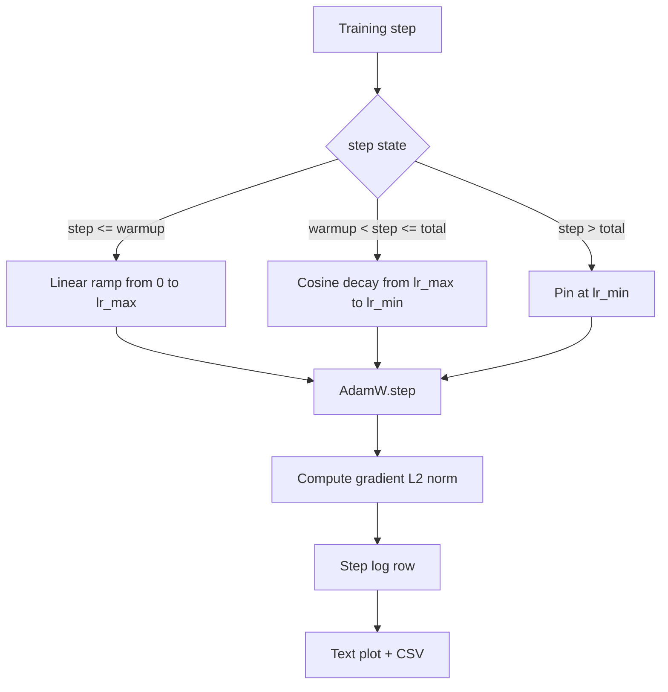

# 带线性预热的余弦学习率

> 学习率调度是仅次于损失函数的第二个重要决定。使用余弦衰减和线性预热的AdamW是现代语言模型训练的默认选择，因为它让模型在脆弱的第一个千次更新中看到较小的有效步长，然后逐渐增加到配置的峰值，再平滑地衰减回零。本课程构建该调度，绘制训练步数上的曲线，记录梯度范数并附在调度旁，并证明该调度遵守预热、峰值和衰减边界。

**类型：** 构建
**语言：** Python
**前置条件：** 阶段19 第30-37课
**时间：** 约90分钟

## 学习目标

- 实现一个AdamW优化器，连接到带有线性预热的余弦学习率调度。
- 计算调度在任何步骤的确切值，且跨运行无浮点漂移。
- 记录梯度L2范数与学习率并列，以便观察训练健康状况。
- 将调度渲染为人眼可读的文本图和任何工具可消费的CSV。

## 问题

最初的千次训练更新是最剧烈的。模型的权重仍接近初始化。优化器的运行二阶矩估计尚未稳定。梯度范数大且噪声多。如果在这些更新期间学习率处于峰值，模型要么直接发散，要么陷入一个再也逃不出的损失平台。两个众所周知的修复方法是梯度裁剪（第19阶段第45课的主题）和从零开始逐步增加的学习率调度。

带预热的余弦调度有三个区域。从第0步到第`warmup_steps`步，学习率从零线性增加到配置的峰值`lr_max`。从第`warmup_steps`步到第`total_steps`步，学习率遵循余弦曲线的上半部分，从`lr_max`衰减到`lr_min`。在`total_steps`之后，学习率固定在`lr_min`，这样配置错误的训练器如果超出步数，不会无声地退出调度。

构建问题在于调度很容易出现差一错误。这种差一错误会在训练运行六小时后显现为学习率在模型开始过拟合的时刻偏高或偏低1%，而除非在边界上彻底测试调度，否则这是不可见的。

## 核心概念



### 预热公式

对于`step`在`[0, warmup_steps]`中且`warmup_steps > 0`，学习率为`lr_max * step / warmup_steps`。退化情况`warmup_steps = 0`被视为“无预热”：调度直接从第0步的`lr_max`开始，立即进入余弦衰减。一些测试工具会传入`warmup_steps = 0`来检查调度是否仍能产生可用的曲线。

### 余弦公式

对于`step`在`(warmup_steps, total_steps]`中，学习率为`lr_min + 0.5 * (lr_max - lr_min) * (1 + cos(pi * progress))`，其中`progress = (step - warmup_steps) / max(1, total_steps - warmup_steps)`。在`step = warmup_steps`处，余弦值为`cos(0) = 1`，得到`lr_max`，恰好与预热端点匹配。在`step = total_steps`处，余弦值为`cos(pi) = -1`，得到`lr_min`，恰好与衰减端点匹配。

两个端点的连续性并非偶然。这是调度实现为单个函数（跨越`step`）而非三个函数拼接的原因。拼接的调度在第一次更改`lr_max`时会丢失一个边界。

### 总步数后的下限

对于`step > total_steps`，学习率保持在`lr_min`。约定明确：调度不会报错也不会外推；它固定在下限，并让训练器记录警告。需要延长训练的训练器应更改调度的`total_steps`，而不是循环。

### 梯度范数与学习率并列记录

调度是训练健康的一半。梯度范数是另一半。训练循环每步记录两者。发散的训练运行会在损失之前显示梯度范数尖峰；调优良好的预热会使梯度范数随学习率线性上升；过于激进的峰值会表现为预热后梯度范数仍然很高。磁盘上的数据集是`step, lr, grad_l2_norm, loss`。CSV是唯一持久的记录。

## 动手构建

`code/main.py` 实现：

- `CosineWithWarmup` - 一个无状态函数`lr(step) -> float`，基于配置的调度。
- `CosineWithWarmup` - 将模型、`lr(step) -> float`优化器和调度封装到一个单步函数中。
- `CosineWithWarmup` - 执行一次前向传播、一次反向传播，记录梯度L2范数，并对优化器应用`lr(step) -> float`。
- `CosineWithWarmup` - 将调度渲染为文本图，便于肉眼阅读。
- `CosineWithWarmup` - 每步输出一行，包含学习率。

文件底部的演示构建了一个微型`nn.Linear`模型，在一个固定输入批次上训练20步，并打印每步的学习率、梯度范数和损失。调度也以文本图形式渲染，用于视觉检查。

运行它：

```bash
python3 code/main.py
```

脚本以零退出，并打印每步的训练日志以及调度图。

## 生产模式

四种模式将调度提升为生产级制品。

**调度存在于配置中，而非代码中。** 训练器从提交到git的YAML或JSON配置中读取`warmup_steps`、`total_steps`、`lr_max`、`lr_min`。调度可重现，因为配置是内容寻址的；调度可审计，因为配置是PR差异的一部分。

**步计数器是单调的，且与轮数解耦。** 某些框架在数据集分片或数据加载器重启时混淆步数和轮数。调度从训练器的检查点读取`global_step`，而非从本地计数器。恢复的运行在正确的调度位置继续，因为步计数器是持久化的轴。

**运行目录中的调度图。** 每个训练运行将`outputs/lr_schedule.png`（或在本课程中是文本图）写入其运行目录。快速浏览目录的审阅者无需重新运行即可检查调度。这可以在PR时捕获配置错误的调度类错误。

**日志行模式固定。** `step, lr, grad_l2_norm, loss`按此顺序。下游笔记本或仪表盘读取该模式；重命名列而不增加版本会使所有现有仪表盘失效。

## 使用它

生产模式：

- **先扫描峰值，再扫描其他参数。** `lr_max`是最敏感的旋钮。先在小模型上扫描它；最优的`lr_max`与模型大小弱相关，因此小模型扫描提供了强先验。
- **预热是总步数的百分比，而非绝对计数。** 一个2亿步的运行有2000步预热几乎一开始就达到峰值；而一个2万步的运行在同样预热步数下会预热10%。将预热配置为百分比（典型值：1-3%），使调度随训练时长缩放。
- **`lr_max`非零是有意为之。** 为峰值`lr_max`的10%的下限能让优化器在长尾中继续学习。一个`lr_min`调度会产生一个在图上看起来很棒但模型实际并未完成训练的训练曲线。

## 发布

`outputs/skill-cosine-warmup.md`在实际项目中会描述哪个配置承载调度、从哪个训练器步数读取全局计数器、以及什么`lr_max`扫描产生了部署的值。本课程提供了引擎。

## 练习

1. 添加调度的平方根倒数变体，并在200步的玩具训练运行中比较。哪个曲线产生较低的最终损失？
2. 添加一个`--restart`标志，在`total_steps / 2`处增加第二次预热。论证在玩具运行中热重启是有益还是有害。
3. 添加一个单元测试，验证调度是连续的：对于`--restart`中的每一步，差值`total_steps / 2`被`[0, total_steps]`所界。
4. 将调度接入一个`--restart`，使其与框架代码组合。本课程使用普通的步函数；包装器改变了什么？
5. 添加一个`--restart`标志，通过`total_steps / 2`写入真实图。论证对于CI运行，本课程的文本图还是PNG是更好的默认选择。

## 关键术语

|  术语  |  人们的说法  |  实际含义  |
|------|-----------------|------------------------|
|  预热  |  "慢启动"  |  在前`warmup_steps`次更新中从零线性上升到`lr_max`  |
|  余弦衰减  |  "平滑下降"  |  在剩余步数中从`lr_max`到`lr_min`的上半余弦曲线  |
|  下限  |  "训练后"  |  在`total_steps`之后调度固定的`lr_min`值  |
|  梯度范数  |  "梯度L2"  |  连接后的梯度向量的欧几里得范数，每步记录  |
|  全局步数  |  "调度轴"  |  一个单调的步计数器，可在重启后生存并驱动调度  |

## 延伸阅读

- [Loshchilov and Hutter, SGDR: Stochastic Gradient Descent with Warm Restarts (arXiv 1608.03983)](https://arxiv.org/abs/1608.03983) - 余弦调度(cosine schedule)的参考论文
- [Loshchilov and Hutter, SGDR: Stochastic Gradient Descent with Warm Restarts (arXiv 1608.03983)](https://arxiv.org/abs/1608.03983) - AdamW的参考论文
- [Loshchilov and Hutter, SGDR: Stochastic Gradient Descent with Warm Restarts (arXiv 1608.03983)](https://arxiv.org/abs/1608.03983) - 阶跃函数如何与框架调度器组合
- 阶段19 · 42 - 该调度所消耗语料库的下载器
- 阶段19 · 43 - 与该调度共同演进的数据加载器
- 阶段19 · 45 - 梯度裁剪与自动混合精度(AMP)，循环中的下一层
