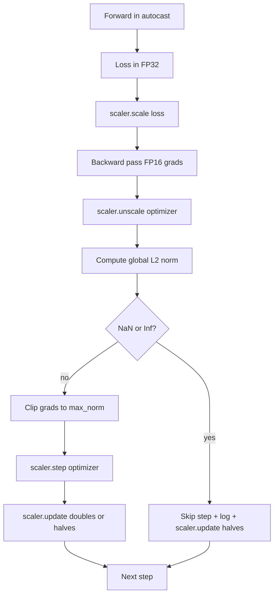

# 梯度裁剪与混合精度

> 上一课中的优化器和调度器假设梯度是正常的，但通常并非如此。单个糟糕的批次可能会使梯度范数飙升三个数量级。混合精度训练通过引入FP16损失侧溢出加剧了这一问题。本节课构建了生产训练中不可或缺的两个安全机制：基于配置的全局L2范数的梯度裁剪(Gradient Clipping)，以及包含autocast和GradScaler的混合精度循环，用于检测NaN和Inf，干净地跳过步骤，并记录缩放因子以供事后分析。

**类型：** 构建
**语言：** Python
**前置条件：** 阶段19 第30-37课
**时间：** 约90分钟

## 学习目标

- 计算所有参数梯度的全局L2范数，并在超过配置阈值时就地裁剪。
- 将训练步骤封装在autocast和GradScaler中，使得FP16前向和反向传播能够容忍溢出。
- 检测损失或梯度中的NaN和Inf，跳过优化器步骤，并记录跳过情况。
- 每步报告GradScaler的缩放因子，以便立即看到长时间连续的跳过。

## 问题

一个昨天还正常运行的训练过程，在第8217步出现了损失曲线的垂直飙升。罪魁祸首是一个梯度范数为4200的批次，是之前峰值范数的二十倍。如果没有裁剪，优化器的步骤会重置模型在过去一小时学到的一切。而使用全局L2范数裁剪为1.0后，同一个批次贡献了单位范数的更新；损失保持在趋势线上；训练得以继续。

混合精度训练通过在前向传播和大部分反向传播中使用FP16，将吞吐量提升2-3倍。代价是FP16的指数范围较窄。一个在FP16中溢出的典型梯度会变成Inf，并通过后续层传播为NaN，导致在下一个优化器步骤中所有权重变为NaN。PyTorch的GradScaler通过在后向传播前将损失乘以一个大的缩放因子，并在优化器步骤前将梯度除以相同的因子来解决这个问题。如果在反缩放时任何梯度是Inf或NaN，缩放器会跳过该步骤并将缩放因子减半；如果之前的N步都正常，缩放器会将因子加倍。在训练过程中，因子会找到FP16范围允许的最高值。

构建问题在于正确连接两者。在反缩放之前裁剪，阈值作用于缩放后的梯度；在反缩放之后裁剪，则GradScaler上的操作顺序很重要。正确的顺序是：`scaler.scale(loss).backward()`，然后`scaler.unscale_(optimizer)`，然后`clip_grad_norm_`，然后`scaler.step(optimizer)`，然后`scaler.update()`。任何其他顺序都会产生静默损坏的循环。

## 核心概念



### 全局L2范数

全局L2范数是拼接后的梯度向量的欧几里得范数，而不是每个参数的范数。PyTorch通过`torch.nn.utils.clip_grad_norm_(parameters, max_norm)`实现。该函数返回裁剪前的范数，以便课程可以记录自然值和裁剪后的值，这对于诊断“我们在每步都进行裁剪”是必要的。

### autocast和GradScaler

`torch.amp.autocast(device_type)`是上下文管理器，选择性地以FP16运行符合条件的操作（大多数矩阵乘法类操作）。`torch.amp.GradScaler(device_type)`是辅助工具，在反向传播前缩放损失，并在优化器步骤前对梯度进行反缩放。两者是设计在一起的；只使用其中一个而不用另一个是测试应该捕获的配置错误。

本课程使用CPU autocast，因为这是在CI中运行的；相同的模式通过将`device_type="cpu"`改为`device_type="cuda"`可以直接移植到CUDA。CPU上的GradScaler是桩（CPU autocast默认已经在BF16下运行，不需要损失缩放），但课程包含了调用点，以便连接方式与GPU循环相同。

### NaN和Inf检测

检测发生在两个地方。首先，损失本身在反向传播前通过`torch.isfinite`检查；Inf或NaN的损失不会产生有用的梯度，应在进入优化器之前跳过。其次，在`scaler.unscale_(optimizer)`之后，课程通过`has_non_finite_grad(...)`扫描反缩放后的梯度，并将任何Inf或NaN视为跳过。两个检查共同覆盖了前向传播和反向传播的失败模式。

### 缩放因子诊断

缩放因子是GradScaler的内部状态。每步课程读取`scaler.get_scale()`并将其与学习率和梯度范数一起记录。健康的运行显示缩放因子以2的幂次上升，直到饱和在`2^17`或`2^18`附近。异常运行显示因子在高值和低值之间振荡，这表示模型梯度有时在范围内，有时不在。如果不记录，这个诊断是不可见的。

## 动手构建

`code/main.py` 实现：

- `clip_global_l2_norm` - 对`torch.nn.utils.clip_grad_norm_`的封装，返回裁剪前和裁剪后的范数。
- `clip_global_l2_norm` - 一个辅助函数，用于扫描梯度中的NaN和Inf。
- `clip_global_l2_norm` - 封装模型、一个`torch.nn.utils.clip_grad_norm_`优化器、一个GradScaler和一个autocast设备。暴露一个`has_non_finite_grad`，运行完整的裁剪、缩放和NaN跳过流程。
- `clip_global_l2_norm`和`torch.nn.utils.clip_grad_norm_` - 结构化的每步记录。
- 一个演示，训练一个小的`clip_global_l2_norm`模型20步，在第5步向梯度中注入一个Inf以测试跳过路径，并打印结果日志。

运行它：

```bash
python3 code/main.py
```

脚本正常退出并打印每步日志，每行标记为`STEP`或`SKIP`；至少有一行是`SKIP`。

## 生产模式

四种模式将循环提升为生产级训练步骤。

**跳过计数器作为警报，而不是日志行。** 每次训练运行中少量的跳过步是健康的。每个epoch数百次跳过是严重警报：模型处于FP16无法维持的状态，循环正在静默失败。课程跟踪1000步滚动跳过率，在生产中，如果超过5%则会触发警报。

**裁剪阈值位于配置中。** `max_norm = 1.0`是语言模型训练的现代默认值。先在小型模型上进行扫描；较大的阈值允许模型从真正困难的批次中恢复；较小的阈值限制了最坏情况，但损失曲线可能更嘈杂。该阈值应与第44课的调度器位于相同的YAML或JSON配置中。

**范数日志与调度器一起写入CSV。** CSV列是`step, lr, grad_l2_pre_clip, grad_l2_post_clip, loss, skipped, skip_reason, scaler_scale`。打开文件的审查者可以看到调度器、梯度情况、缩放因子和跳过结果（及其原因）在同一行中。将列拆分到不同文件会导致分析不一致。

**`scaler.update()`每步都运行，即使跳过。** 在干净步上，缩放器读取其无inf计数器，递增它，并可能加倍因子。在跳过步上，缩放器减半因子并重置计数器。在跳过路径上忘记`update()`是导致“缩放因子从未改变”的错误。

## 使用它

生产模式：

- **Autocast设备与优化器设备匹配。** `torch.amp.autocast(device_type="cuda")`用于GPU训练；`torch.amp.autocast(device_type="cpu")`用于CPU。混合设备会产生静默类型错误，表现为损失曲线看起来正常但模型没有在学习。
- **在反向传播前检查损失。** `torch.amp.autocast(device_type="cuda")`是一个张量归约；成本可以忽略不计，而在NaN损失上节省的是整个训练步骤。始终运行它。
- **在`torch.amp.autocast(device_type="cpu")`中使用`torch.amp.autocast(device_type="cuda")`。** 将梯度设置为`torch.isfinite(loss).all()`而不是零，这允许优化器跳过未受影响的参数组的计算。该设置是免费的吞吐量改进和轻微的bug面减少。

## 发布

`outputs/skill-clip-amp.md`在实际项目中会描述训练步骤使用哪个裁剪阈值和autocast设备，每步CSV在版本控制中的位置，以及生产中的跳过率警报阈值。本节课交付了引擎。

## 练习

1. 将合成的Inf注入替换为真实的损失尖峰（将一批次的目标乘以1e8），并验证跳过路径被触发。
2. 添加一个`--bf16`模式，将autocast切换到BF16而不是FP16。BF16的指数范围比FP16更宽，很少需要损失缩放；验证在相同演示中跳过率降至零。
3. 添加一个单元测试，当没有裁剪发生时，梯度裁剪包装器正确返回裁剪前和裁剪后的范数。
4. 添加滚动窗口跳过率计算和一个CLI标志，如果连续100步的率超过配置阈值，则失败运行。
5. 将循环连接到写入规范CSV（`--bf16`），并通过每行后刷新确认文件在Ctrl-C后存活。

## 关键术语

|  术语  |  人们的说法  |  实际含义  |
|------|-----------------|------------------------|
|  全局L2范数  |  "裁剪目标"  |  所有可训练参数的梯度拼接向量的欧几里得范数  |
|  autocast  |  "混合精度"  |  在`with`块内对符合条件的操作选择性执行FP16（或BF16）  |
|  GradScaler  |  "损失缩放器"  |  在反向传播前乘以损失，并在优化器步骤前对梯度进行反缩放的辅助工具  |
|  跳过  |  "坏步"  |  由于梯度或损失非有限而被拒绝的优化器步骤；缩放器将因子减半  |
|  缩放因子  |  "缩放器状态"  |  GradScaler的当前乘数；在干净段后加倍，每次跳过时减半  |

## 延伸阅读

- [Micikevicius et al., Mixed Precision Training (arXiv 1710.03740)](https://arxiv.org/abs/1710.03740) - 原始的损失缩放提议
- [Micikevicius et al., Mixed Precision Training (arXiv 1710.03740)](https://arxiv.org/abs/1710.03740) - 梯度裁剪参考论文
- [Micikevicius et al., Mixed Precision Training (arXiv 1710.03740)](https://arxiv.org/abs/1710.03740) - 本课程封装的缩放器API
- [Micikevicius et al., Mixed Precision Training (arXiv 1710.03740)](https://arxiv.org/abs/1710.03740) - 本课程使用的裁剪原语
- 阶段19 · 42 - 下载器，其语料供给循环
- 阶段19 · 43 - 循环消费的数据加载器
- 阶段19 · 44 - 本循环与之组合的调度器
