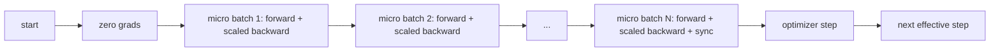
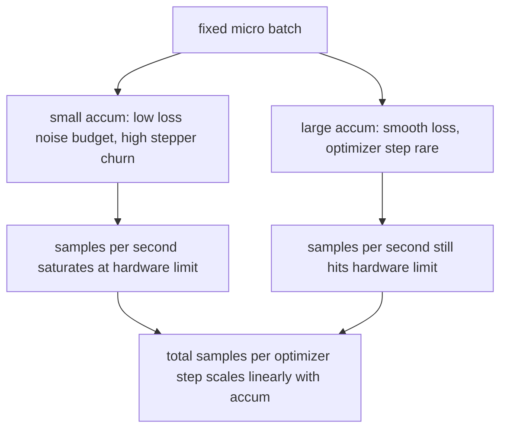

# 梯度累积

> 以无法承受的有效批次训练，一次一个微批次。缩放损失，保持优化器步骤，让梯度堆积起来。

**类型：** 构建
**语言：** Python
**前提条件：** 第19阶段第42至45课
**时间：** 约90分钟

## 学习目标

- 推导有效批次恒等式：`effective_batch = micro_batch * accum_steps`。
- 实现每微批次损失缩放，使得累积梯度与单次全批次反向传播相匹配。
- 跳过优化器同步，直到最后一个微批次（最后一步同步）。
- 绘制吞吐量与有效批次的关系曲线，并解释边际递减效应。

## 问题

你想要以512的有效批次训练，因为在该规模下损失曲线更平滑，优化器步骤更有意义。桌面上的加速器在内存耗尽前只能容纳32个样本。翻倍批次不可行。减半模型也不可行。该领域在2017年想到并一直使用的技巧是运行16次反向传播，让梯度在参数缓冲区中累积，只有当计数达到目标时才执行优化器步骤。

风险在于，损失不再与较大批次时的数值相同。简单求和16个迷你批次的交叉熵是单个完整批次损失的16倍。若不做缩放，梯度方向正确但幅度错误，优化器步骤会过大16倍。解决方法是一次除法。这个解决方法也容易被遗忘。

## 核心概念



约定很短：

- 每个微批次的损失在`accum_steps`之前除以`backward()`。PyTorch默认将梯度求和到`param.grad`中；该除法将运行总和推回到正确的尺度。
- 优化器步骤每个有效批次触发一次，在最后一个微批次的反向传播之后。中途执行步骤会扭曲后续运行依赖的所有参数。
- 优化器的状态（动量缓冲区、Adam动量）每个有效步骤推进一次，而不是每个微批次一次。否则指数移动平均会看到错误的频率，打乱调度。
- 在单设备上，这只是记账。在多等级集群上，相同的模式将非最终微批次包装在`accum_steps`上下文中，跳过梯度全规约；最后一个微批次一次性规约完整的累积梯度，而不是支付N次网络开销。

### 等价性证明的代码

```python
loss = criterion(model(x_full), y_full)
loss.backward()
opt.step()
```

等价于

```python
for x, y in chunks(x_full, y_full, n):
    scaled = criterion(model(x), y) / n
    scaled.backward()
opt.step()
```

直到浮点数求和顺序。循环结束时累积的梯度缓冲区与单次全批次反向传播产生的张量相同。课程代码在`equivalence_check`中用小于1e-4的最大绝对值差值断言这一点。

### 成本去向

每个微批次花费一次前向和一次反向。通过累积，你用时间换取内存。`outputs/accum-curve.json`中的吞吐量曲线展示了当有效批次在固定微批次下增长时发生的情况：



没有免费午餐。翻倍`accum_steps`使每个优化器步骤的墙上时间翻倍。变化的是梯度估计的方差：在相同的墙上预算下，你做出的优化器步骤更少，但每一步平均了更多样本。文献将大批次和小批次视为不同的优化问题；这里的课程是机械性的，而非统计性的。

## 动手构建

`code/main.py`是可运行的构件。它做三件事。

### 第1步：等价性检查

`equivalence_check()`用相同种子构建两个相同的网络副本。一个在一次前向中看到一个16样本的批次。另一个看到四个4样本的块，损失除以4。该函数比较优化器步骤前的梯度缓冲区和步骤后的参数。断言是`max_abs_diff < 1e-4`。

### 第2步：最后一步同步模式

`train_one_optimizer_step`遍历微批次。对于除最后一个外的每个微批次，它进入`no_sync_context(model)`。在单进程上，上下文是无操作；在DDP上，这是跳过梯度全规约的地方。无论哪种情况，记账相同。一个`sync_counter`记录了离开no_sync范围的次数；对于N个微批次，计数为每个有效步骤一次，而不是N次。

### 第3步：吞吐量曲线

`sweep_effective_batches`在固定微批次和一系列累积步骤下运行相同模型。对于每种设置，它记录：

- `samples_per_sec`：总样本数除以墙上时间
- `samples_per_sec`：每个有效步骤的第50百分位数
- `samples_per_sec`：被练习的集合点
- `samples_per_sec`：扫描中优化器步骤的平均值

输出落到`outputs/accum-curve.json`，可从一个笔记本中重用。

运行它：

```bash
python3 code/main.py
```

脚本打印等价性差异，然后是扫描表，接着是JSON路径。退出代码为零。

## 使用它

在生产训练中，梯度累积隐藏在一个旋钮后面。PyTorch的模式是`accumulation_steps = effective_batch // (micro_batch * world_size)`。这里不允许使用的框架包装了相同的循环，但步骤相同：缩放损失，非最终微批次跳过同步，累积，步骤一次。

现实中的三种模式：

- 微批次大小选择为使设备内存饱和。更小则浪费加速器周期。更大则崩溃。
- 有效批次根据学习率调度选择。大有效批次需要缩放学习率和预热；这是自2017年以来讨论的线性缩放规则。
- 累积计数是两者的桥梁，也是唯一可以在运行时自由调整而无需重写数据加载器的旋钮。

## 发布

`outputs/skill-gradient-accumulation.md`捕获了配方，以便同伴可以将其放入新仓库：按`accum_steps`缩放损失，非最终微批次跳过优化器同步，每个有效批次执行一次优化器步骤，以JSON格式记录有效批次吞吐量，使权衡可见。

## 练习

1. 用`--num-steps 100`重新运行扫描，并绘制每秒钟样本数与有效批次的关系图。曲线在哪里变平？
2. 添加一个错误的缩放变体（无除法），并显示第1步的参数差异与参考值的对比。
3. 将SGD换成AdamW，确认优化器状态每个有效步骤推进一次，而不是每个微批次一次。
4. 引入一个真实的`--num-steps 100`包装器，并将`DistributedDataParallel`路由到其方法。确认每个有效批次sync_calls减少N-1。
5. 修改等价性检查，比较两种不同的微划分（2×8 vs 4×4），并解释需要放宽的任何容差。

## 关键术语

|  术语  |  人们的说法  |  实际含义  |
|------|-----------------|------------------------|
|  微批次  |  你前向传播的批次  |  单次前向传播中适合内存的切片  |
|  累积步数  |  每步反向传播次数  |  在一个优化器步骤之前求和的向后次数  |
| 有效批次 | 批次 | 微批次乘以累积步数乘以数据并行世界大小 |
| 损失缩放 | 除以N | 每个微批次划分，使梯度总和与完整批次匹配 |
| 仅在最后同步 | 跳过其余 | 仅在窗口内的最后一次反向传播中运行梯度集合 |

## 延伸阅读

- 关于`DistributedDataParallel.no_sync`的PyTorch文档，介绍了同步最后一步技巧的生产版本。
- Goyal等人(2017)关于大批次训练的线性缩放，这是关注有效批次的典型原因。
- PyTorch问题追踪器关于梯度累积与混合精度反向缩放的交互。
- 第19阶段第42至45课涵盖了本课假设的模型、数据加载器、优化器和训练器框架。
- 第19阶段第47课涵盖了检查点和恢复，以便长时间累积运行能突破挂钟时间限制。
