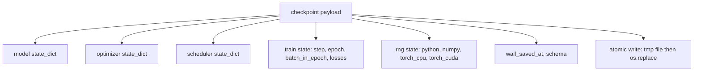
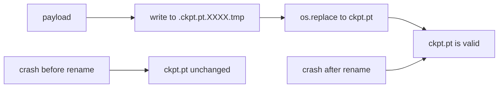
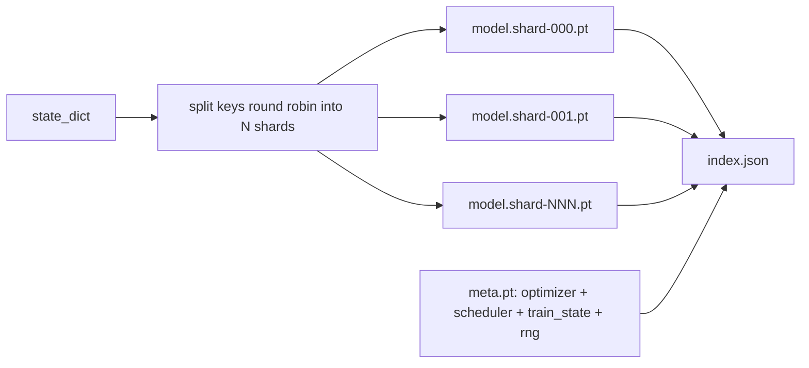

# 检查点保存与恢复

> 训练中断会导致运行终止；检查点能让它们继续。原子性地保存模型、优化器、调度器、损失历史、步计数器和随机数生成器(RNG)状态，这样在任何时刻被杀死都会在磁盘上留下一个有效的文件。

**类型：** 构建
**语言：** Python
**前提条件：** 第19阶段第42至45课
**时间：** 约90分钟

## 学习目标

- 将完整的训练状态打包到一个单一载荷中，以便重新加载到新进程中。
- 实现原子保存：先写入临时文件再重命名，这样崩溃永远不会留下半写文件。
- 恢复Python、NumPy和PyTorch的随机数生成器状态，使恢复后的损失与不间断基线匹配。
- 为不再适合单个文件的模型构建分片检查点(Sharded Checkpoint)布局，包含哈希验证的分片和JSON索引。

## 问题

你设置了一个18小时的训练作业。墙钟上限是4小时。在11小时时集群重启，因为某个比你级别高的人批准了内核升级。没有检查点你就要重新开始。没有恢复你还会丢失前11小时学到的优化器状态，所以即使模型权重幸存，AdamW动量也消失了，下一步会朝着训练轨迹已经越过方向猛冲。

正确的工件是一个包含继续所需一切的文件：模型参数、优化器状态、调度器状态、用于绘图的损失历史、当前步数、轮数和批内计数，以及每个随机源的状态。没有随机数生成器状态，恢复后的损失曲线就会不同。相同的模型、相同的数据、不同的洗牌、不同的丢弃掩码、仪表盘上不同的数字。

原子保存是合约的另一半。直接写入最终文件名意味着写入过程中崩溃会留下损坏的文件；恢复时会读取垃圾数据。先写入同一目录下的临时文件再重命名，意味着写入过程中崩溃会保留之前的好文件不受影响。在POSIX文件系统上，重命名是原子的。

## 核心概念



### 五个状态桶

|  桶  |  为什么重要  |
|--------|----------------|
|  模型  |  权重和缓冲区；模型是什么。  |
|  优化器  |  动量和自适应矩；没有它们，下一步就是一个不同的优化问题。  |
|  调度器  |  学习率在其曲线上的位置；余弦调度尤其在意。  |
|  训练计数器  |  步数、轮数、批内计数，以及绘制仪表盘的损失历史。  |
|  随机数生成器状态  |  丢失率、数据洗牌以及模型内部任何采样的确定性。  |

### 原子保存



两条规则。第一，临时文件与目标文件位于同一目录，这样重命名保持在同一个文件系统内；跨设备重命名不是原子的。第二，临时名称每次尝试都唯一，这样两个写入者不会互相覆盖。

### 分片检查点

当模型变大时，单文件载荷变得太大而无法快速加载、无法检查，并且在网络共享中途读取时出现问题。解决方案是将参数状态拆分为分片，并编写一个将它们联系起来的小索引。



索引记录分片数量、每个分片的sha256以及元文件的sha256。加载器在任何哈希不匹配时大声失败。分片可以放在不同的物理磁盘上；元数据小且先读取。

### 恢复在轮内继续

恢复到下一轮开始会浪费几分钟到一天的时间。修复方法是`(epoch, batch_in_epoch)`加上随机数生成器状态。加载后，训练循环将随机数生成器快进到当前轮中已被消耗的批次之后，并从`batch_in_epoch`继续。课程代码正是这样做的；断言是恢复后的损失轨迹与不间断基线在1e-4内匹配。

## 动手构建

`code/main.py`提供了四个原语和一个演示驱动程序。

### 第1步：捕获和恢复随机数生成器状态

`capture_rng_state`返回一个字典，包含Python的`random.getstate`、NumPy的`np.random.get_state`以及PyTorch CPU和CUDA的随机数生成器字节。`restore_rng_state`逆转它。CPU张量是一个uint8字节缓冲区，PyTorch的随机数生成器知道如何使用它。

### 第2步：原子保存

`atomic_save`将载荷写入目标目录中的临时文件，然后`os.replace`将其交换为最终文件名。`atomic_write_json`对分片索引执行相同操作。

### 第3步：完整检查点往返

`save_checkpoint`将模型、优化器、调度器、训练状态和随机数生成器打包到一个字典中。`load_checkpoint`逆转它并返回一个`TrainState`。schema字段是升级钩子：未来的格式更改会提升版本字符串，加载器进行调度。

### 第4步：分片变体

`save_sharded_checkpoint`将参数键轮询分配到N个分片中，使用自己的原子保存写入每个分片，写入一个包含优化器、调度器和训练状态的元文件，并写入带有分片sha256的JSON索引。`load_sharded_checkpoint`在合并前验证每个分片。

### 第5步：恢复演示

`run_resume_demo`训练一个小模型`total_steps`，在`interrupt_at`保存一个检查点，然后继续。第二个进程恢复检查点并运行剩余的步骤。该函数返回中断点后两个损失轨迹之间的最大绝对差。在恢复随机数生成器后，差异为零或浮点噪声。

运行它：

```bash
python3 code/main.py
```

单文件演示和分片演示都断言最大差异小于1e-4。摘要位于`outputs/resume-demo.json`。

## 使用它

生产训练栈将检查点保存作为训练器的一部分。结构相同：模型+优化器+调度器+计数器+随机数生成器，原子写入，按步骤命名以便轻松找到最新版本。分片布局通过并行读取支持大模型加载；index.json使其正常工作。

需要强制执行的三种模式：

- **模式(Schema)是有效载荷中的字符串。**迁移分支依赖于它。没有它，你无法在不破坏旧运行的情况下演化格式。
- **对每个分片进行Sha256校验。**静默截断的下载是最糟糕的错误；加载器要么快速失败，要么延迟失败。
- **保持检查点节奏诚实。**每N步和每墙钟分钟（以较短者为准）保存一次。否则，崩溃的长步骤会浪费完整窗口的工作。

## 发布

`outputs/skill-checkpoint-save-resume.md` 是任何新训练脚本的配方：有效载荷形状、原子写入、随机数生成器捕获、分片索引。将此技能放入仓库，在定期保存点连接`save_checkpoint`，在启动时连接`load_checkpoint`，运行就能承受终止。

## 练习

1. 将轮询分片替换为按参数组分片（以`.weight`结尾的层 vs 以`.bias`结尾的层）。每种布局何时更优？
2. 扩展保存循环以保留最近K个检查点并删除更旧的。当磁盘小时，K值应为多少？
3. 添加一个`.weight`标志，触发基于墙钟间隔的保存（不仅仅是步数）。
4. 添加启动时运行的校验和验证路径，扫描目录中的每个检查点，并报告哪些已损坏。
5. 实现一个`.weight`函数，向有效载荷添加新字段并升级模式字符串。使加载器同时兼容两个版本。

## 关键术语

|  术语  |  人们的说法  |  实际含义  |
|------|-----------------|------------------------|
|  原子保存(Atomic save)  |  “写入并祈祷”  |  写入同一目录下的临时文件，然后通过os.replace替换为目标文件名  |
|  状态字典(State dict)  |  “权重”  |  模型参数和缓冲区，按参数名索引  |
|  分片检查点(Sharded checkpoint)  |  “大模型文件”  |  多个文件，每个分片一个，加上元文件和包含sha256的JSON索引  |
|  随机数生成器状态(RNG state)  |  “随机种子”  |  捕获的python random、numpy、torch CPU、torch CUDA的状态；不仅仅是种子  |
|  周期中期恢复(Mid-epoch resume)  |  “重启”  |  快进随机数生成器，并从同一周期的下一批次继续  |

## 延伸阅读

- POSIX `rename`语义用于`os.replace`所依赖的原子性声明。
- PyTorch关于`rename`和`os.replace`的文档，包括跨设备恢复的`torch.save`。
- 第19阶段第46课涵盖了本课检查点有效载荷所承受的梯度累积。
- 第19阶段第48课涵盖了此方案兼容其状态字典格式的分布式包装器。
- Linux内核`rename`文档介绍了原子重命名背后的持久性保证。
