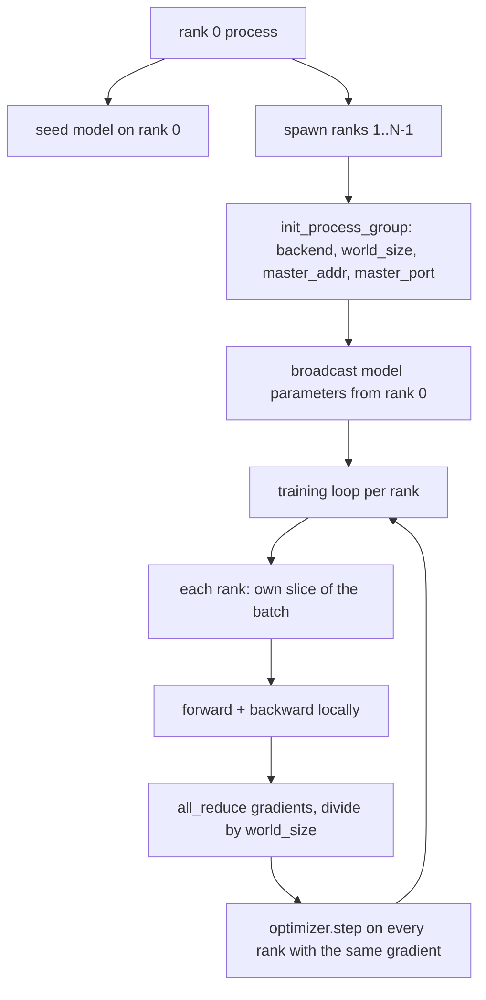
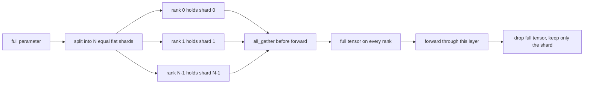

# 从零开始实现分布式数据并行（DDP）与 FSDP

> 多秩训练是两个集合通信规则和一个原则：启动时广播参数，反向传播后平均梯度，确保各秩在训练步数上始终保持一致。

**类型：** 构建
**语言：** Python
**前提条件：** 第19阶段第42至45课
**时间：** 约90分钟

## 学习目标

- 通过 `gloo` 后端跨 N 个秩建立进程组，无需特殊硬件。
- 实现一个最小 DDP 封装器，在构造时广播参数，反向传播后执行全规约梯度。
- 证明对每个秩的梯度进行全规约等价于单个进程在拼接输入上计算的梯度。
- 勾勒 FSDP 参数分片：每个秩持有一个切片，前向传播时收集完整张量，之后丢弃。

## 问题

模型能放入一个设备，但数据集不能。优化预算要求每单位物理时间看到 N 倍的样本数。第一个杠杆是数据并行：每个秩在批次的不同切片上运行相同模型，然后在优化器步骤前平均梯度。第二个杠杆是 FSDP：模型也无法放入一个设备，因此每个秩持有每个参数的一部分，在前向传播过程中逐层重建完整张量。

痛点在于簿记。如果参数在各秩间漂移，训练将在无声中损坏。如果你平均了梯度但没有平均损失，仪表盘将说谎。如果集合通信后端无法在拓扑上达成一致，训练将永远挂起。解决办法是手动编写一次集合通信，并且永远不要信任你无法复现的封装器。

本课在 CPU 上运行。不假设有 CUDA。`gloo` 后端随每个 PyTorch 版本发布，支持 `torch.multiprocessing` 工作进程；相同的代码切换到多 GPU 节点上的 `nccl` 时无需改变结构。

## 核心概念



### 两个关键的集合通信操作

|  集合通信  |  作用  |  时机  |
|------------|--------------|------|
|  `broadcast`  |  将一个张量从一个秩复制到所有其他秩  |  参数初始化、调度器状态、任何一到多同步  |
|  `all_reduce`  |  跨所有秩对张量求和（或求平均、最大值），每个秩都得到结果  |  反向传播后的梯度平均  |
|  `all_gather`  |  每个秩贡献一个张量，每个秩得到拼接后的结果  |  对数几率收集、FSDP 参数去分片  |

DDP 的约定是构造时执行 `broadcast`，反向传播后执行 `all_reduce`。FSDP 的草图在每个层的前向传播前添加了 `all_gather`。

### 梯度平均等价于单进程梯度

在 N 个秩上使用 B 个样本的批次训练的模型，必须产生与单个进程在 N*B 样本批次上训练相同的梯度。诀窍在于，对每个秩的梯度求和并除以 N 得到平均损失梯度，这与使用平均约减的交叉熵在全批次上产生的梯度一致。本课代码通过手动全规约梯度与参考单进程梯度之间的 `max-abs-diff < 1e-3` 断言了这一点。

### FSDP 草图



内存优势是确切的：每个秩的参数内存降低到 1/N。代价是收集操作，每次前向传播都要执行。生产级 FSDP 将收集操作与前一层计算重叠，因此物理时间开销远小于朴素估计。本课对每个参数进行往返，并断言重建结果与原始结果比特相等。

### CPU 和 gloo 后端

CUDA 是生产目标，但相同的代码路径在 CPU 上存在。`gloo` 是 CPU 集合通信后端。它比 GPU 上的 `nccl` 慢几个数量级，但 API 接口相同。本课的进程组使用 `backend="gloo"` 初始化，秩通过 `torch.multiprocessing` 生成，而非 `torchrun`；两者最终调用相同的 `torch.distributed`。在多 GPU 节点上，唯一的变化是 `backend="nccl"`、设备张量和 `torchrun` 的启动方式。

## 动手构建

`code/main.py` 是可运行的文件。

### 步骤 1：启动进程组

```python
os.environ["MASTER_ADDR"] = "127.0.0.1"
os.environ["MASTER_PORT"] = str(port)
dist.init_process_group(backend="gloo", rank=rank, world_size=world_size)
```

`MASTER_ADDR` 和 `MASTER_PORT` 是汇合点：每个秩拨打到同一主机上的相同端口。本课通过绑定并关闭的技巧选取一个空闲端口，以避免多个运行共享机器时发生冲突。

### 步骤 2：构造时广播

`MinimalDDP.__init__` 遍历每个参数和缓冲区，并调用 `dist.broadcast(tensor, src=0)`。秩 0 的值成为规范初始化。没有这一步，每个秩会使用自己的种子初始化，从第一步起各秩就出现分歧。

### 步骤 3：反向传播后全规约梯度

```python
def all_reduce_grads_(module, world_size):
    for p in module.parameters():
        if p.grad is None:
            p.grad = torch.zeros_like(p.data)
        dist.all_reduce(p.grad.data, op=dist.ReduceOp.SUM)
        p.grad.data.div_(world_size)
```

每个秩最终得到相同的平均梯度。优化器步骤现在在每个秩上都是相同输入的函数，这就是参数在整个训练过程中保持同步的原因。

### 步骤 4：证明等价性

`manual_all_reduce_matches_single_process` 在秩 0 上构建相同的模型，并比较全规约后的梯度与单个进程在拼接输入上计算的梯度。最大绝对差异约为 1e-8。

### 步骤 5：FSDP 往返

`fsdp_round_trip_sketch` 将每个参数展平，填充到 `world_size` 的整数倍，切片，全收集，然后去填充。每个秩的重建结果与原始结果相同。这是去分片步骤；逆操作（前向传播后重新分片）是从收集的张量中切出一个切片。

运行它：

```bash
python3 code/main.py
```

默认世界大小为 2。两个 CPU 进程生成，通过 `gloo` 相互通信，正常退出。输出 `outputs/ddp-demo.json` 记录了每个秩的参数和、全规约后的梯度范数、FSDP 往返结果以及手动梯度与参考梯度的差异。

## 使用它

生产训练栈调用相同的原语。PyTorch 的 `DistributedDataParallel` 增加了：将全规约与反向传播重叠的反向传播后梯度钩子，将多个小梯度合并为一个集合通信的分桶全规约，以及第 46 课使用的 `no_sync` 上下文。

PyTorch的FSDP增加了：每层一个扁平参数视图，使得每个rank持有一个连续缓冲区；将下一层的unshard与当前层的计算重叠；以及可选的将分片卸载到CPU。

形状保持不变：启动时广播，反向传播后规约，参数不再适合时分片。

## 发布

`outputs/skill-distributed-fsdp-ddp.md`携带新训练脚本的配方：用`gloo`（CPU）和`nccl`（GPU）启动进程组，将模型包装在DDP外壳中，该外壳在构造时广播、在反向传播后规约，并可选地使用FSDP草图中的all_gather模式对参数进行分片。

## 练习

1. 使用`--world-size 4`运行，并确认整个运行过程中参数散布保持在1e-3以下。
2. 将手动平均替换为`--world-size 4`并计时差异。
3. 向DDP包装器添加一个反向传播后钩子，使all-reduce与反向传播的其余部分重叠；测量挂钟时间的改进。
4. 实现FSDP的重新分片步骤：前向传播后，再次用本地分片替换完整张量。确认每个rank的内存下降。
5. 切换到CUDA机器上的`--world-size 4`后端。注意哪些环境变量改变，哪些保持不变。

## 关键术语

|  术语  |  人们的说法  |  实际含义  |
|------|-----------------|------------------------|
|  后端  |  "gloo或nccl"  |  实现集合操作的库；gloo用于CPU，nccl用于GPU |
|  世界大小  |  "总rank数"  |  组中的进程数；组是集合操作的单位 |
|  Rank  |  "工作器ID"  |  组内的进程标识符，从零开始索引 |
|  全规约  |  "对梯度求和"  |  对所有rank上的张量求和，每个rank得到相同结果 |
|  解除分片  |  "收集参数"  |  通过all_gather从每个rank的切片重建完整张量 |

## 延伸阅读

- PyTorch `torch.distributed`文档介绍了本节课所依赖的集合语义。
- `torch.distributed`库的集合列表，其形状与CUDA支持的`gloo`原语相同。
- 第19阶段第46课介绍了梯度累积模式，该模式将DDP的all-reduce封装在`torch.distributed`中。
- 第19阶段第47课介绍了在DDP和FSDP运行中幸存的检查点布局。
- PyTorch FSDP文档提供了此处勾勒的参数分片的生产实现。
