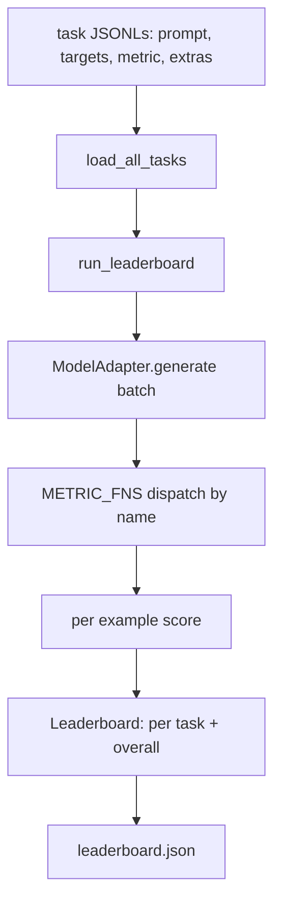
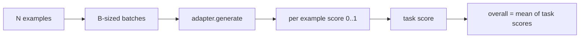

# 语言模型评估框架

> 一个在你无法定义的任务上表现良好的模型，只是偶然表现良好。框架就是任务定义、指标、运行器和排行榜，以一种简短、可替换的形式整合在一起。

**类型：** 构建
**语言：** Python
**前提条件：** 第19阶段第42至45课
**时间：** 约90分钟

## 学习目标

- 将任务定义为JSONL文件，每个示例包含`prompt`、`targets`、`metric`，以及可选的`extras`。
- 实现五个指标：精确匹配、rouge-l F1、可执行检查、多项选择和子串包含。
- 构建一个运行器，按任务批次处理示例并分发到可替换的模型适配器。
- 输出一个排行榜JSON，包含每个任务的得分、延迟和一个可复现的整体平均值。

## 问题

每周都有新的语言模型发布。市场营销声称它表现良好。诚实的提问是：在什么方面表现良好？诚实的回答是你自己编写的排行榜，因为供应商的排行榜是他们自己调优过的。

仓库中没有框架，你只能凭感觉比较两个模型。有了框架，你可以通过在固定任务集和固定指标下的得分来比较它们，并且输出可以差异对比的JSON。框架是昨天运行和今天运行之间的契约。没有它，回归就会发布。

陷阱是让框架过度适配单一模型。解决方法就是反过来利用同一个陷阱：框架足够小，十五分钟就能读完；任务足够小，可以放在仓库中；指标从头编写，以便同事审计；适配器是模型特定代码的唯一位置。更换适配器，排行榜随之变化；更换任务，排行榜也随之变化。其他任何东西都不应变化。

## 核心概念



### 任务规范

每个示例是一行JSONL：

```json
{"id": "arith-00", "prompt": "compute: 2 + 2", "targets": ["4"], "metric": "exact_match"}
```

对于需要评分辅助工具的指标，`extras`携带额外负载：

```json
{
  "id": "code-00",
  "prompt": "python: write a function f that doubles its input",
  "targets": ["ok"],
  "metric": "code_exec",
  "extras": {"io_pairs": [[1, 2], [3, 6]]}
}
```

任务是在`outputs/tasks/`下的`.jsonl`文件。文件名是任务名称。文件中的所有示例共享一个指标。

### 五个固定任务

|  任务  |  指标  |  测试内容  |
|------|--------|---------------|
|  arithmetic  |  exact_match  |  确定性答案上的令牌级别正确性  |
|  summary  |  rouge_l  |  与一行参考摘要的最长公共子序列F1  |
|  code-exec  |  code_exec  |  可执行测试：预测的函数必须满足一组输入-输出对  |
|  multiple-choice  |  multiple_choice  |  预测的第一个字母必须匹配允许的字母  |
|  generation  |  substring_contains  |  自由文本必须至少包含一个目标子串  |

### 指标契约

每个指标都是从`(prediction, targets, extras) -> float in [0.0, 1.0]`到@@SKIP0001@@的函数。框架平均每个示例的得分得到任务得分，然后平均任务得分得到总体得分。指标函数很小：

- `exact_match`: 小写，折叠空白，相等性。
- `exact_match`: 相同规范化，子串测试。
- `exact_match`: 首字母大写。
- `exact_match`: LCS长度除以预测和参考长度，精确率和召回率的F1。
- `exact_match`: 在受限命名空间中执行预测，对每个输入-输出对调用`substring_contains`，计数匹配。

code_exec指标在剥离了内置函数的命名空间中运行预测。本课的测试断言`import os`会报错，因为`os`不在命名空间中；你无法通过代码预测访问文件系统。

### 模型适配器

```python
class ModelAdapter(Protocol):
    def generate(self, prompts: Sequence[str]) -> List[str]: ...
    @property
    def name(self) -> str: ...
```

适配器是接缝。本课提供了`ToyAdapter`，一个确定性的模式匹配器，它为五个固定任务中的每个提示返回正确答案。真正的适配器会调用模型并返回其输出。框架不关心是哪种。

### 运行器

`run_task`一次批处理`batch_size`个提示，并分发给指标函数。`run_leaderboard`遍历每个任务并计算平均。`write_leaderboard`输出带有schema字符串的JSON，以便未来的格式更改不会静默破坏仪表板。



```figure
eval-harness-matrix
```

## 动手构建

`code/main.py` 是可运行的文件。

### 步骤1：播种固定任务

`seed_fixture_tasks(target_dir)`写入五个`.jsonl`文件。当目录为空时，第一次运行`main.py`会播种它们。

### 步骤2：加载任务

`load_all_tasks(task_dir)`读取每一个`.jsonl`，并返回从任务名称到`Example`记录列表的字典。以`#`开头的注释行和空行会被跳过，以便贡献者可以注释文件。

### 步骤3：实现指标

每个指标都是一个带有单元测试的小函数。本课的测试套件包含13个用例，涵盖规范化、部分重叠、代码执行和不安全代码拒绝。

### 第4步：编写运行器

`run_task` 迭代批次，并生成一个包含得分、正确计数、总计数和延迟的 `TaskResult`。`run_leaderboard` 遍历所有任务，并生成一个包含总体平均值的 `Leaderboard`。

### 第5步：输出JSON

`write_leaderboard` 序列化看板。`--include-per-example` 标志会转储每个示例的记录，以便在分数变化时，你可以将预测与之前的运行结果进行对比。

运行它：

```bash
python3 code/main.py
```

该脚本在首次运行时植入测试夹具，使用玩具适配器（该适配器能正确解答所有夹具）对其进行评分，并写入 `outputs/leaderboard.json`。使用玩具适配器时总体得分为1.0；在 `test_main.py` 中的桩适配器测试显示，当适配器无法回答时，同一评测框架会产生0.0分。

## 使用它

要接入真实模型，编写一个适配器。形式如下：

```python
class HttpAdapter:
    name = "vendor.v1"

    def __init__(self, endpoint, api_key):
        self.endpoint = endpoint
        self.api_key = api_key

    def generate(self, prompts):
        out = []
        for prompt in prompts:
            response = http_post(self.endpoint, prompt, self.api_key)
            out.append(response["text"])
        return out
```

将 `ToyAdapter` 替换为 `HttpAdapter`，位于 `main()` 顶部。评测框架、任务、指标和排行榜保持不变。

在实际项目中发布评测框架时应遵循的三个模式：

- **固定任务文件。** leaderboard.json 携带哈希固定的任务内容，或者它旁边携带 JSONL 文件；否则当任务文件变化时分数也会变化，你无法区分。
- **对比预测结果，而不仅仅是分数。** `--include-per-example` 标志让你看到分数下降当天模型的具体输出。
- **限制批次大小。** 真实适配器有速率限制。较小的批次大小可保持评测框架跨供应商的兼容性。

## 发布

`outputs/skill-lm-eval-harness.md` 包含配方：JSONL 任务规范、五个指标、可替换的适配器、批处理运行器、带模式字符串的排行榜 JSON。`outputs/tasks/` 中的任务文件是测试夹具；将它们复制到实际项目中作为起始文件。

## 练习

1. 添加第六个任务，并附带一个你从头编写的自定义指标（类似 BLEU 的重叠度、类似 BLEURT 的参考评分，或任何具有明确约定的指标）。
2. 扩展 `code_exec` 以捕获标准输出，并接受预期标准输出列表作为目标。
3. 添加一个排行榜差异命令：给定两个 `code_exec` 文件，输出哪些任务发生了变动及变动幅度。
4. 限制每个示例的延迟。为适配器调用设置超时；在排行榜中单独显示 `code_exec` 列。
5. 在排行榜中使用 sha256 固定任务内容，以便未来读者能验证他们评分的是相同的任务。

## 关键术语

|  术语  |  人们的说法  |  实际含义  |
|------|-----------------|------------------------|
|  任务规格  |  "评估格式"  |  包含提示、目标、指标和每个示例的可选附加字段的 JSONL 文件  |
|  指标  |  "评分方式"  |  从（预测、目标、附加字段）到 [0, 1] 范围内浮点数的函数  |
|  适配器  |  "模型客户端"  |  包含 generate(prompts) -> list[str] 方法的对象；唯一的模型特定代码  |
|  排行榜  |  "计分板"  |  包含每个任务得分、总计数、延迟和总体平均值的 JSON  |
|  代码执行指标  |  "运行并检查"  |  在受限命名空间中执行预测，与输入-输出对进行比较  |

## 延伸阅读

- 原始的 lm-evaluation-harness 作为生产参考，规模大得多但结构相同。
- HuggingFace 的 lighteval 作为同一契约的另一种实现。
- 第19阶段第46课涵盖了评测框架评分的训练栈中使用的梯度累积模式。
- 第19阶段第47课涵盖了你要评分的检查点格式；在排行榜中固定检查点哈希。
- 第19阶段第48课涵盖了生成被测模型的分布式训练栈。
