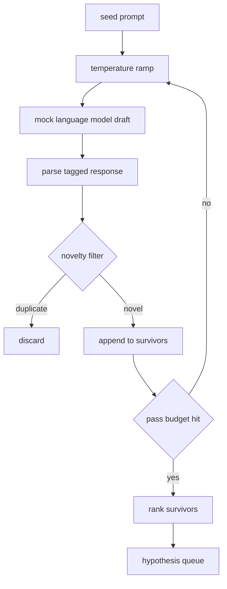

# 假设生成器

> 一个研究代理问同一个问题两次就是浪费令牌。诀窍是迫使每次输出都落到新的地方。

**类型：** 构建
**语言：** Python
**先决条件：** 第 19 阶段 Track A 第 20-29 课
**时间：** 约 90 分钟

## 学习目标
- 从种子提示驱动采样器，并将其输出转换为类型化假设记录。
- 每次通过时提高采样器温度，使下一版草稿与上一版相距更远。
- 使用小型嵌入模型和余弦距离阈值过滤近似重复项。
- 使用融合了新颖性、特异性和可测试性的评分函数对幸存者进行排序。
- 保持每一步是确定性的，这样相同的种子总是产生相同的队列。

## 为什么先生成，再过滤

一个一次只问一个模型一次的规划器只能得到一个假设。这对于一个示例来说没问题。但对于一个研究循环来说，形状不对。循环需要一个有深度的排名队列，这样当第一个假设失败时，运行者无需为另一次完整的采样过程付费就可以准备好下一个假设。

两个想法结合产生这个队列。第一个是温度递增(ramping)：每次通过采样器时温度升高一档，鼓励后续草稿漫游。第二个是新奇性过滤：每次草稿后，生成器测量与之前所有幸存者的嵌入距离，并拒绝簇内的任何草稿。

本课附带一个模拟语言模型，它对固定提示返回脚本化的令牌序列。这个模拟足以运行完整路径：输入种子提示，应用温度递增，解析候选，运行新奇性过滤，输出排名队列。

## 假设的形状

```text
Hypothesis
  id             : int           (monotonic within a run)
  text           : str           (the claim)
  variables      : list[str]     (what changes between conditions)
  metric         : str           (what the runner will measure)
  baseline_ref   : str | None    (which paper or run the comparison cites)
  draft_pass     : int           (which sampler pass produced this)
  temperature    : float         (the sampler setting at draft time)
  novelty_score  : float         (distance from prior survivors, 0..1)
  rank_score     : float         (weighted sum used for ordering)
```

`variables` 和 `metric` 不是自由文本。解析器从标记响应中提取它们。第 52 课的运行者(runner)在构建实验配置时直接读取这些字段。

`baseline_ref` 是可选的但推荐使用。第 53 课的评估器(evaluator)需要一个基线进行比较。如果假设省略了基线，评估器会回退到同一指标的上一次运行。

## 架构



循环很直接。有趣的部分是每个盒子都有一个硬合同。

## 温度递增

从 `t_min` 开始，到 `t_max` 结束，步长 `(t_max - t_min) / (n_passes - 1)`。每次通过以当前温度调用采样器，产生 `n_passes` 个均匀分布在 `GeneratorConfig.schedule()` 之间的值。模拟模型通过在一小组以 `(prompt, temp_bucket)` 为键的脚本化响应之间切换来模拟温度。桶是开区间，因此温度的小变化会选取不同的桶并产生不同的草稿。在生产环境中，采样器将是一个真实模型，并传递 `temperature=t`。

默认调度是从 `0.2` 到 `1.2` 进行 6 次传递。六次足以填满队列，而无需为那些新奇性过滤器会拒绝的样本付费。低于 `0.2` 时，模型会重复种子。高于 `1.2` 时，响应往往会偏离主题并导致解析器失败。

## 新奇性过滤

每次草稿解析后，生成器将文本嵌入并与每个已接受的假设进行比较。嵌入是一个小的哈希词袋(token)向量，归一化为单位长度。两个单位向量之间的余弦距离是 `1 - dot(a, b)`。如果草稿与任何先前幸存者的最小距离高于 `novelty_threshold`，则通过。默认值为 `0.25`。

哈希嵌入并不花哨。它是确定性的，零依赖，并且足以捕获明显的情况：两个草稿共享大部分名词。生产部署将换成一个小句子模型。接口保持不变。

## 排名分数

```text
rank_score = w_novelty * novelty_score
           + w_specificity * specificity_score
           + w_testability * testability_score
```

三个子分数。`novelty_score` 是与先前幸存者的最小嵌入距离。`specificity_score` 是假设中具体变量数量除以目标数量的比值。`testability_score` 如果假设同时指定了指标和基线则为 1，如果只有指标则为 0.5，否则为 0。

默认权重为 `0.4`、`0.3`、`0.3`。权重位于生成器配置中，以便后续课程可以无需分叉代码即可更改它们。

## 模拟语言模型

```python
class MockLLM:
    def sample(self, prompt: str, temperature: float, seed: int) -> str:
        ...
```

给定一个 `(prompt, temperature, seed)` 三元组，采样器是确定性的。模拟保持一个以 `(prompt_signature, temperature_bucket)` 为键的脚本响应表。如果表中没有某个键的条目，采样器返回一个会导致解析器失败的备用响应。备用路径由其中一个测试执行。

种子被混合到响应中，因此相同的 `(prompt, temperature)` 对但不同的种子会产生不同的草稿。在测试中，我们固定种子以保持结果可复现。在实际部署中，种子将来自系统时钟或计数器。

## 输出队列

输出是一个按 `rank_score` 降序排列的 `Hypothesis` 记录列表。第 52 课中的运行者弹出头部，运行实验，第 53 课中的评估者写回一个裁决。如果裁决说假设是错误的，运行者弹出下一个。

队列是有限的。当队列为空时，编排器可以加宽种子提示并再次运行生成器，或者停止并报告预算已用尽。

## 如何阅读代码

`code/main.py` 定义了 `Hypothesis`、`MockLLM`、`HypothesisGenerator` 和一个确定性演示。生成器暴露一个返回排序队列的单一 `run(seed_prompt)` 方法；传递次数从 `GeneratorConfig.n_passes` 中读取而非作为参数传递。嵌入是一个哈希词袋。新奇性过滤器是一个单独的函数。排名分数是一个单独的函数。没有任何东西依赖 `numpy`；嵌入数学是纯标准库，因此本课保持可移植性。

`code/tests/test_generator.py` 涵盖了线性路径、重复拒绝路径、解析器失败路径、温度递增边界和排名排序。

## 这位于何处

第 50 课生成队列。第 51 课获取队列头部并运行文献搜索以确认或反驳它。第 52 课获取同一头部并运行实际实验。第 53 课读取两个输出并写出裁决。这四课组合成一个没有人类参与的研究循环；人类可以在任何边界介入。
