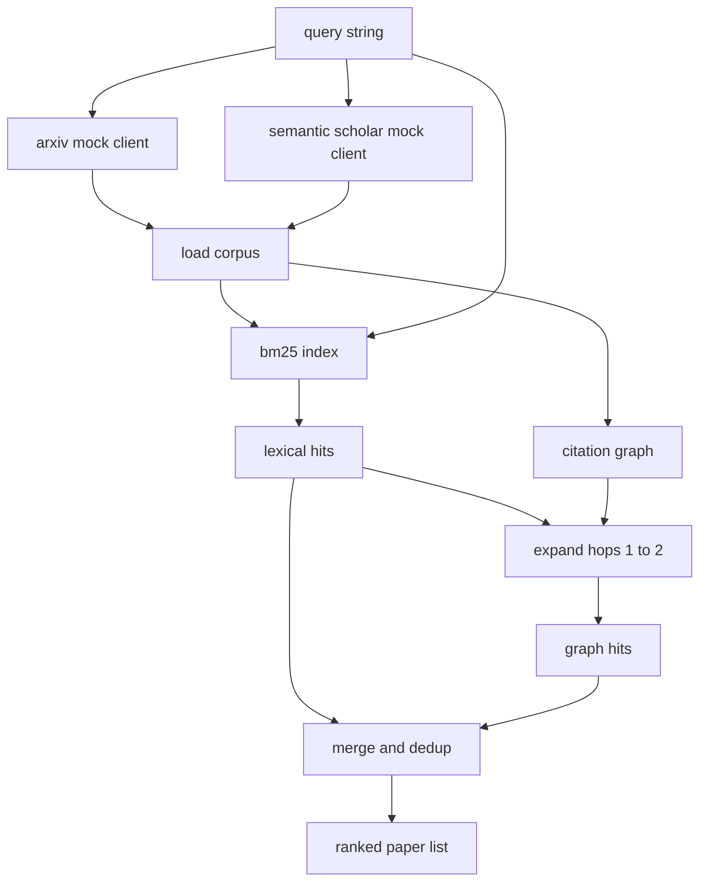

# 文献检索

> 假设很廉价。知道别人是否已经证明过它才是昂贵的地方。在运行者启动沙箱之前，构建能够回答那个问题的检索层。

**类型：** 构建
**语言：** Python
**先决条件：** 第 19 阶段 Track A 第 20-29 课
**时间：** 约 90 分钟

## 学习目标
- 用循环下游将读取的字段建模一份小型论文记录。
- 仅使用标准库数据结构在摘要上构建BM25索引。
- 遍历引文图以找到词汇搜索遗漏的论文。
- 通过稳定的论文ID对词汇和图表遍历的结果进行去重。
- 将两个模拟外部API包装在一个客户端后面，这样当真实端点落地时上游调用点保持不变。

## 为什么需要两次检索遍历

对摘要进行关键词搜索会返回与查询共享词汇的论文。这覆盖了大部分表面情况。它遗漏了两种情况。第一种是基础论文使用了不同的词汇；例如，查询“稀疏注意力”会错过一篇题为“transformer路由中的块选择”的论文。第二种是相关论文是引用已知锚点的后续工作；找到锚点并向前遍历比暴力搜索摘要池更高效。

这节课构建了两种遍历。对摘要的BM25捕捉词汇命中。引文图遍历将种子集向前和向后扩展一到两跳。通过论文ID对并集进行去重，并按照一个小的组合分数排序。

## 论文形状

```text
Paper
  id          : str           (stable identifier, "p001" for the mock corpus)
  title       : str
  abstract    : str
  year        : int
  authors     : list[str]
  references  : list[str]     (paper ids this paper cites)
  citations   : list[str]     (paper ids that cite this paper)
  source      : str           (which mock api supplied it, "arxiv" or "s2")
```

参考文献和引数字段构成了有向引文图。两个模拟API返回重叠但不完全相同的字段，因此语料库加载器在`id`上合并它们。

## 架构



检索客户端拥有两种遍历和合并。调用者向其提供查询，并得到一个排序列表，其中每个条目都带有每篇论文的得分字段（`bm25_score`、`graph_distance`、`recency_score`、`final_score`），这些字段解释了排序。

## 从头实现BM25

实现是标准的Okapi BM25，使用默认参数`k1=1.5`、`b=0.75`。索引是两个字典：`term -> doc_frequency`和`term -> list of (doc_id, term_count)`。文档长度是摘要的标记数。平均文档长度在索引构建时计算一次。对查询进行评分是对查询词项的`idf * tf_norm`求和，其中`tf_norm`是标准的BM25长度归一化词频。

分词器是`lower`，然后在非字母数字字符上分割。它没有被词干化。生产系统会替换为一个小型词干分析器。接口保持不变。

```text
idf(t)      = log((N - df + 0.5) / (df + 0.5) + 1.0)
tf_norm(t)  = (f * (k1 + 1)) / (f + k1 * (1 - b + b * dl / avgdl))
score(d, q) = sum over t in q of idf(t) * tf_norm(t)
```

## 引文图遍历

图是根据语料库一次性构建的。前向边从一篇论文指向其参考文献。后向边从一篇论文指向其引用。遍历是由顶部BM25命中结果作为种子的广度优先搜索，最多两跳。

两跳是一个有意的上限。一跳太浅；代理通常想要直接祖先或后代。三跳会在连通图上使结果规模膨胀，并且容易偏离主题。这节课将跳数限制暴露为一个配置旋钮，以便下游循环可以收紧它。

## 去重与排序

两次遍历返回重叠的集合。合并以论文ID为键。对于每篇论文，最终得分是加权混合。

```text
final_score = w_bm25 * bm25_score_norm
            + w_graph * graph_score
            + w_recency * recency_score
```

`bm25_score_norm`是BM25得分除以合并集合中的最大BM25得分（因此该字段在0到1之间）。`graph_score`对于直接词汇命中为1，然后一跳为`0.6`，两跳为`0.3`，否则为0。`recency_score`是一个从语料库最小年份的0到最大年份的1的线性斜坡。

默认权重是`0.5`、`0.3`、`0.2`。权重是可配置的；一个过时的话题可能会降低时效性的权重，而一个快速变化的话题则会提高它。

## 模拟语料库

语料库由`build_corpus()`生成的一百篇论文组成。每篇论文都有一个手写的标题和摘要，涉及五个主题之一：注意力稀疏性、检索增强、低秩适配器、数据集蒸馏和评估框架。参考文献和引用被连接起来，使得每个主题形成一个连通的子图，并带有一些跨主题的边。

两个模拟API客户端（`ArxivMockClient`、`SemanticScholarMockClient`）从同一个语料库读取，但暴露不同的字段。Arxiv返回标题、摘要、年份、作者。Semantic Scholar添加参考文献和引用。检索客户端在id上合并；跨客户端的字段不一致处理推迟到后续课程。

## 第52和53课读取的内容

第五十二课中的运行者读取`paper.id`、`paper.title`以及摘要的前三个句子作为实验的上下文。第五十三课中的评估器读取`paper.year`和`paper.references`以将基线归因于特定论文。

检索客户端返回一个`RetrievalResult`，其中包含排序列表和每次查询的指标：命中数、平均得分、最高得分、总运行时间。运行者记录这些数据，以便下游的可观测性通路可以绘制随时间变化的质量。

## 如何阅读代码

`code/main.py`定义了`Paper`、`ArxivMockClient`、`SemanticScholarMockClient`、`BM25Index`、`CitationGraph`、`RetrievalClient`以及一个确定性的演示。模拟客户端和语料库位于同一个文件中，以便课程保持可移植。BM25实现是一个类，60行代码。图遍历是一个方法。

`code/tests/test_retrieval.py`涵盖了词汇路径、图路径、合并、去重和空查询。

## 这位于何处

第五十课产生一个假设。第五十一课检索文献以查看该假设是否已经解决。第五十二课如果未解决则运行实验。第五十三课读取检索结果和实验指标以撰写结论。检索客户端是这四个阶段中最廉价的，并在编排器中首先运行。
