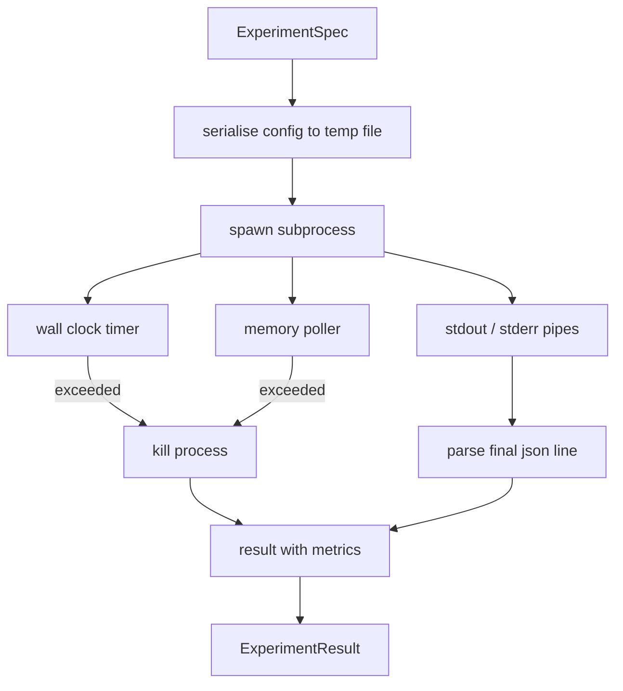

# 实验运行器

> 循环的诚实程度取决于其测量的质量。构建一个执行器(runner)，它接收规格(spec)，在沙盒子进程中执行，并输出评估器(evaluator)可以信任的JSON指标数据块(metrics blob)。

**类型：** 构建
**语言：** Python
**先决条件：** 第 19 阶段 Track A 第 20-29 课
**时间：** 约 90 分钟

## 学习目标
- 将实验编码为类型化规格(typed spec)，执行器可以将其序列化到子进程。
- 启动子进程，设置严格的墙上时钟超时(hard wall clock timeout)和软内存上限(soft memory cap)，并将两者作为终止条件呈现。
- 捕获标准输出(stdout)、标准错误(stderr)以及结构化的指标数据块(structured metrics blob)到单个结果记录(result record)中。
- 构建一个消融表(ablation table)，在固定的基础规格(base spec)上一次扫描一个配置旋钮(configuration knob)。
- 保持每个结果在给定种子(seed)下是确定性的，以便评估器在多次运行中看到相同的数字。

## 为何使用子进程

研究循环(run)运行不受信任的代码。假设来自采样器(sampler)，实验脚本来自同一条路径；将其中任何一个视为安全的进程内代码，都可能导致崩溃，从而拖垮编排器(orchestrator)。子进程是该语言提供的最简单的隔离机制：一个独立的进程、独立的地址空间、父端的一个信号句柄。

此处的执行器并未实现完整的沙箱化(sandboxing)。没有cgroup、没有seccomp过滤器、没有命名空间重映射。它所拥有的是墙上时钟超时、一个用于内存增长检测的轮询循环(polling loop)，以及一个在达到任一限制时终止进程的杀死路径(kill path)。这是每个更精细的沙箱所扩展的运行时契约(runtime contract)。本课将契约精简到可以一口气读完。

## ExperimentSpec的形状

```text
ExperimentSpec
  spec_id        : str            (stable id, "exp_001")
  hypothesis_id  : int            (link back to the queue from lesson 50)
  script_path    : str            (path to the python script to run)
  config         : dict           (passed to the script as one json arg)
  seed           : int            (deterministic seed for the experiment)
  wall_timeout_s : float          (hard timeout, killed on exceed)
  memory_cap_mb  : int            (soft cap, polled; killed on exceed)
  metric_keys    : list[str]      (which fields the evaluator will read)
```

脚本存放在磁盘上；执行器将配置写入一个临时文件路径，脚本读取该文件。脚本预期在标准输出上打印一行JSON，其键是`metric_keys`的超集。标准输出上的其他内容将被捕获，但被指标解析器(metrics parser)忽略。

## 架构



执行器是一个包含一个主方法(main method)的类。轮询器(poller)是一个小线程，每隔一个轮询间隔(poll interval)唤醒一次，并在可用时从proc文件系统读取子进程的`psutil`等效值，当平台不暴露该信息时则回退为无操作(no op)。

## 为何使用软内存上限

硬内存上限需要`resource.setrlimit`且仅适用于POSIX。本课提供了一种可移植的方法：从平台轮询驻留集大小(resident set size)，如果超过上限则杀死子进程。该上限是软的，因为轮询器具有非零间隔；进程可能在两次轮询之间尖峰超过上限然后回落。执行器记录观察到的最大RSS，以便评估器看到运行接近极限的程度。

在没有进程检查支持的系统上，轮询器记录一次性警告并自行禁用。墙上时钟超时仍然适用。本课的测试覆盖了两种路径。

## 捕获标准输出和标准错误

执行器在完成时读取两个管道的内容。标准输出逐行扫描；解析为JSON且包含所有必需`metric_keys`的最后一行被视为指标数据块。更早的JSON行保留在结果中作为`intermediate_metrics`；评估器可以使用这些行来绘制学习曲线。

标准错误被逐字捕获到结果中。执行器不会因非零退出码(non zero exit code)而引发异常；而是将退出码记录在结果中。任何非零退出都被标记为`"crash"`，即使脚本打印了指标，因此评估器默认将部分运行视为失败。

## 消融表

```python
def ablate(base: ExperimentSpec, knob: str, values: list[Any]) -> list[ExperimentSpec]:
    ...
```

给定一个基础规格(base spec)和一个旋钮名称(knob name)，辅助函数(helper)为每个值返回一个规格，其中`config[knob]`被覆盖。每个规格获得一个派生的`spec_id`（`f"{base.spec_id}_{knob}_{value}"`）。执行器提供一个`AblationRunner`，按顺序运行它们并返回一个由旋钮值键控的`AblationTable`。

为何一次一个旋钮。全因子扫描(full factorial sweep)会呈指数级增长并产生评估器无法解释的结果。一次一个旋钮产生一个清晰的坐标轴，评估器可以绘制。本课仅在调用者组合的重复单旋钮消融(repeated single knob ablation)形式下支持多旋钮扫描。

## 确定性

每个规格都带有一个种子(seed)。执行器通过配置字典(config dict)（`config["__seed"] = spec.seed`）将种子转发给脚本。`code/experiments/`中的模拟实验脚本(mock experiment script)遵守种子，并在多次运行中产生相同的指标。第五十三课中的评估器依赖于这一点；没有确定性，一个“回归”可能只是不同的随机初始化。

## 模拟实验脚本

本课提供的一个实验脚本：`code/experiments/sparsity_experiment.py`。这是一个真实的脚本，它读取其配置文件，使用numpy随机过程模拟一个小型训练运行，并打印一个JSON指标数据块。该脚本遵守用于测试超时的`sleep_s`旋钮和用于测试内存轮询器的`allocate_mb`旋钮。

该模拟并非真正的训练。它是一个数值计算，模拟训练循环的形状：损失曲线(loss curve)、最终困惑度(final perplexity)、墙上时间(wall time)。本课的要点是执行器，而不是模拟。真实的实验脚本会导入一个模型。

## 结果形状

```text
ExperimentResult
  spec_id              : str
  hypothesis_id        : int
  exit_code            : int
  terminal             : "ok" | "timeout" | "oom" | "crash"
  wall_time_s          : float
  peak_rss_mb          : float | None
  metrics              : dict
  intermediate_metrics : list[dict]
  stdout_tail          : str
  stderr_tail          : str
```

评估器首先读取`metrics`和`terminal`。如果终端(terminal)不是`"ok"`，则实验计为失败运行，评估器的裁定自动给出。否则，指标通过显著性检验(significance test)处理。

## 如何阅读代码

`code/main.py`定义了`ExperimentSpec`、`ExperimentResult`、`ExperimentRunner`、`AblationRunner`和一个确定性演示(deterministic demo)。子进程管理是一个类。内存轮询器是一个小线程。消融辅助函数是一个单个函数。

`code/experiments/sparsity_experiment.py`是测试中使用的模拟实验。它从argv读取配置文件路径，并在完成时写入一行JSON指标。

`code/tests/test_runner.py`覆盖了成功路径(success path)、超时路径(timeout path)、崩溃路径(crash path)、消融表(ablation table)以及两次运行间的确定性检查(determinism check)。

## 这位于何处

第五十课生成假设(hypothesis)。第五十一课过滤掉文献中已经解决的问题。第五十二课对剩余内容运行实验。第五十三课读取结果、运行显著性检验，并写出编排器针对假设ID存储的裁定(verdict)。
