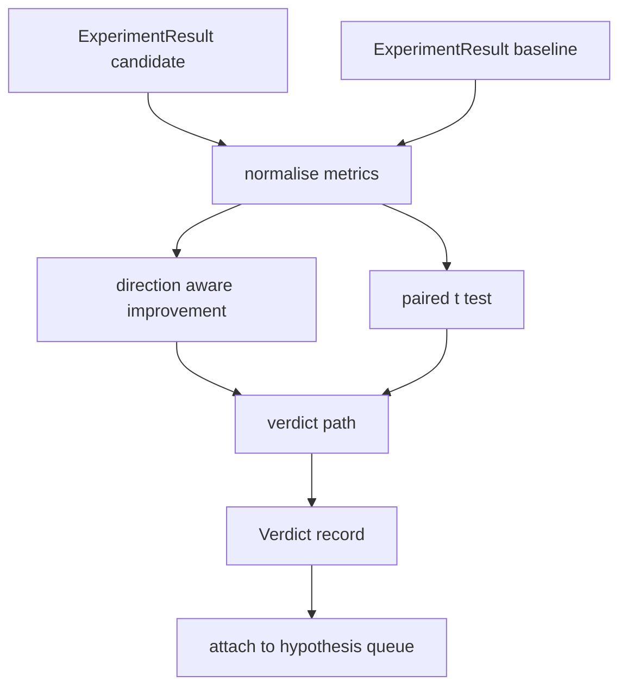

# 结果评估器

> 运行器产生数字。评估器决定这些数字是改进、回归还是噪声。构建判定路径，将指标转化为一行结论。

**类型：** 构建
**语言：** Python
**先决条件：** 第 19 阶段 Track A 第 20-29 课
**时间：** 约 90 分钟

## 学习目标
- 使用方向感知改进和固定阈值将候选运行与基线进行比较。
- 对每个种子指标从头运行配对t检验（paired t test），并读取得到的p值。
- 对对数尺度指标进行归一化，以便下游报告可以将它们与线性指标混合。
- 发出每个假设的判定，编排器可以将其附加到第五十课的队列中。
- 保持每一步纯函数化，使相同输入始终产生相同判定。

## 为什么使用配对检验

运行器输出的单个数字并不能说明变化是否真实。相同的配置使用不同的种子会产生不同的困惑度（perplexity）。变化可能是噪声。正确的比较是配对的：相同种子、相同数据，分别使用候选配置和基线配置运行一次。每个种子贡献一个差值。这些差值的均值就是效应。这些差值的标准误差就是噪声基底。

本课从头实现该检验。没有使用`scipy.stats`。数学内容足够小，可以在一屏内阅读。

```text
diffs    = [a_i - b_i for i in seeds]
mean     = sum(diffs) / n
variance = sum((d - mean) ** 2 for d in diffs) / (n - 1)
t_stat   = mean / sqrt(variance / n)
df       = n - 1
p_value  = two_sided_p(t_stat, df)
```

双尾p值使用了正则化不完全贝塔函数（regularised incomplete beta function）。本课提供了一个小型实现，使用Lentz连分数。整个代码只有六十行标准库数学。

## 方向感知改进

某些指标在上升时改进（准确率、吞吐量）。其他指标在下降时改进（损失、困惑度、墙上时间）。评估器在每个指标上携带一个`direction`字段。

```text
if direction == "higher_is_better":
    improvement = (candidate - baseline) / abs(baseline)
elif direction == "lower_is_better":
    improvement = (baseline - candidate) / abs(baseline)
```

改进是有符号的。对于越高越好的指标，负的改进意味着候选更差。判定路径同时读取符号和大小。

一个固定阈值（`improvement_threshold=0.02`，百分之二）决定变化是否大到值得报告。低于该阈值，无论p值如何，判定都是“噪声”；循环对用户无法测量的变化不感兴趣。

## 架构



评估器运行三个独立的计算，并在判定路径中合并它们。每个计算都是纯函数，没有共享状态。

## 对数归一化

困惑度在损失上是指数级的。损失下降0.1会导致困惑度下降更大。直接比较两个配置的困惑度没问题，但将其与线性指标混合到一个报告中则需要归一化。

本课对任何`scale`字段为`"log"`的指标，在计算改进前取自然对数进行归一化。然后在对数空间中应用阈值。困惑度从32降到28，对于越低越好的指标是`log(28) - log(32) = -0.133`，远高于百分之二的阈值。

```text
if scale == "log":
    a = log(candidate)
    b = log(baseline)
else:
    a = candidate
    b = baseline
```

`scale="linear"`（默认值）的指标跳过变换。相同的代码路径处理两种情形。

## 每种子配对检验

第五十二课的运行器每次运行输出一个最终指标块。对于配对检验，评估器需要每个种子一个候选块和一个基线块。编排器在一系列种子下以两种配置运行相同的实验，并将两个`ExperimentResult`记录列表交给评估器。

评估器按种子（种子位于`result.metrics["seed"]`）配对，并遍历请求的指标。如果两个列表中的种子不匹配，评估器抛出`PairingError`。编排器应重新运行。

## 判定形状

```text
Verdict
  hypothesis_id          : int
  metric                 : str
  direction              : "higher_is_better" | "lower_is_better"
  scale                  : "linear" | "log"
  candidate_mean         : float
  baseline_mean          : float
  improvement            : float       (signed, fraction; see direction rules)
  p_value                : float | None  (None if n < 2)
  significance_threshold : float
  improvement_threshold  : float
  verdict                : "improved" | "regressed" | "noise" | "failed"
  rationale              : str
```

判定路径是一个小的决策表：

```text
1. If any candidate result has terminal != "ok": verdict = "failed"
2. else if |improvement| < improvement_threshold:  verdict = "noise"
3. else if p_value is None or p_value > significance: verdict = "noise"
4. else if improvement > 0:                          verdict = "improved"
5. else:                                             verdict = "regressed"
```

理由是编排器可以针对假设ID记录的一行人类可读句子。

## 如何阅读代码

`code/main.py`定义了`MetricSpec`、`Verdict`、`Evaluator`、t统计量和不完全贝塔辅助函数，以及一个确定性演示。t检验使用纯标准库数学实现；numpy仅用于读取指标列表和计算均值和方差。

`code/tests/test_evaluator.py`涵盖了改进路径、回归路径、噪声路径（小改进）、噪声路径（低n）、失败终端路径、对数归一化路径、针对已知参考值的t检验以及配对错误。

## 这位于何处

第五十课生成了假设队列。第五十一课过滤掉了文献已解决的内容。第五十二课在候选和基线配置下跨种子运行实验。第五十三课读取这些运行并写出判定。编排器将这四个部分缝合在一起：

```text
for hypothesis in queue:
    literature = retrieval.search(hypothesis.text)
    if literature_settles(hypothesis, literature):
        attach(hypothesis, verdict="settled")
        continue
    candidates = runner.run_all(specs_for(hypothesis))
    baselines  = runner.run_all(baseline_specs_for(hypothesis))
    metric_spec = MetricSpec("perplexity", direction=LOWER, scale=LOG)
    verdict = evaluator.evaluate(hypothesis.id, metric_spec, candidates, baselines)
    attach(hypothesis, verdict)
```

该编排器不在本课中；四个课程通过各自定义的数据类组合到编排器中，无需额外的粘合代码。
