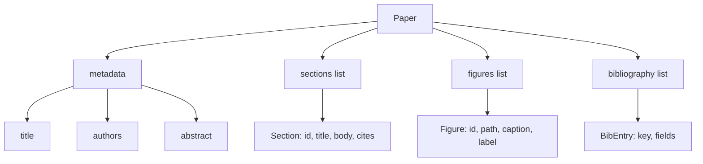
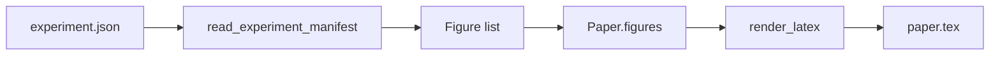
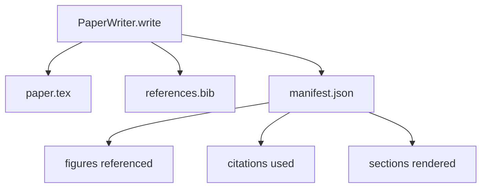

# 论文编写器

> LaTeX骨架是研究人员与排版员之间的合同。如果合同被破坏，文档将无法编译，并且失败会明确提示。先构建骨架，再填充内容。

**类型:** 构建
**语言:** Python
**前置条件:** 第19阶段第50-53课
**时间:** ~90分钟

## 学习目标

- 将研究论文视为具有已知章节图的结构化工件，而不是自由格式的文档。
- 生成一个LaTeX骨架，在编写任何正文之前声明其摘要、章节、图表插槽和参考文献键。
- 通过确定性插槽机制将从实验输出（路径和说明）中生成的图表注入骨架。
- 连接一个模拟的正文生成器，该生成器根据结构化大纲填充每个章节，从而使测试框架可以在没有模型的情况下进行测试。
- 输出一个`paper.tex`和一个`references.bib`以及一个清单，该清单列出了所有引用的图表和所有使用的引用。

## 为什么先构建骨架

以正文开始的草稿会累积结构债务。引言部分增加了三段本应属于相关工作部分的内容。一个图表在被定义之前就被引用了。参考文献最终为同一篇论文提供了三个键。当作者注意到时，重写的成本已经高于写作的成本。

骨架扭转了这一点。结构被预先声明为数据。章节是具有名称和顺序的插槽。图表是具有ID和说明的插槽。参考文献键在顶部声明，并指向它们对应的条目。正文被一次一个地生成到这些插槽中。测试框架可以在任何正文被编写之前验证：每个图表都有一个插槽，每个引用都有一个条目，每个章节都出现在目录中。

这与之前课程应用于计划、工具调用和跟踪的规则相同。结构就是合同。

## 论文形状

每个字段都是纯Python数据。渲染器是一个从`Paper`到LaTeX字符串的纯函数。测试框架可以在渲染之前分析论文：统计章节数，列出缺失的图表文件，检查每个`\cite{key}`是否有对应的`BibEntry`。

## 渲染合同

渲染器保证三个属性。首先，骨架中的每个图表插槽都会发出一个带有稳定标签的`\begin{figure}`块，标签形式为`fig:<id>`。其次，每个章节都会发出一个带有稳定标签的`\section{}`，标签形式为`sec:<id>`，以便交叉引用工作。第三，参考文献会发出一个`\bibliography`块，其`references.bib`恰好包含论文中声明的条目，不多不少。

违反其中任何一条都是渲染错误，而不是警告。骨架是合同；默默丢弃图表的渲染是合同违约。

## 来自实验的图表注入

本系列之前的课程产生了作为JSON清单的实验输出。每个清单带有一系列工件，包括路径和简短说明。论文编写器读取该清单并生成`Figure`记录。

注入是确定性的。图表ID由实验名称加上单调递增的计数器派生。说明来自清单。路径相对于论文的输出目录进行标准化，以便即使实验输出位于磁盘上的其他位置，LaTeX也能编译。

## 模拟的正文生成器

本课不调用模型。一个`MockProseGenerator`读取大纲形状并确定性地生成正文。大纲形状是每个章节的一个短字符串。生成器将该字符串扩展为两个短段落，其中融入了章节标题。生成的正文会在大纲声明时提及图表和引用。

这足以测试编写器的每个行为。实际实现会将生成器替换为模型调用。其周围的测试框架不变。这就是将正文生成器声明为可调用对象的价值：测试使用确定性的替代，生产使用模型，管道的其余部分完全相同。

## 清单输出

编写器向输出目录输出三个文件。

清单是下游评估器或批评循环读取的内容。它不解析LaTeX；它读取清单。下一课，批评循环，将此清单作为输入并生成反馈列表。这就是为什么清单是合同的一部分而LaTeX不是的原因。

## 验证关卡

编写器在写入任何文件之前运行四个关卡。

1. 每个图表ID在论文内唯一。
2. 每个章节的`cites`字段引用的参考文献键已在论文中声明。
3. 摘要非空。
4. 标题非空。

失败的关卡会引发带有确切原因的`PaperValidationError`。测试框架将原因作为失败模式呈现。没有部分写入：要么所有三个文件都被输出，要么一个都不输出。

## 如何阅读代码

`code/main.py`定义了`Paper`、`Section`、`Figure`、`BibEntry`、`PaperValidationError`、`MockProseGenerator`、`PaperWriter`和一个`render_latex`函数。`write`方法接受一个输出目录并输出`paper.tex`、`references.bib`和`manifest.json`。`read_experiment_manifest`辅助函数将实验清单列表转换为`Figure`记录。

`code/tests/test_paper_writer.py`涵盖：无章节的骨架渲染、两个章节和两个图表的完整渲染、缺失引用关卡、重复图表ID关卡、清单内容以及LaTeX字符串合同（每个章节发出一个`\section{}`，每个图表发出一个`\begin{figure}`）。

## 进一步探索

实际实现会希望的两个扩展。首先，多格式渲染：相同的`Paper`形状可以编译为博客文章的Markdown和预览的HTML。渲染器成为`Paper`上的策略。其次，引用丰富化：编写器从引用键获取BibTeX条目，给定本地DOI缓存。两者都增加价值，两者都可以在不触及骨架合同的情况下添加。

骨架是赌注。章节、图表和引用被声明为数据，正文被生成到插槽中，清单与LaTeX一起输出。所有其他改进都在此基础上组合。
