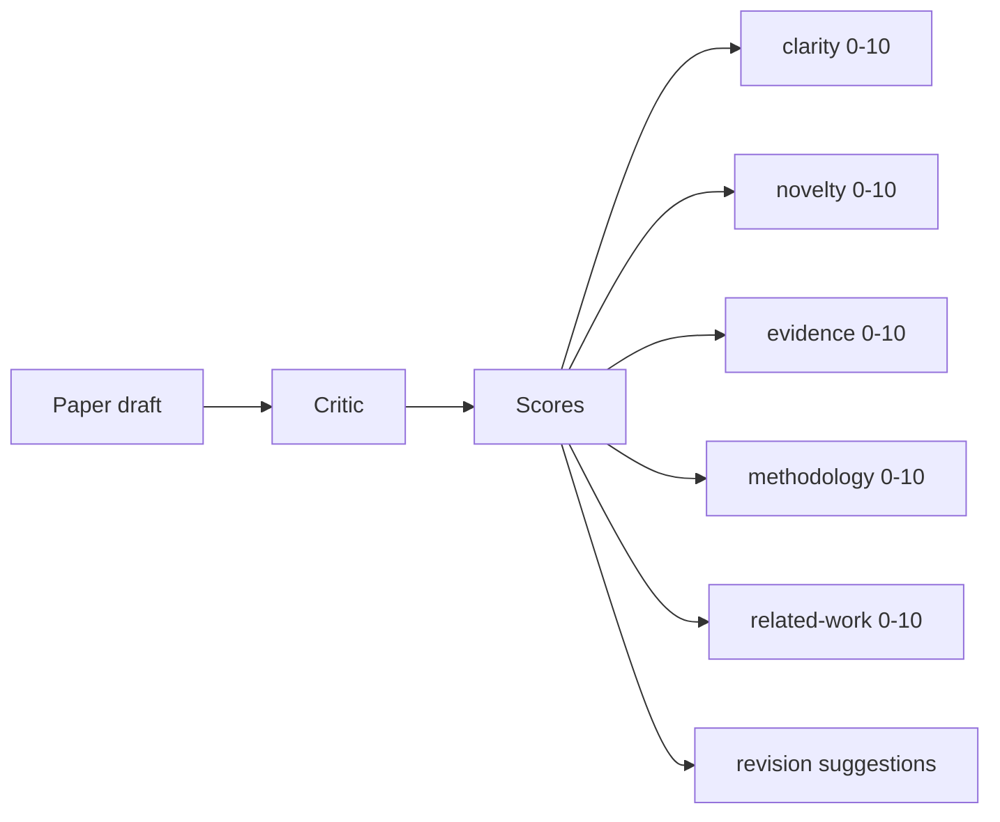
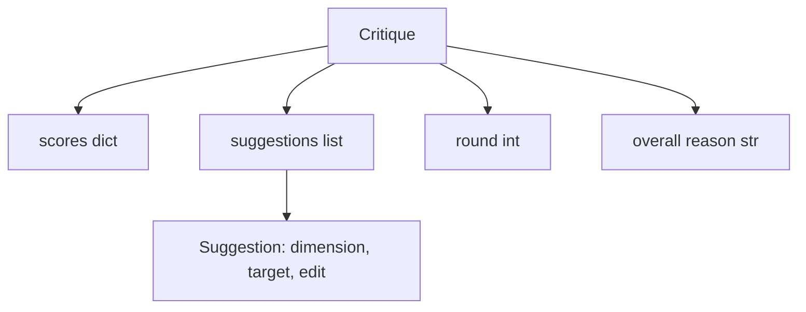
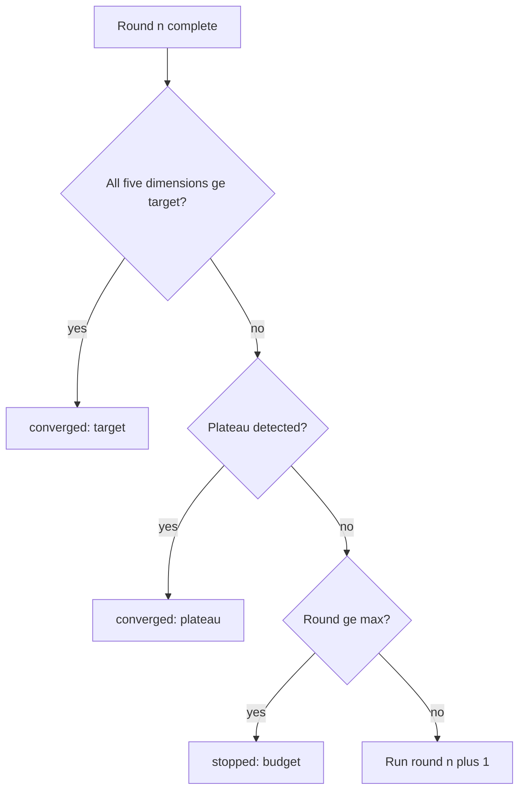
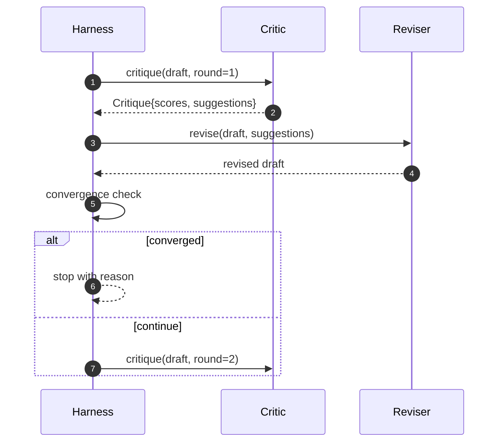

# 评审循环

> 第一次就返回"看起来不错"的评论者是有缺陷的。总是返回"需要改进"的评论者也是有缺陷的。有趣的评论者是那些能够收敛的，你必须设计这种收敛。

**类型:** 构建
**语言:** Python
**前置条件:** 第19阶段第50-53课
**时间:** ~90分钟

## 学习目标

- 在五个固定维度上对论文草稿评分：清晰度、新颖性、证据、方法论、相关工作。
- 将每轮的评论作为结构化的修订差异（structured revision diff）应用，而不是自由形式的重写。
- 通过比较各轮的评分来检测收敛；在达到平台期、目标达成或预算耗尽时停止。
- 用最大迭代预算限制轮数，以防止非收敛评论者无限运行。
- 输出每轮追踪信息，以便仪表板或下一阶段能够呈现评分轨迹。

## 为什么是五个固定维度

自由形式的评论者是一个返回一段建议的模型。下一轮的修订将这段文字视为环境上下文。重写是否解决了批评意见无法验证，因为批评意见从未具有结构。

五个维度为框架提供了合同。



评分是一个向量。框架观察各轮中每个维度的变化。一次提高清晰度但降低证据的修订在证据上是回退，收敛检查会检测到这一点。仅靠模型的评论者无法提供这种保证。

## 评论的形状



每条建议都带有它改进的维度、它针对的部分，以及一个``edit``指令，修订者可以应用该指令。修订者也是一个可调用对象。本课提供了一个确定性修订者，它将编辑指令解释为追加到部分的操作。模型驱动的修订者会将同一字段解释为提示。合同不变。

## 收敛规则（按顺序）

当三个条件中的任何一个触发时，评论循环终止。



目标是严格的情况：五个维度（清晰度、新颖性、证据、方法论、相关工作）中的每一个都必须达到``>= target_score``（默认``8.0``），循环才返回成功。均值高但有一个维度弱是不够的。平台期检测比较当前轮次的均值与上一轮次的均值。如果连续两轮的改进低于``plateau_epsilon``（默认``0.1``），循环以``plateau``退出。预算是对轮数的硬限制（默认``5``），并以``budget``退出。

顺序很重要。目标优先于平台期优先于预算。如果第三轮达到目标，而同一轮也触发了平台期，结果是``target``，而不是``plateau``。

## 为什么平台期检测运行两轮

一轮的平台期是噪声。即使是在固定草稿上，真正的评论者每次迭代也会返回略微不同的评分，因为确定性评分仍然依赖于哪些建议被应用以及应用顺序。要求连续两轮平台期可以过滤掉这种噪声。如果框架报告平台期，则草稿确实不再改进。

## 本课中的确定性评论者

本课不调用模型。提供的评论者是一个可调用对象，它根据三个信号对草稿评分：平均章节主体长度（清晰度）、图表数量和引用数量（证据），以及论文元数据中的``originality_tag``字段（新颖性）。修订者知道如何推动每个评分上升。

```text
clarity      grows when the average section body length increases
novelty      grows when originality_tag is set to "high"
evidence     grows when a section's figure_refs is non-empty
methodology  grows when a section titled "Method" exists with body
related-work grows when a section titled "Related Work" exists with body
```

修订者将每条建议解释为有针对性的追加。第一轮后，框架可以观察到评分上升。测试利用这一属性来断言循环减少了差距。

## 完整的循环合同



框架拥有轮次计数器、追踪信息和收敛检查。评论者拥有评分。修订者拥有差异。三者互不干扰对方的状态。

## 追踪输出

每一轮输出一个追踪事件，包含轮次编号、评分向量、建议数量和收敛结果。完整的追踪信息与最终草稿一起返回。下游仪表板可以渲染每轮评分图表。下一课（迭代调度器）读取追踪信息以决定分支是否值得保留。

## 预防不良评论者的预算

一个产生无法提高评分的建议的评论者会使循环锁定在最大迭代上限。追踪信息使其可见：五轮，评分持平，结果``budget``。用户将其解读为评论者错误，而非草稿错误。相反，仅显示最终草稿会隐藏诊断。先追踪后设计的方法使其可见。

## 如何阅读代码

``code/main.py``定义了``Critique``、``Suggestion``、``Critic``协议、``Reviser``协议、``CriticLoop``，以及一个返回确定性评论者和匹配修订者的``make_deterministic_critic_pair``工厂。包含一个最小化的``Paper``形状，以便本课独立运行。

``code/tests/test_critic_loop.py``涵盖：第一轮后的单调改进、在调整过的草稿上的目标收敛、两轮持平后的平台期检测、无建议改进时的预算耗尽、修订者应用建议、以及追踪形状。

## 进一步探索

实际实现会需要的两个扩展。第一，维度权重：针对研讨会的论文将新颖性权重高于方法论；期刊则相反。收敛检查变为加权均值。第二，配对评论者：一个评论者评分，另一个评论者在修订者看到建议之前进行裁决。两者都增加价值，两者都基于相同的``Critique``形状组合。

赌注是评分向量。一旦评论有了结构，所有其他改进、收敛规则、仪表板、配对评论者，都可以在无需改变循环的情况下加入。
