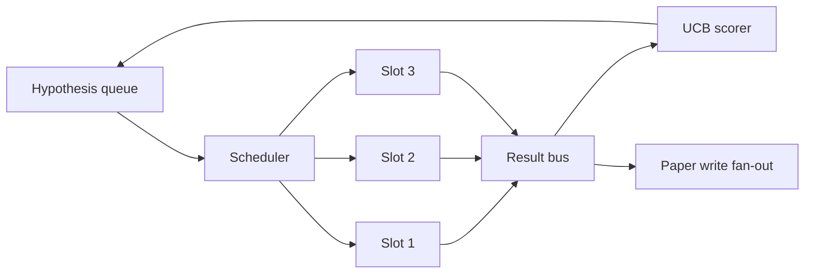
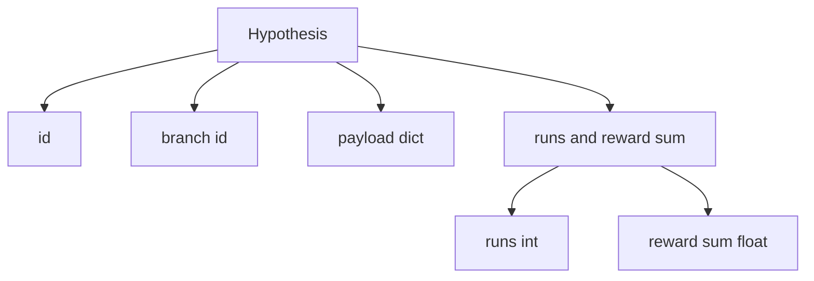
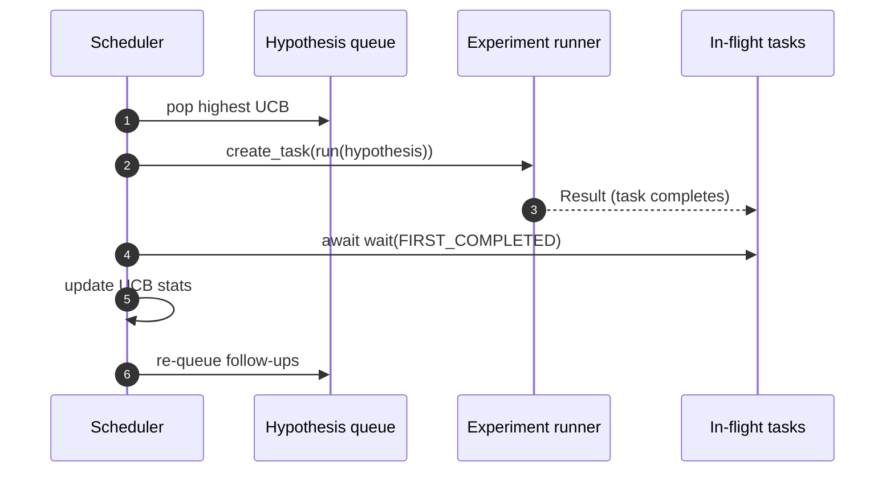

# 迭代调度器

> 没有调度器的研究循环是一个自欺欺人的队列。调度器是循环决定停止探索什么的地方，而这个决定就是整个游戏的关键。

**类型:** 构建
**语言:** Python
**前置条件:** 第19阶段第50-53课
**时间:** ~90分钟

## 学习目标

- 将研究工作流建模为一个假设队列，该队列向并行的实验槽供料，这些槽的结果再汇聚回来。
- 使用asyncio并发运行多个实验，以便调度器能让所有槽保持忙碌。
- 使用UCB对每个假设分支进行评分，以便调度器可以剪除低收益分支而不放弃探索。
- 将完成的结果分叉到论文撰写阶段和重新入队阶段，以便高收益分支生成后续假设。
- 输出每次迭代的轨迹，包括分支分数、槽占用情况和剪枝决策。

## 为什么需要调度器，而不是工作列表

扁平的工作列表按提交顺序运行任务。当每个任务独立时，这没问题。但研究不是独立的：实验三的发现会改变实验四和实验五的优先级。一个能读取结果汇聚并重新排序队列的调度器，每单位计算能完成更多有用的工作。

有趣的设计选择是评分规则。贪婪的评分器总是选择当前领先者，从不探索。均匀的评分器从不利用。UCB（上置信界）是中间路线：利用领先者的同时，为尝试较少的分支保留容量。

## 系统结构



队列保存假设。调度器在槽空闲时选择UCB最高的假设。每个槽异步运行一个实验。完成的实验将结果扇入到总线上。总线更新原始分支的UCB统计信息，并在分支的收益超过阈值时，将结果分叉到论文撰写阶段。

## 假设的形状



`branch`是UCB统计信息的关键。多个假设可能共享一个分支（分支是研究方向；假设是该方向内的一次试验）。`runs`是该分支已完成的实验次数，`reward_sum`是累积奖励。UCB同时读取两者。

## UCB评分

本课使用的UCB公式是经典的UCB1。

```text
ucb(branch) = mean_reward(branch) + c * sqrt( ln(total_runs) / runs(branch) )
```

`total_runs`是所有分支完成的实验总数。`c`是探索权重；本课默认为`sqrt(2)`。运行次数为零的分支获得`+inf`，因此未尝试的分支总是优先被调度。平均奖励高的分支保持高分，直到其他分支赶上；运行多次但奖励不多的分支会被较少运行的替代方案超越。

剪枝门与选择器分开。当分支的平均奖励在至少经过`prune_after_runs`次试验（默认`3`）后低于绝对下限（默认`0.2`）时，剪枝会将该分支从未来的调度中移除。这保持了队列的有限性。

## 使用asyncio的并行槽

调度器使用`asyncio.create_task`驱动实验。每个任务运行实验执行器（一个`async def`可调用对象），该执行器返回一个`Result`。主循环使用`asyncio.wait(..., return_when=asyncio.FIRST_COMPLETED)`等待正在执行的任务集合，并在每次完成时触发评分更新。



三个槽并发运行。主循环永远不会在单个实验上阻塞。调度器会在槽空闲时立即启动新任务，直到队列为空且没有任务在运行。

## 分叉：论文触发

当分支的平均奖励超过`paper_threshold`（默认`0.7`）且该分支尚未产生论文时，调度器会将一个`paper.trigger`事件分叉到输出列表中。下游的论文编写器（来自第五十四课）将拾取这个事件。在本课中，触发器被捕获为一个列表，以便测试可以断言它。

## 分叉：后续假设

当高收益结果到达时，调度器可以调用用户提供的`expander`，在同一分支上生成一个或多个后续假设。扩展器是一个从`Result`到`list[Hypothesis]`的纯函数。本课附带了一个确定性的扩展器，对于任何奖励超过论文阈值的结果，它会生成两个后续假设。

## 预算

两个预算保护调度器免于失控循环。

```text
max_experiments    : total count of experiments run across all branches
max_seconds        : wall-clock cap (asyncio time)
```

当任何一个触发时，调度器停止调度新任务，等待正在执行的任务，并返回最终轨迹。轨迹包含一个`stop_reason`。

## 轨迹与最终报告

每个调度决策（选择、分派、结果、剪枝、分叉）都会发出一个事件。最终报告总结了每个分支的统计信息、总运行次数、总挂钟时间和触发的论文触发器。下一课，端到端演示，将读取此报告以驱动论文编写器。

## 如何阅读代码

`code/main.py`定义了`Hypothesis`、`Result`、`BranchStats`、`IterationScheduler`以及一个`make_deterministic_runner`工厂，该工厂返回一个具有可预测奖励的asyncio实验执行器。执行器会休眠固定的`delay_ms`（默认`5ms`），以便并发性可观察。

`code/tests/test_scheduler.py`涵盖：UCB优先选择未尝试的分支、并行槽占用、超过阈值时触发论文触发器、低收益试验后的分支剪枝、分叉后续假设以及预算退出（实验次数和挂钟时间）。

## 进一步探索

实际实现会需要的三个扩展。首先，跨会话的持久化UCB统计信息：当前统计信息存在于内存中；实际调度器会检查点保存它们，以便重启时保留已花费的探索预算。其次，多目标评分：每个结果发出一个向量而不是标量奖励，UCB变成帕累托风格的选择器。第三，上下文赌博机：选择器根据假设特征（长度、复杂度）进行条件判断，以便相似的假设共享探索。

调度器是研究超越工作列表的地方。一旦UCB连接好并且槽并行运行，所有其他改进都可以在此基础上组合。
